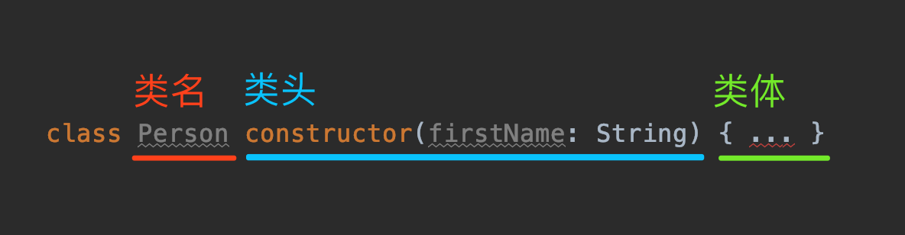
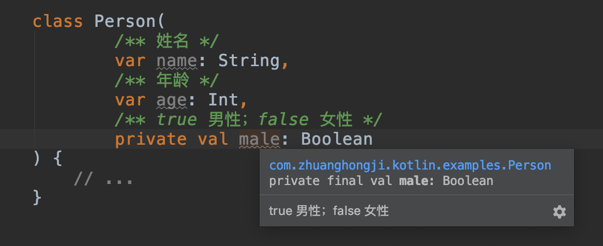

# Kotlin Examples - Classes

## 示例

### 类 (Classes)

[类的声明](https://kotlinlang.org/docs/reference/classes.html#classes) 由以下三个部分组成：
* **类名**
* **类头**：可选，指定参数及其类型，主构造函数等。
* **类体**：可选，用花括号括起来。



如果一个类没有类体，那么可以省略它的花括号。

```kt
class Customer                                  // 1

class Contact(val id: Int, var email: String)   // 2

fun main() {

    val customer = Customer()                   // 3

    val contact = Contact(1, "mary@gmail.com")  // 4

    println(contact.id)                         // 5
    contact.email = "jane@gmail.com"            // 6
}
```

```
1
```

1. 声明一个名为 `Customer` 的、无参数构造函数的类。
2. 声明一个带有不可变属性 `id`，可变属性 `email` 的类，其主构造函数有 `id` 和 `email` 两个参数。
3. 创建 `Customer` 类的一个实例。注意，没有 `new` 关键字。
4. 通过使用带两个参数的构造函数创建一个 `Contact` 类的实例。
5. 访问 `id` 属性。
6. 为 `email` 属性赋一个新的值。


### 数据类 (Data Classes)

数据类使得声明用于存储某些值的类变得更加容易。

```kt
data class User(val name: String, val id: Int)

fun main() {
    val user = User("Alex", 1)
    println(user)                                          // 1

    val secondUser = User("Alex", 1)
    val thirdUser = User("Max", 2)

    println("user == secondUser: ${user == secondUser}")   // 2
    println("user == thirdUser: ${user == thirdUser}")

    println(user.hashCode())                               // 3
    println(thirdUser.hashCode())

    // copy() function
    println(user.copy())                                   // 4
    println(user.copy("Max", 2))                           // 5
    println(user.copy("Max"))                              // 6
    println(user.copy(id = 2))                             // 7

    println("name = ${user.component1()}")                 // 8
    println("id = ${user.component2()}")
}
```

```
User(name=Alex, id=1)
user == secondUser: true
user == thirdUser: false
63347075
2390846
User(name=Alex, id=1)
User(name=Max, id=2)
User(name=Max, id=1)
User(name=Alex, id=2)
name = Alex
id = 1
```


### 枚举类 (Enum Classes)

枚举类用于模拟表示一组有限的、不同值的类型，比如方向、状态和模式等。

类似其它类，它们可能包含属性和方法，通过分号与枚举实例分隔。

```kt
enum class State {
    IDLE, RUNNING, FINISHED                           // 1
}

enum class Color(val rgb: Int) {                      // 2
    RED(0xFF0000),                                    // 3
    GREEN(0x00FF00),
    BLUE(0x0000FF),
    YELLOW(0xFFFF00);

    fun containsRed() = (this.rgb and 0xFF0000 != 0)  // 4
}

fun main() {
    val red = Color.RED                               // 5
    println(red)                                      // 6
    println(red.containsRed())
    println(Color.BLUE.containsRed())

    val state = State.RUNNING
    val message = when (state) {                      // 7
        State.IDLE -> "It's idle"
        State.RUNNING -> "It's running"
        State.FINISHED -> "It's finished"
    }
    println(message)
}
```

```
RED
true
false
It's running
```

1. 一个带有三个枚举实例的简单枚举类 (注意实例是有限且不同的)。
2. 一个具有一个 `rgb` 属性和一个 `containsRed` 方法的枚举类。
3. 每个实例都必须为构造函数参数传递一个参数值。
4. 使用分号将成员与实例分开。
5. 可以通过类名直接访问枚举实例。
6. 默认的 `toString` 方法会返回实例的名字，这里是 `"RED"`。
7. 使用枚举时，编译器可以推断出 `when` 表达式是否是详尽的，因此你不需要使用 `else` 情况。


### 密封类 (Sealed Classes)

密封类用来表示 **受限的类继承结构**：当一个值为有限集中的类型、而不能有任何其他类型时。

```kt
sealed class Mammal(val name: String)                                                   // 1

class Cat(val catName: String) : Mammal(catName)
class Human(val humanName: String, val job: String) : Mammal(humanName)

fun greetMammal(mammal: Mammal): String {
    when (mammal) {                                                                     // 2
        is Human -> return "Hello ${mammal.name}; You're working as a ${mammal.job}"    // 3
        is Cat -> return "Hello ${mammal.name}"                                         // 4
                                                                                        // 5
    }
}

fun main() {
    println(greetMammal(Cat("Snowy")))
}
```

1. 使用两个子类定义一个密封类，这两个子类必须在同一个文件内。
2. 密封类可作为 `when` 表达式的参数。
3. 执行 smartcast 后，Mammal 转换为 Human。
4. 执行 smartcast 后，Mammal 转换为 Cat。
5. `else` 语句是不需要的，因为密封类的所有子类都覆盖了。这有悖于一般的超类，一般的超类总是需要 `else` 的。


### 继承

```kt
open class Dog {                // 1
    open fun sayHello() {       // 2
        println("wow wow!")
    }
}

class Yorkshire : Dog() {       // 3
    override fun sayHello() {   // 4
        println("wif wif!")
    }
}

fun main() {
    val dog: Dog = Yorkshire()
    dog.sayHello()
}
```

```
wif wif!
```

1. Kotlin 中的类默认是 *final* 的。如果你想让类可以被覆写，则必须标记上 `open` 修饰符。
2. Kotlin 中的方法默认同样是 *final* 的。正如类一样，`open` 修饰符标识允许覆写。
3. 统一通过使用 **子类名称 + `: SuperclassName()`** 来覆写一个类。空的圆括号 `()` 表示对超类默认构造函数的调用。
4. 覆写方法或属性时需要 `overview` 修饰符。


### 不使用默认构造函数进行继承

```kt
open class Tiger(val origin: String) {
    fun sayHello() {
        println("A tiger from $origin says: grrhhh!")
    }
}

class SiberianTiger : Tiger("Siberia")                  // 1

fun main() {
    val tiger: Tiger = SiberianTiger()
    tiger.sayHello()
}
```

```
A tiger from Siberia says: grrhhh!
```

1. 当超类没有提供默认构造函数时，从子类调用父类构造函数必须提供相关参数。


### 绕过构造函数参数

```kt
open class Lion(val name: String, val origin: String) {
    fun sayHello() {
        println("$name, the lion from $origin says: graoh!")
    }
}

class Asiatic(name: String) : Lion(name = name, origin = "India") // 1

fun main() {
    val lion: Lion = Asiatic("Rufo")
    lion.sayHello()
}
```

```
Rufo, the lion from India says: graoh!
```

1. 可以看到，`name` 既不是 `var` 也不是 `val`，这是因为它是 `Asiatic` 构造函数的参数且它的值会传递到 `Lion` 的 `name` 属性 (it does not override it)。


## 扩展

### 构造函数

在 Kotlin 中的类可以有 **一个主构造函数** 和 **一个或多个次构造函数**。

**主构造函数**

主构造函数是类头的一部分，跟在「类名」和「可选的类型参数」后面。比如，一个复杂点的 `Person` 类的定义如下：

```kt
// 主构造函数时私有的，且有 @CustomAnnotation 注解标识
class Person private @CustomAnnotation constructor(firstName: String) { ... }
```

如果主构造函数没有任何注解或者可见性修饰符，可以省略 `constructor` 关键字：

```
class Person(firstName: String) { ... }
```

主构造函数不能包含任何代码，它对应的代码是写在以 `init` 关键字作为前缀的代码块中。这个代码块称为 **初始化块 (Initializer Blocks)**。

前面有一篇文章讲到了类的属性，其中提到一个 **属性初始化器 (Property Initializer)** 的知识点。在类的实例初始化时，初始化块与属性初始化器是交织在一起的，并按照出现在类体中的顺序执行：

> 注：主构造函数的参数可以在属性初始化器中使用，也可以在初始化块中使用。

```kt
class InitOrderDemo(name: String) {
    var firstProperty = "First property: $name".also(::println)
    init {
        println("First initializer block thai prints $name, firstProperty = $firstProperty")
    }

    val secondProperty = "Second property: ${name.length}".also(::println)
    init {
        println("Second initializer block thai prints ${name.length}, secondProperty = $secondProperty")
    }
}

fun main() {
    InitOrderDemo("zhuang")
}
```
```kt
First property: zhuang
First initializer block thai prints zhuang, firstProperty = First property: zhuang
Second property: 6
Second initializer block thai prints 6, secondProperty = Second property: 6
```

Kotlin 提供了一个简洁的语法，使得可以在主构造函数中声明属性：

```kt
class Person(var name: String, var age: Int, private val male: Boolean) {

    fun desc() {
        val genderDesc = if (male) "男性" else "女性"
        println("This person named $name, $age years old, $genderDesc")
    }
}

fun main() {
    Person("xiaohong", 18, false).desc()
    Person("zhuanghongji", 19, true).desc()
}
```
```kt
This person named xiaohong, 18 years old, 女性
This person named zhuanghongji, 19 years old, 男性
```

如果想对主构造函数中的属性编写对应注释，可以酱紫：

```kt
class Person(
        /** 姓名 */
        var name: String,
        /** 年龄 */
        var age: Int,
        /** true 男性；false 女性 */
        private val male: Boolean
) {
    // ...
}
```




**次构造函数**

在类中声明次构造函数的姿势是这样的：

```kt
class Person {
    constructor(parent: String) {
        println("The parent is $parent")
    }
}
```

如果类有一个主构造函数，那么这个类的每个次构造函数都必须显式的委托给主构造函数。可以直接委托，也可以通过其它次构造函数间接委托：

> 注：即使类没有主构造函数，委托的行为也是会隐式执行的。

```kt
class Person(var name: String) {

    init {
        println("------")
        println("The name is $name")
    }

    constructor(name: String, parent: String): this(name) {
        println("The parent is $parent")
    }

    constructor(name: String, parent: String, age: Int): this(name, parent) {
        println("The age is $age")
    }
}


fun main() {
    Person("zhuanghongji")
    Person("zhuanghongji", "zhuangmoumou")
    Person("zhuanghongji", "zhuangmoumou", 21)
}
```
```kt
------
The name is zhuanghongji
------
The name is zhuanghongji
The parent is zhuangmoumou
------
The name is zhuanghongji
The parent is zhuangmoumou
The age is 21
```

上面的这个代码片段主要是演示了如何将次构造函数委托给主构造函数。如果你仔细看日志的话，你会发现：**所有初始化块中的代码都会次构造函数之前执行**。

> 注意：在 JVM 上，如果主构造函数的所有参数都有默认值，编译器会额外生成一个使用默认值的构造函数。这使得 Kotlin 更易于使用通过无构造函数创建类实例的库 (比如 Jackson、JPA)。


### 继承

在 Kotlin 中，所有的类都有一个共同的超类 `Any`。

```kt
class Example   // 隐式继承 Any 类
```

要注意的是，`Any` 不同于 Java 中的 `Object`，它只有三个成员：

```kt
public open class Any {
    public open operator fun equals(other: Any?): Boolean
    public open fun hashCode(): Int
    public open fun toString(): String
}
```

如果要显式指定超类型，可把超类型的声明放在类头的冒号之后：

```kt
open class Base(p: Int)

class Derived(p: Int): Base(p)
```

如果超类有一个主构造函数，那其子类必须使用该类的主构造函数就地初始化。

如果超类没有主构造函数，那么其子类的每个次构造函数都必须使用 `super` 关键字初始化该类，或委托给另一个构造函数做到这一点：

```kt
open class Base {
    constructor(a: String)
    constructor(a: String, b: Int)
    constructor(a: String, b: Int, c: Boolean)
}

class Drived: Base {
    
    constructor(a: String): super(a)

    // 其它姿势如下：
    // constructor(a: String): super(a, 2)
    // constructor(a: String, b: Int): super(a, b)
    // constructor(a: String, b: Int, c: Boolean): super(a, b, c)
}
```

**覆盖方法**

与 Java 不同，在 Kotlin 中的「可覆盖的成员」以及「覆盖后的成员」都需要显式声明对应修饰符：

```kt
// open 表示该类是开放的、可被继承的
open class Base {
    open fun v() { ... }
    fun nv() { ... }
}

class Derived(): Base() {
    // override 表示覆盖了父类的方法，不加会报错
    override fun v() { ... }
}
```

标记为 `override` 的成员本身是开放的，也就是说它可以直接被子类覆盖 (不需要再加 `open` 关键字进行修饰)。如果想禁止再次覆盖，使用 `final` 关键字即可。比如：

```kt
open class AnotherDerived(): Base() {
    final override fun v() { ... }
}
```


**覆盖属性**

在 Kotlin 中，有一个覆盖属性的概念，即在父类中声明了的然后子类又重新进行声明的属性。姿势与覆盖方法类似，也需要通过 `ovveride` 关键字进行修饰，而且它们必须具有兼容的类型：

```kt
open class Foo {
    open var x: Int = 0
        get() = field * 2
}

class Bar1: Foo() {
    // 覆写了属性的 get 方法
    override var x: Int = super.x
        get() = field * 3
}

fun main() {
    val foo = Foo()
    foo.x = 1
    println(foo.x)      // 2

    val bar1 = Bar1()
    bar1.x = 1
    println(bar1.x)     // 3
}
```

可以用一个 `var` 属性覆盖一个 `val` 属性，但反过来不行。因为一个 `val` 属性在本质上是只声明了一个 getter 方法，而将其覆盖为 `var` 属性则只是在子类声明中额外声明一个 setter 方法而已，并删减父类任何东西。

另外要注意的是，Kotlin 支持在主构造函数中使用 `override` 关键字作为声明的一部分：

```kt
interface Foo {
    val count: Int
}

class Bar1(override val count: Int) : Foo

class Bar2 : Foo {
    override var count: Int = 0
}
```

### 抽象类

类及其中的某些成员可以通过 `abstract` 关键字声明为抽象的，抽象成员在该类中可以不做具体实现。抽象类或抽象成员都是不需要用 `open` 关键字进行标识的，因为它本身就是为继承、覆盖而生。

我们可以用一个抽象成员覆盖一个非抽象的开放成员：

```kt
open class Base {
    open fun f() { println("Base") }
}
abstract class Derived: Base() {
    abstract override fun f()
}

class Test: Derived() {
    override fun f() {
        println("Test")
    }
}
fun main() {
    Base().f()    // Base
    Test().f()    // Test
}
```


### 伴生对象

与 Java 不同，Kotlin 的类并不支持静态方法，而是建议简单的使用包级函数。如果你需要写一个直接通过类名就可以调用 (使用类名作为限定符进行调用) 的函数，可以使用 Kotlin 提供的 **伴生对象** 语法。比如：

```kt
class AnyUtils {
    // Error: Kotlin: Expecting member declaration
    // static fun doSomething() {}

    companion object {
        const val TAG = "AnyUtils"

        fun doSomething() {
            println("AnyUtils: doSomething...")
        }
    }
}

fun main() {
    println(AnyUtils.TAG)     // AnyUtils
    AnyUtils.doSomething()    // AnyUtils: doSomething...
}
```

上面通过 `companion` 修饰的对象是类内部的对象，也就是我们所说的伴生对象，就像影子一样伴随着这个类。伴生对象的成员只能通过类名作为限定符进行访问。实际上，上面的示例中省略了伴生对象的名称声明。省略伴生对象名称时，我们可通过 `Companion` 关键字来获取伴生对象的引用：

```kt
val comp = AnyUtils.Companion
println(comp.TAG)             // AnyUtils
comp.doSomething()            // AnyUtils: doSomething...
```

如果想显式声明一个伴生对象的名称也是可以的，下面我们通过一个工厂示例来演示一下：

```kt
class FactoryDemo {
    companion object Factory {
        fun create() = FactoryDemo()
    }

    fun printUserName() {
        println("zhuanghongji")
    }
}

fun main() {
    val demo = FactoryDemo.create()
    demo.printUserName()                // zhuanghongji

    // 通过伴生对象的引用来访问相关方法
    val factory = FactoryDemo.Factory
    factory.create().printUserName()    // zhuanghongji
}
```

注意，如果显式声明了伴生对象的名称，则只能通过该名称来获取伴生对象的引用。如果你还想通过 `Companion` 关键字来获取伴生对象引用，对不起，编译器会报错：

```kt
// Error: Kotlin: Unresolved reference: Companion
val comp = FactoryDemo.Companion
```

还有一点要注意，伴生对象的成员在调用时看起来像是其它语言的静态成员，但实际上不是，它们在运行时其实是真实对象的实例成员。举个栗子，Java 中的静态成员不可以实现接口吧，但伴生对象可以：

```kt
interface Factory<T> {
    fun create(): T
}

class FactoryDemo {
    // 省略伴生对象名称，并实现 Factory 接口
    companion object: Factory<FactoryDemo> {
        override fun create() = FactoryDemo()
    }

    fun printUserName() {
        println("zhuanghongji")
    }
}

fun main() {
    FactoryDemo.create().printUserName()    // zhuanghongji
}
```

  

通过类名调用方法都这么麻烦，我要你 Kotlin 何用？

客官别急，在 JVM 平台上，如果使用 `@JvmStatic` 注解对伴生对象的成员函数或成员变量进行标识，就可以将这些成员生成为真正的静态方法和字段。姿势是酱紫的：

```kt
class Test {
    companion object {
        @JvmStatic fun foo() {}
        fun bar() {}
    }
}
```

现在，`foo()` 方法在 JVM 中是静态的了，而 `bar()` 方法不是。


### 数据类

话说数据类是个啥？

假设我们现在是在写 Java 代码，正要定义一个表示用户信息的 `User` 类，于是先风骚地敲下这段代码：

```java
public class User {
  private String name;
  private int age;
  private String gender;
  private String address;
}
```

然后再继续风骚的 `Command + N` -> `Generate` 生成出一长串的 `getter`、`setter` 和 `toString`。代码生成是很快，但如果后面因为一些特殊原因对 `getter` 和 `setter` 做一些改动，或者是在这个类中添加一些其它方法，后面的维护者看来就觉得有点奇怪了。

Kotlin 中的数据类，就是为解决这个问题而生的。在 Kotlin 中，只需通过 `data` 关键字标识就可以将某个类声明为数据类。比如：

```kt
data class User(
        val name: String, 
        val age: Int,
        val gender: String,
        val address: String
)
```

在编译时，编译器会自动根据主构造函数中声明的所有属性导出以下成员：
* `equals()` 和 `hashCode()`
* `toString`
* `component1`、`component2` ... `componentN` (序号对应属性的声明顺序)
* `copy()`

你说自动导出就自动导出，怎么证明？这个好说，验证代码呈上：

```kt
fun main() {
    val user1 = User("zhuanghongji", 18, "男", "广州")
    println("name = ${user1.name}, component1 = ${user1.component1()}")
    println("age = ${user1.age}, component2 = ${user1.component2()}")
    println("gender = ${user1.gender}, component3 = ${user1.component3()}")
    println("address = ${user1.address}, component4 = ${user1.component4()}")
    println(user1.toString())

    println("------")

    val user2 = user1.copy()
    println(user1.equals(user2))   // equals 等价于 ==
    println(user1 == user2)
    println("user1.hashCode() = ${user1.hashCode()}, user2.hashCode() = ${user2.hashCode()}")
    println(user1 === user2)
}
```

日志输出如下：

```
name = zhuanghongji, component1 = zhuanghongji
age = 18, component2 = 18
gender = 男, component3 = 男
address = 广州, component4 = 广州
User(name=zhuanghongji, age=18, gender=男, address=广州)
------
true
true
user1.hashCode() = 2079155656, user2.hashCode() = 2079155656
false
```

为了确保导出代码的一致性以及该导出行为是有意义的，定义的数据类需要满足以下要求：
* 主构造函数至少要有一个参数。
* 主构造函数中的所有参数都需要标记 `var` 或 `val`。
* 数据类不能是抽象、开放、密封或内部的。
  
此外，成员的生成会遵循以下规则：
* 如果数据类的类体中有显式地实现了 `equals()`、`hashCode()` 或 `toString()` 函数，或者这些函数在父类中有 `final` 实现，那么在生成过程中是不会生成这些函数的。
* 如果超类型具有 `open` 的 `componentN` 函数并且返回兼容的类型，那么编译器会为数据类生成相应的函数，并且覆盖超类的实现。
* 不允许为 `componentN()` 函数提供显式实现。

现在，我们来验证下这些规则：

```kt
data class User(
        val name: String,
        val age: Int,
        val gender: String,
        val address: String
) {
    override fun equals(other: Any?): Boolean {
        return super.equals(other)
    }

    override fun hashCode(): Int {
        return 1234567
    }

    override fun toString(): String {
        return "CustomToString"
    }

    // Error: Kotlin: Conflicting overloads: public final fun component1():
    // Unit defined in com.zhuanghongji.kotlin.examples.User
    // fun component1() {}
}

fun main() {
    val user = User("zhuanghongji", 18, "男", "广州")
    println(user.hashCode())      // 1234567
    println(user.toString())      // CustomToString
}
```

**在类体中声明的属性**

注意，对于前面讲到的自动生成的函数，只针于主构造函数内部定义的属性。如需在生成的实现中排出一个属性，可将其声明在类体中，示例如下：

```kt
data class Person(val name: String) {
    var age: Int = 0
}

fun main() {
    val person1 = Person("John")
    val person2 = Person("John")
    person1.age = 10
    person2.age = 20

    println(person1)              // Person(name=John)
    println(person2)              // Person(name=John)
    println(person1 == person2)   // true
}
```

**复制**

在很多情况下，我们需要复制一个对象并且改变它的一些属性，但其余部分保持不变。`copy` 函数就能满足你，拿前面我们用到的 `User` 类为例：

```kt
data class User(
        val name: String,
        val age: Int,
        val gender: String,
        val address: String
)

fun main() {
    val xiaoming = User("小明", 18, "男", "广州")
    println(xiaoming)

    // 过了一年后，小明长大了一岁
    val anotherXiaoming = xiaoming.copy(age = xiaoming.age + 1)
    println(anotherXiaoming)
}
```
```kt
User(name=小明, age=18, gender=男, address=广州)
User(name=小明, age=19, gender=男, address=广州)
```

**数据类与解构声明**

编译器为数据类生成的 `componentN` 函数，使得它们可以在解构声明中使用：

```kt
fun main() {
    val xiaoming = User("小明", 18, "男", "广州")

    val (name, age) = xiaoming
    println("name = $name, age = $age")

    val (a, b) = xiaoming
    println("a = $a, b = $b")
}
```
```kt
name = 小明, age = 18
a = 小明, b = 18
```

一个解构声明同时创建了多个变量，变量的名称跟解构对象中的属性名称是可以一样也可以不一样，但对应类型必须是一样的。比如上面示例代码的解构声明语句，会被编译成以下代码：

```kt
val name = user.component1()
val age = user.component2()

val a = user.component1()
val b = user.component2()
```

结构声明可以在 `for` 循环中使用，比如：

```kt
val userList = arrayListOf<User>(
        User("小明", 19, "男", "广州"),
        User("小红", 18, "女", "广州")
)
for ((name, age) in userList) {
    println("name = $name, age = $age")
}
```
```kt
name = 小明, age = 19
name = 小红, age = 18
```

也可以在函数返回值中使用，比如：

```kt
fun getUser(): User {
    return User("小强", 6, "男", "广州")
}

val (name, age) = getUser()
println("name = $name, age = $age")
```

> 小强还没成年就被拿出来当做示例了，罪过罪过..   >_^

其实，小强的这个例子也可以使用标准库提供的 `Pair` 类来实现，但具体采用哪种实现方式就见仁见智了。


**标准数据类**

标准库中提供了 `Pair` 和 `Triple` 两个数据类。下面我们来演示下使用姿势：


```kt
// 假设我们正在从一个格式为 `x,y,value;x,y,value;x,y,value` 的字符串中
// 解析出折线图的坐标或所有值的数据列表：
val lineStr = "1,2,3.3;4,5,6.6;7,8,9.9"

// 仅解析出 x 和 y
fun getCoordinates(): List<Pair<String, String>> {
    val result = arrayListOf<Pair<String, String>>()
    for (item in lineStr.split(";")) {
        val values = item.split(",")
        result.add(Pair(values[0], values[1]))
    }
    return result
}

// 解析出 x, y 的同时也解析出 value
fun getPoints(): List<Triple<String, String, String>> {
    val result = arrayListOf<Triple<String, String, String>>()
    for (item in lineStr.split(";")) {
        val values = item.split(",")
        result.add(Triple(values[0], values[1], values[2]))
    }
    return result
}

println(getCoordinates())
println(getPoints())
```
```kt
[(1, 2), (4, 5), (7, 8)]
[(1, 2, 3.3), (4, 5, 6.6), (7, 8, 9.9)]
```

注意，在解析过程中并没有定义 `Coordinates` 和 `Point` 类，而是直接使用了标准库提供的 `Pair` 和 `Triple` 类。另外，`Pair(values[0], values[1])` 也可以简写成 `values[0] to values[1]`。

> 在很多情况下，命名数据类也是个很好的设计选择，因为它们通过为属性提供了有意义的名称而使得代码的可读性更强。


**枚举类**

说完了数据类，那枚举类又是个啥？

枚举类最基本的用法是实现类型安全的枚举。每个枚举都是一个对象，枚举常量需要用逗号分隔：

```kt
enum class Direction {
    EAST, SOUTH, WEST, NORTH
}

// 如果想补充注释：
enum class Direction {
    /** 东 */
    EAST,

    /** 南 */
    SOUTH,

    /** 西 */
    WEST,

    /** 北 */
    NORTH
}
```

**初始化**

每个枚举都是枚举类的实例，初始化枚举并使用：

```kt
enum class Color(val rgb: Int) {
    RED(0xFF0000),
    GREEN(0x00FF00),
    BLUE(0x0000FF),
}

fun main() {
    println(Color.RED)        // RED
    println(Color.RED.rgb)    // 16711680
}
```


**匿名类**

枚举常量可以声明自己的匿名类，以及相应的方法：

```kt
enum class ProtocolState {
    WAITING {
        override fun signal(): ProtocolState = TALKING
    },

    TALKING {
        override fun signal(): ProtocolState = WAITING
    };

    abstract fun signal(): ProtocolState
}

fun main() {
    println(ProtocolState.WAITING.signal())   // TALKING
    println(ProtocolState.TALKING.signal())   // WAITING
}
```

注意，枚举类中定义的其它成员需要通过分号 `;` 与枚举常量的定义相分隔。


**在枚举类中实现接口**

枚举类不能继承，但是可以实现接口：
* 可以为所有条目提供统一的接口实现。
* 也可以在相应匿名类中为每个条目提供各自的实现。


示例中要使用到的 JDK 中的代码：

```java
package java.util.function;
@FunctionalInterface
public interface BinaryOperator<T> extends BiFunction<T,T,T> { ... }

package java.util.function;
@FunctionalInterface
public interface BiFunction<T, U, R> {

    /**
     * Applies this function to the given arguments.
     *
     * @param t the first function argument
     * @param u the second function argument
     * @return the function result
     */
    R apply(T t, U u);

    // ...
}

package java.util.function;
@FunctionalInterface
public interface IntBinaryOperator {

    /**
     * Applies this operator to the given operands.
     *
     * @param left the first operand
     * @param right the second operand
     * @return the operator result
     */
    int applyAsInt(int left, int right);
}
```

示例代码：

```kt
enum class IntArithmetics: BinaryOperator<Int>, IntBinaryOperator {
    PLUS {
        // 为每个条目提供各自的实现
        override fun apply(t: Int, u: Int): Int = t + u
    },
    TIMES {
        // 为每个条目提供各自的实现
        override fun apply(t: Int, u: Int): Int = t * u
    };

    // 为所有条目提供统一的接口实现
    override fun applyAsInt(left: Int, right: Int): Int = apply(left, right)
}
```

测试代码和日志输出如下：

```kt
fun main() {
    // 获取单个枚举常量
    println(IntArithmetics.valueOf("PLUS").apply(2, 3))
    println(IntArithmetics.valueOf("TIMES").apply(2, 3))

    // 遍历枚举常量
    val a = 2
    val b = 3
    for (f in IntArithmetics.values()) {
        println("$f($a, $b) = ${f.apply(a, b)}")
        println("$f($a, $b) = ${f.applyAsInt(a, b)}")
    }
}
```
```kt
5
6
PLUS(2, 3) = 5
PLUS(2, 3) = 5
TIMES(2, 3) = 6
TIMES(2, 3) = 6
```


### 密封类

数据类和枚举类都讲了，听说还有个密封类？

前面讲到，密封类可用来表示受限的继承结构。从某种意义上讲，密封类可视为枚举类的扩展。枚举类型的集合也是受限的，但每个枚举常量只有一个实例，而密封类的一个子类可以有多个实例。

要声明一个密封类，只需在类名前面加上 `sealed` 关键字接口。但要注意的是，密封类的子类必须定义在与密封类的相同的文件中。比如：

```kt
sealed class Expr

data class Const(val number: Double): Expr()
data class Sum(val e1: Expr, val e2: Expr): Expr()
object NotANumber: Expr()
```

密封类是自身抽象的，它：
* 可以有抽象函数
* 不能直接实例化
* 不允许有非 `private` 构造函数 (其构造函数默认为 `private`)

```kt
sealed class Expr {
    // Error: Kotlin: Constructor must be private in sealed class
    // Error: Kotlin: Sealed types cannot be instantiated
    // public constructor() {
    //     doSomething()
    // }
    
    abstract fun doSomething()
}

// Error: Kotlin: Cannot access '<init>': it is private in 'Expr'
// Error: Kotlin: Sealed types cannot be instantiated
// val e = Expr()
```

> 注意：扩展密封类子类的类 (即间接继承密封类的类) 不需要放在跟密封类相同的文件中，可以放在任何位置。

使用密封类的主要好处在于使用 `when` 表达式时，如果验证语句覆盖了所有情况，就不需要再为该表达式添加 `else` 语句：

```kt
fun eval(expr: Expr): Double = when(expr) {
    is Const -> expr.number
    is Sum -> eval(expr.e1) + eval(expr.e2)
    NotANumber -> Double.NaN
    // 不再需要 `else` 子句，因为我们已经覆盖了所有的情况
}
```


## 总结

在这篇文章中，我们主要讲解了类以及几个特殊类 (数据类、枚举类、密封类) 的基本知识，也通过相关示例演示了如何进行使用。