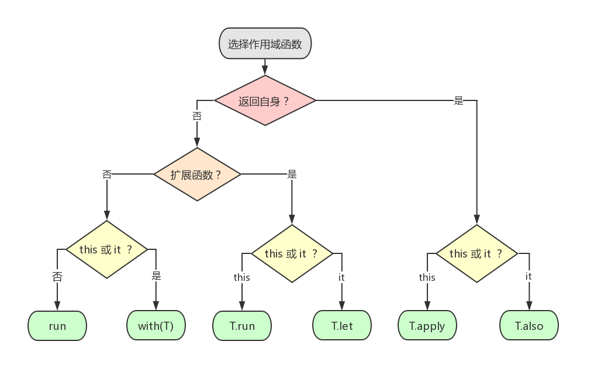

# Kotlin Examples - let, run, with, apply, also

## 示例

`let`、`run`、`with`、`apply` 和 `also` 都是 Kotlin 标准库提供的作用域函数 (scope function)，且都定义在 `package kotlin` 下的 `Standard.kt` 文件中。

在开发过程中合理使用作用域函数，在减少代码的同时逻辑依然保持清晰。

### let

`let` 这个作用域函数主要用于空检查。比如说，在对象上调用时 `let` 会执行给定的代码块 (block) 并将代码块中的最后一个表达式的运算结果作为其返回值。在代码块中，可通过 `it` 引用来访问该对象。

```kt
fun customPrint(s: String) {
    println(s.toUpperCase())
}

fun main() {
//sampleStart
    val empty = "test".let {             // 1
        customPrint(it)                  // 2
        it.isEmpty()                     // 3
    }
    println(" is empty: $empty")

    fun printNonNull(str: String?) {
        println("Printing \"$str\":")

        str?.let {                       // 4
            print("\t")
            customPrint(it)
            println()
        }
    }
    printNonNull(null)
    printNonNull("my string")
//sampleEnd
}
```
```kt
TEST
 is empty: false
Printing "null":
Printing "my string":
	MY STRING
```

1. 在字符串 `"test"` 上调用给定的代码块，并获得一个返回结果。
2. 将 `"test"` 字符串的引用 `it` 作为参数来调用 `customPrint()` 函数。
3. `let` 会返回该表达式的值。
4. 使用安全调用，因此 `let` 及其代码块仅在非 `null` 值的情况下执行。


### run 

类似 `let`，`run` 也是类似的功能：执行给定代码块并返回其结果。不同在于，给定 `run` 的代码块的内部是通过 `this` 引用来访问对象的，而不是 `it`。

如果你只是想要调用该对象的方法而不是将其作为参数传递给其它函数时，使用 `run` 再好不过了。

```kt
fun main() {
//sampleStart
    fun getNullableLength(ns: String?): Int? {
        println("for \"$ns\":")
        return ns?.run {                            // 1
            println("\tis empty? ${isEmpty()}")     // 2
            println("\tlength = $length")
            length                                  // 3
        }
    }
    val a = getNullableLength(null)
    val b = getNullableLength("")
    val c = getNullableLength("some string with kotlin")
    println("a = $a, b = $b, c = $c")
//sampleEnd
}
```
```kt
for "null":
for "":
	is empty? true
	length = 0
for "some string with kotlin":
	is empty? false
	length = 23
a = null, b = 0, c = 23
```

1. 在可空变量上调用给定的代码块。
2. 在 `run` 内部，不使用对象名称就可以访问其成员。
3. 如果给定字符串不为 `null`，则返回其长度 `lenght`。


### with

前面提到了 `let` 和 `run` 都有扩展函数的定义，调用形式为 `T.let`、 `T.run`。

> 注：`run` 也支持 `run { ... }` 形式的调用。另外，在本文「扩展」部分可以看到各个作用域函数的原型定义。

`with` 是一个「非扩展」函数，它只有 `with(x) { ... }` 形式的调用。

`with` 作用域函数存在的意义？
* 使得我们可以更简洁地访问其参数的成员，即在引用其成员时可以省略实例名称。

比如：

```kt
class Configuration(var host: String, var port: Int)

fun main() {
    val configuration = Configuration(host = "127.0.0.1", port = 9000)

//sampleStart
    with(configuration) {
        println("$host:$port")      // 1
    }

    // instead of:
    println("${configuration.host}:${configuration.port}")    
//sampleEnd
}
```
```kt
127.0.0.1:9000
127.0.0.1:9000
```

1. 不需要 `configuration` 这个实例名称就可以访问其成员 `host` 和 `port`，因为隐式 `this` 执行的就是 `configuration`。


### apply

`apply()` 函数可以执行给定代码块并返回对象本身。在代码块内部，对象是通过 `this` 进行引用的。

通常情况下，此函数可用来进行对象的初始化。

```kt
data class Person(var name: String, var age: Int, var about: String) {
    constructor(): this("", 0, "")
}

fun main() {
//sampleStart
    val jake = Person()                     // 1
    val stringDescription = jake.apply {    // 2
        name = "Jake"                       // 3
        age = 30
        about = "Android Developer"
    }.toString()                            // 4
//sampleEnd
    println(stringDescription)
}
```
```kt
Person(name=Jake, age=30, about=Android Developer)
```

1. 使用默认属性值创建一个 `Person()` 实例。
2. 将代码块 (接下来的3行) 应用于实例。
3. 在 `apply` 内部，这行代码等价于 `jake.name = "Jake"`。
4. 返回值是实例本身，因此你可以链接其它操作。


### also

`also` 的工作方式类似 `apply`：都是执行给定的块并返回被调用的对象。但是在 `also` 给定代码块的内部，对象是通过 `it` 进行引用的，因此该作用域函数更容易将该对象作为参数进行传递。

通常情况下，我们可以利用 `also` 函数来嵌入其它操作，比如登录调用链。

```kt
data class Person(var name: String, var age: Int, var about: String) {
    constructor(): this("", 0, "")
}

fun writeCreationLog(p: Person) {
    println("A new persion ${p.name} was created.")
}

fun main() {
//sampleStart
    val jake = Person("Jake", 30, "Android developer")
            .also {
                writeCreationLog(it)
            }
//sampleEnd
}
```
```kt
A new persion Jake was created.
```

1. 使用给定的属性值创建一个 `Person()` 对象。
2. 将给定的代码块应用于对象，返回值是对象本身。
3. 将对象作为参数传递来调用日志函数。


## 扩展

### let 

```kt
package kotlin

/**
 * Calls the specified function [block] with `this` value as its argument and returns its result.
 */
@kotlin.internal.InlineOnly
public inline fun <T, R> T.let(block: (T) -> R): R {
    contract {
        callsInPlace(block, InvocationKind.EXACTLY_ONCE)
    }
    return block(this)
}
```

使用很简单，调皮的我在这里就不再作其它演示。


### run

```kt
package kotlin

/**
 * Calls the specified function [block] and returns its result.
 */
@kotlin.internal.InlineOnly
public inline fun <R> run(block: () -> R): R {
    contract {
        callsInPlace(block, InvocationKind.EXACTLY_ONCE)
    }
    return block()
}

/**
 * Calls the specified function [block] with `this` value as its receiver and returns its result.
 */
@kotlin.internal.InlineOnly
public inline fun <T, R> T.run(block: T.() -> R): R {
    contract {
        callsInPlace(block, InvocationKind.EXACTLY_ONCE)
    }
    return block()
}
```

由上面的源码定义可以看出，`run` 函数既可以单独使用 (`run { ... }`) 也可以基于某个对象来使用 (`T.run { ... }`)。

在一开始的示例中，我们已经演示了如何基于一个字符串对象来使用该函数：

```kt
// 如果 ns == null 则不执行给定代码块，否则执行给定代码块
ns?.run {                            
    println("\tis empty? ${isEmpty()}")     
    println("\tlength = $length")
    length                                  
}
```

那单独使用的姿势是怎样的呢？

下面我们来模拟一个 Android 中的交互场景：用户点击按钮时，根据是否登录来弹出对应的对话框，以提示用户 "请先登录" 或 "已领取奖励"。示例代码如下：

```kt
abstract class Dialog(val message: String) {
    abstract fun show()
}

val loginDialog = object : Dialog("请先登录") {
    override fun show() {
        println("Show loginDialog with message = $message")
    }
}

val awardDialog = object : Dialog("已领取奖励") {
    override fun show() {
        println("Show awardDialog with message = $message")
    }
}

fun isLogin(): Boolean {
    return true   // or false
}

fun main() {
//sampleStart
    run {
        if (isLogin()) awardDialog else loginDialog
    }.show()
//sampleEnd
}
```
```kt
Show awardDialog with message = 已领取奖励
```

通过 `run` 来处理逻辑，可以更容易地表输出代码执行的最终目的是什么，即最终是为了调用 `show()` 方法弹出对话框。其中 `run` 对应的代码块逻辑就只是判断使用哪个 `Dialog` 而已。

`run` 函数其实也可以应用到我们常用的构建者模式中。比如构建一个 `Uri`：

```kt
class UriBuilder {
    var scheme = ""
    var host = ""
    var port = ""
    var path = ""
    fun build() = "$scheme://$host:$port/$path"
}

fun main() {
//sampleStart
    val uri = UriBuilder().run {
        scheme = "https"
        host = "192.1.5.197"
        port = "8080"
        path = "index.html"
        build()
    }
    println(uri)
//sampleEnd
}
```
```kt
https://192.1.5.197:8080/index.html
```


### with

```kt
package kotlin

/**
 * Calls the specified function [block] with the given [receiver] as its receiver and returns its result.
 */
@kotlin.internal.InlineOnly
public inline fun <T, R> with(receiver: T, block: T.() -> R): R {
    contract {
        callsInPlace(block, InvocationKind.EXACTLY_ONCE)
    }
    return receiver.block()
}
```

`with` 是干啥的？能马上想起来？不能？那看这段代码：

```kt
with("ABCDEFG") {
    // 直接访问参数的成员，不需要通过引用
    println(length)
    println(toLowerCase())
    println(toUpperCase())
    println(substring(0, 3))
}
```

再想想？知道 `with` 是干啥的了吧  >_>

举一个 `with` 在 Android 中的应用场景？在我们打开一个加载网页的页面时，一般都需要对 `WebView` 进行一些初始化设置。模拟代码如下：

```kt
data class Settings(
        var allowContentAccess: Boolean,
        var allowFileAccess: Boolean,
        var defaultFontSize: Int
)

class WebView {
    var settings: Settings = Settings(false, false, 14)
    fun loadUrl() {
        println("loadUrl with $settings")
    }
}

fun main() {
//sampleStart
    val webView = WebView()
    with(webView.settings) {
        allowContentAccess = true
        allowFileAccess = true
        defaultFontSize = 16
    }
    webView.loadUrl()
//sampleEnd
}
```
```
loadUrl with Settings(allowContentAccess=true, allowFileAccess=true, defaultFontSize=16)
```

看到这里你可能会想，如果 `webView.settings` 是 nullable 的话，`with` 代码块内部是不是要加上空判断？是的，比如：

```kt
class WebView {
    var settings: Settings? = ... 
}

with(webView.settings) {
    // 直接 allowContentAccess = true 会报错噢
    this?.allowContentAccess = true
    this?.allowFileAccess = true
    this?.defaultFontSize = 16
}
```

你再想了想，觉得这太麻烦了吧.. 好，那我们改为使用前面提到过的 `run` 函数：

```kt
webView.settings?.run {
    allowContentAccess = true
    allowFileAccess = true
    defaultFontSize = 16
}
```

嗯，这样就简洁多了。


### apply

```kt
package kotlin

/**
 * Calls the specified function [block] with `this` value as its receiver and returns `this` value.
 */
@kotlin.internal.InlineOnly
public inline fun <T> T.apply(block: T.() -> Unit): T {
    contract {
        callsInPlace(block, InvocationKind.EXACTLY_ONCE)
    }
    block()
    return this
}
```

与前面提到的 `let`、`run` 和 `with` 不同，`apply` 函数始终是返回自身的，而不是返回代码块中最后一个表达式的值。

举个栗子：

```kt
data class User(var name: String)

fun main() {
    // let
    val user1 = User("zhuanghongji")
    val result1 = user1.let {
        it.name.reversed()
    }
    println("result1 = $result1")

    // apply
    val user2 = User("zhuanghongji")
    val result2 = user2.apply {
        name = name.reversed()
    }
    println("result2 = $result2")
}
```
```kt
result1 = ijgnohgnauhz
result2 = User(name=ijgnohgnauhz)
```

由上面的日志输出可以看出：
* `result1` 的值其实是 `it.name.reversed()` 函数的返回值。
* 而 `result2` 的值还是 `user2` 这个对象，代码块中的逻辑仅仅是把它的 `name` 属性 `reversed` 了而已。

在 Android 应用开发过程中，我们经常需要通过构造一个 `Intent` 来启动一个 `Activity`。这里我们通过使用 `apply` 来模拟一下这个场景：

```kt
class Intent {
    var component = ""
    var action = ""
    var category = ""
    var data = ""
}

fun startActivity(intent: Intent) {
    println("""
startActivity:
component = ${intent.component}
action = ${intent.action}
category = ${intent.category}
data = ${intent.data}
            """
    )
}

fun main() {
    val intent = Intent().apply {
        // 通过 apply 来初始化 Intent 的实例对象，
        // 然后再将该实例对象作为代码块的返回值进行返回
        component = "LoginActivity"
        action = "com.zhuanghongji.kt.action"
        category = "com.zhuanghongji.kt.category"
        data = "hello"
    }
    startActivity(intent)
}
```

日志输出如下：

```kt
startActivity:
component = LoginActivity
action = com.zhuanghongji.kt.action
category = com.zhuanghongji.kt.category
data = hello
```


### also

```kt
/**
 * Calls the specified function [block] with `this` value as its argument and returns `this` value.
 */
@kotlin.internal.InlineOnly
@SinceKotlin("1.1")
public inline fun <T> T.also(block: (T) -> Unit): T {
    contract {
        callsInPlace(block, InvocationKind.EXACTLY_ONCE)
    }
    block(this)
    return this
}
```

与 `apply` 类似，`also` 函数也始终是返回自身的。`also` 与 `apply` 的区别在于：
* `also` 是通过 `it` 来引用对象的。
* 而 `apply` 还是 `this` 来引用对象 (访问对象成员)。

使用姿势也简单，这里也不再演示了。


### 决策树

前面讲到的这五种作用域函数，在选择具体使用哪一个时可基于以下三个条件去做决策：

1. 是返回自身，还是返回代码块中最后一个表达式的值？
2. 是否需要使用扩展函数，即是否需要基于给定的对象去访问其成员？
3. 在使用时是想通过 `this` 进行引用，还是需要通过 `it` 引用来进行参数传递？

示意图如下：




### 链式调用

在做决策时只能选择一个作用域函数？图样图森破..


在使用作用域函数时，我们是可以组合多个来进行链式调用的。比如：

```kt
data class Node(val name: String) {
    var child: Node? = null
    fun makeChild(childName: String): Node {
        child = Node(childName)
        return this
    }

    fun desc() {
        println("The name of this node is $name.")
    }
}

fun main() {
    Node("A").let {
        it.makeChild("B")
    }.also {
        with(it) {
            println(name)           // A
            println(it.name)
        }
    }.also {
        it.child?.run {
            println(name)           // B
            println(it.name)        // A
        }
    }.apply {
        desc()                      // The name of this node is A.
    }
}
```


## 总结

在这篇文章中，我们主要是讲解了 Kotlin 中五中作用域函数的基本使用姿势，以及在实际开发过程中是如何进行决策的的。