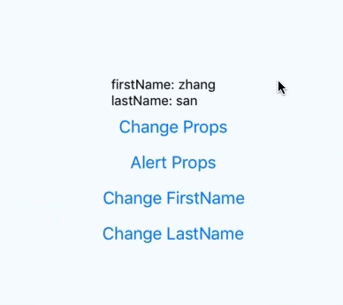

# React Native - 属性和状态

在 RN 中，我们可以通过两种数据来控制一个组件：

* `props`: 属性，在组件创建时指定，指定后不可修改。
* `state`: 状态，在组件内部定义，可用于需要改变的数据。

## 基础知识

### Props

大多数组件在创建时就可以通过不同的参数进行定制，这个定制参数就称为 `props`（属性）。

比如说：RN 中有一个名为 `Image` 的基本组件，你可以通过它的 `source` 属性来控制要显示的图片内容。

```js
import React, {Component} from 'react';
import {
  StyleSheet,
  Image
} from 'react-native';

export default class App extends Component<Props> {
  render() {
    // wrong
    // let pic = "https://upload.wikimedia.org/wikipedia/commons/d/de/Bananavarieties.jpg"
    let pic = {
      uri: "https://upload.wikimedia.org/wikipedia/commons/d/de/Bananavarieties.jpg"
    };
    return (
        <Image source={pic} style={{width: 300, height: 200}}/>
    )
  }
}
```


请注意 `{pic}` 有一层花括号，我们需要通过这层括号来把 `pic` 变量嵌入到 JSX 中。花括号的意思是，内部是一个 js 变量或表达式，需要执行后取值。

> 注：在 iOS 上使用 http 链接的图片地址可能不会显示，见 [解决办法](https://segmentfault.com/a/1190000002933776)

在我们自己定义的组件中同样可以使用 `props` 属性，这使得你可以通过不同的参数值来让单一组件在应用程序不同地方使用。这仅仅需要你在 `render` 函数中引用 `this.props`，比如：

```js
import React, {Component} from 'react';
import {
  StyleSheet,
  View,
  Text,
} from 'react-native';

class Greeting extends Component {
  render() {
    return (
      <Text>Hello {this.props.name}</Text>
    )
  }
}

export default class App extends Component<Props> {
  render() {
    return (
      <View style={styles.container}>
        <Greeting name='张三'/>
        <Greeting name='李四'/>
        <Greeting name='王五'/>
      </View>
    )
  }
}

const styles = StyleSheet.create({
  container: {
    flex: 1,
    flexDirection: 'column',
    justifyContent: 'center',
    alignItems: 'center',
  },
});
```


在上面的示例中，我们可以通过 `name` 属性对 `Greeting` 组件进行定制，然后在不同的场景中重复使用该组件。把 `Greeting` 写在了 JSX 中的用法和内置组件并无差异，这正是 React 的魅力所在。

同时，上面的示例中还用一个名为 `View` 的组件，该组件常用作其它组件的容器，来帮助控制布局和样式。


### State

一般来说，你应该在 `constructor` 中初始化 `state`，然后在需要修改时调用 `setState()` 方法。举个例子，现在我们想要做一段不断闪烁的文字：

* 闪烁的文字内容本身在组件创建时就已经指定好了，所以可将其作为一个 `props` 属性。
* 可以通过不断的显示和隐藏文字产生闪烁效果，所以文字内容的显示或隐藏是随着时间变化的，是一个 `state` 状态。

```js
class Blink extends Component {
  constructor(props) {
    super(props)
    this.state = {
      isShowingText: true,
    }

    // Toggle the state every second
    setInterval(() => {
      this.setState(previousState => {
        return {isShowingText: !previousState.isShowingText}
      })
    }, 1000)
  }

  render() {
    let display = this.state.isShowingText ? this.props.text : ' '
    return (
      <Text>{display}</Text>
    )
  }
}

export default class App extends Component<Props> {
  render() {
    return (
      <View style={styles.container}>
        <Blink text='你好'/>
        <Blink text='我好'/>
        <Blink text='大家好才是真的好'/>
      </View>
    )
  }
}

const styles = StyleSheet.create({
  container: {
    flex: 1,
    flexDirection: 'column',
    justifyContent: 'center',
    alignItems: 'center',
  },
});
```


在实际开发中，我们一般不会通过定时器函数（`setInterval()` `setTimeout()` ..） 来操作 `state`。我们大多数是在接收到服务器返回的新数据或用户输入数据之后，再去操作 `state`。当然，在这种场景下我们也可以使用一些「状态容器」比如 [Redux](http://redux.js.org/index.html) 来统一管理数据流。

一旦 `setState()` 方法被调用，`Blink` 组件就会被重新绘制。

`State` 的工作原理和 `React` 一致，所以如果想进行更加深入的了解细节，可以阅读 [React.Component API](https://facebook.github.io/react/docs/component-api.html)。

### Props 和 State 的区别和使用场景

简单而言，在指定某个组件的 props 之后，在组件内部是不可以再进行修改的，而 state 在指定后可修改的，每次我们通过 `setState` 修改组件的状态时，都会触发组件的 `render()` 方法重新绘制该组件。在开发过程中，我们可以通过这个区别点来设计组件的数据。

换个角度来说，props 是一个父组件传递给子组件的数据流，可以一直传递到子孙组件中，可用于组件的初始化。而 state 表示的是单个组件自身内部的状态，有着高度的内聚性，不会对外部组件造成影响，其改变通常是由事件进行驱动的。 

但我们要知道的是，无论是 state 发生变化还是父组件传递的 props 发生变化，都会触发该组件的 `render()` 方法进行重新渲染。

## 内容拓展

### prop-types

Facebook 提供了一个属性和类似对象的运行时类型检查库：[prop-types](https://github.com/facebook/prop-types) 

你可以使用 `prop-types` 来文档化预期传递给组件的属性类型，React 会根据你的定义来检查传递给组件的属性，如果不匹配的话则在开发过程中发出警告。

**安装**

```shell
npm install --save prop-types
```

**导入**

```shell
import PropTypes from 'prop-types';
```

**用法**

```js
import React from 'react';
import PropTypes from 'prop-types';

class MyComponent extends React.Component {
  render() {
    // ... do things with the props
  }
}

MyComponent.propTypes = {
  // You can declare that a prop is a specific JS primitive. By default, these
  // are all optional.
  optionalArray: PropTypes.array,
  optionalBool: PropTypes.bool,
  optionalFunc: PropTypes.func,
  optionalNumber: PropTypes.number,
  optionalObject: PropTypes.object,
  optionalString: PropTypes.string,
  optionalSymbol: PropTypes.symbol,

  // Anything that can be rendered: numbers, strings, elements or an array
  // (or fragment) containing these types.
  optionalNode: PropTypes.node,

  // A React element.
  optionalElement: PropTypes.element,

  // You can also declare that a prop is an instance of a class. This uses
  // JS's instanceof operator.
  optionalMessage: PropTypes.instanceOf(Message),

  // You can ensure that your prop is limited to specific values by treating
  // it as an enum.
  optionalEnum: PropTypes.oneOf(['News', 'Photos']),

  // An object that could be one of many types
  optionalUnion: PropTypes.oneOfType([
    PropTypes.string,
    PropTypes.number,
    PropTypes.instanceOf(Message)
  ]),

  // An array of a certain type
  optionalArrayOf: PropTypes.arrayOf(PropTypes.number),

  // An object with property values of a certain type
  optionalObjectOf: PropTypes.objectOf(PropTypes.number),

  // You can chain any of the above with `isRequired` to make sure a warning
  // is shown if the prop isn't provided.

  // An object taking on a particular shape
  optionalObjectWithShape: PropTypes.shape({
    optionalProperty: PropTypes.string,
    requiredProperty: PropTypes.number.isRequired
  }),

  // An object with warnings on extra properties
  optionalObjectWithStrictShape: PropTypes.exact({
    optionalProperty: PropTypes.string,
    requiredProperty: PropTypes.number.isRequired
  }),

  requiredFunc: PropTypes.func.isRequired,

  // ...
};
```

### defaultProps 

在 RN 中，组件是支持默认属性的，可以通过 `defaultProps` 指定默认属性，比如：

```js
import React, { Component } from 'react'
import { View, Text } from 'react-native';

export class Person extends Component {
  render() {
    return (
      <View>
        <Text>{`${this.props.name} - ${this.props.age}`}</Text>
      </View>
    )
  }  
}

Person.defaultProps = {
  name: 'zhuanghongji',
  age: 18,
}
```

```js
import React, { Component } from 'react';
import { StyleSheet, View } from 'react-native';
import { Person } from './src/components/Person'

export default class App extends Component {
  render() {
    return (
      <View style={styles.container}>
        <Person />
        <Person name="zhangsan"/>
        <Person age={23}/>
      </View>
    );
  }
}

const styles = StyleSheet.create({
  container: {
    flex: 1,
    justifyContent: 'center',
    alignItems: 'center',
    backgroundColor: '#F5FCFF',
  },
});
```


从上面的效果图中，可以看出：

* 第一行：未对 `Person` 指定任意属性时，使用了默认的 `name` 属性值 `zhuanghongji` 和默认的 `age` 属性值 `18`。
* 第二行：对 `Person` 指定了 `name` 属性，则不使用其默认值。没有指定 `age` 属性值，则使用其默认值 `18`。
* 第三行：对 `Person` 指定了 `age` 属性，则不使用其默认值。没有指定 `name` 属性值，则使用其默认值 `zhuanghongji`。

如果你使用的是 ES7 或以上，可以换一种写法指定 `propTypes` 和 `defaultProps`，示例如下：

```js 
export class Person extends Component {

  static propTypes = {
    name: PropTypes.string,
    age: PropTypes.number,
  }

  static defaultProps = {
    name: 'zhuanghongji',
    age: 18,
  }
  
  // ...
}
```

### 较佳实践 

#### 将 state 写为 class 组件的实例变量

前面的 Blink 示例中，我们是将 state 写在组件构造函数中的。但很多时候，我们是不需要在组件构造函数中执行其它逻辑，这时我们就可以将 state 作为 class 的实例变量。比如：

```js
export class Person extends Component {

  state = {
    height: 172,
    weight: 60,
  }
  
  // ...
}
``` 

#### 使用对象解构和模板字符串

也有时候，组件可能有很多个属性和状态，先来看一种可能的写法：

```js
export class Person extends Component {

  static propTypes = {
    name: PropTypes.string,
    age: PropTypes.number,
  }

  static defaultProps = {
    name: 'zhuanghongji',
    age: 18,
  }

  state = {
    height: 172,
    weight: 60,
  }

  render() {
    return (
      <View>
        <Text>大家好，我叫 {this.props.name}，今年刚好 {this.props.age} 岁，很高兴认识你。</Text>
        <Text>我的身高是 {this.state.height} 厘米，体重是 {this.state.weight} 公斤。</Text>
      </View>
    )
  }  
}
```

我们来换一种好点的写法，看了之后再谈论其好在哪里：

```js
export class Person extends Component {
  // ...

  render() {
    const { name, age } = this.props
    const { height, weight } = this.state 
    return (
      <View>
        <Text>{`大家好，我叫 ${name}，今年刚好 ${age} 岁，很高兴认识你。`}</Text>
        <Text>{`我的身高是 ${height} 厘米，体重是 ${weight} 公斤。`}</Text>
      </View>
    )
  }  
}
``` 

好处如下：

* 在 `render()` 方法 `return` 之前，我们先通过「对象解构」解析出要使用到的属性或者状态，这样我们就能够清晰的察觉到该 `render()` 方法具体用到了哪些属性和状态。
* 通过字符串模板使得文本相关代码更加简洁，可读性更强。

#### 拆分 render 过程

当组件较为复杂时，可以将整个 render 过程拆分成多个 `renderXxx()` 过程，每个 `renderXxx()` 方法负责绘制一个或多个关系密切的页面元素。在每个 `renderXxx()` 方法里面先通过解构拿到相关的属性和状态，然后再在具体绘制内容里面进行引用也是一个比较好的实践。比如：

```js
export class Person extends Component {
  // ...

  renderContent() {
    const { date, username, desc } = this.props
    return (
      <View>
        <Text>{date}</Text>
        <Text>{username}</Text>
        <Text>{desc}</Text>
      </View>
    )
  }

  render() {
    const { title } = this.props
    return (
      <View>
        <Text>{title}</Text>
        {
          this.renderContent()
        }
      </View>
    )
  }  
}
``` 

#### 适当将组件拆分更小有助于性能提升 

上菜要快，直接看下面示例代码：

```js
// 显示收藏状态的组件
export class Collection extends Component {

  state = {
    isCollected: false,
  }

  render() {
    console.log('Collection render..')
    const { isCollected } = this.state 
    return (
      <View>
        <Button 
          title={isCollected ? '已收藏' : '未收藏'}
          onPress={() => this.setState(prevState => {
            return {
              isCollected: !prevState.isCollected
            }
          })}
        />
      </View>
    )
  }  
}
```

```js
export default class App extends Component {

  state = {
    comment: "nothing."
  }

  render() {
    console.log('App render..')
    const { comment } = this.state 
    return (
      <View style={styles.container}>
        <Text>zhuanghongji</Text>
        <Collection />
        <Text>{comment}</Text>
        <Button 
          title="Change Commet" 
          onPress={() => this.setState({
            comment: "handsome boy."
          })}
        />
      </View>
    );
  }
}
``` 

运行效果如下：


在页面上完成显示之后，点击子组件的 "未收藏" 按钮和父组件的 “Change Commet” 按钮，观察 console 中的日志输出你会发现一些现象：

* 当点击 "未收藏" 按钮时只有一个 `Collection render..` 日志输出，说明这个操作只触发了 `Collection` 组件的重新绘制。
* 而当你点击 “Change Commet” 按钮时先输出一个 `App render..` 日志，然后再输出一个 `Collection render..` 日志，说明了这个操作不仅触发了父组件 `App` 的重新绘制，也触发了 `Collection` 组件的重新绘制。当实际上，我们是不需要 `Collection` 组件进行重新绘制的。那么，这个问题有木有方法解决，有，且不知一个。

先来看一个对应于当前子标题的解决方案，将 `comment` 相关内容封装成一个子组件，那么该组件的 state 变化时，是不会影响到 `Collection` 组件的。也就是说，我们通过组件的进一步拆分避免了某些组件的无效绘制，提高了性能。当如果组件拆分得过小，使得组件深度更深从而降低了代码的可读性和扩张性。

当然，还有另外一个解决方案，那就是利用组件的生命周期方法：`shouldComponentUpdate()`，通过该方法你可以让 React 知道如果当前的 state 或 props 发生变化时，组件的显示是否收到影响。我们往 `Collection` 组件中增加一个寿命周期方法：

```js
shouldComponentUpdate(nextProps, nextState) {
  return this.state.isCollected !== nextState.isCollected
}
```

这时如果你再去点击 `Change Comment`，会发现只有 `App render..` 日志输出而没有 `Collection render..` 的了， 说明我们通过 `shouldComponentUpdate()` 方法确实避免了某些组件的无效绘制。


## 常见问题

**1. 组件的属性 (props) 真的不能改变吗？** 

* 如果单单是从组件内部来看，该组件的属性是不可变的。
* 但如果拓宽到父组件的范畴来看，组件的属性其实是可变的。

子组件的属性是由父组件进行传递的，当父组件传递的值发生变化时，子组件接收到的属性的值其实也发生了变化。来看一段演示代码：

```js 
export class Person extends Component {

  render() {
    const { firstName, lastName } = this.props
    return (
      <View>
        <Text>firstName: {firstName ? firstName : '--'}</Text>
        <Text>lastName: {lastName ? lastName : '--'}</Text>
        <Button
          title="Change Props"
          onPress={() => {
            this.props.firstName = 'changed'
          }}
        />
        <Button
          title="Alert Props"
          onPress={() => {
            alert(this.props.firstName)
          }}
        />
      </View>
    )
  }  
}

export default class App extends Component {

  firstName = "zhang"

  state = {
    lastName: "san"
  }

  render() {
    const { lastName } = this.state 
    return (
      <View style={styles.container}>
        <Person firstName={this.firstName} lastName={lastName}/>
        <Button 
          title="Change FirstName" 
          onPress={() => {
            this.firstName = "li"
          }}
        />
        <Button 
          title="Change LastName" 
          onPress={() => {
            this.setState({
              lastName: 'si'
            })
          }}
        />
      </View>
    );
  }
}
``` 

我们在子组件 `Person` 和父组件 `App` 中定义了四个按钮：

* **Change Props**：点击时修改子组件的 `firstName` 属性。
* **Alert Props**：点击时弹出显示子组件 `firstName` 属性的值。
* **Change FirstName**：点击时修改父组件要传递给子组件的 `firstName` 属性值，`firstName` 是父组件的普通实例变量。
* **Change LastName**：点击时修改父组件要传递给子组件的 `lastName` 属性值，`lastName` 是父组件的一个状态变量。

我们运行代码，然后依次点击这些按钮，看下显示效果是怎样的？

 

从上面的效果图中，可以发现：

* 点击 `Change Props` 和 `Alert Props` 之后，属性 `firstName` 的值还是 `zhang`，说明我们在内部是不可以修改属性值的。
* 点击 `Change FirstName` 时页面没发生变化，当在点击 `hange LastName` 之后 `firstName` 和 `lastName` 都发生了变化，说明父组件是可以修改传递给子组件的属性的值的，只是当子组件属性值在父组件中是以状态变量形式存在时，通过 `setState()` 修改该状态变量才会马上触发子组件刷新显示内容。


**2. 多次通过 `setState()` 改变组件状态，会触发几次 `render()` 方法？** 


**3. 如果每次 `setState()` 的数据相同，也会触发 `render()` 方法吗？**