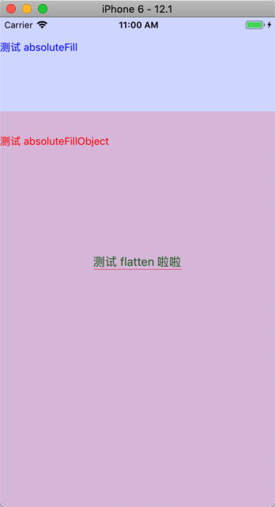
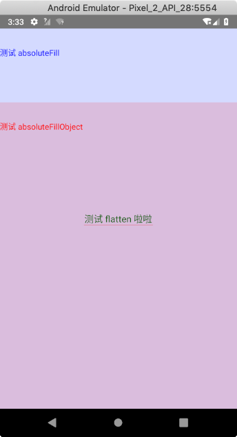
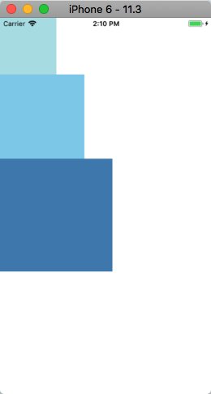
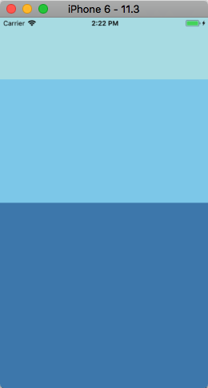
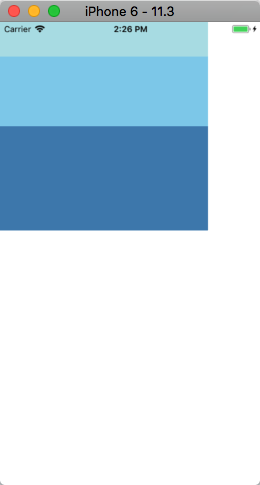
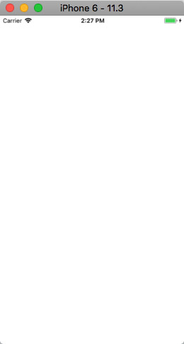
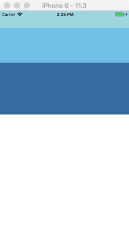

# React Native - 样式、高度和宽度

## 样式

### 基本用法

在 RN 中，你不需要使用特殊的语言或语法来定义样式，仍然是使用 JavaScript 来定义样式。所有的核心组件都接收一个名为 `style` 的属性，且其中的具体样式名基本匹配了 web 上的 CSS 命名，只是按照了 javascript 的语法要求使用了驼峰命名法，比如 `background-color` 改为 `backgroundColor`。

`style` 属性值可以是一个普通 JavaScript 对象，也可以是一个数组:

* 相对数组用法来说，对象用法更加简单，且更加常用。
* 在数组用法中，位置居后的样式对象比居前的优先级更高，通过这个特性你就可以间接实现样式的继承 (覆盖) 了。

实际开发中，组件的样式会越来越复杂，所以通常情况下我们会使用 `StyleSheet.create` 来集中定义组件的样式。示例如下：

```js
export default class App extends Component<Props> {
  render() {
    return (
      <View style={styles.container}>
        <Text style={styles.red}>仅仅红色{'\n'}</Text>
        <Text style={styles.bigBlue}>仅仅大蓝{'\n'}</Text>
        <Text style={[styles.bigBlue, styles.red]}>大蓝，接着红，红色优先级高{'\n'}</Text>
        <Text style={[styles.red, styles.bigBlue]}>红，接着大蓝，蓝色优先级高{'\n'}</Text>
      </View>
    )
  }
}

const styles = StyleSheet.create({
  container: {
    flex: 1,
    flexDirection: 'column',
    justifyContent: 'center',
    alignItems: 'center',
  },
  red: {
    color: 'red',
  },
  bigBlue: {
    color: 'blue',
    fontWeight: 'bold',
    fontSize: 24,
  }
});
```


常用的做法是按顺序声明和使用 `style` 属性，借鉴 CSS 中的「层叠」做法，后声明的属性会覆盖先声明的同名属性。

### StyleSheet 

`StyleSheet` 是一种类似于 CSS 样式表的抽象。

**`StyleSheet` 是由 RN 默认提供的一个 API，提供了三个静态方法：**

* `static setStyleAttributePreprocessor(property, process)`: 可用于设置一个预处理样式属性值的函数。该方法是实验性的，后续可能会被移除。
* `static create(obj)`: 根据传入的对象创建一个样式索引。
* `static flatten(style)`: 将样式对象数组展平为一个聚合样式对象。

**同时，`StyleSheet` 也提供了三个属性：**

* `hairlineWidth`: 该常量始终是一个整数的像素值，并会尽量符合当前平台最细的线的标准。该值是平台相关的，不同的平台或不同的屏幕像素密度都会导致不一样的结果。
* `absoluteFill`: 一个非常常见的模式是创建具有位置绝对 (position absolute) 和零位置 (zero positioning) 的叠加，因此 `absoluteFill` 可以用于方便并减少这些样式的重复。
* `absoluteFillObject`: 有时可能你需要 `absoluteFill` 但要做一些调整，`absoluteFillObject` 正好满足你，其可用于在 `StyleSheet` 中创建自定义样式。 

下面我们通过一个示例来学习这些静态方法和属性的使用：

```js
import React, { Component } from 'react';
import { StyleSheet, View, Text } from 'react-native';

export default class App extends Component {
  render() {

    const textStyle = StyleSheet.flatten([styles.text1, styles.text2])
    // textStyle 的值为 { fontSize: 16, color: 'green' }

    console.log(styles.text1)
    // Simply styles.text1 would return its ID (number), such as 4 or 26 or else number
    console.log(StyleSheet.flatten(styles.text1))
    // 打印结果为 { fontSize: 16, color: 'white' }

    console.log(`StyleSheet.absoluteFill = `, StyleSheet.absoluteFill)
    // StyleSheet.absoluteFill is ID (number) too, such as StyleSheet.absoluteFill =  2
    console.log(StyleSheet.flatten(StyleSheet.absoluteFill))
    // 打印结果为 {position: "absolute", left: 0, right: 0, top: 0, bottom: 0}

    console.log('StyleSheet.absoluteFillObject = ', StyleSheet.absoluteFillObject)
    // StyleSheet.absoluteFillObject 是一个对象，其值与 StyleSheet.flatten(StyleSheet.absoluteFill) 相同

    return (
      <View style={styles.container}>
        
        <Text style={textStyle}>测试 flatten 啦啦</Text>

        <View style={styles.testHairlineWidth} />

        {/* 设置了蓝色透明为 22，否则会因为「覆盖」导致你看不到上述代码绘制的内容 */}
        <View style={[StyleSheet.absoluteFill, { backgroundColor: '#0000FF22'}]}>
          <Text style={{ marginTop: 32, color: 'blue' }}>测试 absoluteFill </Text>
        </View>

        <View style={styles.testAbsoluteFillObject}>
          <Text style={{ marginTop: 32, color: 'red' }}>测试 absoluteFillObject </Text>
        </View>
      </View>
    );
  }
}

const styles = StyleSheet.create({
  container: {
    flex: 1,
    justifyContent: 'center',
    alignItems: 'center',
    backgroundColor: '#F5FCFF',
  },

  text1: {
    fontSize: 16,
    color: 'white',
  },
  text2: {
    color: 'green',
  },

  testHairlineWidth: {
    width: 120,
    height: StyleSheet.hairlineWidth,
    backgroundColor: 'red',
  },

  testAbsoluteFillObject: {
    ...StyleSheet.absoluteFillObject,
    top: 128,
    backgroundColor: '#FF000022',
  },
});
```

运行结果如下：

| iOS | Android
| -- | --
|  | 


## 高度和宽度

组件的高度和宽度决定了其在屏幕上显示的尺寸。

### 固定大小

在样式中添加固定的 `width` 和 `height` 是给组件设定尺寸大小的最简单方式。在 RN 中所有的尺寸大小都是无单位的，并且表示的是与密度无关的像素。举个例子:

```js
export default class App extends Component<Props> {
  render() {
    return (
      <View>
        <View style={{width: 100, height: 100, backgroundColor: 'powderblue'}}/>
        <View style={{width: 150, height: 150, backgroundColor: 'skyblue'}}/>
        <View style={{width: 200, height: 200, backgroundColor: 'steelblue'}}/>
      </View>
    );
  }
}
```

| iPhone 6 | Pixel
| -- | --
|  | 

类似上述代码给组件设置尺寸是一种常见的模式，比如要求在不同尺寸的屏幕上都显示成一样的大小。


### 弹性尺寸 (Flex Dimensions)

在组件的样式中使用 `flex` 可以使其在可利用的空间中动态的扩张或收缩。一个常见的使用场景是使用 `flex: 1` 来指定某个组件填满所有可用的空间。下面是两点更为详细的用法：

* 如果有多个并列的子组件使用了 `flex: 1`，则这些子组件会平分父容器中剩余的空间。
* 如果这些并列的子组件的 `flex` 值不一样，则谁的值更大，谁占据剩余空间的比例就更大（即占据剩余空间的比等于并列组件间 `flex` 值的比）。

> 注意：组件能够撑满剩余空间的前提是其父容器的尺寸大于零。
> 
> 如果父容器既没有固定的 `width` 和 `height`，也没有设定 `flex`，则父容器的尺寸为零。其子组件如果使用了 `flex`，也是无法显示的。

```js
export default class App extends Component<Props> {
  render() {
    return (
      // Try removing the `flex: 1` on the parent View.
      // The parent will not have dimensions, so the children can't expand.
      // What if you add `height: 300` instead of `flex: 1`?
      <View style={{flex: 1}}>
        <View style={{flex: 1, backgroundColor: 'powderblue'}} />
        <View style={{flex: 2, backgroundColor: 'skyblue'}} />
        <View style={{flex: 3, backgroundColor: 'steelblue'}} />
      </View>
    );
  }
}
```

| iOS | Android
| -- | --
|  | 

试着给父容器设置不同的样式，效果如下：

| 不设置任何样式 | {width: 300, height: 300} | {width: 300} | {height: 300}
| -- | -- | -- | --
|  |  |  |  


## 总结

在这篇文章中，我们讲述了如何在 RN 中使用样式，并概述了 StyleSheet API 的使用。在文章的下半部分，描述了在 RN 中如何指定组件的宽度和高度，以及弹性尺寸的用法。