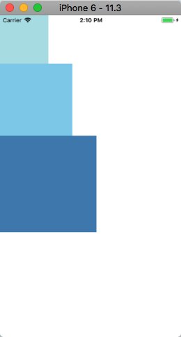
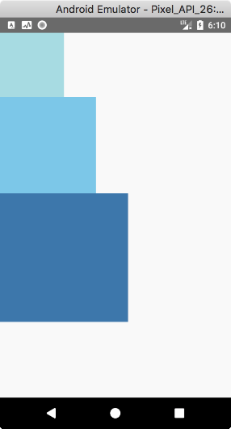
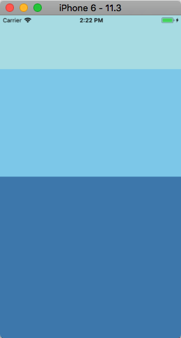
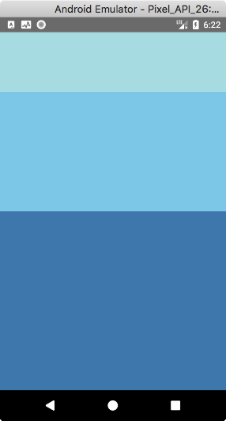
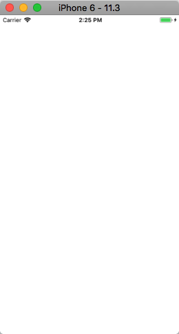
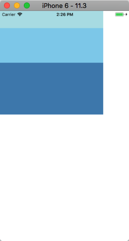
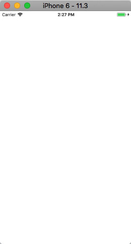
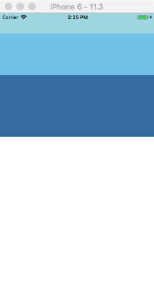

# 理解 React Native 中的 Height 和 Width

Height：高度。  
Width：宽度。  

组件的高度和宽度决定了其在屏幕上显示的尺寸。

## 固定大小

在样式中添加固定的 `width` 和 `height` 是给组件设定尺寸大小的最简单方式。在 RN 中，所有的尺寸大小都是无单位的，表示的是与设备像素无关的逻辑像素点。

举个栗子:
```js
export default class App extends Component<Props> {
  render() {
    return (
      <View>
        <View style={{width: 100, height: 100, backgroundColor: 'powderblue'}}/>
        <View style={{width: 150, height: 150, backgroundColor: 'skyblue'}}/>
        <View style={{width: 200, height: 200, backgroundColor: 'steelblue'}}/>
      </View>
    );
  }
}
```

| iPhone 6 | Pixel
| -- | --
|  | 

这样给组件设置尺寸也是一种常见的模式，比如要求在不同尺寸的屏幕上都显示成一样的大小。


## 弹性大小

在组件的样式中使用 `flex` 而已使其在可利用的空间中动态的扩张或收缩。一般来说，你会使用 `flex: 1` 来指定某个组件填满所有可用的空间。
* 如果有多个并列的子组件使用了 `flex: 1`，则这些子组件会平分父容器中剩余的空间。
* 如果这些并列的子组件的 `flex` 值不一样，则谁的值更大，谁占据剩余空间的比例就更大（即占据剩余空间的比等于并列组件间 `flex` 值的比）。

> 组件能够撑满剩余空间的前提是其父容器的尺寸大于零。如果父容器既没有固定的 `width` 和 `height`，也没有设定 `flex`，则父容器的尺寸为零。其子组件如果使用了 `flex`，也是无法显示的。

```js
export default class App extends Component<Props> {
  render() {
    return (
      // Try removing the `flex: 1` on the parent View.
      // The parent will not have dimensions, so the children can't expand.
      // What if you add `height: 300` instead of `flex: 1`?
      <View style={{flex: 1}}>
        <View style={{flex: 1, backgroundColor: 'powderblue'}} />
        <View style={{flex: 2, backgroundColor: 'skyblue'}} />
        <View style={{flex: 3, backgroundColor: 'steelblue'}} />
      </View>
    );
  }
}
```

| iOS | Android
| -- | --
|  | 

试着给父容器设置不同的样式，效果如下：

| 不设置任何样式 | {width: 300, height: 300} | {width: 300} | {height: 300}
| -- | -- | -- | --
|  |  |  | 
