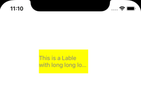
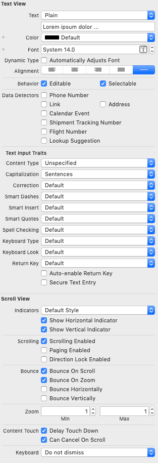
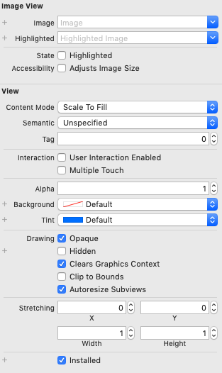

# iOS 中的视图和控件 (Views and Controls)

官方文档：[UIKit > Views and Controls](https://developer.apple.com/documentation/uikit/views_and_controls)

在屏幕上显示你的内容并定义该内容允许的交互。

> All code in this page is Objective-C.

## 概述

应用程序的用户界面是由各种视图和控件组成的，来看一张官网的图片：


视图之间是可以进行嵌套的，可以使用视图执行以下操作：
* 响应触摸和其它事件。
* 使用 Core Graphics 或 UIKit 类绘制自定义内容。
* 支持拖放交互。
* 响应焦点变化。
* 为视图的大小、位置和外观属性设置动画。

[UIView](https://developer.apple.com/documentation/uikit/uiview?language=objc) 是所有视图的根类，并定义了它们的通用行为。[UIControl](https://developer.apple.com/documentation/uikit/uicontrol?language=objc) 定义了额外的行为，特定于为用户交互而设计的按钮、开关及其它视图。

在官方文档中，大致是这样对视图和控件进行分类的：

**视图基本原理**
* `UIView`: 管理屏幕上矩形区域的对象。

**容器视图**
* `UIStackView`: 流线型界面(interface)，用于将视图集合放置成行或列。
* `UIScrollView`: 允许滚动和缩放其包含视图的视图。

**内容视图**
* `UIImageView`: 在界面上显示单个图像或一系列动画图像的对象。
* `UIPickerView`: 一个使用模拟 spinning-wheel 或 slot-machine 来显示一组或多组值的视图。
* `UIProgressView`: 一个描述任务随时间推移的视图。

**控制**
* `UIControl`: 控件的基类，它是为响应用户交互而传达某种特地操作或意图的可视元素。
* `UIButton`: 用于响应用户交互执行自定义代码的控件。
* `UIDatePicker`: 用于输入日期和时间值的控件。
* `UIPageControl`: 显示一系列水平的点的控件，每个点对应于应用程序文档或其他数据模型实体中的页面。
* `UISegmentedControl`: 由多个段组成的水平控件，每段用作离散按钮。
* `UISlider`: 用于从连续值范围中选择单个值的控件。
* `UIStepper`: 用于递增或递减值的控件。
* `UISwitch`: 提供二选一(binary)选项的控件，比如 On/Off。


**文本视图**
* `UILabel`: 显示一行或多行只读文本的视图，通常与控件一起使用，以描述其预期用途。
* `UITextField`: 在界面中显示一个可编辑文本区域的对象。
* `UITextView`: 可滚动的多行文本区域。

**Bars**
* `UIBarItem`: 项目(item)的抽象超类，可以添加到屏幕底部显示的栏(bar)中。
* `UIBarButtonItem`: 专门用于放置在工具栏或标签栏上的按钮。
* `UIBarButtonItemGroup`: iPad 上键盘上方快捷方式栏上的一组条形按钮项。
* `UINavigationBar`: 导航控件显示在屏幕顶部的栏中，通常与导航控制器结合使用。
* `UISearchBar`: 用于从用户接收搜索相关信息的专用视图。
* `UIToolBar`: 在界面底部边缘显示一个或多个按钮的控件。
* `UITabBar`: 在选项卡栏中显示一个或多个按钮的控件，用于在应用程序中选择不同的子任务、视图或模式。
* `UITabBarItem`: 标签栏中的项目。
* `UIBarPositioning`: 一组用于定义条形图在 iOS 应用中的定位方式的方法。
* `UIBarPositioningDelegate`: 一组支持符合协议的条形定位的方法。


下面换个思路，由浅入深的介绍 iOS 中部分视图和控件。

> 通过 Xcode 新建一个 Objective-C 项目，在 `Main.storyboard` 中拖入视图或控件，然后在 `ViewController.m` 中的 `viewDidLoad` 方法中写测试代码：

```objc
#import "ViewController.h"

@interface ViewController ()

// views and controls outlet here, for example:
// @property (weak, nonatomic) IBOutlet UILabel *myLabel;

@end

@implementation ViewController

- (void)viewDidLoad {
    [super viewDidLoad];
    // write example code here, for example:
    // _myLabel.text = @"This is a Lable.";
}

@end
```

## UILabel

```objc
@interface UILabel : UIView
```


**常见属性：**
* `text`
* `textColor`
* `textAlignment`
* `numberOfLines`
* `lineBreakMode`
* `enable`

**示例：**

```objc
_myLabel.text = @"This is a Lable with long long long long long long text.";
_myLabel.textColor = [UIColor redColor];
_myLabel.backgroundColor = [UIColor yellowColor];
```


如果添加以下代码，再次运行：

```objc
_myLabel.numberOfLines = 2;
_myLabel.lineBreakMode = NSLineBreakByTruncatingTail;
_myLabel.enabled = NO;
```




## UIButton

```objc
@interface UIButton : UIControl
```


**常见属性：**
* `imageView`
* `titleLabel`

**常见方法：**
```objc
+ (id)buttonWithType:(UIButtonType)buttonType

- (UIImage *)backgroundImageForState:(UIControlState)state

- (UIImage *)imageForState:(UIControlState)state

- (void)setTitle:(NSString *)title forState:(UIControlState)state

- (void)addTarget:(id)target action:(SEL)action forControlEvents: (UIControlEvents) controlEvents
```

**按钮类型**
* `UIButtonTypeCustom`
* `UIButtonTypeRoundedRect`
* `UIButtonTypeDetailDisclosure`
* `UIButtonTypeInfoLight`
* `UIButtonTypeInfoDark`
* `UIButtonTypeContactAdd`

**示例：**

将控件的 outlet 和 action 拖入 `ViewController` 中，完整代码如下：

```objc
@interface ViewController ()

@property (weak, nonatomic) IBOutlet UIButton *myButton;

- (IBAction)onTouchInside:(id)sender;

@end

@implementation ViewController

- (void)viewDidLoad {
    [super viewDidLoad];
    [_myButton setTitle:@"say hello" forState:UIControlStateNormal];
    [_myButton setBackgroundColor:[UIColor lightGrayColor]];
    [_myButton setTitleColor:[UIColor blackColor] forState:UIControlStateNormal];
}

- (IBAction)onTouchInside:(id)sender {
    NSLog(@"You touch the button inside: hello friends.");
}

@end
```


点击按钮可看到打印的日志：

```
You touch the button inside: hello friends.
```


## UITextField

```objc
@interface UITextField : UIControl
```


**常见属性：**
* 在没有任何用户输入时，显示占位符
* 正常文本
* 自动更正型
* 键盘类型
* 返回键类型
* 清除按钮模式
* 对齐方式
* 委托

**示例：**

完整代码如下：

```objc
#import "ViewController.h"

@interface ViewController () <UITextFieldDelegate>

@property (weak, nonatomic) IBOutlet UITextField *myTextField;

@end

@implementation ViewController

- (void)viewDidLoad {
    [super viewDidLoad];
    UILabel *prefixLable = [[UILabel alloc] initWithFrame:CGRectZero];
    prefixLable.text = @"姓名：";
    [prefixLable setFont: [UIFont boldSystemFontOfSize:18]];
    [prefixLable sizeToFit];

    _myTextField.leftView = prefixLable;
    _myTextField.leftViewMode = UITextFieldViewModeAlways;
    _myTextField.placeholder = @"请输入你的姓名";
    _myTextField.borderStyle = UITextBorderStyleRoundedRect;
    _myTextField.contentVerticalAlignment = UIControlContentVerticalAlignmentCenter;
    [_myTextField setFont: [UIFont boldSystemFontOfSize:16]];

    _myTextField.delegate = self;
}


# pragma mark - TextField Delegate

- (void)textFieldDidBeginEditing:(UITextField *)textField {
    NSLog(@"textFieldDidBeginEditing");
}

- (void)textFieldDidEndEditing:(UITextField *)textField {
    NSLog(@"textFieldDidEndEditing");
}

@end
```


## UITextView

```objc
@interface UITextView : UIScrollView
```



**常见属性：**
* `dataDetectorTypes`
* `delegate`
* `editable`
* `inputAccessoryView`
* `inputView`
* `text`
* `textAlignment`
* `textColor`

**重要的委托方法：**
```
- (void)textViewDidBeginEditing:(UITextView *)textView

- (void)textViewDidEndEditing:(UITextView *)textView

- (void)textViewDidChange:(UITextView *)textView

- (BOOL)textViewShouldEndEditing:(UITextView *)textView
```

**示例：**

这次我们不从 storyboard 中拖视图了，我们用代码来创建一个：

```objc
#import "ViewController.h"

@interface ViewController () <UITextViewDelegate>

@end

@implementation ViewController

- (void)viewDidLoad {
    [super viewDidLoad];
    // add text view
    UITextView *myTextView = [[UITextView alloc] initWithFrame:CGRectMake(10, 50, 300, 200)];
    [myTextView setFont: [UIFont boldSystemFontOfSize:18]];
    [myTextView setText: @"《江城子》十年生死两茫茫，不思量，自难忘。千里孤坟，无处话凄凉。纵使相逢应不识，尘满面，鬓如霜。夜来幽梦忽还乡。小轩窗，正梳妆。相顾无言，惟有泪千行。---《江城子》十年生死两茫茫，不思量，自难忘。千里孤坟，无处话凄凉。纵使相逢应不识，尘满面，鬓如霜。夜来幽梦忽还乡。小轩窗，正梳妆。相顾无言，惟有泪千行。"];
    myTextView.delegate = self;
    [self.view addSubview:myTextView];
}


# pragma mark - TextView Delegate

- (BOOL)textView:(UITextView *)textView shouldChangeTextInRange:(NSRange)range replacementText:(NSString *)text {
    if ([text isEqualToString:@"\n"]) {
        [textView resignFirstResponder];
    }
    return YES;
}

- (void)textViewDidBeginEditing:(UITextView *)textView {
    NSLog(@"textViewDidBeginEditing");
}

- (void)textViewDidChange:(UITextView *)textView {
    NSLog(@"textViewDidChange, textView.text = %@", textView.text);
}

- (void)textViewDidEndEditing:(UITextView *)textView {
    NSLog(@"textViewDidEndEditing");
}

- (BOOL)textViewShouldEndEditing:(UITextView *)textView {
    NSLog(@"textViewShouldEndEditing");
    return YES;
}

@end
```


## UISwitch

```objc
@interface UISwitch : UIControl
```


**常见属性：**
* `onImage`
* `offImage`
* `on`

**常见方法：**
```objc
- (void)setOn:(BOOL)on animated:(BOOL)animated
```

**示例：**

```objc
#import "ViewController.h"

@interface ViewController ()

@property (weak, nonatomic) IBOutlet UISwitch *mySwitch;

@end

@implementation ViewController

- (void)viewDidLoad {
    [super viewDidLoad];
    [_mySwitch addTarget:self action:@selector(onValueChanged:) forControlEvents:UIControlEventValueChanged];
}

- (IBAction)onToggle:(id)sender {
    if (_mySwitch.on) {
        [_mySwitch setOn:NO animated:YES];
    } else {
        [_mySwitch setOn:YES animated:YES];
    }
}

- (IBAction)onValueChanged:(id)sender {
    NSLog(@"Switch current state %@", _mySwitch.on ? @"On" : @"Off");
}

@end
```


## UIStepper

```objc
@interface UIStepper : UIControl
```


**常见属性：**
* `value`
* `stepValue`
* `continuous`
* `minimumValue`
* `maximumValue`

**示例：**

```objc
#import "ViewController.h"

@interface ViewController ()

@property (weak, nonatomic) IBOutlet UIStepper *myStepper;

@end

@implementation ViewController

- (void)viewDidLoad {
    [super viewDidLoad];
    _myStepper.value = 2;
    _myStepper.stepValue = 2;
    _myStepper.minimumValue = 0;
    _myStepper.maximumValue = 10;
    _myStepper.autorepeat = YES;
    _myStepper.continuous = YES;

    [_myStepper addTarget:self action:@selector(onStepperChange) forControlEvents:UIControlEventValueChanged];
}

- (void)onStepperChange {
    NSLog(@"onStepperChange: %f", _myStepper.value);
}

@end
```

```
// 启动后一直点加号，日志如下
onStepperChange: 4.000000
onStepperChange: 6.000000
onStepperChange: 8.000000
onStepperChange: 10.000000
```


## UISlider

```objc
@interface UISlider : UIControl
```


**常见属性：**
* `continuous`
* `maximumValue`
* `minimumValue`
* `value`

**常见方法：**
```objc
- (void)setValue:(float)value animated:(BOOL)animated
```

**示例：**

```objc
#import "ViewController.h"

@interface ViewController ()

@property (weak, nonatomic) IBOutlet UILabel *minLabel;
@property (weak, nonatomic) IBOutlet UISlider *mySlider;
@property (weak, nonatomic) IBOutlet UILabel *valueLabel;
@property (weak, nonatomic) IBOutlet UITextField *valueTextField;
@property (weak, nonatomic) IBOutlet UIButton *valueConfirmButton;

@end

@implementation ViewController

- (IBAction)onSliderValueChanged:(UISlider *)slider {
    NSLog(@"onSliderValueChanged");
    float value = slider.value;
    _valueLabel.text =  [NSString stringWithFormat:@"%f", value];
}

- (IBAction)onConfirmButtonTouchUpInside:(id)sender {
    NSLog(@"onConfirmButtonTouchInside");
    _valueLabel.text = _valueTextField.text;
    float value = [_valueTextField.text floatValue];
    [_mySlider setValue:value animated:YES];
}

- (void)viewDidLoad {
    [super viewDidLoad];
    // init views
    _minLabel.text = @"0";
    _valueLabel.text = @"10";
    _valueTextField.placeholder = @"请输入要设置到 Slider 的值";
    _valueTextField.keyboardType = UIKeyboardTypeNumbersAndPunctuation;
    [_valueConfirmButton setTitle:@"确定" forState:UIControlStateNormal];

    // init sldier
    [_mySlider addTarget:self action:@selector(onSliderValueChanged:) forControlEvents:UIControlEventValueChanged];
    _mySlider.minimumValue = 0;
    _mySlider.maximumValue = 100;
    _mySlider.continuous = YES;
    [_mySlider setValue:10 animated:YES];
}

@end
```


## UISegmentedControl

```objc
@interface UISegmentedControl : UIControl
```


**常见属性：**
*
*
*
*
*

**示例：**

```

```


## UIImageView

```objc
@interface UIImageView : UIView
```



**常见属性：**
* `image`
* `highlightedImage`
* `userInteractionEnabled`
* `animationImages`
* `animationRepeatCount`

**常见方法：**
```objc
- (id)initWithImage:(UIImage *)image

- (id)initWithImage:(UIImage *)image highlightedImage:(UIImage *)highlightedImage

- (void)startAnimating

- (void)stopAnimating
```

**示例：**

```

```


## UIDatePicker

```objc
@interface UIDatePicker : UIControl
```


**常见属性：**
*
*
*
*
*

**示例：**

```

```


## UISearchBar

```objc
@interface UISearchBar : UIView
```


**常见属性：**
*
*
*
*
*

**示例：**

```

```


## AAAA

```

```


**常见属性：**
*
*
*
*
*

**示例：**

```

```
