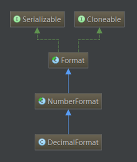

# 使用 DecimalFormat 格式化数字字符串

`DecimalFormat` 是 `NumberFormat` 的一个具体子类，可用于格式化数字字符串，比如取两位小数、千位逗号分隔符等。 

  


## 示例

```java
double pi = 3.1415927; // 圆周率
// 取一位整数
System.out.println(new DecimalFormat("0").format(pi));         // 3
// 取一位整数和两位小数
System.out.println(new DecimalFormat("0.00").format(pi));      // 3.14
// 取两位整数和三位小数，整数不足部分以0填补。
System.out.println(new DecimalFormat("00.000").format(pi));    //  03.142
// 取所有整数部分
System.out.println(new DecimalFormat("#").format(pi));         // 3
// 以百分比方式计数，并取两位小数
System.out.println(new DecimalFormat("#.##%").format(pi));     // 314.16%

long c = 299792458;  //  光速
// 显示为科学计数法，并取五位小数
System.out.println(new DecimalFormat("#.#####E0").format(c));  // 2.99792E8
// 显示为两位整数的科学计数法，并取四位小数
System.out.println(new DecimalFormat("00.####E0").format(c));  // 29.9792E7
// 每三位以逗号进行分隔。
System.out.println(new DecimalFormat(",###").format(c));       // 299,792,458
// 将格式嵌入文本
System.out.println(new DecimalFormat("光速大小为每秒,###米").format(c)); // 光速大小为每秒299,792,458米
```

通过打印结果，可以发现：
* `DecimalFormat` 类可以根据 `#` 和 `0` 两种占位符来指定整数或小数的长度。  
* `0` 表示如果位数不足则以0填充；`#` 表示只要有可能就把数字放在这个位置。

如果使用具有多个分组字符的模式，则最后一个分隔符和整数结尾之间的间隔才是使用的分组大小。所以 `#,##,###,####` 等同于 `######,####` 等同于 `##,####,####`。

`DecimalFormat` 包含一个模式和一组符号。

## 常见符号

|符号|位置|含义
|--|--|--
|0|数字|阿拉伯数字
|#|数字|阿拉伯数字，如果不存在则显示为空
|.|数字|小数分隔符
|-|数字|减号
|,|数字|分组分隔符
|E|数字|分隔科学计数法中的尾数和指数。在前缀或后缀中无需加引号
|%|数字|乘以 100 并显示为百分数
|/u2030|数字|乘以 1000 并显示为千分数

## 其它示例

```java
DecimalFormat df1 = new DecimalFormat("0.0");   
DecimalFormat df2 = new DecimalFormat("#.#");   
DecimalFormat df3 = new DecimalFormat("000.000");   
DecimalFormat df4 = new DecimalFormat("###.###");   
System.out.println(df1.format(12.34));   // 12.3
System.out.println(df2.format(12.34));   // 12.3
System.out.println(df3.format(12.34));   // 012.340
System.out.println(df4.format(12.34));   // 12.34
```

```java
DecimalFormat format = new DecimalFormat("###,####.000");   
System.out.println(format.format(111111123456.1227222));     // 1111,1112,3456.122

Locale.setDefault(Locale.US);   
DecimalFormat usFormat = new DecimalFormat("###,###.000");   
System.out.println(usFormat.format(111111123456.1227222));  // 111,111,123,456.122

DecimalFormat addPattenFormat = new DecimalFormat();   
addPattenFormat.applyPattern("##,###.000");   
System.out.println(addPattenFormat.format(111111123456.1227));  //  111,111,123,456.122

DecimalFormat zhiFormat = new DecimalFormat();   
zhiFormat.applyPattern("0.000E0000");   
System.out.println(zhiFormat.format(10000));           // 1.000E0004
System.out.println(zhiFormat.format(12345678.345));    // 1.234E0007

DecimalFormat percentFormat = new DecimalFormat();   
percentFormat.applyPattern("#0.000%");   
System.out.println(percentFormat.format(0.3052222));   // 30.522%
```

## 封装一个金额格式化工具类 

在日常开发中，我们可能会经常遇到格式化金额字符串的情况，那么可以封装一个工具类来统一处理这种情况。

DecimalUtils.java :

```java
import java.math.RoundingMode;
import java.text.DecimalFormat;

public class DecimalUtils {

    private static final String DEFAULT_RESULT = "";

    private DecimalUtils() {}

    private static String formatMoneyHalfUpOrNot(Double money, boolean isHalfUp) {
        if (money == null) {
            return DEFAULT_RESULT;
        }
        DecimalFormat formatter = new DecimalFormat("###,###.00");
        formatter.setRoundingMode(
                isHalfUp ? RoundingMode.HALF_UP : RoundingMode.DOWN);
        return formatter.format(money);
    }

    /**
     * 格式化金额字符串（非四舍五入）
     * @param money 金额字符串
     * @return 格式化后的字符串
     */
    public static String formatMoney(String money) {
        try {
            double moneyD = Double.valueOf(money);
            return formatMoneyHalfUpOrNot(moneyD, false);
        } catch (NumberFormatException e) {
            return DEFAULT_RESULT;
        }
    }

    /**
     * 格式化金额数字（非四舍五入）
     * @param money 金额数字
     * @return 格式化后的字符串
     */
    public static String formatMoney(Double money) {
        if (money == null) {
            return DEFAULT_RESULT;
        }
        return formatMoneyHalfUpOrNot(money, false);
    }

    /**
     * 格式化金额字符串（会四舍五入）
     * @param money 金额字符串
     * @return 格式化后的字符串
     */
    public static String formatMoneyHalfUp(String money) {
        try {
            double moneyD = Double.valueOf(money);
            return formatMoneyHalfUpOrNot(moneyD, true);
        } catch (NumberFormatException e) {
            return DEFAULT_RESULT;
        }
    }

    /**
     * 格式化金额数字（会四舍五入）
     * @param money 金额数字
     * @return 格式化后的字符串
     */
    public static String formatMoneyHalfUp(Double money) {
        if (money == null) {
            return DEFAULT_RESULT;
        }
        return formatMoneyHalfUpOrNot(money, true);
    }
}
```

DecimalUtilsTest.java :

```java
import org.junit.Assert;
import org.junit.Test;

/** 
* DecimalUtils Tester. 
* 
* @author zhuanghongji
* @since <pre>Jan 1, 2019</pre> 
* @version 1.0 
*/ 
public class DecimalUtilsTest {

    @Test
    public void testFormatMoney1() throws Exception {
        String result = DecimalUtils.formatMoney("12.34567");
        Assert.assertEquals("12.34", result);
    }

    @Test
    public void testFormatMoney2() throws Exception {
        String result = DecimalUtils.formatMoney(12345678.905);
        Assert.assertEquals("12,345,678.90", result);
    }

    @Test
    public void testFormatMoney3() throws Exception {
        // 格式化非数字字符串，预期返回空串
        String result = DecimalUtils.formatMoney("ABC.23");
        Assert.assertEquals("", result);
    }

    @Test
    public void testFormatMoney4() throws Exception {
        // 格式化字符串，补齐零
        String result = DecimalUtils.formatMoney("123");
        Assert.assertEquals("123.00", result);
    }

    @Test
    public void testFormatMoneyHalfUp1() throws Exception {
        // 格式化数字字符串，四舍五入
        String result = DecimalUtils.formatMoneyHalfUp("123.456");
        Assert.assertEquals("123.46", result);
    }

    @Test
    public void testFormatMoneyHalfUp2() throws Exception {
        // 格式化 double，四舍五入
        String result = DecimalUtils.formatMoneyHalfUp(1234.567);
        Assert.assertEquals("1,234.57", result);
    }
} 
```