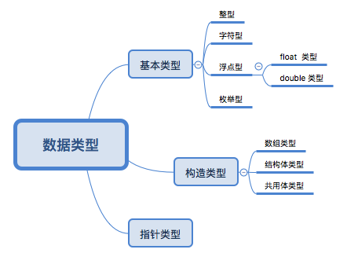
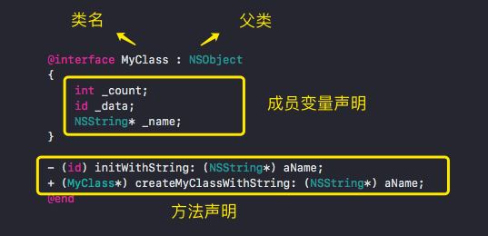
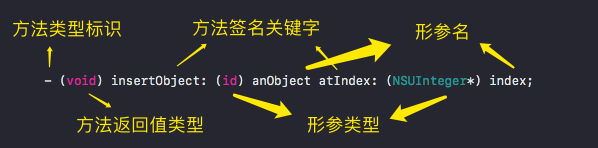
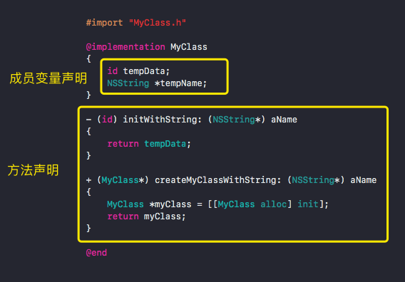

# OC 基础和语法介绍

文章内容：
1. 简介
2. 简单示例
3. 数据类型
4. 输出函数及格式字符
5. 运算符
6. 类和对象

## 1. 简介

Objective-C (后续均简称 OC) 是 C 语言的严格超集，任何 C 语言程序不经修改就可以直接通过 OC 编译器的编译。OC 代码文件扩展名：

| 扩展名 |  | 描述
| -- | -- | --
| .h | 头文件 | 包含类、类型、函数等的声明
| .m | 源代码文件 | 可以包含 OC 和 C 代码
| .mm | 源代码文件 | 可以包含 OC 和 C 代码，也可以包含 C++ 代码

OC 是一门强类型的语言：
* 所有的变量必须先声明，再使用。
* 指定类型的变量只能接收与之匹配的值。


**类型**

OC 提供了丰富的基本类型，大致可以分为两类：
* 数值类型：整型、字符型、浮点型等
* 布尔类型

数值类型之间可以进行类型转换，包括：
* 自动类型转换
* 强制类型转换

**注释**

OC 提供了两种注释形式：
* 单行注释：`// ...`
* 多行注释：`/* ... */`

**分隔符**

* 分号 `;`：每个 OC 语句必须使用分好作为结尾。
* 花括号 `{}`：成对出现，类的成员部分需要放在花括号中定义，方法体部分必须放在一个代码块里。
* 方括号 `[]`：主要用于访问数组元素，在对象调用方法时也需要用方括号括起来，比如：
```objc
NSString *str = @"zhuanghongji";
NSLog(@"我名字的长度为：%ld", [str length]);
// 我名字的长度为：12
```
* 圆括号 `()`：
```
1. 在定义函数时，必须使用圆括号来包含所有的 **形参声明**，调用函数时也必须使用圆括号来传入 **实参值**。
2. 将表达式中的某个部分括成一个整体，保证这个部分优先计算。
3. 作为强制类型转换的运算符。
```
* 空格 ` `：使用空格来分隔一条语句的不同部分。
* 圆点 `.`：通常作为「类/对象」和它的属性之间的分隔符，表明调用某个类或实例的指定成员。


## 2. 简单示例

创建一个 OC 的命令行程序时，Xcode 会自动生成了以下代码：
```objc
#import <Foundation/Foundation.h>

int main(int argc, const char * argv[]) {
    @autoreleasepool {
        // insert code here...
        NSLog(@"Hello, World!");
    }
    return 0;
}
```

运行成功后，控制台会打印出 `Hello, World!`。

下面来解析一下这段代码：

* `#import` 指令的功能是，告诉编译器找到名为 `Foundation.h` 的文件并将其信息导入或包含到程序中，与 `#include` 相比可以确保相同的文件只会包含一次。
* `Foundation.h` 是 Foundation 框架的头文件，只要引入了它就可以使用 Foundation 框架的所有功能了。
* `@` 符号没有实际意义，只是用来作为 OC 字符串的特有标识。不加的话，则视为 C 语言中的字符串。
* `NSLog()` 是 OC 中的格式化输出函数，类似 C 语言中的 `printf()` 函数
* 在 OC 中，所有的程序语句必须使用 `;` 号结束，所有变量使用前必须先定义。

> Foundation 框架提供了 OC 专有的基本类型，并提供了多线程、网络连接、文件操作、本地数据存储等常用功能。

## 3. 数据类型

### 3.1 数据类型分类

声明一个变量只需指定变量类型和变量名，格式如下：

```objc
type varName;
```

OC 支持的数据类型大致如下：



**指针类型** 是 OC 中最重要的类型，所有系统类、自定义类的本质都是指针类型。除此之外，还有一种特殊的类型「空类型」，即空引用 `nil` 的类型。

> 空引用 `nil` 是空类型变量唯一的值，空引用 `nil` 可以转换为任何引用类型。


### 3.2 基本数据类型

**整型**

* `int`
* `short int`
* `long int`
* `long long`

整数常量有三种表示方式：

* 十进制
* 八进制：以 `0` 开头。
* 十六进制：以 `0x` 开头，其中 `10 ~ 15` 分别以 `a ~ f` 表示。

> 在上述四种整型类型前面添加 `unsigned` 关键词，可将他们变成无符号整型。无符号整型的最高位不是符号位，而是数值位，因此无符号整数不能表示表示负数。

**字符型**

表示单个字符时，必须使用单引号 `'` 引起来。每个字符只占用一个字节，不支持中文字符。

字符型常量有两种表现形式：

* 直接通过单个字符指定，如 `'a'`、`'B'` 和 `'0'`等。
* 通过转义字符来表示，如 `'\n'`、`'\t'` 和 `'\\'` 等。

**浮点型**

* `float`
* `double`
* `long double`

**枚举型**

如果一个变量只有几种可能的值（比如季节变量只有春夏秋冬这四个值），那么可以将该变量定义为 **枚举变量**。示例如下：

```objc
#import <Foundation/Foundation.h>

// 定义枚举类型
enum season {spring, summer, fall, winter};

// 使用该枚举类型来定义变量
enum season mySeason, yourSeason;

int main(int argc, const char * argv[]) {
    @autoreleasepool {
        // 进行赋值
        mySeason = summer;
        yourSeason = fall;
        NSLog(@"一个像 %d 一个像 %d", mySeason, yourSeason);
        // 一个像 1 一个像 2
    }
    return 0;
}
```

枚举类型在定义时可以不指定类型名称，比如：

```objc  
// 匿名枚举类型
enum {male, female} me, you;
```

关于枚举类型的三点说明：

* 枚举值不是变量，因此不能对它们进行赋值。
* 默认情况下，每个枚举常量按它们的定义顺序，依次为 `0, 1, 2, 3, ...`。当然，你也可以显式的指定枚举常量的值。
* 枚举值的本质是无符号整数，因此可用来比较大小。

再来看一个枚举示例：

```objc
int main(int argc, const char * argv[]) {
    @autoreleasepool {
        enum letter {a = 4, b, c = 1, d, e, f, g};
        enum letter my, your, his, her, its;

        my = b;
        your = d;
        his = e;
        her = f;
        its = g;

        NSLog(@"my 的值 = %u", my);       // my 的值 = 5
        NSLog(@"your 的值 = %u", your);   // your 的值 = 2
        NSLog(@"his 的值 = %u", his);     // his 的值 = 3
        NSLog(@"her 的值 = %u", her);     // her 的值 = 4
        NSLog(@"its 的值 = %u", its);     // its 的值 = 5

        if (my > your) {
            NSLog(@"b > d = YES");        // b > d = YES
        }

        NSLog(@"e + f + g = %d", his + her + its);
        // e + f + g = 12
    }
    return 0;
}
```

**布尔类型**

OC 提供的布尔类型有 `YES` 和 `NO` 两个值，分别代表「真」和「假」。


### 3.3 类型转换

**自动类型转换**

支持把某个类型的值直接赋值给另一个类型变量的方式，比如：

```objc
int a = 6;
float b = a; // int 自动转换为 float
```

**强制类型转换**

借助强制类型转换运算符 `()` 强制指定某个表达式的类型，比如：

```objc
int a = 100;
int b = 3;
float c = a / b;         // 33
float d = (float) a / b; // 33.3333 
```


## 4. 输出函数及格式字符

`NSLog()` 是 Foundation 框架提供的功能强大的输出函数，可以输出整数、字符串和 OC 对象等。它的定义如下：

```objc
FOUNDATION_EXPORT void NSLog(NSString *format, ...) NS_FORMAT_FUNCTION(1,2) NS_NO_TAIL_CALL;
```

第一个参数 `format` 是字符串常量，可使用 `%` 格式的占位符并由后面的可变参数进行填充。

`NSLog()` 支持的占位符格式如下：

| 格式字符 | 说明
| -- | --
| d | 以带符号的十进制形式输出整数
| o | 以无符号的八进制形式输出整数
| x | 以无符号的十六进制形式输出整数
| u | 以无符号的十进制形式输出整数
| c | 以字符形式输出，只输出一个字符
| s | 输出 C 语言风格的字符串
| f | 以小数形式输出浮点数，默认输出 6 位小数
| e | 以指数形式输出浮点数，数字部分默认输出 6 位小数
| g | 自动选用 `%f` 或 `%e` 其中之一，保证输出宽度较短的格式，且不会输出无意义的 0
| p | 以十六进制形式输出指针变量所代表的地址值
| @ | 输出 OC 的对象


举个例子：

```objc
int a = 27;
NSLog(@"d -> %d", a);     // d -> 27
NSLog(@"o -> %o", a);     // o -> 33
NSLog(@"x -> %x", a);     // x -> 1b

double b = 2.3;
NSLog(@"f -> %f", b);     // f -> 2.300000
NSLog(@"e -> %e", b);     // e -> 2.300000e+00
NSLog(@"g -> %g", b);     // g -> 2.3

char c = 'C';
NSLog(@"c -> %c", c);     // c -> C

NSString *str = @"zhuanghongji";
NSLog(@"@ -> %@", str);   // @ -> zhuanghongji

NSDate *date = [[NSDate alloc] init];
NSLog(@"@ -> %@", date);  // @ -> Sat Jun  9 16:16:30 2018
```

## 5. 运算符

OC 中的运算符跟 C 中的差异不大，大致分为以下几种：
* 算数运算符
* 赋值运算符
* 比较运算符
* 逻辑运算符
* 位运算符
* 类型相关运算符


## 6. 类和对象

OC 支持面向对象的三大特征：

* **封装**：提供了 `@private` `@package` `protected` `@public` 等访问控制符来实现封装。
* **继承**：允许子类继承父类，以得到父类的成员变量和方法。
* **多态**：在继承体系中，所有的派生类都从基类继承接口，但每个派生类都是独立的实体。

### 6.1 定义类

OC 中定义类需要分为两个部分：

* 接口部分：定义该类包含的成员变量和方法。
* 实现部分：为该类的方法提供实现。

在 XCode 中，我们可以这样新建一个类：  

> 右键 -> `New File...` -> `Cocoa Class` -> 输入类名，如 `Haha` -> 选择保存路径 -> `Create`。 这样会生成一个 `Haha.h` 头文件（接口部分）和一个 `Haha.m` 源代码文件（实现部分）。具体代码如下：

Haha.h
```objc
#import <Foundation/Foundation.h>

@interface Haha : NSObject

@end
```

Haha.m
```objc
#import "Haha.h"

@implementation Haha

@end
```

**类接口部分的语法**



`@interface` 声明定义类的接口部分，`@end` 表明定义结束。
* **成员变量**：用于描述该类的对象的状态数据，OC 建议成员变量名以下划线 `_` 开头。
* **方法**：用于描述该类的行为。

> 一般来说，我们会将定义类的接口声明部分放在头文件，命名为 `*.h` 文件。

声明方法的语法格式如下：  



* 方法类型标识
  * `+`: 表示该方法是类方法，可以使用类名直接调用。
  * `-`: 表示该方法是实例方法，必须由其对象进行调用。
* 方法返回值类型：可以是 OC 允许的任何数据类型。
* 方法签名关键字：OC 的方法签名由「方法签名关键字」和「冒号」组成。

> 在 OC 的方法声明中，所有的类型（包括 `void`）都应该使用圆括号括起来。

**类实现部分的语法**



* 类实现部分的类名必须与类接口部分的类名相同，表示这是同一个类的接口部分和实现部分。
* 类实现部分也可以在类名后使用 `: 父类` 来表示继承了某个父类，但通常没有必要也不会这么做。
* 类实现部分也可声明自己的成员变量，但这些成员变量只能在当前类内访问。
* 类实现部分必须为类声明部分的每个方法提供实现。另外，在实现部分定义的方法只能在类实现部分使用。

**示例**

下面我们来定义一个 `FKPerson` 类试试看：

FKPerson.h
```objc
#import <Foundation/Foundation.h>

@interface FKPerson : NSObject
{
    // 下面定义了两个成员变量
    NSString* _name;
    int _age;
}

// 定义了一个 setName: andAge: 方法
- (void) setName: (NSString*)name andAge:(int)age;

// 定义了一个 say: 方法
- (void) say: (NSString*)content;

// 定义了一个不带形参的 info 方法
- (NSString*) info;

// 定义了一个类方法
+ (void) foo;

@end
```

FKPerson.m
```objc
#import "FKPerson.h"

@implementation FKPerson
{
    // 定义一个只能在实现部分使用的成员变量（被隐藏的成员变量）
    int _testAttr;
}

- (void) setName:(NSString*)name andAge:(int)age
{
    _name = name;
    _age = age;
}

- (void) say:(NSString*)content
{
    NSLog(@"%@", content);
}

- (NSString*) info {
    [self test];
    return [NSString stringWithFormat:
            @"我是一个人，名字为：%@， 年龄为：%d", _name, _age];
}

// 定义一个只能在实现部分使用的方法（被隐藏的方法）
- (void) test
{
    NSLog(@"这是一个在实现部分定义的 test 方法");
}

+ (void) foo
{
    NSLog(@"FKPerson 类的类方法，通过类名调用");
}

@end
```

main.m
```objc
#import <Foundation/Foundation.h>
#import "FKPerson.h"

int main(int argc, const char * argv[]) {
    @autoreleasepool {
        [FKPerson foo];

        FKPerson *person = [[FKPerson alloc] init];
        [person say:@"I'm a FKPerson"];

        [person setName:@"zhuanghongji" andAge:23];
        NSString *info = [person info];
        NSLog(@"%@", info);
    }
    return 0;
}

// FKPerson 类的类方法，通过类名调用
// I'm a FKPerson
// 这是一个在实现部分定义的 test 方法
// 我是一个人，名字为：zhuanghongji， 年龄为：23
```

### 6.2 对象的产生和使用

上面的 `mian.m` 已经演示了如何定义变量、创建对象、调用类方法，下面用文字来描述下：

* 定义变量的语法：`类名* 变量名`
* 创建对象的语法：`[[类名 alloc] 初始化方法]`
* 调用方法的语法：`[调用者 方法名:参数 形参标签:参数值 ...]`

> 调用方法时是允许省略「形参标签」的，但这样做会降低代码的可读性。

## 6.3 对象和指针

上面有这样一行代码：  

```objc
FKPerson *person = [[FKPerson alloc] init];
```

在这行代码中产生了两个东西：

* `person` 变量
* `FKPerson` 对象

## 6.4 self 关键字

OC 提供了 `self` 关键字，它总是指向调用该方法的对象，以让类中的一个方法可以方便地访问该类的另一个方法或成员变量。

以前面的示例为基础，我们可以这样做：
```objc
- (NSString*) info {
    [self test];
    self->_testAttr = 3;
    // ...
}
```

## 6.5 id 类型

OC 提供了一个 `id` 类型，可以代表所有对象的类型。也就是说，任意类的对象都可以赋值给 `id` 类型的变量。

当通过 `id` 类型的变量来调用方法时，会进行 **动态绑定**。也就是说，OC 会跟踪对象所属的类，在运行时进行所属类的判断，以及调用方法的动态确定（而不是在编译时确定要调用的方法）。

```objc
int main(int argc, const char * argv[]) {
    @autoreleasepool {
        id p = [[FKPerson alloc] init];
        [p say:@"你好，id 类型"];
    }
    return 0;
}

// 打印日志：
// 你好，id 类型
```

