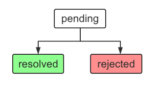

# Promise 的基本使用

## 概述

从语法上来说 `Promise` 其实是一个对象，通过这个对象我们可以接收到其内部异步操作的结果。比如说：
* 首先，我们会创建了一个 Promise 对象并立即执行网络操作，以获取数据服务端的数据。
* 然后，在一段时间后我们获取到数据并发出网络操作结果的通知 (获取数据成功或失败)。
* 最后，其它人就可以通过这个对象来获取到我们刚才发出的通知。

`Promise` 对象主要有以下两个特点：
* 对象状态不受外界影响，只有异步操作的结果可以决定当前是处于哪一种状态。
* 对象状态一旦发生变化，就不会再改变，并且在任何时候都可以得到这个变化结果。

Promise 对象的状态有以下三种：
* `pending`: 进行中。
* `resolved`: 已成功。
* `rejected`: 已失败。

Promise 对象的状态变化只有以下两种情况：
* 由 `pending` 变为 `resolved`。
* 由 `pending` 变为 `rejected`。



通过 `Promise` 我们可以将异步操作以同步操作的形式表现出来，在语法层面避免了层层嵌套的回调函数。然而世界上并没有银弹，它也有着一些缺点：
* `Promise` 一旦建立就会马上执行，并且无法在中途取消。
* 不设置对应回调函数的话，`Promise` 内部抛出的错误无法反应到外部。
* 当 `Promise` 处于 `pending` 状态时，外部无法得知当前是进展到哪个阶段。


## 基本用法

### 构造函数

`Promise` 构造函数接收一个 "函数" 作为参数，且 "该函数" 的两个参数的类型也是函数。它们分别为 `resolve` 和 `reject`，这两个函数参数的作用如下：
* `resolve`: 将 Promise 对象的状态由 `pending` 变为 `resolved`。
* `reject`: 将 Promise 对象的状态由 `pending` 变为 `rejected`。

```js
const promise = new Promise((resolve, reject) => {
  // do something..
  if (success) {
    resolve(result)
  } else {
    reject(error)
  }
})
```

### Promise 实例

在 `Promise` 实例生成以后，我们可以通过该实例的 `then()` 方法来分别指定 `resolved` 和 `rejected` 两种状态的回调函数：

* 第一个回调函数：实例状态变为 `resolved` 时回调。
* 第二个回调函数：实例状态变为 `rejected` 时回调，可选。

```js
promise.then(result => {
  // resolved..
}, error => {
  // rejected..
})
```

实际上，第二个回调函数是可选的，所以我们也可以通过 `catch()` 实例方法写成这样：

```js
promise.then(result => {
  // resolved..
})
.catch(error => {
  // rejected..
})
```

### 举个栗子

在下面的示例中，我们通过 `setTimeout()` 模拟异步操作，然后打印出异步操作最终的结果。

```js
/**
 * 根据学生名字查询其考试分数
 *
 * @param {string} name 学生名字
 * @return promise
 */
function queryScore(name) {
  return new Promise((resolve, reject) => {
    // async
    setTimeout(() => {
      if (name === 'xiaoming') {
        resolve({ name: name, score: 90 })
      } else {
        reject(`The student named ${name} is not exits.`)
      }
    }, 1000)
  })
}

queryScore('xiaoming').then(result => {
  console.log(`Resolved: ${result.name}'s score is ${result.score}.`)
}, error => {
  console.log(`Rejected: ${error}`)
})

queryScore('xiaoli').then(result => {
  console.log(`Resolved: ${result.name}'s score is ${result.score}.`)
})
.catch(error => {
  console.log(`Rejected: ${error}`)
})
```

打印结果如下：

```
Resolved: xiaoming's score is 90.
Rejected: The student named xiaoli is not exits.
```

## 方法原型

### Promise.prototype.then()

从前面可以看到，在 `Promise` 的实例上是可以调用 `then()` 方法的，也就是说，`then()` 方法是在原型对象 `Promise.prototype` 上进行定义的。

其作用：**为 Promise 实例添加状态改变 (resolve) 时的回调函数。**

`then` 方法可以返回一个新的 `Promise` 实例，因此，我们在使用 `Promise` 时可以采用链式写法，即 `then()` 方法后面再调用另一个 `then()` 方法。比如：

```js
getJSON('/post/1.json')
.then(post => {
  // do something with post
  return getJSON(post.commentURL)
})
.then(comments => {
  // do something with comments
  console.log("resolved: ", comments);
}, err => {
  console.log("rejected: ", err);
})
```


### Promise.prototype.catch()

`Promise.prototype.catch()` 方法实际上是 `.then(null, rejection)` 的别名，用于指定发生错误时的回调函数。

举个栗子：

```js
getJSON('/posts.json').then(posts => {
  // ...
}).catch(err => {
  // ...
})
```

`getJSON()` 方法返回一个 Promise 对象：
* 如果该对象状态变为 `resolved`，则会调用 `then()` 方法指定的回调函数。
* 如果该对象状态变为 `rejection`，则会调用 `catch()` 方法指定的回调函数。

特别地，如果 `then()` 方法指定的回调函数在运行时抛出错误，也会被 `catch()` 方法捕获。总的来说，下面三种写法是等价的：

```js
// 写法一
new Promise(function(resolve, reject) {
  throw new Error('test')
}).catch(function(error) {
  console.log(error);
});

// 写法二
new Promise((resolve, reject) => {
  reject(new Error('test'))
}).catch(error => {
  console.log(error)
})

// 写法三
new Promise((resolve, reject) => {
  try {
    throw new Error('test')
  } catch(error) {
    reject(error)
  }
}).catch(error => {
  console.log(error)
})
```

也就是说，`reject()` 方法的作用，等同于抛出错误。但是如果是在 Promise 状态已经变为 `resolved` 之后抛出错误，会被视为是无效的，因为 "状态" 只能改变一次。

```js
new Promise((resolve, reject) => {
  resolve('ok')
  throw new Error('test')
}).catch(error => {
  console.log(error)       // You would not see this log.
})
```

Promise 对象的错误具有「冒泡」性质，会一直传递直到被捕获为止。也就是说，错误总是会被下一个 `catch` 语句捕获。

```js
getJSON('/post/1.json')
.then(post => {
  return getJSON(post.commentURL)
})
.then(comments => {
  // some code
})
.catch(error => {
  // 捕获前面三个 promise (一个由 getJSON 产生，两个有 then 产生) 
  // 可能产生的错误
})
```

### Promise.all()

`Promise.all()` 方法用于将多个 Promise 实例包装成一个新的 Promise 实例。

```js
const p = Promise.all([p1, p2, p3])
```

`p` 的状态由 `p1`、`p2`、`p3` 决定，分成两种情况：

* `resolved`
  * 只有 `p1`、`p2`、`p3` 的状态都变成 `resolved`，`p` 才会会变成 `resolved`。
  * 此时 `p1`、`p2`、`p3` 的返回值组成一个数组，传递给 `p` 的回调函数。
* `rejected`
  * 只要 `p1`、`p2`、`p3` 之中只要有任意一个状态变成 `rejected`，`p` 就会会变成 `rejected`。
  * 此时第一个被 `rejected` 的实例的返回值，会传递给 `p` 的回调函数。

要注意的是：

* 该方法参数的元素可以不是 `Promise` 实例，当不是时会自动调用 `Promise.resolve()` 转换为 `Promise` 实例。
* 该方法的参数也可以不是数组，但该参数必须具有 `Iterator` 接口且返回的每个成员都是 `Promise` 实例。  

举个 `resolved` 栗子：

```js
const promises = [3, 5, 7, 9, 11].map(id => {
  return Promise.resolve(id * 2)
})

Promise.all(promises).then(results => {
  console.log(results)
}).catch(error => {
  console.log(error)
})

// [ 6, 10, 14, 18, 22 ]
```

再举个 `rejected` 栗子：

```js
const p1 = new Promise((resolve, reject) => {
  resolve("1")
})

const p2 = new Promise((resolve, reject) => {
  reject("something wrong.")
})

Promise.all([p1, p2, 99]).then(results => {
  console.log(results)
}).catch(error => {
  console.log(error)
})

// something wrong.
```


### Promise.race()

`Promise.race()` 方法的作用是将多个 Promise 实例包装成一个新的 Promise 实例。

```js
const p = Promise.race([p1, p2, p3]);
```

区别在于，上述的 `p1`、`p2`、`p3` 之中只有有一个实例率先改变状态，那 `p` 的状态也就会随之改变。率先改变状态的实例的返回值，会直接传递给 `p` 的回调函数。

举个栗子：

```js
const p1 = new Promise((resolve, reject) => {
  setTimeout(() => {
    resolve('the result from p1')
  })
})

const p2 = new Promise((resolve, reject) => {
  resolve('the result from p2')
})

// p2 会先执行 resolve 函数
Promise.race([p1, p2]).then(results => {
  console.log(results)
}).catch(error => {
  console.log(error)
})

// the result from p2
```


### Promise.resolve()

我们可以通过 `Promise.resolve()` 将现有对象直接转为 Promise 对象，状态为 `resolved`。

```js
// 下面两行代码是等价的

Promise.resolve('foo')

new Promise(resolve => resolve('foo'))
```

`Promise.resolve()` 的参数可分为四种情况：
* 参数是一个 Promise 实例：
  * `Promise.resolve()` 将不做任何修改，原封不动的返回这个实例。
* 参数是一个 `thenable` 对象：
  * `Promise.resolve()` 会将该对象转化为 Promise 对象并立即执行其 `then` 方法。
* 参数不是具有 then 方法的对象，或根本就不是对象：
  * 比如说是一个原始值，`Promise.resolve()` 会返回一个新的 Promise 对象，状态为 `resolved`，然后将参数值传递给该对象的回调函数。
* 不带有任何参数：
  * 直接返回一个 `resolved` 状态的 Promise 对象。

其中 `thenable` 对象指的是具有 `then` 方法的对象，比如：

```js
let thenable = {
  then: function(resolve, reject) {
    resolve(42);
  }
};
```

示例：

```js
// 1
const p = new Promise((resolve, reject) => {
  resolve('first')
})
Promise.resolve(p).then(result => console.log(result))          // first

// 2
let t = {
  then: (resolve, reject) => {
    resolve('second')
  }
}
Promise.resolve(t).then(result => console.log(result))          // second

// 3
Promise.resolve('third').then(result => console.log(result))    // third

// 4
Promise.resolve().then(result => console.log(result))           // undefined
```


### Promise.reject()

`Promise.reject()` 方法也会返回一个新的 Promise 实例，但状态为 `rejected`。

```js
// 下面两行代码是等价的

Promise.reject('bar')

new Promise((resolve, reject) => reject('bar'))
```

注意：与 `Promise.resolve()` 不同，`Promise.reject()` 的参数会原封不动的作为 `reject` 后续方法的参数。One more time, reject 是原封不动传过去的噢。

不信你看：

```js
let t = {
  then: (resolve, reject) => {
    resolve('second')
  }
}
Promise.reject(t).catch(e => console.log(e === t))  // true
```


## 总结

这篇文章本质上是参考阮一峰 ES6 教程总结的 "Promise 基本使用"。如果你使用 TypeScript 来编写 Promise 相关代码，会发现 then 回调函数中的参数是也是支持类型推导的，这样的话在编码过程中就能做到 "类型在心中，也在代码里" 了。