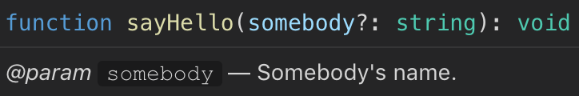

# 通过 JSDoc 提高开发效率

1. 概述
2. 示例
3. 块标签

## 1. 概述

### JSDoc 是什么

JSDoc 是一个根据 JavaScript 代码文件中的注释信息，生成对应 API 文档的工具。同时，现在很多编辑器或 IDE 会通过 JSDoc 生成智能提示。使得开发者可以快速了解整个类及其属性、方法，从而提高开发效率、降低维护成本。

### JSDoc 注释形式

JSDoc 注释一般放置在方法或函数声明之前，以 `/** */` 形式呈现。比如：

```js
/**
 * Book类，代表一个书本.
 *
 * @constructor
 * @param {string} title - 书本的标题.
 * @param {string} author - 书本的作者.
 */
function Book(title, author) {
  this.title=title;
  this.author=author;
}

Book.prototype={
  /**
   * 获取书本的标题
   *
   * @returns {string|*}
   */
  getTitle:function(){
      return this.title;
  },

  /**
   * 设置书本的页数
   *
   * @param pageNum {number} 页数
   */
  setPageNum:function(pageNum){
      this.pageNum=pageNum;
  }
};
```

如果你使用的 IDE 是 VSCode，当你把鼠标移动到对应方法名上面时，你将看到对应注释信息的提示：

| Book | getTitle | setPageNum
| -- | -- | --
|  |  | 

> 类似 `@constructor` `@param` `returns` 这样的标识被称为「块标签 」(Block Tags)。

## 2. 示例

### ES 2015 Classes

#### 简单的类

下面的示例演示了如何通过一个构造函数、两个实例方法和一个静态方法文档化一个简单的类：

```js
/** Class representing a point. */
class Point {

  /**
   * Convert a string containing two comma-separated numbers into a point.
   *
   * @param {string} str - The string containing two comma-separated numbers.
   * @return {Point} A Point object.
   */
  static fromString(str) {
    // ...
  }

  /**
   * Create a point.
   *
   * @param {number} x - The x value.
   * @param {number} y - The y value.
   */
  constructor(x, y) {
    // ...
  }

  /**
   * Get the x value.
   *
   * @return {number} The x value.
   */
  getX() {
    // ...
  }

  /**
   * Get the y value.
   *
   * @return {number} The y value.
   */
  getY() {
    // ...
  }
}
```

如果是类表达式中定义的类；

```js
/** Class representing a point. */
const Point = class {
    // and so on
}
```

#### 扩展类

可以通过 `@extends` 来注释当前类是扩展自哪个类的：

```js
/**
 * Class representing a dot.
 * @extends Point
 */
class Dot extends Point {
    /**
     * Create a dot.
     *
     * @param {number} x - The x value.
     * @param {number} y - The y value.
     * @param {number} width - The width of the dot, in pixels.
     */
    constructor(x, y, width) {
        // ...
    }

    /**
     * Get the dot's width.
     *
     * @return {number} The dot's width, in pixels.
     */
    getWidth() {
        // ...
    }
}
```


### ES 2015 Modules

#### 导出值

Color.js:
```js
/** 模块名称 */
export const name = 'mixer';

/** 最近混合的颜色 */
export var lastColor = null;

/**
 * 混合两种颜色
 *
 * @param {string} color1 - 第一个颜色，十六进制格式
 * @param {string} color2 - 第二个颜色，十六进制格式
 * @return {string} 混合的颜色
 */
export function blend(color1, color2) {}

 /**
 * 获取红、绿、蓝颜色值
 *
 * @function
 * @param {string} color - 颜色，十六进制格式
 * @returns {Array.<number>} 红、绿、蓝颜色值数组，每个值的范围都是从 0 到 225
 */
function rgbify(color) {}

export {
    rgbify as toRgb
}
```

Test.js:
```js
import {
  name,
  lastColor,
  blend,
  toRgb,
} from './Colors'
```

当你从其它模块导入该模块的值时，将鼠标放置到对应「导入名称」上将看到对应的提示信息：

| name | lastColor
| -- | --
|  | 


| blend | toRgb
| -- | --
|  | 


## 3. 块标签

### `@author`

指定作者。另外，在名字后面可添加 “用尖括号括起来的邮箱地址”


示例：

```js
/**
 * @author zhuanghongji <zhuanghongji.com@gmail.com>
 */
function MyClass() {}
```


### `@const`

记录一个对象作为一个常量。

> 如果你的 JavaScript 宿主环境尚不支持常量声明，`@const` 描述可以很有效地用在 `var` 声明上。

示例：

```js
/**
 * @const
 * @type {string}
 * @default
 */
const RED = 'FF0000';

/** @const {number} */
var ONE = 1;
```


### `@deprecated`

说明该方法或该类已不再是首选方法，已废弃。

> 应添加一些文本，以说明 ”为什么要弃用“、”更优选择是什么” 等。

示例：

```js
/**
 * @deprecated since version 2.0
 */
function old() {
  // ...
}
```


### `@description`

允许你提供一段描述说明，该说明可能包括 HTML 标签。

示例：

```js
/**
 * @param {number} a
 * @param {number} b
 * @returns {number}
 * @description Add two numbers.
 */
function add(a, b) {
    return a + b;
}
```


### `@example`

提供一个如何使用描述项的例子，跟随此标签的文字将显示为高亮代码。

> 注意，可以同时使用多个 `@example` 标签。

示例：

```js
/**
 * Solves equations of the form a * x = b
 *
 * @example
 * // returns 2
 * globalNS.method1(5, 10);
 *
 * @example
 * // returns 3
 * globalNS.method(5, 15);
 *
 * @returns {Number} Returns the value of x for the equation.
 */
globalNS.method1 = function (a, b) {
    return b / a;
};
```


### `@param`

对某个函数的参数的各项说明，包括参数名、参数数据类型、描述等。

> 可在变量说明前加个连字符，使之更加容易阅读。

示例：

*名称, 类型, 和说明*

```js
/**
 * @param {string} somebody - Somebody's name.
 */
function sayHello(somebody) {
  alert('Hello ' + somebody);
}
```

*多类型*

```js
/**
 * @param {(string|string[])} [somebody=John Doe] - Somebody's name, or an array of names.
 */
function sayHello(somebody) {
  if (!somebody) {
    somebody = 'John Doe';
  } else if (Array.isArray(somebody)) {
    somebody = somebody.join(', ');
  }
  alert('Hello ' + somebody);
}
```

*任意类型*

```js
/**
 * @param {*} somebody - Whatever you want.
 */
function sayHello(somebody) {
  console.log('Hello ' + JSON.stringify(somebody));
}
```

*变量是一个对象，带属性*

```js
/**
 * Assign the project to an employee.
 * @param {Object} employee - The employee who is responsible for the project.
 * @param {string} employee.name - The name of the employee.
 * @param {string} employee.department - The employee's department.
 */
function assign(employee) {
  // ...
}
```


```js
/**
 * @param {string} [somebody] - Somebody's name.
 */
function sayHello(somebody) {
    if (!somebody) {
        somebody = 'John Doe';
    }
    alert('Hello ' + somebody);
}
```



> 提示：`somebody` 后面有个 `?` 噢。


### `@returns`

描述一个函数的返回值。

示例：

```js
/**
 * Returns the sum of a and b.
 *
 * @param {number} a
 * @param {number} b
 * @returns {number} sum
 */
function sum(a, b) {
    return a + b;
}
```


### `@see`

表示可以参考另一个标识符的说明文档，或者一个外部资源。

示例：

```js
/**
 * Both of these will link to the bar function.
 * @see {@link bar}
 * @see bar
 */
function foo() {}

// Use the inline {@link} tag to include a link within a free-form description.
/**
 * @see {@link foo} for further information.
 * @see {@link http://github.com}
 */
function bar() {}
```


### `@since`

标明一个类，方法，或其它标识符是在哪个特定版本开始添加进来的。

示例：

```js
/**
 * Provides access to user information.
 *
 * @since 1.0.1
 */
function UserRecord() {}
```


### `@summary`

完整描述的一个简写版本。

示例：

```js
/**
 * A very long, verbose, wordy, long-winded, tedious, verbacious, tautological,
 * profuse, expansive, enthusiastic, redundant, flowery, eloquent, articulate,
 * loquacious, garrulous, chatty, extended, babbling description.
 *
 * @summary A concise summary.
 */
function bloviate() {}
```


### `@todo`

记录一个将要完成的任务。

> 在一个 JSDoc 注释块中您可以包含多个 `@todo` 标签。

示例：

```js
/**
 * @todo Write the documentation.
 * @todo Implement this function.
 */
function foo() {
    // write me
}
```


### `@type`

标识一个标识符可能包含的值的类型，或由函数返回值的类型。

示例：

```js
/** @type {(string|Array.<string>)} */
var foo;

/** @type {number} */
var bar = 1;
```

```js
/**
 * @type {number}
 * @const
 */
var FOO = 1;

// same as:

/** @const {number} */
var FOO = 1;
```


### `@version`

描述版本信息。

示例：

```js
/**
 * Solves equations of the form a * x = b. Returns the value
 * of x.
 * @version 1.2.3
 * @returns
 */
function solver(a, b) {
  return b / a;
}
```
