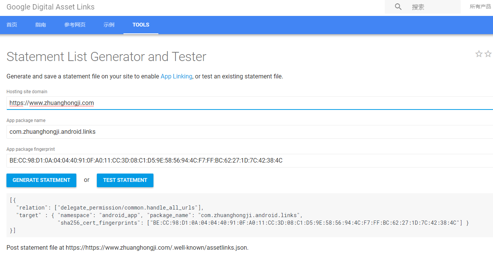

# App Links

App Links, 下文简称为「应用链接」。

## 处理应用链接

在Android 6.0之前，当用户点击了网页上的一个链接后，经常会出现一个另用户疑惑的选择对话框 (向用户询问使用哪个App来处理该链接)。

例如：点击银行邮件中的URI，会弹出对话框来询问用户是使用浏览器还是银行自己的App来打开该链接。  

现在有了更友好地解决办法：

**在Android 6.0及以上版本允许应用将自己指定为给定类型链接的默认处理程序。**  

当然，如果用户不希望应用程序设置为默认处理程序，可以在「设置」中覆盖此行为。

自动处理应用链接需要「应用开发者」和「网站所有者」之间的合作，开发者必须在应用中声明应用与一个或多个网站之间的关联，并请求 Android 系统去验证这些关联。反过来，网站所有者必须通过发布「数字资产链接 Digital Asset Links」文件来提供该验证。「数字资产链接」文件是一个符合资产链接协议的声明语句 (statements) 集合，可以对其他应用程序或网站进行公开的、验证的断言。

建立应用链接验证的一般步骤如下：

1. 在应用清单文件中，为网站的 URI 创建 Intent 过滤器。
2. 在应用中进行相关配置，以向系统请求对应用链接进行验证。
3. 在对应网站上发布数字资产链接的 Json 文件以提供给App进行验证。

## 关于系统对 URI 请求的处理

只要用户尚未选择处理某网站URI的默认应用程序，应用链接 (App Links) 功能允许你的应用成为该网站URI的默认处理程序。当「点击链接」或「编程请求一个 Web URI Intent」时，Android 系统会按照以下条件逐个降序来确定如何处理该请求：

1. **用户设置了应用链接关联**：   
系统会将该请求直接传递给该应用程序，用户有两种方式进行指定：  
  * 其一，在应用选择对话框中选择应用程序之前，勾选了「始终」；  
  * 其二，在「*设置->应用程序*」中进行设置。


2. **用户没有关联，并且仅有一个支持的应用**：  
系统也会直接将请求传递给该应用程序。

3. **用户没有关联，并且有多个支持的应用**：  
系统将显示一个应用程序选择对话框，提示用户选择最合适的应用程序来处理该请求。

> 在上述情况2中，如果用户安装了新的应用并且系统已将其验证为这种类型链接的处理程序，系统会将该应用设置为默认处理程序。  
>
> 在其他两种情况下，验证的处理应用链接程序的存在对系统的行为没有影响。

## 为 URI 创建对应的 Intent 处理程序

应用链接 (App Links) 基于 Android 的 Intent 框架，使得应用程序能够处理来自系统或其他应用程序的请求。  

一般情况下，可能会有多个应用程序在其 Intent 过滤器中声明了相同的网页链接 URI 模式，当用户没有选择默认处理程序时，系统就会按上述「了解系统对URI请求的处理」一节中讲到的那样进行处理。

要使得应用能够处理链接，需要在应用清单文件中声明对应的 Intent 过滤器。 以下示例声明了该应用可以处理 http://www.android.com 和 https://www.android.com 链接：

```xml
<activity ...>
    <intent-filter>
        <action android:name="android.intent.action.VIEW" />
        <category android:name="android.intent.category.DEFAULT" />
        <category android:name="android.intent.category.BROWSABLE" />
        <data android:scheme="http" />
        <data android:scheme="https" />
        <data android:host="www.android.com" />
    </intent-filter>
</activity>
```

对于应用链接来说，`intent-filter` 中的 `android:scheme` 的值必须声明为 `http` `https` 两者之一或两者都声明，不能有为其他值的scheme。而且，必须包含 `android.intent.action.VIEW` 和 `android.intent.category.BROWSABLE` 这两种category 。

上面的代码仅声明了应用程序跟网站之间的关联。  

为了让系统将你的应用程序视为一组URI的默认处理程序，你还必须请求系统对此应用链接进行验证。

## 请求系统对应用链接进行验证

当你声明了请求系统对应用链接进行验证的代码，Android 系统会在应用程序安装完成后对你的应用链接进行验证。验证成功后，如果用户尚未设置默认处理程序的话，系统会自动将这一类的URI请求路由到你的应用程序。

**Q: 系统是如何进行验证的？**  
A: 系统会通过Intent过滤器中的主机名获取到托管在该domail下的数据资产链接文件 (*assetlinks.json*) ,与之比较之后得到验证结果。

**Q: 如何启用自动验证？**  
A: 要为你的应用启用自动验证，需要在对应的Intent过滤器中将 `android:autoVerify` 属性设置为`true`，示例代码：

```xml
<activity ...>
    <intent-filter android:autoVerify="true">
        <action android:name="android.intent.action.VIEW" />
        <category android:name="android.intent.category.DEFAULT" />
        <category android:name="android.intent.category.BROWSABLE" />
        <data android:scheme="http" android:host="www.android.com" />
        <data android:scheme="https" android:host="www.android.com" />
    </intent-filter>
</activity>
```

当 `android:autoVerify` 属性存在时，安装该应用程序会使得系统尝试去验证与该URI关联的主机。  

只有系统成功验证清单文件中所有声明的应用链接模式后，才会将你的应用视为指定 URI 模式的默认处理程序。

## 支持多个主机的应用链接

前面讲到，系统只有正确验证 `intent-filter` 中所有声明的主机时，才会将应用设置为默认处理程序。  

例如下面代码，如果 `https://www.example.com/.well-known/assetlinks.json` 和 `https://www.example.net/.well-known/assetlinks.json` 文件都不存在或都认证失败的话，系统就不会将该应用视为默认处理程序：

```xml
<application>

  <activity android:name="MainActivity">
    <intent-filter android:autoVerify="true">
      <action android:name="android.intent.action.VIEW" />
      <category android:name="android.intent.category.DEFAULT" />
      <category android:name="android.intent.category.BROWSABLE" />
      <data android:scheme="http" android:host="www.example.com" />
      <data android:scheme="https" android:host="www.example.com" />
    </intent-filter>
  </activity>
  <activity android:name="SecondActivity">
    <intent-filter>
      <action android:name="android.intent.action.VIEW" />
      <category android:name="android.intent.category.DEFAULT" />
      <category android:name="android.intent.category.BROWSABLE" />
      <data android:scheme="https" android:host="www.example.net" />
    </intent-filter>
  </activity>

</application>
```

## 支持多个子域的应用链接

数字资产链接协议将子域 (subdomains) 视为唯一的独立主机。  

如果你在Intent过滤器中将 `www.example.com` 和 `mobile.example.com` 声明为 `host`，则必须在每个子域上发布单独的 `assetlinks.json` 文件。  

例如，下面的声明代码只有在网站所有者发布了有效的 `https://www.example.com/.well-known/assetlinks.json` 和 `https://mobile.example.com/.well-known/assetlinks.json` 文件时，系统才会将该应用视为默认处理程序。

```xml
<application>
  <activity android:name=」MainActivity」>
    <intent-filter android:autoVerify="true">
      <action android:name="android.intent.action.VIEW" />
      <category android:name="android.intent.category.DEFAULT" />
      <category android:name="android.intent.category.BROWSABLE" />
      <data android:scheme="http" android:host="www.example.com" />
      <data android:scheme="https" android:host="mobile.example.com" />
    </intent-filter>
  </activity>
</application>
```

## 在网站上声明应用关联

网站所有者通过托管内容类型为 *application/json* 、并且以 *assetlinks.json* 为命名的提供数字资产链接的 Json 文件进行声明。  
文件域名为：

```
https://domain[:optional_port]/.well-known/assetlinks.json
```

> **重要提示**：无论你在Intent过滤器中的声明是否包含https，  
Android系统都是通过加密的Https协议来对Json文件进行验证。  
请确保您的托管文件可通过Https进行连接。

*assetlinks.json* 文件使用了以下几个字段来标识关联的应用程序：

* `package_name`：应用的包名。
* `sha256_cert_fingerprints`：应用签名证书的SHA256指纹。  
此字段支持多个指纹，可用于支持不同版本的应用程序，如调试、生产等。   
该字段可以通过Java keytool工具进行生成，命令如下：

```
$ keytool -list -v -keystore my-release-key.keystore
```

以下 `assetlinks.json` 示例文件授予包名为 `com.example` 的应用程序的链接开放权限：

```json
[{
  "relation": ["delegate_permission/common.handle_all_urls"],
  "target": {
    "namespace": "android_app",
    "package_name": "com.example",
    "sha256_cert_fingerprints":
    ["14:6D:E9:83:C5:73:06:50:D8:EE:B9:95:2F:34:FC:64:16:A0:83:42:E6:1D:BE:A8:8A:04:96:B2:3F:CF:44:E5"]
  }
}]
```

## 将网站与多个应用进行关联

一个网站可以在同一个 `assetlinks.json` 文件中声明与多个应用之间的关联，示例如下：

```json
[{
  "relation": ["delegate_permission/common.handle_all_urls"],
  "target": {
    "namespace": "android_app",
    "package_name": "example.com.puppies.app",
    "sha256_cert_fingerprints":
    ["14:6D:E9:83:C5:73:06:50:D8:EE:B9:95:2F:34:FC:64:16:A0:83:42:E6:1D:BE:A8:8A:04:96:B2:3F:CF:44:E5"]
  }
  },
  {
  "relation": ["delegate_permission/common.handle_all_urls"],
  "target": {
    "namespace": "android_app",
    "package_name": "example.com.monkeys.app",
    "sha256_cert_fingerprints":
    ["14:6D:E9:83:C5:73:06:50:D8:EE:B9:95:2F:34:FC:64:16:A0:83:42:E6:1D:BE:A8:8A:04:96:B2:3F:CF:44:E5"]
  }
}]
```

不同的应用程序可能会处理同一网络下不同资源的链接。  
例如，app1 可以为 `https://example.com/articles` 声明一个 Intent 过滤器，  
而 app2 可能会为 `https://example.com/videos` 声明一个 Intent 过滤器。

> 注意：与同一个域相关联的多个应用程序可能使用相同或不同的证书进行签名。

## 将单个应用与多个网站相关联

以下实例展示了如何将同一个 App 与 `example.com` 和 `example.net` 进行关联：  

`https://www.example.com/.well-known/assetlinks.json`

```json
[{
  "relation": ["delegate_permission/common.handle_all_urls"],
  "target": {
    "namespace": "android_app",
    "package_name": "com.mycompany.app1",
    "sha256_cert_fingerprints":
    ["14:6D:E9:83:C5:73:06:50:D8:EE:B9:95:2F:34:FC:64:16:A0:83:42:E6:1D:BE:A8:8A:04:96:B2:3F:CF:44:E5"]
  }
}]
```

`https://www.example.net/.well-known/assetlinks.json`:

```json
[{
  "relation": ["delegate_permission/common.handle_all_urls"],
  "target": {
    "namespace": "android_app",
    "package_name": "com.mycompany.app1",
    "sha256_cert_fingerprints":
    ["14:6D:E9:83:C5:73:06:50:D8:EE:B9:95:2F:34:FC:64:16:A0:83:42:E6:1D:BE:A8:8A:04:96:B2:3F:CF:44:E5"]
  }
}]
```

上述两种关联中，除了 URL 之外，其他都是相同的。

## 测试应用链接

在实现了应用链接功能之后，我们需要对其进行验证，以确保系统可以将你的应用程序与对应网站进行关联，并且能按预期处理 URI 请求。  

Android 官方提供了一个网页工具，可以生成 `assetlinks.json` 文件或进行关联测试。  

链接地址和网页样图如下：  

`https://developers.google.com/digital-asset-links/tools/generator`



## 确认数字资产链接文件

可以通过 Google 的一个 api 确认 `assetlinks.json` 文件是否存在：

```
https://digitalassetlinks.googleapis.com/v1/statements:list?
   source.web.site=https://<domain1>:<port>&
   relation=delegate_permission/common.handle_all_urls
```

假设链接如下：  

`[https://digitalassetlinks.googleapis.com/v1/statements:list?
   source.web.site=https://www.zhuanghongji.com&
   relation=delegate_permission/common.handle_all_urls](https://digitalassetlinks.googleapis.com/v1/statements:list?
   source.web.site=https://www.zhuanghongji.com&
   relation=delegate_permission/common.handle_all_urls)`

若不存在对应的数字资产链接文件，服务器会返回下面文本：

```json
{
    error: {
    code: 400,
    message: "Invalid JSON payload received. Unknown name " source.web.site": Cannot bind query parameter. Field ' source' could not be found in request message. Invalid JSON payload received. Unknown name " relation": Cannot bind query parameter. Field ' relation' could not be found in request message.",
    status: "INVALID_ARGUMENT",
    details: [
      {
        @type: "type.googleapis.com/google.rpc.BadRequest",
        fieldViolations: [
          {
            description: "Invalid JSON payload received. Unknown name " source.web.site": Cannot bind query parameter. Field ' source' could not be found in request message."
          },
          {
            description: "Invalid JSON payload received. Unknown name " relation": Cannot bind query parameter. Field ' relation' could not be found in request message."
          }
        ]
      }
    ]
  }
}
```

## 测试一个 Web URI 的 Intent

一旦你确认与应用相关联的网站列表，并且确认托管的 JSON 文件是有效的。  
在手机上安装该应用程序，等待至少 20 秒后 (完成异步验证过程)，可使用以下命令检查系统是否验证了你的应用程序并正确设置了链接处理策略：  

```shell
adb shell am start -a android.intent.action.VIEW \
    -c android.intent.category.BROWSABLE \
    -d "http://<domain1>:<port>"
```

## 检查链接策略

作为测试过程的一部分，你可以检查当前系统链接处理策略，命令行如下：

```shell
adb shell dumpsys package domain-preferred-apps
 --or--
adb shell dumpsys package d
```

假设我们已经安装了包名为 `com.zhuanghongji.android.links` 的应用程序，并执行命令 `adb shell dumpsys package com.zhuanghongji.android.links`。返回结果格式如下：

```shell
Activity Resolver Table:
  Full MIME Types:
      text/plain:
        d54fb2 com.zhuanghongji.android.links/.TestActivity

  Base MIME Types:
      text:
        d54fb2 com.zhuanghongji.android.links/.TestActivity

  Schemes:
      custom:
        d54fb2 com.zhuanghongji.android.links/.TestActivity
      https:
        ec75b03 com.zhuanghongji.android.links/.MainActivity

  Non-Data Actions:
      android.intent.action.MAIN:
        ec75b03 com.zhuanghongji.android.links/.MainActivity

  MIME Typed Actions:
      com.zhuanghongji.android.links.test.activity:
        d54fb2 com.zhuanghongji.android.links/.TestActivity

Preferred Activities User 0:
  Schemes:
      http:
        9cc738f com.zhuanghongji.android.links/.MainActivity
         mMatch=0x300000 mAlways=false
          Action: "android.intent.action.VIEW"
          Category: "android.intent.category.BROWSABLE"
          Category: "android.intent.category.DEFAULT"
          Scheme: "http"
          Authority: "www.zhuanghongji.com": -1
          AutoVerify=false
      https:
        9cf3a84 com.zhuanghongji.android.links/.MainActivity
         mMatch=0x300000 mAlways=true
          Selected from:
            com.zhuanghongji.android.links/.MainActivity
            com.UCMobile/.main.UCMobile
            com.android.chrome/com.google.android.apps.chrome.Main
            com.android.browser/.BrowserActivity
            com.ss.android.article.news/com.ss.android.newmedia.app.AppLinkActivity
            com.xunlei.downloadprovider/.launch.dispatch.mocklink.LinkBHOActivity
          Action: "android.intent.action.VIEW"
          Category: "android.intent.category.BROWSABLE"
          Category: "android.intent.category.DEFAULT"
          Scheme: "https"
          Authority: "www.zhuanghongji.github.io": -1
          AutoVerify=false

Registered ContentProviders:
  com.zhuanghongji.android.links/com.android.tools.fd.runtime.InstantRunContentProvider:
    Provider{feeda80 com.zhuanghongji.android.links/com.android.tools.fd.runtime.InstantRu

ContentProvider Authorities:
  [com.zhuanghongji.android.links.com.android.tools.fd.runtime.InstantRunContentProvider]:
    Provider{feeda80 com.zhuanghongji.android.links/com.android.tools.fd.runtime.InstantRu
      applicationInfo=ApplicationInfo{e4638b9 com.zhuanghongji.android.links}

Key Set Manager:
  [com.zhuanghongji.android.links]
      Signing KeySets: 88

Packages:
  Package [com.zhuanghongji.android.links] (8a697af):
    userId=10214
    pkg=Package{3f6fef2 com.zhuanghongji.android.links}
    codePath=/data/app/com.zhuanghongji.android.links-1
    dexoptNeeded=false
    resourcePath=/data/app/com.zhuanghongji.android.links-1
    legacyNativeLibraryDir=/data/app/com.zhuanghongji.android.links-1/lib
    primaryCpuAbi=null
    secondaryCpuAbi=null
    versionCode=1 targetSdk=25
    versionName=1.0
    splits=[base, lib_dependencies_apk, lib_slice_0_apk, lib_slice_1_apk, lib_slice_2_apk,
apk, lib_slice_5_apk, lib_slice_6_apk, lib_slice_7_apk, lib_slice_8_apk, lib_slice_9_apk]
    applicationInfo=ApplicationInfo{e4638b9 com.zhuanghongji.android.links}
    flags=[ DEBUGGABLE HAS_CODE ALLOW_CLEAR_USER_DATA ALLOW_BACKUP ]
    privateFlags=[ ]
    pkgFlagsEx=[ ]
    dataDir=/data/user/0/com.zhuanghongji.android.links
    supportsScreens=[small, medium, large, xlarge, resizeable, anyDensity]
    timeStamp=2017-06-11 23:13:37
    firstInstallTime=2017-06-10 14:29:34
    lastUpdateTime=2017-06-11 23:13:48
    signatures=PackageSignatures{18017bc [144b4fe]}
    installPermissionsFixed=true installStatus=1
    pkgFlags=[ DEBUGGABLE HAS_CODE ALLOW_CLEAR_USER_DATA ALLOW_BACKUP ]
    User 0:  installed=true hidden=false stopped=false notLaunched=false enabled=0
      runtime permissions:
```

## 测试示例

以下示例显示了一个清单文件配置，其中定义了几个应用程序链接：

```xml
<application>
    <activity android:name=」MainActivity」>
        <intent-filter android:autoVerify="true">
            <action android:name="android.intent.action.VIEW" />
            <category android:name="android.intent.category.DEFAULT" />
            <category android:name="android.intent.category.BROWSABLE" />
            <data android:scheme="http" android:host="www.example.com" />
            <data android:scheme="https" android:host="mobile.example.com" />
        </intent-filter>
        <intent-filter>
            <action android:name="android.intent.action.VIEW" />
            <category android:name="android.intent.category.BROWSABLE" />
            <data android:scheme="http" android:host="www.example2.com" />
        </intent-filter>
    </activity>

    <activity android:name=」SecondActivity」>
        <intent-filter>
            <action android:name="android.intent.action.VIEW" />
            <category android:name="android.intent.category.DEFAULT" />
            <category android:name="android.intent.category.BROWSABLE" />
            <data android:scheme="http" android:host="account.example.com" />
        </intent-filter>
    </activity>

      <activity android:name=」ThirdActivity」>
        <intent-filter>
            <action android:name="android.intent.action.VIEW" />
            <category android:name="android.intent.category.DEFAULT" />
            <data android:scheme="http" android:host="map.example.com" />
        </intent-filter>
        <intent-filter>
            <action android:name="android.intent.action.VIEW" />
            <category android:name="android.intent.category.BROWSABLE" />
            <data android:scheme="market" android:host="example.com" />
        </intent-filter>
      </activity>

</application>
```

系统将尝试从上述清单中验证的主机列表如下：

```
www.example.com
mobile.example.com
www.example2.com
account.example.com
```

系统不会尝试验证的主机列表如下：

```
map.example.com (it does not have android.intent.category.BROWSABLE)
market://example.com (it does not have either an 「http」 or 「https」 scheme)
```

## 参考文章

* [Handling App Links](https://developer.android.com/training/app-links/index.html)
