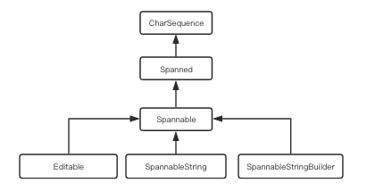
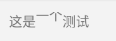
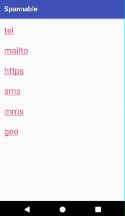

# Spannable 相关技术总结

## 概述

我们都知道，如果想要用 `TextView` 显示将一段HTML字符串，可通过 `Html.fromHtml(source)` 方法实现。  

```java
/**
 * Returns displayable styled text from the provided HTML string with the legacy flags
 * {@link #FROM_HTML_MODE_LEGACY}.
 *
 * @deprecated use {@link #fromHtml(String, int)} instead.
 */
@Deprecated
public static Spanned fromHtml(String source) {
    return fromHtml(source, FROM_HTML_MODE_LEGACY, null, null);
}
```

示例演示：

```java
String html = "这是一个<a href=\"https://www.zhuanghongji.com\">zhuanghongji</a>的a标签，" +
    "点击可以跳转到 https://www.zhuanghongji.com";
TextView tv = findViewById(R.id.textview);
tv.setText(Html.fromHtml(html));
```


## SpannableString 和 SpannableStringBuilder

从源码来看，`fromHtml()` 方法最终返回的类型实际上是 `Spanned` 接口的实现类 ： `SpannableStringBuilder`。  

类似 `StringBuilder` 和 `String`，`SpannableStringBuilder` 也有一个对应的类 `SpannableString`，用法也很类似：

```java
SpannableString ss = new SpannableString("Hello World");

SpannableStringBuilder ssb = new SpannableStringBuilder();
ssb.append("Hello");
ssb.append(" ");
ssb.append("World");
```

他们都可用来存储字符串，区别在于：  

**SpannableString 和 SpannableStringBuilder 都有一个特殊函数 `setSpan()`，能给这些存储的字符串添加各种样式（Span），比如“增加下划线”、“加背景色”、“加前景色”、”修改字体颜色或大小“、”用图片替换指定文字”等**

> 注意：并不是所有的样式都是支持的，对于不支持的样式会退化成 String 类型。即不会显示附加的样式，而是直接显示原来的字符串。

继承关系如下：

```java
class SpannableString extends SpannableStringInternal
implements CharSequence, GetChars, Spannable {}

class SpannableStringBuilder
implements CharSequence, GetChars, Spannable, Editable, Appendable, GraphicsOperations {}

interface Editable extends CharSequence, GetChars, Spannable, Appendable {}

interface Spannable extends Spanned {}

interface Spanned extends CharSequence {}

interface CharSequence {}  
```



因为 `SpannableString` 和 `SpannableStringBuilder` 最终都实现了 `CharSequence` 接口，所以这两者都可以直接通过 TextView.setText() 设置到 TextView 。


## setSpan()

```java
/**
 * 给特定范围的字符串设置样式
 * @param what 对应的各种Span
 * @param start 范围的起始位置
 * @param end 范围的结束位置
 * @param flags 标识了当“范围前”和“范围后”紧贴插入新字符时是否对新
 *              插入的字符应用相同的样式
 */
public void setSpan(Object what, int start, int end, int flags) {
  super.setSpan(what, start, end, flags);
}
```

|flags|含义
|--|--
|Spannable.SPAN_EXCLUSIVE_EXCLUSIVE|前后都不应用
|Spannable.SPAN_EXCLUSIVE_INCLUSIVE|前面不应用，后面应用
|Spannable.SPAN_INCLUSIVE_EXCLUSIVE|前面应用，后面不应用
|annable.SPAN_INCLUSIVE_INCLUSIVE|前后都应用

示例演示：

```java
EditText et = findViewById(R.id.editText);

SpannableString ss = new SpannableString("这是一个测试");
ForegroundColorSpan colorSpan = new ForegroundColorSpan(Color.RED);
// 前面应用，后面不应用
ss.setSpan(colorSpan, 2, 4, Spanned.SPAN_EXCLUSIVE_INCLUSIVE);
et.setText(ss);
```


>如果你用的是 TextView 而不是 EditText，flag 也是可以生效的噢  
>比如这样插入字符串：`tv.append("1234");  `

上面示例可以看出，要应用一个Span大致可以分为三步：

* 构造String
* 构造Span
* 通过 `setSpan()` 对指定范围的String应用这个Span

 `ForegroundColorSpan` 可以设置字体颜色(前景色)，其他Span总结如下：    

### 常见 Span

|Span|功能|效果演示  
|--|--|--
|BackgroundColorSpan|设置字体背景颜色|
|TextAppearanceSpan|设置字体|
|AbsoluteSizeSpan|设置字体大小<br>(绝对值，单位：像素) |
|RelativeSizeSpan|设置字体大小<br>参数表示为默认字体大小的多少倍<br>(相对值得，单位：像素)|
|ScaleXSpan|设置字体大小<br>参数表示为默认字体宽度的多少倍，高度不变<br>(相对值得，单位：像素)|
|StyleSpan|设置粗体、斜体|
|StrikethroughSpan|设置删除线|
|UnderlineSpan|设置下划线|
|SuperscriptSpan|设置上标|
|SubscriptSpan|设置下标|
|SubscriptSpan|设置项目符号|
|ImageSpan|置换图片|

```java
// 附：演示代码
TextView tv = findViewById(R.id.textview);
SpannableString ss = new SpannableString("这是一个测试");

// TextAppearanceSpan
TextAppearanceSpan span = new TextAppearanceSpan("monospace",
    Typeface.NORMAL, 70, null, null);
ss.setSpan(span, 2 , 4, Spanned.SPAN_EXCLUSIVE_EXCLUSIVE);
tv.setText(ss);

// ImageSpan
Drawable d = getResources().getDrawable(R.mipmap.ic_launcher);
// 需要设置Drawable的范围，否则图片无法正常绘制出来
// Specify a bounding rectangle for the Drawable. This is where the drawable will draw when its draw() method is called.
d.setBounds(0, 0, d.getIntrinsicWidth(), d.getIntrinsicHeight());
ImageSpan span = new ImageSpan(d, ImageSpan.ALIGN_BASELINE);
ss.setSpan(span, 2, 4, Spanned.SPAN_EXCLUSIVE_INCLUSIVE);
tv.setText(ss);

// BulletSpan
// 第一个参数表示项目符号占用的宽度，第二个参数为项目符号的颜色
BulletSpan span = new BulletSpan(48, Color.RED);
ss.setSpan(span, 0 , ss.length(), Spanned.SPAN_EXCLUSIVE_EXCLUSIVE);
tv.setText(ss);
```

### URLSpan

`URLSpan` 是一种可以响应点击事件的Span，我们先来看下源码：

```java
public class URLSpan extends ClickableSpan implements ParcelableSpan {

    private final String mURL;

    public URLSpan(String url) {
        mURL = url;
    }

    public URLSpan(Parcel src) {
        mURL = src.readString();
    }

    public int getSpanTypeId() {
        return getSpanTypeIdInternal();
    }

    /** @hide */
    public int getSpanTypeIdInternal() {
        return TextUtils.URL_SPAN;
    }

    public int describeContents() {
        return 0;
    }

    public void writeToParcel(Parcel dest, int flags) {
        writeToParcelInternal(dest, flags);
    }

    /** @hide */
    public void writeToParcelInternal(Parcel dest, int flags) {
        dest.writeString(mURL);
    }

    public String getURL() {
        return mURL;
    }

    @Override
    public void onClick(View widget) {
        Uri uri = Uri.parse(getURL());
        Context context = widget.getContext();
        Intent intent = new Intent(Intent.ACTION_VIEW, uri);
        intent.putExtra(Browser.EXTRA_APPLICATION_ID, context.getPackageName());
        try {
            context.startActivity(intent);
        } catch (ActivityNotFoundException e) {
            Log.w("URLSpan", "Actvity was not found for intent, " + intent.toString());
        }
    }
}
```

可以看到，`URLSpan` 响应点击事件的行为实际上是继承自 `ClickableSpan`，`URLSpan` 重写了 `onClick()` 方法：通过 “Intent-Uri" 的方式来处理我们传入的字符串参数。  

示例演示：

```java
TextView tv = findViewById(R.id.textview);
SpannableStringBuilder builder = new SpannableStringBuilder();
int flag = Spanned.SPAN_EXCLUSIVE_EXCLUSIVE;

// 拨号
SpannableString tel = new SpannableString("tel\n\n");
tel.setSpan(new URLSpan("tel:4155551212"), 0, tel.length(), flag);
builder.append(tel);

// 邮件
SpannableString mailto = new SpannableString("mailto\n\n");
mailto.setSpan(new URLSpan("mailto:zhuanghongji.com@gmail.com"), 0, mailto.length(), flag);
builder.append(mailto);

// 网址
SpannableString https = new SpannableString("https\n\n");
https.setSpan(new URLSpan("https://www.baidu.com"), 0, https.length(), flag);
builder.append(https);

// 短信
SpannableString sms = new SpannableString("sms\n\n");
sms.setSpan(new URLSpan("sms:4155551212"), 0, sms.length(), flag);
builder.append(sms);

// 彩信
SpannableString mms = new SpannableString("mms\n\n");
mms.setSpan(new URLSpan("mms:4155551212"), 0, mms.length(), flag);
builder.append(mms);

// 地图
SpannableString geo = new SpannableString("geo\n\n");
geo.setSpan(new URLSpan("geo:38.899533,-77.036476"), 0, geo.length(), flag);
builder.append(geo);

tv.setText(builder);

// 必须设置，使得可响应Span的点击事件
tv.setMovementMethod(LinkMovementMethod.getInstance());
```


>上面的示例使用了 `SpannableStringBuilder`，最终设置到TextView是直接 `tv.setText(builder);` 这样设置的。
>
>如果你是 `tv.setText(builder.toString());` 这样设置的话，那么所有的 Span 样式都会失效（即跟设置普通的字符串没什么两样）。

### ClickableSpan

官方文档是这样描述 `ClickableSpan` 的：

> If an object of this type is attached to the text of a TextView with a movement method of LinkMovementMethod, the affected spans of text can be selected. If selected and clicked, the {@link #onClick} method will be called.

源码如下：

```java
public abstract class ClickableSpan extends CharacterStyle implements UpdateAppearance {
    private static int sIdCounter = 0;

    private int mId = sIdCounter++;

    /**
     * Performs the click action associated with this span.
     */
    public abstract void onClick(View widget);

    /**
     * Makes the text underlined and in the link color.
     */
    @Override
    public void updateDrawState(TextPaint ds) {
        ds.setColor(ds.linkColor);
        ds.setUnderlineText(true);
    }

    /**
     * Get the unique ID for this span.
     *
     * @return The unique ID.
     * @hide
     */
    public int getId() {
        return mId;
    }
}
```

其中的 `updateDrawState()` 是 `public` 的，所以我们可以通过重写该方法来设置”颜色“、”是否有下划线”等样式。

示例演示：

```java
TextView tv = findViewById(R.id.textview);
SpannableString ss = new SpannableString("这是一个测试");
ss.setSpan(new ClickableSpan() {
  @Override
  public void updateDrawState(TextPaint ds) {
    super.updateDrawState(ds);
    ds.setColor(Color.GREEN);
    ds.setUnderlineText(true);
    // ds.set...
  }

  @Override
  public void onClick(View widget) {
    Toast.makeText(MainActivity.this, "click event", Toast.LENGTH_SHORT).show();
  }
}, 0, 2, Spanned.SPAN_EXCLUSIVE_EXCLUSIVE);
tv.setText(ss);
tv.setMovementMethod(LinkMovementMethod.getInstance());
```


如果仔细看上面的GIF图你会发现，在我们点击”这是”两个字时会出现高亮色（colorAccent），直到我们点击其他字符串才会消失。  

如果不想出现高亮色，我们可以加一行代码 `tv.setHighlightColor(Color.TRANSPARENT);`

之前特意写了个库 [UrlSpannableTextView](https://github.com/zhuanghongji/UrlSpannableTextView) 专门用来处理"带a标签的html字符串"的点击事件，主要逻辑就是通过 `ClickableSpan` 实现的，感兴趣的朋友可以Star或Fork.

### 其它

Span 还有一些其他的玩法，附一段代码（还没弄懂怎么玩）：

```java
TextView tv = findViewById(R.id.textview);
SpannableString ss = new SpannableString("这是一个测试");

// 设置字体（依次包括字体名称，字体大小，字体样式，字体颜色，链接颜色）
ColorStateList csl = null;
ColorStateList cslLink = null;
XmlResourceParser xppColor = getResources().getXml(R.color.);
try {
  csl = ColorStateList.createFromXml(getResources(), xppColor);
} catch (XmlPullParserException e) {
  e.printStackTrace();
} catch (IOException e) {
  e.printStackTrace();
}

XmlResourceParser xppLinkcolor = getResources().getXml(R.color.);
try {
  cslLink = ColorStateList.createFromXml(getResources(), xppLinkcolor);
} catch (XmlPullParserException e) {
  e.printStackTrace();
} catch (IOException e) {
  e.printStackTrace();
}

TextAppearanceSpan span = new TextAppearanceSpan("monospace",
    Typeface.NORMAL, 70, csl, cslLink);
ss.setSpan(span, 2, 4, Spanned.SPAN_EXCLUSIVE_EXCLUSIVE);
tv.setText(ss);
```


## 参考文章：

* [SpannableString与SpannableStringBuilder](http://blog.csdn.net/harvic880925/article/details/38984705)
* [Android中TextView通过SpannableString设置字体、大小、颜色、样式、超级链接](http://blog.csdn.net/snowdream86/article/details/6776629)
