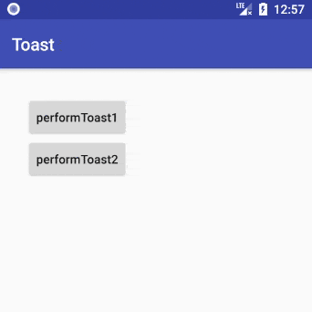
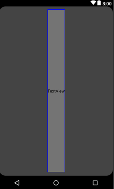
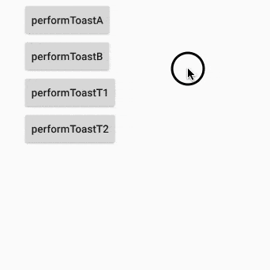

# 你真的知道 Toast 怎么用了吗

不管在 Android 还是在 iOS 中，Toast 都是一个十分重要的交互设计。它有着以下特性：

* 设计理念是不打断用户操作，但想让用户看到相关信息
* 展示时，浮在应用所有界面之上
* 永远不会获得焦点
* 显示内容可自定义
* 大小取决于内容，可自定义显示在屏幕上的任意位置
* 可以通过 `cancel()` 方法取消显示

比如说，用户点击了 "发送消息" 按钮，我们就可以 Toast 提示下：  

>  图片丢失，待补充

如果你希望提示能与用户产生一定交互，比如说点击后查看发送详情，那么使用 [Notification](https://developer.android.com/guide/topics/ui/notifiers/notifications.html) 会是更好的选择。

从学 Android 的第一天开始我们就知道可以这样 Toast:

```Java
Toast.makeText(context, "This is Toast.", Toast.LENGTH_SHORT).show();
```

事实上，官方还提供了控制 Toast 位置、设置自定义 View 的方法，效果如下图：




## 基本使用

首先，通过 `Toast` 的静态方法 `makeText()` 获取实例，该方法需要三个参数：

* application Context
* 消息文本内容
* 显示时间

然后调用 `Toast` 实例的 `show()` 方法，即可弹出一个简单的 Toast 提示，如图 "Sending message..."

```Java
// 简单调用
Context context = getApplicationContext();
CharSequence text = "Sending message...";
int duration = Toast.LENGTH_SHORT;
Toast toast = Toast.makeText(context, text, duration);
toast.show();

// 链式调用
Toast.makeText(context, "Sending message...", Toast.LENGTH_SHORT).show();
```

## 控制 Toast 的位置

一个标准的 Toast 是出现在接近屏幕底部的位置的，水平居中。你可以通过 `setGravity(int, int, int)` 方法改变这个位置。

```Java
/**
 * Set the location at which the notification should appear on the screen.
 * @see android.view.Gravity
 * @see #getGravity
 */
public void setGravity(int gravity, int xOffset, int yOffset) {
    mTN.mGravity = gravity;
    mTN.mX = xOffset;
    mTN.mY = yOffset;
}
```

举个例子（效果图相关代码）：

```Java
// performToast1
Toast toast = Toast.makeText(mContext, "Simple Toast", Toast.LENGTH_LONG);
        toast.setGravity(Gravity.TOP|Gravity.LEFT, 0, 0);
        toast.show();
```


## 自定义 Toast 的显示内容

如果你不满足于单一的文字提示，你可以为 Toast 自定义一个显示的布局：

* 定义你的 View Layout
* 然后通过 `setView(View)` 方法设置到 Toast 中

```Java
/**
 * Set the view to show.
 * @see #getView
 */
public void setView(View view) {
    mNextView = view;
}
```

举个例子（效果图相关代码）：

```xml
<!-- custom_toast_container.xml -->
<?xml version="1.0" encoding="utf-8"?>
<LinearLayout xmlns:android="http://schemas.android.com/apk/res/android"
    android:id="@+id/custom_toast_container"
    android:orientation="horizontal"
    android:layout_width="fill_parent"
    android:layout_height="fill_parent"
    android:padding="8dp"
    android:background="#DAAA">
    <ImageView
        android:src="@mipmap/ic_launcher_round"
        android:layout_width="wrap_content"
        android:layout_height="wrap_content"
        android:layout_marginRight="8dp" />
    <TextView android:id="@+id/text"
        android:layout_width="wrap_content"
        android:layout_height="wrap_content"
        android:textColor="#FFF" />
</LinearLayout>
```

```Java
// performToast2
LayoutInflater inflater = getLayoutInflater();
View layout = inflater.inflate(R.layout.view_toast,
        (ViewGroup) findViewById(R.id.custom_toast_container));

TextView text = (TextView) layout.findViewById(R.id.text);
text.setText("This is a custom toast");

Toast toast = new Toast(getApplicationContext());
toast.setGravity(Gravity.CENTER_VERTICAL, 0, 0);
toast.setDuration(Toast.LENGTH_LONG);
toast.setView(layout);
toast.show();
```

> **Note**: Do not use the public constructor for a Toast unless you are going to define the layout with setView(View). If you do not have a custom layout to use, you must use makeText(Context, int, int) to create the Toast.

## Toast 的公共方法

|方法名|方法描述
|--|--
|**cancel()**|Close the view if it's showing, or don't show it if it isn't showing yet.
|**getDuration()**|Return the duration.
|**getGravity()**|Get the location at which the notification should appear on the screen.
|**getHorizontalMargin()**|Return the horizontal margin.
|**getVerticalMargin()**|Return the vertical margin.
|**getView()**|Return the view.
|**getXOffset()**|Return the X offset in pixels to apply to the gravity's location.
|**getYOffset()**|Return the Y offset in pixels to apply to the gravity's location.
|**makeText(Context context, int resId, int duration)**|Make a standard toast that just contains a text view with the text from a resource.
|**makeText(Context context, CharSequence text, int duration)**|Make a standard toast that just contains a text view.
|**setDuration(int duration)**|Set how long to show the view for.
|**setGravity(int gravity, int xOffset, int yOffset)**|Set the location at which the notification should appear on the screen.
|**setMargin(float horizontalMargin, float verticalMargin)**|Set the margins of the view.
|**setText(int resId)**|Update the text in a Toast that was previously created using one of the makeText() methods.
|**setText(CharSequence s)**|Update the text in a Toast that was previously created using one of the makeText() methods.
|**setView(View view)**|Set the view to show.
|**show()**|Show the view for the specified duration.


## 普通 Toast 是怎样炼成的

> 整个 `Toast` 类的源码大概 500 来行。

来看下 `makeText()` 方法:

```java
public static Toast makeText(Context context, @StringRes int resId, @Duration int duration)
                            throws Resources.NotFoundException {
    return makeText(context, context.getResources().getText(resId), duration);
}

public static Toast makeText(Context context, CharSequence text, @Duration int duration) {
    return makeText(context, null, text, duration);
}

/**
 * Make a standard toast to display using the specified looper.
 * If looper is null, Looper.myLooper() is used.
 * @hide
 */
public static Toast makeText(@NonNull Context context, @Nullable Looper looper,
        @NonNull CharSequence text, @Duration int duration) {
    Toast result = new Toast(context, looper);

    LayoutInflater inflate = (LayoutInflater)
            context.getSystemService(Context.LAYOUT_INFLATER_SERVICE);
    View v = inflate.inflate(com.android.internal.R.layout.transient_notification, null);
    TextView tv = (TextView)v.findViewById(com.android.internal.R.id.message);
    tv.setText(text);

    result.mNextView = v;
    result.mDuration = duration;

    return result;
}
```

```xml
<!-- com.android.internal.R.layout.transient_notification.xml -->
<LinearLayout xmlns:android="http://schemas.android.com/apk/res/android"
    android:layout_width="match_parent"
    android:layout_height="match_parent"
    android:orientation="vertical"
    android:background="?android:attr/toastFrameBackground">
    <TextView
        android:id="@android:id/message"
        android:layout_width="wrap_content"
        android:layout_height="wrap_content"
        android:layout_weight="1"
        android:layout_gravity="center_horizontal"
        android:textAppearance="@style/TextAppearance.Toast"
        android:textColor="@color/bright_foreground_dark"
        android:shadowColor="#BB000000"
        android:shadowRadius="2.75"/>
</LinearLayout>
```

  

`com.android.internal.R.layout.transient_notification` 实际上就是普通 Toast 的 View，再来看下自定义 View 时和显示时的相关代码：

```Java
// 自定义 Toast View 时用到的方法
public void setView(View view) {
    mNextView = view;
}

// 最终显示时调用的方法
public void show() {
    if (mNextView == null) {
        throw new RuntimeException("setView must have been called");
    }

    INotificationManager service = getService();
    String pkg = mContext.getOpPackageName();
    TN tn = mTN;
    tn.mNextView = mNextView;

    try {
        service.enqueueToast(pkg, tn, mDuration);
    } catch (RemoteException e) {
        // Empty
    }
}
```

综上，普通 Toast 的 `makeText()` 方法实际上相当于是帮我们自定义了显示的 View 而已，所有 Toast 最终的显示都可以看做是 "在你定义的位置 toast 出你定义的 View"。

> 国内不同品牌的手机，显示的 Toast 也是不一样的，估计只是修改了布局的样式等东西而已。

## 自问自答

##### Toast 的超时时间具体是多少？

```java
private static class TN extends ITransientNotification.Stub {
    // 这两个值并不是用来控制 Toast 的显示时间的，
    // 只是为了防止有些应用的 toast 类型的窗口长期覆盖在别的应用上面，
    // 而超时自动隐藏这些窗口的时间，可以看作是一种防护措施。
    static final long SHORT_DURATION_TIMEOUT = 4000;
    static final long LONG_DURATION_TIMEOUT = 7000;

    // ...
}

public class NotificationManagerService extends SystemService {
    static final int LONG_DELAY = PhoneWindowManager.TOAST_WINDOW_TIMEOUT;
    static final int SHORT_DELAY = 2000; // 2 seconds

    // ...
}

public class PhoneWindowManager implements WindowManagerPolicy {
  /** Amount of time (in milliseconds) a toast window can be shown. */
  public static final int TOAST_WINDOW_TIMEOUT = 3500; // 3.5 seconds

  // ...
}
```
**综上：Toast 的长短超时时间分别为 3.5 秒和 2 秒。**

##### 通过 Toast 提供的公开 API 能不能弹一个时间超长的 Toast？

```Java
public class Toast {

    /** @hide */
    @IntDef({LENGTH_SHORT, LENGTH_LONG})
    @Retention(RetentionPolicy.SOURCE)
    public @interface Duration {}

    /**
     * Show the view or text notification for a short period of time.  This time
     * could be user-definable.  This is the default.
     * @see #setDuration
     */
    public static final int LENGTH_SHORT = 0;

    /**
     * Show the view or text notification for a long period of time.  This time
     * could be user-definable.
     * @see #setDuration
     */
    public static final int LENGTH_LONG = 1;

    /**
     * Set how long to show the view for.
     * @see #LENGTH_SHORT
     * @see #LENGTH_LONG
     */
    public void setDuration(@Duration int duration) {
        mDuration = duration;
        mTN.mDuration = duration;
    }

    // ...
}
```

mDuration 的值限定为 `LENGTH_SHORT` 和 `LENGTH_LONG`，如果你想这样调用：

```Java
Toast.makeText(mContext, "123", 2).show();
```

IDE 会提示错误：Must be one of: Toast.LENGTH_SHORT, Toast.LENGTH_LONG - Ensures that when parameter in a method only allows a specific set of constants, calls obey those rules.

但编译运行甚至 Toast 都是正常的，只是时间并不会边长而已。

**综上：无法通过 Toast 提供的公开 API 直接弹出超长时间的 Toast**

##### Toast 能不能在非 UI 线程调用？

写一段测试代码：

```Java
new Thread(new Runnable() {
    @Override
    public void run() {
        Toast.makeText(MainActivity.this, "Call toast on non-UI thread", Toast.LENGTH_SHORT)
                .show();
    }
}).start();
```

应用会直接闪退，错误提示：


```Java
E/AndroidRuntime: FATAL EXCEPTION: Thread-4
  Process: com.zhuanghongji.toast, PID: 24693
  java.lang.RuntimeException: Can not toast on a thread that has not called Looper.prepare()
      at android.widget.Toast$TN.<init>(Toast.java:390)
      at android.widget.Toast.<init>(Toast.java:114)
      at android.widget.Toast.makeText(Toast.java:277)
      at android.widget.Toast.makeText(Toast.java:267)
      at com.zhuanghongji.toast.MainActivity$1.run(MainActivity.java:25)
      at java.lang.Thread.run(Thread.java:764)
      ...
```

我们来看下相关源码：

```Java
/**
 * Constructs an empty Toast object.  If looper is null, Looper.myLooper() is used.
 * @hide
 */
public Toast(@NonNull Context context, @Nullable Looper looper) {
    mContext = context;
    mTN = new TN(context.getPackageName(), looper);
    // ...
}

private static class TN extends ITransientNotification.Stub {
  // ...
  TN(String packageName, @Nullable Looper looper) {
    // ...
    if (looper == null) {
        // Use Looper.myLooper() if looper is not specified.
        looper = Looper.myLooper();
        if (looper == null) {
            throw new RuntimeException(
                    "Can't toast on a thread that has not called Looper.prepare()");
        }
    }
    mHandler = new Handler(looper, null) {
      // ...
    }
  }
}
```

**综上，可以在非 UI 线程里调用 Toast，但是得是一个有 Looper 的线程。**

那么，我们怎样可以在非 UI 线程弹出 Toast 呢？  

可以这样做：

```Java
Looper.prepare();
Toast.makeText(MainActivity.this, "Call toast on non-UI thread", Toast.LENGTH_SHORT)
        .show();
Looper.prepare();
```

注意：如果本身就是 UI 线程的话，不能这样做噢。否则

```Java
Caused by: java.lang.RuntimeException: Only one Looper may be created per thread
   at android.os.Looper.prepare(Looper.java:95)
   at android.os.Looper.prepare(Looper.java:90)
   at com.zhuanghongji.toast.MainActivity.onCreate(MainActivity.java:26)
   ...
```

##### 应用在后台时能不能 Toast？

写一个 Demo，在 MainActivity 的 onCreate 里加上这样一段代码：

```Java
view.postDelayed(new Runnable() {
    @Override
    public void run() {
        Toast.makeText(MainActivity.this, "background toast", Toast.LENGTH_SHORT).show();
    }
}, 5000);
```
然后待应用启动后按 HOME 键，等几秒看是否能弹出该 Toast 即可。
**结论是：应用在后台时可以弹出 Toast。**

##### Toast 数量有没有限制？

// TODO


## 封装一个 Toast 工具类

```Java
// 用于获取 Context
public class App extends Application {

    private static Context sContext;

    @Override
    public void onCreate() {
        super.onCreate();
        sContext = this;
        MToast.init(sContext);
    }

    public static Context getContext() {
        return sContext;
    }
}
```

```Java
// Toast 工具类
public class MToast {

    private static final String NULL_CONTEXT = "Please call init(）first for getting context of application.";

    @SuppressLint("StaticFieldLeak")
    private static Context sContext;

    private static Toast sToast;

    /**
     * 在 Application 中初始化，主要是为了拿到 Context
     * @param applicationContext the context of application
     */
    public static void init(Context applicationContext) {
        sContext = applicationContext;
    }

    @NonNull
    public static Toast newToast() {
        if (sContext == null) {
            throw new RuntimeException(NULL_CONTEXT);
        }
        sToast = new Toast(sContext);
        return sToast;
    }

    public static void show(String text) {
        show(text, Toast.LENGTH_SHORT);
    }

    /**
     * 显示普通的 Toast（如果当前有 Toast 正在显示，则取消再显示）
     * @param text 文字内容
     * @param duration 显示时长，如 {@link Toast#LENGTH_SHORT}、{@link Toast#LENGTH_LONG}
     */
    public static void show(String text, int duration) {
        if (sToast != null ) {
            sToast.cancel();
        }
        if (sContext == null) {
            throw new RuntimeException(NULL_CONTEXT);
        }
        sToast = Toast.makeText(sContext, text, duration);
        sToast.show();
    }

    public static void show(View view) {
        show(view, Toast.LENGTH_SHORT);
    }

    /**
     * 显示自定义 View 的 Toast（如果当前有 Toast 正在显示，则取消再显示）
     * @param view 自定义 View
     * @param duration 显示时长，如 {@link Toast#LENGTH_SHORT}、{@link Toast#LENGTH_LONG}
     */
    public static void show(View view, int duration) {
        if (sToast != null ) {
            sToast.cancel();
        }
        if (sContext == null) {
            throw new RuntimeException(NULL_CONTEXT);
        }
        sToast = newToast();
        sToast.setView(view);
        sToast.setDuration(duration);
        sToast.show();
    }

    public static void showT(String text) {
        showT(text, Toast.LENGTH_SHORT);
    }

    public static void showT(String text, int duration) {
        Looper.prepare();
        show(text, duration);
        Looper.loop();
    }

    public static void showT(View view) {
        showT(view, Toast.LENGTH_SHORT);
    }

    public static void showT(View view, int duration) {
        Looper.prepare();
        show(view, duration);
        Looper.loop();
    }
}
```

测试代码：

```java
// ...

public void performToastA(View view) {
    MToast.show("AAA", Toast.LENGTH_LONG);
}

public void performToastB(View view) {
    MToast.show("BBB", Toast.LENGTH_LONG);
}

public void performToastT1(View view) {
    new Thread(new Runnable() {
        @Override
        public void run() {
            MToast.showT("TTT", Toast.LENGTH_LONG);
        }
    }).start();
}

public void performToastT2(View view) {
    new Thread(new Runnable() {
        @Override
        public void run() {
            LayoutInflater inflater = getLayoutInflater();
            View layout = inflater.inflate(R.layout.view_toast,
                    (ViewGroup) findViewById(R.id.custom_toast_container));
            TextView text = (TextView) layout.findViewById(R.id.text);
            text.setText("This is a performToastT2");
            MToast.showT(layout, Toast.LENGTH_LONG);
        }
    }).start();
}
```

测试演示：  




## 参考文档

* [Toasts overview](https://developer.android.com/guide/topics/ui/notifiers/toasts#java)
* [Android 源码分析 - 从 Toast 出发](http://mazhuang.org/2017/11/12/start-from-toast/)
