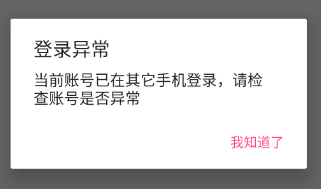

# 全面了解 Android 中的广播机制（二）：实践与封装

在上一篇文章「全面了解 Android 中的广播机制（一）：基础」总结了广播的一般使用方法，下面通过广播来实现一个「退出登录」功能。

## 退出登录方案探讨

在你使用微信的时候，如果你在另外一台手机上登录了，再回到当前手机时，就会被强制退出当前登录状态。一个简单的实现思路是这样的，在页面上弹出一个对话框，用户只能点击对话框中的 "退出" 按钮，然后再回到登录页面即可。

前面写过一篇文章「关于 Activity 的几个最佳实践」中，设计了一个 `ActivityManager` 来管理当前启动了的全部 `Activity`，并支持退出关闭所有 `Activity`。

### 关键代码设计

登录管理类 `LoginManger`：

```Java
public class LoginManger {

    private static boolean sIsLogin = false;

    public static boolean isLogin() {
        return sIsLogin;
    }

    public static void performLogin(String username, String password, OnLoginListener listener) {
        if ("admin".equals(username) && "12345".equals(password)) {
            sIsLogin = true;
            listener.onLoginSuccess();
        } else {
            sIsLogin = false;
            listener.onLoginFailed();
        }
    }

    public static void performLogout(final Context context) {
        AlertDialog.Builder builder = new AlertDialog.Builder(context);
        builder.setTitle("登录异常");
        builder.setMessage("当前账号已在其它手机登录，请检查账号是否异常");
        builder.setCancelable(false);
        builder.setPositiveButton("我知道了", new DialogInterface.OnClickListener() {
            @Override
            public void onClick(DialogInterface dialog, int which) {
                ActivityManager.finishAll();
                Intent intent = new Intent(context, LoginActivity.class);
                context.startActivity(intent);
            }
        });
        builder.show();
    }

    public interface OnLoginListener {
        void onLoginSuccess();
        void onLoginFailed();
    }
}
```

`BaseActivity`:

```java
public abstract class BaseActivity extends AppCompatActivity {

  public static final String ACTION_FORCE_OFFLINE = "com.zhuanghongji.BaseActivity.App.ACTION_FORCE_OFFLINE";

  // ...

  @Override
    protected void onCreate(@Nullable Bundle savedInstanceState) {
        super.onCreate(savedInstanceState);
        mContext = this;
        // ...

        mLocalBroadcastManager = LocalBroadcastManager.getInstance(mContext);
        mForceOfflineReceiver = new ForceOfflineReceiver(mContext);
        mIntentFilter = new IntentFilter(ACTION_FORCE_OFFLINE);
    }

    @Override
    protected void onResume() {
        super.onResume();
        mLocalBroadcastManager.registerReceiver(mForceOfflineReceiver, mIntentFilter);
    }

    @Override
    protected void onPause() {
        super.onPause();
        mLocalBroadcastManager.unregisterReceiver(mForceOfflineReceiver);
    }

    public class ForceOfflineReceiver extends BroadcastReceiver {

        private Context mContext;

        public ForceOfflineReceiver(Context context) {
            mContext = context;
        }

        @Override
        public void onReceive(Context context, Intent intent) {
            // context instanceOf Application is true, so use mContext
            if (LoginManger.isLogin()) {
                LoginManger.performLogout(mContext);
            }
        }
    }
}
```

登录页面 `LoginActivity`：

```Java
public class LoginActivity extends BaseActivity {

  // ...
  // 按钮事件，点击模拟登录
  public void performLogin(View view) {
          LoginManger.performLogin("admin", "12345",
                  new LoginManger.OnLoginListener() {
                      @Override
                      public void onLoginSuccess() {
                          Intent intent = new Intent(mContext, MainActivity.class);
                          startActivity(intent);
                      }

                      @Override
                      public void onLoginFailed() {
                          // ....
                      }
                  });
      }
  }
```

主页面 `MainActivity`：

```Java
public class MainActivity extends BaseActivity {

  // ...
  // 点击事件，模拟退出登录
  public void performSimulateLoginException(View view) {
      LocalBroadcastManager manager = LocalBroadcastManager.getInstance(mContext);
      Intent intent = new Intent();
      intent.setAction(BaseActivity.ACTION_FORCE_OFFLINE);
      manager.sendBroadcast(intent);
  }
}  
```

效果截图：  



上述代码中，有个关键点就是，`BaseActivity` 中强制下线的广播是在 `onResume()` 中注册以及在 `onPause()` 中解注册的，这是因为我们始终需要保证只有处于栈顶的 `Activity` 才能接收到这条强制下线的广播。

实际上，上述方案有很多不足的地方：

1. 假设我们所有的 `Activity` 都继承自 `BaseActivity`，那么每次启动一个新的 `Activity` 都要重新创建广播接受器，再进行注册或解注册，这些操作对应用来说会不会是多余的开销?
2. `BaseActivity` 中的广播注册逻辑比较复杂，一旦 `BaseActivity` 中的逻辑多了起来，强制下线相关的代码逻辑就显得没那么清晰了。

**针对不足 1** 提出两个建议方案:
1. 对于一个应用来说，一般都会有一个 `Activity` (比如 `MainActivity`) 只会创建一次或者说很少会重新创建，那么如果我们只在这个 `Activity` 的 `onCreate()` 中注册以及在 `onDestroy()` 中解注册是不是就减少了开销？
2. 对应一个上线的应用来说，强制下线的设计远远不止这么简单。可能还需要根据实际情况去考虑留痕、安全检查、前后台切换监听、接口调用等一些操作。换个角度想，或许用广播去设计退出登录功能本身是个 bad idea，你说是不是？

所以说，上面的强制下线设计方案只能起到一个抛砖引玉的作用。

**针对不足 2** 我们可以封装出一个本地广播管理类来解决代码复杂性的问题。

## 封装一个本地广播管理类

上述广播相关代码有以下几点问题：

1. 在 `BaseActivity` 中需要多声明 3 个成员变量 `mLocalBroadcastManager` `mForceOfflineReceiver` `mIntentFilter`，有点多。
2. 在 `BaseActivity` 中需要多声明一个广播接收器内部类，使得代码更加复杂。
3. 在 `MainActivity` 中发送一个广播代码量比较多。
4. 没有一个统一的地方去管理 `Action`。

为解决上述问题，我们可以封装一个「本地广播管理类」来简化和模板化一些操作：

```Java
public class CustomLocalBroadcastManager {

    // 在这里填写你部分或所有的 Action
    // public static final String ACTION_TEST = "com.zhuanghong.demo.ACTION_TEST";

    private static final String TAG = "CLBroadcastManager";

    private LocalBroadcastManager mManager;

    private CustomBroadcastReceiver mReceiver;

    private IntentFilter mFilter;

    @Nullable
    private OnCustomReceiveListener mOnCustomReceiveListener;

    /**
     * Create a CustomLocalBroadcastManager with given actions.
     * <p> Promise me, do not forget to set listener for {@link CustomBroadcastReceiver}
     * @param context the context of Activity
     * @param actions which will add to IntentFilter for receive broadcast
     */
    public CustomLocalBroadcastManager(Context context, String... actions) {
        this(context, null, actions);
    }

    /**
     * Create a CustomLocalBroadcastManager with given listener and actions.
     * <p> If you prefer to set {@link OnCustomReceiveListener} later,
     * you can use {@link CustomLocalBroadcastManager} instead.
     * @param context the context of Activity
     * @param listener will be called when the broadcast received
     * @param actions which will add to IntentFilter for receive broadcast
     */
    public CustomLocalBroadcastManager(Context context, OnCustomReceiveListener listener,
                                       String... actions) {
        if (actions == null || actions.length == 0) {
            throw new IllegalArgumentException("The actions of broadcast should not be empty.");
        }
        mOnCustomReceiveListener = listener;
        mManager = LocalBroadcastManager.getInstance(context);
        mReceiver = new CustomBroadcastReceiver();
        mFilter = new IntentFilter();
        for (String action : actions) {
            mFilter.addAction(action);
        }
    }

    /**
     * 注册对应广播接收器
     */
    public void registerReceiver() {
        mManager.registerReceiver(mReceiver, mFilter);
    }

    /**
     * 解注册对应广播接收器
     */
    public void unregisterReceiver() {
        mManager.unregisterReceiver(mReceiver);
    }

    /**
     * 设置收到对应广播时回调的监听器
     * @param onCustomReceiveListener 回调的监听器
     */
    public void setOnCustomReceiveListener(OnCustomReceiveListener onCustomReceiveListener) {
        mOnCustomReceiveListener = onCustomReceiveListener;
    }

    /**
     * 根据指定的 action 和 extra data 发送一个广播
     * @param context the context of Activity
     * @param callback 回调，用于获取 action 和 初始化 extra data
     */
    public static void sendBroadcast(Context context, OnInitIntentCallback callback) {
        LocalBroadcastManager manager = LocalBroadcastManager.getInstance(context);
        Intent intent = new Intent(callback.onGetAction());
        callback.onDataSetup(intent);
        manager.sendBroadcast(intent);
    }

    private class CustomBroadcastReceiver extends BroadcastReceiver {

        @Override
        public void onReceive(Context context, Intent intent) {
           if (mOnCustomReceiveListener != null) {
               mOnCustomReceiveListener.onCustomReceive(context, intent);
               return;
           }
           Log.w(TAG, "You didn't set the listener for CustomBroadcastReceiver");
        }
    }

    /**
     * 收到对应广播时回调的监听器
     */
    public interface OnCustomReceiveListener {
        /**
         * see {@link BroadcastReceiver#onReceive(Context, Intent)}
         */
        void onCustomReceive(Context context, Intent intent);
    }

    /**
     * 初始化要发送的广播消息
     */
    public interface OnInitIntentCallback {
        /**
         * Get the Intent action
         * @return the Intent action
         */
        String onGetAction();

        /**
         * 初始化 Intent 的数据
         * @param intent 通过 {@link #onGetAction()} 初始化的 Intent
         */
        void onDataSetup(Intent intent);
    }
}
```

封装出来后，你发送广播的姿势大概是这样的：

```Java
CustomLocalBroadcastManager.sendBroadcast(mContext,
    new CustomLocalBroadcastManager.OnInitIntentCallback() {
        @Override
        public String onGetAction() {
            return ACTION_TEST;
        }

        @Override
        public void onDataSetup(Intent intent) {
            // intent.setData(Uri.parse("https://www.google.com"));
            intent.putExtra(EXTRA_NAME_1, "Hello");
            intent.putExtra(EXTRA_NAME_2, "Broadcast");
        }
    });
```

注册和解注册一个广播接收器的姿势大概是这样的：

```Java
// ....

private CustomLocalBroadcastManager mCustomLocalBroadcastManager;

@Override
protected void onCreate(Bundle savedInstanceState) {
    super.onCreate(savedInstanceState);
    // ...
    mCustomLocalBroadcastManager = new CustomLocalBroadcastManager(mContext,
            new CustomLocalBroadcastManager.OnCustomReceiveListener() {
                @Override
                public void onCustomReceive(Context context, Intent intent) {
                    String a = intent.getStringExtra(EXTRA_NAME_1);
                    String b = intent.getStringExtra(EXTRA_NAME_2);
                    Toast.makeText(context, a + " " + b, Toast.LENGTH_SHORT).show();
                }
    }, CustomLocalBroadcastManager.ACTION_TEST);

    mCustomLocalBroadcastManager.registerReceiver();
}

@Override
protected void onDestroy() {
    super.onDestroy();
    mCustomLocalBroadcastManager.unregisterReceiver();
}

// ....
```
