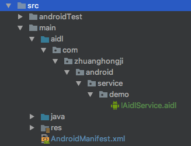
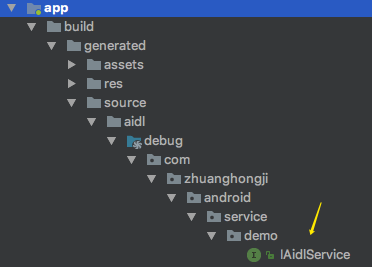
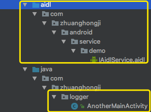

# Android 中的 Service（三）: 范例解析

## Service 的基本用法

新建一个 `CustomService` 类，重写一些父类的方法，一旦触发就打印出相关日志：

```java
public class MainActivity extends AppCompatActivity {

    public static final String TAG = "MainActivity";

    private Context mContext;

    private CustomService.CustomBinder mCustomBinder;
    private ServiceConnection mServiceConnection;

    @Override
    protected void onCreate(Bundle savedInstanceState) {
        super.onCreate(savedInstanceState);
        setContentView(R.layout.activity_main);
        mContext = this;

        mServiceConnection = new ServiceConnection() {
            @Override
            public void onServiceConnected(ComponentName name, IBinder service) {
                Log.i(TAG, "onServiceConnected");
                // 获取到 IBinder 的实例，然后就在 Activity 中就可以根据具体场景去调用 CustomBinder 的
                // 任何 public 方法，即实现了 Activity 对 Service 的控制
                mCustomBinder = (CustomService.CustomBinder) service;
                mCustomBinder.startDownload();
            }

            @Override
            public void onServiceDisconnected(ComponentName name) {
                Log.i(TAG, "onServiceDisconnected");
            }
        };
    }

    // 启动服务
    public void doStartService(View view) {
        // 构建一个 Intent 对象，并调用 startService() 方法来启动 CustomService
        Intent intent = new Intent(mContext, CustomService.class);
        startService(intent);
    }

    // 停止服务
    public void doStopService(View view) {
        Intent intent = new Intent(mContext, CustomService.class);
        stopService(intent);
    }

    // 绑定服务
    public void doBindService(View view) {
        Intent intent = new Intent(mContext, CustomService.class);
        bindService(intent, mServiceConnection, BIND_AUTO_CREATE);
    }

    // 解绑服务
    public void doUnbindService(View view) {
        unbindService(mServiceConnection);
    }
}
```

```Java
public class CustomService extends Service{

    public static final String TAG = "CustomService";

    private CustomBinder mCustomBinder = new CustomBinder();

    @Override
    public void onCreate() {
        super.onCreate();
        Log.i(TAG, "onCreate");
    }

    @Override
    public int onStartCommand(Intent intent, int flags, int startId) {
        Log.i(TAG, "onStartCommand");
        return super.onStartCommand(intent, flags, startId);
    }

    @Nullable
    @Override
    public IBinder onBind(Intent intent) {
        Log.i(TAG, "onBind");
        return mCustomBinder;
    }

    @Override
    public boolean onUnbind(Intent intent) {
        Log.i(TAG, "onUnbind");
        return super.onUnbind(intent);
    }

    @Override
    public void onRebind(Intent intent) {
        Log.i(TAG, "onRebind");
        super.onRebind(intent);
    }


    @Override
    public void onDestroy() {
        super.onDestroy();
        Log.i(TAG, "onDestroy");
    }

    // 用于和 Activity 建立关联，使得 Activity 可以和 Service 进行通信
    static class CustomBinder extends Binder {
        // 测试方法调用，并不是真正去下载东西
        public void startDownload() {
            Log.i(TAG, "执行 startDownload 方法");
        }

    }
}
```

```xml
<?xml version="1.0" encoding="utf-8"?>
<manifest xmlns:android="http://schemas.android.com/apk/res/android"
    package="com.zhuanghongji.android.service.demo">

    <application
        android:allowBackup="true"
        android:icon="@mipmap/ic_launcher"
        android:label="@string/app_name"
        android:roundIcon="@mipmap/ic_launcher_round"
        android:supportsRtl="true"
        android:theme="@style/AppTheme">

        <!-- 每一个 Service 都必须在 AndroidManifest.xml 中注册 -->
        <service android:name=".CustomService"/>

        <activity android:name=".MainActivity">
            <intent-filter>
                <action android:name="android.intent.action.MAIN" />

                <category android:name="android.intent.category.LAUNCHER" />
            </intent-filter>
        </activity>
    </application>

</manifest>
```


### 操作一

启动应用，点击三次「启动服务」，再点击一次「停止服务」，再点击一次「启动服务」，打印出来的日志如下：

```
I/CustomService: onCreate
I/CustomService: onStartCommand
I/CustomService: onStartCommand
I/CustomService: onStartCommand

I/CustomService: onDestroy

I/CustomService: onCreate
I/CustomService: onStartCommand
```

> **验证**：多个服务启动请求会导致多次对服务的 `onStartCommand()` 进行相应调用。但是要停止服务，只需要一个服务停止请求（`stopSelf()` 或 `stopService()`）。


### 操作二

启动应用，点击三次「绑定服务」，再点击一次「解绑服务」，再点击一次「绑定服务」，打印出来的日志如下：

```
I/CustomService: onCreate
I/CustomService: onBind
I/MainActivity: onServiceConnected
I/CustomService: 执行 startDownload 方法

I/CustomService: onUnbind
I/CustomService: onDestroy

I/CustomService: onCreate
I/CustomService: onBind
I/MainActivity: onServiceConnected
I/CustomService: 执行 startDownload 方法
```

> **验证**：多次绑定服务并不会多次 `onBind()` 和 `onServiceConnected()` 方法，解绑的话也是一次即可。

### 操作三

点击一次「启动服务」，然后点击一次「绑定服务」，再点击一次「停止服务」，再点击一次「解绑服务」，打印出来的日志如下：

```
I/CustomService: onCreate
I/CustomService: onStartCommand

I/CustomService: onBind
I/MainActivity: onServiceConnected
I/CustomService: 执行 startDownload 方法

I/CustomService: onUnbind
I/CustomService: onDestroy
```

点击一次「启动服务」，然后点击一次「绑定服务」，再点击一次「解绑服务」，再点击一次「停止服务」，打印出来的日志如下：

```
I/CustomService: onCreate
I/CustomService: onStartCommand

I/CustomService: onBind
I/MainActivity: onServiceConnected
I/CustomService: 执行 startDownload 方法

I/CustomService: onUnbind

I/CustomService: onDestroy
```

> **验证**：一个服务可以同时启动和绑定，当同时启动和绑定时，必须让服务进行停止和解绑之后才会被销毁。

## Service 与 Thread

首先，`Service` 和 `Thread` 之间没有任何直接联系的。

基于上述代码，另外在 `MainActivity` 和 `CustomService` 的 `onCreate()` 方法中都添加一行代码，打印出当前线程的 id:

```Java
Log.i(TAG, "MainActivity currentThread id = " + Thread.currentThread().getId()
        + ", name = " + Thread.currentThread().getName());

Log.i(TAG, "CustomService currentThread id = " + Thread.currentThread().getId()
        + ", name = " + Thread.currentThread().getName());
```

```
I/MainActivity: MainActivity currentThread id = 2, name = main
I/CustomService: CustomService currentThread id = 2, name = main
```

> **验证**：它们的线程 id 是完全一样的，说明 `Service` 确实是主线程中运行的。也就是说，如果你在 `Service` 中编写了耗时的代码，必定是会导致 ANR 的。

一般来说，我们会在 `Service` 中创建一个子线程，然后在新线程中处理耗时的逻辑，**那为什么不直接在 Activity 中创建呢？**

* 因为 `Activity` 很难对 `Thread` 进行控制，当 `Activity` 被销毁之后，就没有任何其它的办法可以再重新获取到之前创建的子线程的实例了。
* 同时，在一个 `Activity` 中创建的子线程，另一个 `Activity` 无法直接对其进行操作。但 `Service` 可以和所有的 `Activity` 进行关联，可以方便地操作其中的方法，即使 `Activity` 被销毁了，之后只要重新与 `Service` 建立关联，就又能够重新 获取到原有的 `Service` 中的 `Binder` 实例了。

因此，使用 `Service` 来处理后台任务，`Activity` 就可以放心地 `finish()`，完全不需要担心无法对后台任务进行控制的情况。

举个例子：  

我们在使用微信发朋友圈的时候，先是在编辑页面，点击发布之后马上跳转到了朋友圈页面。然后，此时你可以看到自己刚刚发布的朋友圈，但却不能进行点赞或评论的。只有等到真正上传照片且发布成功后，你才可以点赞或评论。

那么，这个编辑页上传发布、通知可朋友圈页面可以进行点赞和评论的功能，是不是就可以通过 `Service` 来做呢？


## 创建前台 Service

```Java
public class NotificationService extends Service {

    private static final String TAG = "NotificationService";

    @Override
    public void onCreate() {
        super.onCreate();
        Log.i(TAG, "onCreate()");
        // 注意：以下方式在 Android 8.0 上不起作用
        Intent notificationIntent = new Intent(this, SecondActivity.class);
        PendingIntent pendingIntent = PendingIntent.getActivity(this, 0,
                notificationIntent, 0);
        Notification notification = new Notification.Builder(this)
                .setContentIntent(pendingIntent)
                .setSmallIcon(R.mipmap.ic_launcher_round)
                .setContentTitle("这是标题")
                .setContentText("这是内容")
                .setWhen(System.currentTimeMillis())
                .build();

        notification.flags = Notification.FLAG_AUTO_CANCEL;
        notification.defaults = Notification.DEFAULT_SOUND;
        startForeground(123, notification);
    }

    @Nullable
    @Override
    public IBinder onBind(Intent intent) {
        throw new UnsupportedOperationException("Not yet implemented.");
    }
}
```

```Java
// MainActivity
public void doStartNotificationService(View view) {
    Intent intent = new Intent(this, NotificationService.class);
    startService(intent);
}

// SecondActivity
public void stopNotificationService(View view) {
    Intent intent = new Intent(this, NotificationService.class);
    stopService(intent);
}
```

  

主要逻辑是，在 `MainActivity` 中启动一个前台服务，此时可以看到通知栏多了一个通知。点击通知跳转到 `SecondActivity`，然后点击「停止前台服务」，可以看到通知栏里显示的前台服务消失了。


## 远程 Service

验证下 `Service` 执行耗时操作导致 ANR 的场景：

```Java
public class NewService extends Service {

    public static final String TAG = "NewService";

    @Override
    public void onCreate() {
        super.onCreate();
        Log.i(TAG, "onCreate");
        try {
            Thread.sleep(1000 * 20);
        } catch (InterruptedException e) {
            e.printStackTrace();
        }
    }

    @Nullable
    @Override
    public IBinder onBind(Intent intent) {
        return null;
    }
}
```

在我们启动 `NewService` 之后，点击其它按钮是无响应的，过一段时间后就会提示你「无响应」了，如下图：


前面讲到，在 Serice 中开启新线程去执行耗时任务可以有效地避免 ANR 的出现。那么，如果把使用远程 Service 之后不开启线程还会不会出现 ANR 呢？

下面将 `NewService` 注册为远程 `Serice`：

```xml
<!-- AndroidManifest.xml -->
<service android:name=".NewService"
            android:process=":other"/>
```

此时再启动 `NewService` 后，点击其它按钮是正常响应的，也不会造成 ANR。你还可以在 Android Studio 的 Logcat 下看到新启用的进程（包名）:


当然，你也可以通过 `Process.myPid()` 打印出当前进程 id 以验证是否启用了新的进程。

> **验证**：使用了远程 `Serice` 后，`Serice` 已经在另外一个进程中运行了，只会阻塞新进程中的主线程，而不会影响到当前的应用程序。

另外说明一下，上面的 `NewService` 是通过 `startService()` 方法启用服务的，如果你使用 `bindService()` 去绑定 `NewService`，测试代码如下：

```Java
// MainActivity
public void doStartNewService(View view) {
    Intent intent = new Intent(this, NewService.class);
    bindService(intent, new ServiceConnection() {
        @Override
        public void onServiceConnected(ComponentName name, IBinder service) {
            Log.i(TAG, "doStartNewService - onServiceConnected");
            NewService.NewBinder newBinder = (NewService.NewBinder) service;
            newBinder.doSomething();
        }

        @Override
        public void onServiceDisconnected(ComponentName name) {
            Log.i(TAG, "doStartNewService - onServiceDisconnected");
        }
    }, BIND_AUTO_CREATE);
}

// 修改后的 NewService
public class NewService extends Service {

    public static final String TAG = "NewService";

    private NewBinder mNewBinder = new NewBinder();

    @Override
    public void onCreate() {
        super.onCreate();
        Log.i(TAG, "onCreate");
    }

    @Nullable
    @Override
    public IBinder onBind(Intent intent) {
        return mNewBinder;
    }

    static class NewBinder extends Binder {
        public void doSomething() {
            Log.i(TAG, "执行 doSomething 方法");
        }
    }
}
```

执行 `doStartNewService()` 方法时会报错，如下：

```Java
I/MainActivity: doStartNewService - onServiceConnected
E/AndroidRuntime: FATAL EXCEPTION: main
  Process: com.zhuanghongji.android.service.demo, PID: 6704
  java.lang.ClassCastException: android.os.BinderProxy cannot be cast to com.zhuanghongji.android.service.demo.NewService$NewBinder
      at com.zhuanghongji.android.service.demo.MainActivity$2.onServiceConnected(MainActivity.java:83)
      at android.app.LoadedApk$ServiceDispatcher.doConnected(LoadedApk.java:1274)
      at android.app.LoadedApk$ServiceDispatcher$RunConnection.run(LoadedApk.java:1291)
      at android.os.Handler.handleCallback(Handler.java:815)
      at android.os.Handler.dispatchMessage(Handler.java:104)
      at android.os.Looper.loop(Looper.java:207)
      at android.app.ActivityThread.main(ActivityThread.java:5811)
      at java.lang.reflect.Method.invoke(Native Method)
      at com.android.internal.os.ZygoteInit$MethodAndArgsCaller.run(ZygoteInit.java:907)
      at com.android.internal.os.ZygoteInit.main(ZygoteInit.java:768)
```

因为此时 `NewService` 和 `MainActivity` 是运行在两个不同的进程中的，这是就不能再使用传统的建立关联的方式了。

## 使用 AIDL 进行跨进程通信

通过 `app` -> `new` -> `AIDL` -> `AIDL File` 新建一个 AIDL 文件 `IAidlService.aidl`：
然后目录结构会发生变化，自动生成 aidl 目录与 java 目录同级，文件结构与当前应用的包名一致：

  

默认生成  `IAidlService.aidl` 文件内容如下：

```Java
// IAidlService.aidl
package com.zhuanghongji.android.service.demo;

// Declare any non-default types here with import statements

interface IAidlService {
    /**
     * Demonstrates some basic types that you can use as parameters
     * and return values in AIDL.
     */
    void basicTypes(int anInt, long aLong, boolean aBoolean, float aFloat,
            double aDouble, String aString);
}
```

此时我们 `Build` -> `Rebuild Project` 重新编译下项目，会发现 `app` -> `build` -> `generated` -> `source` -> `aidl` 目录下生成了一个新的编译文件：  



为了验证通信，我们来修改下 `IAidlService` 并重新编译：

```Java
interface IAidlService {

	int plus(int a, int b);

	String toUpperCase(String str);
}
```

然后再新建一个服务类 `AIDLService`：

```Java
public class AIDLService extends Service {

    IAidlService.Stub mBinder = new IAidlService.Stub() {

        @Override
        public int plus(int a, int b) throws RemoteException {
            return a + b;
        }

        @Override
        public String toUpperCase(String str) throws RemoteException {
            if (str == null) {
                return null;
            }
            return str.toUpperCase();
        }
    };

    @Nullable
    @Override
    public IBinder onBind(Intent intent) {
        return mBinder;
    }
}
```

再将该服务类注册成远程服务：

```xml
<!-- AndroidManifest.xml -->
<service android:name=".AIDLService"
    android:process=":aidl"/>
```

绑定该服务并进行一些测试方法的调用：

```Java
// MainActivity
public void doStartAidlService(View view) {
    Intent intent = new Intent(this, AIDLService.class);
    bindService(intent, new ServiceConnection() {
        @Override
        public void onServiceConnected(ComponentName name, IBinder service) {
            Log.i(TAG, "doStartAidlService - onServiceConnected");
            IAidlService aidl = IAidlService.Stub.asInterface(service);
            try {
                int plus = aidl.plus(6, 1);
                String upper = aidl.toUpperCase("abc");
                Log.i(TAG, "plus = " + plus + ", upper = " + upper);
            } catch (RemoteException e) {
                e.printStackTrace();
            }


        }

        @Override
        public void onServiceDisconnected(ComponentName name) {
            Log.i(TAG, "doStartAidlService - onServiceDisconnected");
        }
    }, BIND_AUTO_CREATE);
}
```

打印日志如下：

```
I/MainActivity: doStartAidlService - onServiceConnected
I/MainActivity: plus = 7, upper = ABC
```

由此可见，我们确实已经实现了跨进程通信，在一个进程中访问到了另一个进程中的方法。

实际上，**跨进程通信的真正意义是，让一个应用程序去访问另一个应用程序中的 `Serice`，以实现共享 `Serice` 的功能**。下面我们来实现一下。

首先，修改下上面 Project 的 `AIDLService` 的注册代码，然后重新编译并启动：

```xml
<service android:name=".AIDLService"
    android:process=":aidl">
    <intent-filter>
        <action android:name="com.zhuanghongji.android.service.demo.AIDL_SERVICE"/>
    </intent-filter>
</service>
```

新建一个 Project，将上面生成的 `aidl` 目录同文件一起复制到新建的项目中，并进行编译:



在 `AnotherMainActivity` 中添加能够隐式绑定 `AIDLService` 的逻辑：

```Java
public class AnotherMainActivity extends AppCompatActivity {

    public static final String TAG = "AnotherMainActivity";

    @Override
    protected void onCreate(Bundle savedInstanceState) {
        super.onCreate(savedInstanceState);
        setContentView(R.layout.activity_another_main);
    }

    public void bindService(View view) {
        Intent intent = new Intent();
        intent.setPackage("com.zhuanghongji.android.service.demo");
        intent.setAction("com.zhuanghongji.android.service.demo.AIDL_SERVICE");

        bindService(intent, new ServiceConnection() {
            @Override
            public void onServiceConnected(ComponentName name, IBinder service) {
                Log.i(TAG, "doStartAidlService - onServiceConnected");
                IAidlService aidl = IAidlService.Stub.asInterface(service);
                try {
                    int plus = aidl.plus(6, 1);
                    String upper = aidl.toUpperCase("abc");
                    Log.i(TAG, "plus = " + plus + ", upper = " + upper);
                } catch (RemoteException e) {
                    e.printStackTrace();
                }


            }

            @Override
            public void onServiceDisconnected(ComponentName name) {
                Log.i(TAG, "doStartAidlService - onServiceDisconnected");
            }
        }, BIND_AUTO_CREATE);
    }
}
```

执行 `bindService()` 方法后，我们可以看到 `Logcat` 中成功打印出如下日志：

```
I/AnotherMainActivity: doStartAidlService - onServiceConnected
I/AnotherMainActivity: plus = 7, upper = ABC
```


## 参考文章

* [Android Service完全解析，关于服务你所需知道的一切(上)](https://blog.csdn.net/guolin_blog/article/details/11952435)
* [Android Service完全解析，关于服务你所需知道的一切(下)](https://blog.csdn.net/guolin_blog/article/details/9797169)
* [Service Intent must be explicit的两种解决方法](https://blog.csdn.net/ethanhola/article/details/54848843)
