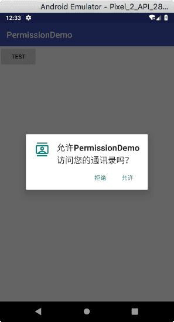
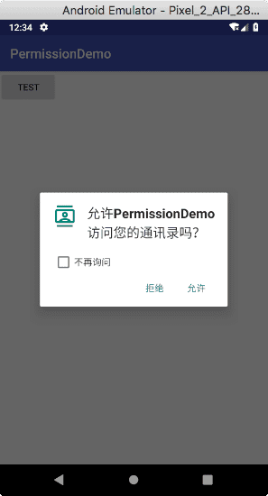
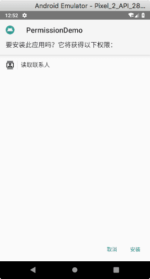
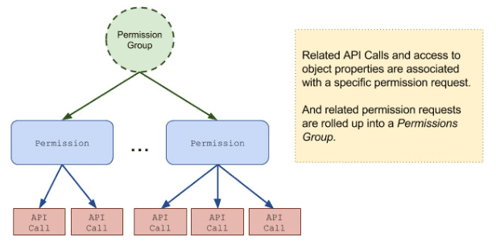

# Androud 中的运行时权限：概述

在 Android 中，权限的目的是为了保护用户的隐私。Android 应用必须请求相关权限后才能访问用户的敏感数据 (比如联系人和短信) 或某些系统功能 (比如相机和互联网)。系统可能会根据使用的功能自动授予对应权限，也可能提示用户允许对应的权限请求。

本文内容主要是描述了 Android 权限的工作方式，包括：

* 如何向用户呈现权限
* 「安装时请求」和「运行时请求」这两者的区别
* 权限的实施方式
* 权限及其组的类型

## 权限授予

* 应用必须通过 [app manifest](https://developer.android.com/guide/topics/manifest/manifest-intro.html) 中的 [`<use-permission>`](https://developer.android.com/guide/topics/manifest/uses-permission-element.html) 标签来声明它所需要的权限。举个例子，一个需要发送短信的应用会在 manifest 中声明权限：

```xml
<manifest xmlns:android="http://schemas.android.com/apk/res/android"
          package="com.example.snazzyapp">

    <uses-permission android:name="android.permission.SEND_SMS"/>

    <application ...>
        ...
    </application>
</manifest>
```

你应用中列举的如果是 *普通权限* (即不会对用户隐私或设备造成较大风险的权限)，系统会自动向你授予这些权限。

你应用中列举的如果是 *危险权限* (即可能会影响用户隐私或设备正常运行的权限)，比如上面提到的 [SEND_SMS](https://developer.android.com/reference/android/Manifest.permission.html#SEND_SMS) 权限，用户必须明确授予这些权限。


## 请求提示危险权限

只有危险权限才需要请求用户同意。Android 请求用户授予权限的方式取决于用户设备上运行的 Android 版本以及应用所针对 (target) 的系统版本。


### 运行时请求 (Android 6.0+)

如果设备运行的是 Android 6.0 (API level 23) 或以上，并且应用的 `targetSdkVersion` 是 23 或以上，在安装时不会向用户提示任何有关权限的东西。

当你的应用请求权限时，用户会看到一个系统对话框 (如下左图所示)，告知用户你的应用尝试访问哪个权限组。该对话框有 **拒绝** 和 **允许** 两个按钮。

如果用户拒绝了权限请求，则下次你的应用请求权限时该对话框会包含一个 **不再提示** 复选框 (如下右图所示)。勾选该复选框，表示用户不希望再次收到该权限提示。

| 没拒绝过 | 曾拒绝过
| -- | --
|  | 

如果用户勾选了 **不再提示** 并且点击了 **拒绝**，那么你下次你的应用尝试访问请求同一个权限时系统就不再提示用户了。

即使用户授予了你的应用所请求的权限，你也不能总是依赖拥有了对应的权限。用户是可以在系统设置中逐个启用或禁用权限的，你应该在运行时始终检查并请求权限以防止出现运行时错误 [SecurityException](https://developer.android.com/reference/java/lang/SecurityException)。


### 安装时请求 (Android 5.1.1 及以下)

如果用户设备运行的版本是 Android 5.1.1 (API level 22) 或以下，或应用的 `targetSdkVersion` 是 22 或更低，在安装你的应用时系统会自动要求用户授予所有的危险权限，如下图。



如果用户点击了 **安装**，系统会授予应用程序请求的所有权限。如果用户点击了 **取消**，也就是说拒绝了权限请求，系统将取消应用程序的安装。

应用更新时如果包含其它权限的请求，系统会在应用更新之前提示用户允许这些新权限。


## 自动权限调整

随着时间推移，可能会有新的限制规则加入平台，以至于使用某些 API 时你的应用必须请求 **以前不需要** 的权限。Android 会根据应用 `targetSdkVersion` 属性的值来决定该应用是否需要某个权限，如果该值低于该权限添加时的 Android 版本，则会添加该权限。

例如，从 API 19 开始限定了 [READ_EXTERNAL_STORAGE](https://developer.android.com/reference/android/Manifest.permission.html#READ_EXTERNAL_STORAGE) 权限对共享存储空间的访问。如果你的 `targetSdkVersion` 为 18 或更低，在较新版本中此权限会添加到你的应用中。

> 警告：如果你的应用自动添加了权限，即使你的应用实际上可能不需要该权限，在 Google Play 应用列表上也会列举出这些额外的权限。为避免这种情况并移除你不需要的默认权限，需尽可能地将你的 **targetSdkVersion** 更新到最高。你可以在 [Build.VERSION_CODES](https://developer.android.com/reference/android/os/Build.VERSION_CODES.html) 中查看每个版本都添加了哪些权限。


## 保护级别

应用权限被分为了几个保护级别 (会影响是否需要运行时权限请求)。

其中有三种保护级别会影响第三方应用程序：
* 普通权限 [PROTECTION_NORMAL](https://developer.android.com/reference/android/content/pm/PermissionInfo.html)
* 签名权限 [PROTECTION_SIGNATURE](https://developer.android.com/reference/android/content/pm/PermissionInfo.html#PROTECTION_SIGNATURE)
* 危险权限


### 普通权限

普通权限涵盖了应用程序需要访问沙箱外部数据或资源但对用户隐私或其它应用操作造成影响的风险非常小的区域。例如，设置时区的权限。

如果应用程序在其清单文件中声明了它需要的普通权限，系统在安装时会自动授予这些权限。系统是不会提示用户去授予普通权限的，用户也无法撤销这些权限。

从 Android 9 (API 28) 开始，下面的这些权限被分为了普通权限：

| 权限 | 说明
| -- | --
| [ACCESS_LOCATION_EXTRA_COMMANDS](https://developer.android.com/reference/android/Manifest.permission.html#ACCESS_LOCATION_EXTRA_COMMANDS) | todo
| [ACCESS_NETWORK_STATE](https://developer.android.com/reference/android/Manifest.permission.html#ACCESS_NETWORK_STATE) |
| [ACCESS_NOTIFICATION_POLICY](https://developer.android.com/reference/android/Manifest.permission.html#ACCESS_NOTIFICATION_POLICY) |
| [ACCESS_WIFI_STATE](https://developer.android.com/reference/android/Manifest.permission.html#ACCESS_WIFI_STATE) |
| [BLUETOOTH](https://developer.android.com/reference/android/Manifest.permission.html#BLUETOOTH) |
| [BLUETOOTH_ADMIN](https://developer.android.com/reference/android/Manifest.permission.html#BLUETOOTH_ADMIN) |
| [BROADCAST_STICKY](https://developer.android.com/reference/android/Manifest.permission.html#BROADCAST_STICKY) |
| [CHANGE_NETWORK_STATE](https://developer.android.com/reference/android/Manifest.permission.html#CHANGE_NETWORK_STATE) |
| [CHANGE_WIFI_MULTICAST_STATE](https://developer.android.com/reference/android/Manifest.permission.html#CHANGE_WIFI_MULTICAST_STATE) |
| [CHANGE_WIFI_STATE](https://developer.android.com/reference/android/Manifest.permission.html#CHANGE_WIFI_STATE) |
| [DISABLE_KEYGUARD](https://developer.android.com/reference/android/Manifest.permission.html#DISABLE_KEYGUARD) |
| [EXPAND_STATUS_BAR](https://developer.android.com/reference/android/Manifest.permission.html#EXPAND_STATUS_BAR) |
| [FOREGROUND_SERVICE](https://developer.android.com/reference/android/Manifest.permission.html#FOREGROUND_SERVICE) |
| [GET_PACKAGE_SIZE](https://developer.android.com/reference/android/Manifest.permission.html#GET_PACKAGE_SIZE) |
| [INSTALL_SHORTCUT](https://developer.android.com/reference/android/Manifest.permission.html#INSTALL_SHORTCUT) |
| [INTERNET](https://developer.android.com/reference/android/Manifest.permission.html#INTERNET) |
| [KILL_BACKGROUND_PROCESSES](https://developer.android.com/reference/android/Manifest.permission.html#KILL_BACKGROUND_PROCESSES) |
| [MANAGE_OWN_CALLS](https://developer.android.com/reference/android/Manifest.permission.html#MANAGE_OWN_CALLS) |
| [MODIFY_AUDIO_SETTINGS](https://developer.android.com/reference/android/Manifest.permission.html#MODIFY_AUDIO_SETTINGS) |
| [NFC](https://developer.android.com/reference/android/Manifest.permission.html#NFC) |
| [READ_SYNC_SETTINGS](https://developer.android.com/reference/android/Manifest.permission.html#READ_SYNC_SETTINGS) |
| [READ_SYNC_STATS](https://developer.android.com/reference/android/Manifest.permission.html#READ_SYNC_STATS) |
| [RECEIVE_BOOT_COMPLETED](https://developer.android.com/reference/android/Manifest.permission.html#RECEIVE_BOOT_COMPLETED) |
| [REORDER_TASKS](https://developer.android.com/reference/android/Manifest.permission.html#REORDER_TASKS) |
| [REQUEST_COMPANION_RUN_IN_BACKGROUND](https://developer.android.com/reference/android/Manifest.permission.html#REQUEST_COMPANION_RUN_IN_BACKGROUND) |
| [REQUEST_COMPANION_USE_DATA_IN_BACKGROUND](https://developer.android.com/reference/android/Manifest.permission.html#REQUEST_COMPANION_USE_DATA_IN_BACKGROUND) |
| [REQUEST_DELETE_PACKAGES](https://developer.android.com/reference/android/Manifest.permission.html#REQUEST_DELETE_PACKAGES) |
| [REQUEST_IGNORE_BATTERY_OPTIMIZATIONS](https://developer.android.com/reference/android/Manifest.permission.html#REQUEST_IGNORE_BATTERY_OPTIMIZATIONS) |
| [SET_ALARM](https://developer.android.com/reference/android/Manifest.permission.html#SET_ALARM) |
| [SET_WALLPAPER](https://developer.android.com/reference/android/Manifest.permission.html#SET_WALLPAPER) |
| [SET_WALLPAPER_HINTS](https://developer.android.com/reference/android/Manifest.permission.html#SET_WALLPAPER_HINTS) |
| [TRANSMIT_IR](https://developer.android.com/reference/android/Manifest.permission.html#TRANSMIT_IR) |
| [USE_FINGERPRINT](https://developer.android.com/reference/android/Manifest.permission.html#USE_FINGERPRINT) |
| [VIBRATE](https://developer.android.com/reference/android/Manifest.permission.html#VIBRATE) |
| [WAKE_LOCK](https://developer.android.com/reference/android/Manifest.permission.html#WAKE_LOCK) |
| [WRITE_SYNC_SETTINGS](https://developer.android.com/reference/android/Manifest.permission.html#WRITE_SYNC_SETTINGS) |


### 签名权限

系统会在安装时授予的、仅限于与定义对应权限的应用签名相同的应用的权限。

> 注意：某些签名不适用于第三方应用程序。

| 权限 | 说明
| -- | --
| [BIND_ACCESSIBILITY_SERVICE](https://developer.android.com/reference/android/Manifest.permission#BIND_ACCESSIBILITY_SERVICE) | todo
| [BIND_AUTOFILL_SERVICE](https://developer.android.com/reference/android/Manifest.permission#BIND_AUTOFILL_SERVICE) |
| [BIND_CARRIER_SERVICES](https://developer.android.com/reference/android/Manifest.permission#BIND_CARRIER_SERVICES) |
|  [BIND_CHOOSER_TARGET_SERVICE](https://developer.android.com/reference/android/Manifest.permission#BIND_CHOOSER_TARGET_SERVICE) |
| [BIND_CONDITION_PROVIDER_SERVICE](https://developer.android.com/reference/android/Manifest.permission#BIND_CONDITION_PROVIDER_SERVICE) |  
| [BIND_DEVICE_ADMIN](https://developer.android.com/reference/android/Manifest.permission#BIND_DEVICE_ADMIN) |
|  [BIND_DREAM_SERVICE](https://developer.android.com/reference/android/Manifest.permission#BIND_DREAM_SERVICE) |
| [BIND_INCALL_SERVICE](https://developer.android.com/reference/android/Manifest.permission#BIND_INCALL_SERVICE) |
|  [BIND_INPUT_METHOD](https://developer.android.com/reference/android/Manifest.permission#BIND_INPUT_METHOD) |
| [BIND_MIDI_DEVICE_SERVICE](https://developer.android.com/reference/android/Manifest.permission#BIND_MIDI_DEVICE_SERVICE) |
| [BIND_NFC_SERVICE](https://developer.android.com/reference/android/Manifest.permission#BIND_NFC_SERVICE) |
| [BIND_NOTIFICATION_LISTENER_SERVICE](https://developer.android.com/reference/android/Manifest.permission#BIND_NOTIFICATION_LISTENER_SERVICE) |
| [BIND_PRINT_SERVICE](https://developer.android.com/reference/android/Manifest.permission#BIND_PRINT_SERVICE) |
| [BIND_SCREENING_SERVICE](https://developer.android.com/reference/android/Manifest.permission#BIND_SCREENING_SERVICE) |
| [BIND_TELECOM_CONNECTION_SERVICE](https://developer.android.com/reference/android/Manifest.permission#BIND_TELECOM_CONNECTION_SERVICE) |
| [BIND_TEXT_SERVICE](https://developer.android.com/reference/android/Manifest.permission#BIND_TEXT_SERVICE) |
| [BIND_TV_INPUT](https://developer.android.com/reference/android/Manifest.permission#BIND_TV_INPUT) |
| [BIND_VISUAL_VOICEMAIL_SERVICE](https://developer.android.com/reference/android/Manifest.permission#BIND_VISUAL_VOICEMAIL_SERVICE) |
| [BIND_VOICE_INTERACTION](https://developer.android.com/reference/android/Manifest.permission#BIND_VOICE_INTERACTION) |
| [BIND_VPN_SERVICE](https://developer.android.com/reference/android/Manifest.permission#BIND_VPN_SERVICE) |
| [BIND_VR_LISTENER_SERVICE](https://developer.android.com/reference/android/Manifest.permission#BIND_VR_LISTENER_SERVICE) |
| [BIND_WALLPAPER](https://developer.android.com/reference/android/Manifest.permission#BIND_WALLPAPER) |
| [CLEAR_APP_CACHE](https://developer.android.com/reference/android/Manifest.permission#CLEAR_APP_CACHE) |
| [MANAGE_DOCUMENTS](https://developer.android.com/reference/android/Manifest.permission#MANAGE_DOCUMENTS) |
| [READ_VOICEMAIL](https://developer.android.com/reference/android/Manifest.permission#READ_VOICEMAIL) |
| [REQUEST_INSTALL_PACKAGES](https://developer.android.com/reference/android/Manifest.permission#REQUEST_INSTALL_PACKAGES) |
| [SYSTEM_ALERT_WINDOW](https://developer.android.com/reference/android/Manifest.permission#SYSTEM_ALERT_WINDOW) |
| [WRITE_SETTINGS](https://developer.android.com/reference/android/Manifest.permission#WRITE_SETTINGS) |
| [WRITE_VOICEMAIL](https://developer.android.com/reference/android/Manifest.permission#WRITE_VOICEMAIL) |


### 危险权限

危险权限主要是指会访问用户私人信息的数据或资源、可能会影响用户存储数据或影响其它应用程序操作的权限。例如，读取用户联系人的权限是一种危险权限。

 * 要使用危险权限，应用必须在运行时提示用户进行授予。
 * 在用户允许该权限之前，应用是无法提供依赖该权限的功能的。

危险权限列表见后面的 [权限组](#权限组) 部分。


### 特殊权限

有一些权限的表现不像普通权限也不像危险权限。比如说， [`SYSTEM_ALERT_WINDOW`](https://developer.android.com/reference/android/Manifest.permission.html#SYSTEM_ALERT_WINDOW) 和 [`WRITE_SETTINGS`](https://developer.android.com/reference/android/Manifest.permission.html#WRITE_SETTINGS) 是特别敏感的权限，所以大多数应用程序应尽量避免使用它们。如果应用程序确实需要其中一个权限，就必须在清单文件中声明，并发送一个意图来请求用户的授权。系统响应该意图是会向用户显示一个详细的管理页面。

// todo 补充图片


## 权限组

权限被分为了多个与设备能力或功能相关的组。

在此系统下，权限请求会在组这个层级进行处理，而且单个权限组对应于多个在清单中声明的权限。例如，SMS 组包括 `READ_SMS` 和 `RECEIVE_SMS` 权限的声明。以这种方式对权限进行分组使得用户可以做出更有意义的、更明智的选择，从而避免用户被复杂的、技术性的权限请求所困扰。



所有的危险权限都属于权限组。

如果设备运行的是 Android 6.0 (API 23) 且应用程序的 `targetSdkVersion` 为 23 或更高，那当你的应用请求危险权限时，系统可能会有以下两种行为：

* 若当前你的应用在对应权限组中没有任何权限，系统就会向用户显示权限请求对话框，并描述应用程序要访问的权限组。要注意，该对话框并不会描述组中的具体权限。比如说，如果某个应用请求了 [`READ_CONTACTS`](https://developer.android.com/reference/android/Manifest.permission.html?hl=zh-cn#READ_CONTACTS) 权限，系统对话框可能会描述为 "该应用程序需要访问设备联系人"。如果用户允许授予，系统就会给予其请求对应的具体权限。

* 若当前你的应用程序在对应权限组中已经拥有该权限，则系统会立即授予应用正在请求的权限，且不会与用户进行任何交互。举个例子，某个应用已经请求并获得了 [`READ_CONTACTS`](https://developer.android.com/reference/android/Manifest.permission.html?hl=zh-cn#READ_CONTACTS) 权限，然后它再请求 [`WRITE_CONTACTS`](https://developer.android.com/reference/android/Manifest.permission.html?hl=zh-cn#WRITE_CONTACTS) 权限，这种情况下系统会立即授予该权限，且不会向用户显示权限请求对话框。

> 注意：未来版本的 Android SDK 可能会将特定权限从一个组移到另一个组，所以在编码时不能应用程序的逻辑不能基于这些权限组的结构。
>
> 举个例子，在 Android 8.1 (API 27) 中 READ_CONTACTS 和 WRITE_CONTACTS 用属于 CONTACTS 权限组。如果你的应用请求并获得了 READ_CONTACTS 权限，请不要假设系统会百分百自动授予 WRITE_CONTACTS 权限。

如果设备运行 Android 5.1 (API 22) 或更低版本，或者你的应用程序 `targetSdkVersion` 小于或等于 22，则在安装应用程序时系统会要求用户授予权限。系统告知用户的是该应用程序需要的哪些权限组，而不是告知某个具体的权限。

例如，应用程序在清单中声明了 [`READ_CONTACTS`](https://developer.android.com/reference/android/Manifest.permission.html?hl=zh-cn#READ_CONTACTS) 权限，则在安装时会列出 "联系人" 权限组。当用户点击了安装时，该应用程序也仅仅授予了 [`READ_CONTACTS`](https://developer.android.com/reference/android/Manifest.permission.html?hl=zh-cn#READ_CONTACTS) 权限。

> 注意：你的应用需要明确声明你所需要的每个权限，即使用户已在同一组中授予了其它权限。


| 危险权限和权限组 | 权限常量
| -- | --
| [CALENDAR](https://developer.android.com/reference/android/Manifest.permission_group.html#CALENDAR) | <ul> <li>[READ_CALENDAR](https://developer.android.com/reference/android/Manifest.permission.html#READ_CALENDAR)</li> <li>[WRITE_CALENDAR](https://developer.android.com/reference/android/Manifest.permission.html#WRITE_CALENDAR)</li>  </ul>
| [CALL_LOG](https://developer.android.com/reference/android/Manifest.permission_group#CALL_LOG) | <ul> <li>[READ_CALL_LOG](https://developer.android.com/reference/android/Manifest.permission#READ_CALL_LOG)</li> <li>[WRITE_CALL_LOG](https://developer.android.com/reference/android/Manifest.permission#WRITE_CALL_LOG)</li> <li>[PROCESS_OUTGOING_CALLS](https://developer.android.com/reference/android/Manifest.permission#PROCESS_OUTGOING_CALLS)</li>  </ul>
| [CAMERA](https://developer.android.com/reference/android/Manifest.permission_group.html#CAMERA) | <ul> <li>[CAMERA](https://developer.android.com/reference/android/Manifest.permission.html#CAMERA)</li> </ul>
| [CONTACTS](https://developer.android.com/reference/android/Manifest.permission_group.html#CONTACTS) | <ul> <li>[READ_CONTACTS](https://developer.android.com/reference/android/Manifest.permission.html#READ_CONTACTS)</li> <li>[WRITE_CONTACTS](https://developer.android.com/reference/android/Manifest.permission.html#WRITE_CONTACTS)</li><li>[GET_ACCOUNTS](https://developer.android.com/reference/android/Manifest.permission.html#GET_ACCOUNTS)</li>  </ul>
| [LOCATION](https://developer.android.com/reference/android/Manifest.permission_group.html#LOCATION) | <ul> <li>[ACCESS_FINE_LOCATION](https://developer.android.com/reference/android/Manifest.permission.html#ACCESS_FINE_LOCATION)</li> <li>[ACCESS_COARSE_LOCATION](https://developer.android.com/reference/android/Manifest.permission.html#ACCESS_COARSE_LOCATION)</li>  </ul>
| [MICROPHONE](https://developer.android.com/reference/android/Manifest.permission_group.html#MICROPHONE) | <ul> <li>[RECORD_AUDIO](https://developer.android.com/reference/android/Manifest.permission.html#RECORD_AUDIO)</li>  </ul>
| [PHONE](https://developer.android.com/reference/android/Manifest.permission_group.html#PHONE) | <ul> <li>[READ_PHONE_STATE](https://developer.android.com/reference/android/Manifest.permission.html#READ_PHONE_STATE)</li> <li>[READ_PHONE_NUMBERS](https://developer.android.com/reference/android/Manifest.permission.html#READ_PHONE_NUMBERS)</li><li>[CALL_PHONE](https://developer.android.com/reference/android/Manifest.permission.html#CALL_PHONE)</li><li>[ANSWER_PHONE_CALLS](https://developer.android.com/reference/android/Manifest.permission.html#ANSWER_PHONE_CALLS)</li><li>[ADD_VOICEMAIL](https://developer.android.com/reference/android/Manifest.permission.html#ADD_VOICEMAIL)</li><li>[USE_SIP](https://developer.android.com/reference/android/Manifest.permission.html#USE_SIP)</li>  </ul>
| [SENSORS](https://developer.android.com/reference/android/Manifest.permission_group.html#SENSORS) | <ul> <li>[BODY_SENSORS](https://developer.android.com/reference/android/Manifest.permission.html#BODY_SENSORS)</li>  </ul>
| [SMS](https://developer.android.com/reference/android/Manifest.permission_group.html#SMS) | <ul> <li>[SEND_SMS](https://developer.android.com/reference/android/Manifest.permission.html#SEND_SMS)</li> <li>[RECEIVE_SMS](https://developer.android.com/reference/android/Manifest.permission.html#RECEIVE_SMS)</li><li>[READ_SMS](https://developer.android.com/reference/android/Manifest.permission.html#READ_SMS)</li> <li>[RECEIVE_WAP_PUSH](https://developer.android.com/reference/android/Manifest.permission.html#RECEIVE_WAP_PUSH)</li> <li>[RECEIVE_MMS](https://developer.android.com/reference/android/Manifest.permission.html#RECEIVE_MMS)</li>   </ul>
| [STORAGE](https://developer.android.com/reference/android/Manifest.permission_group.html#STORAGE) | <ul> <li>[READ_EXTERNAL_STORAGE](https://developer.android.com/reference/android/Manifest.permission.html#READ_EXTERNAL_STORAGE)</li> <li>[WRITE_EXTERNAL_STORAGE](https://developer.android.com/reference/android/Manifest.permission.html#WRITE_EXTERNAL_STORAGE)</li>  </ul>
