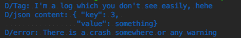
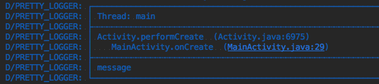
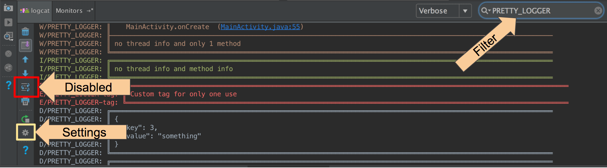

# Logger 全面解析（一）：基础用法

## 简介
[Logger](https://github.com/orhanobut/logger) 是 Android 平台上一个简单、美观且强大的日志库。  

正常情况下我们通过 Log 类打印日志的姿势是这样的：

```Java
Log.d("Tag", "I'm a log which you don't see easily, hehe");
Log.d("json content", "{ \"key\": 3, \n \"value\": something}");
Log.d("error", "There is a crash somewhere or any warning");
```

  

从上图来看好像也什么毛病，但是如果你想分析当前打印日志的代码是在「哪个线程打印的」、「方法调用栈是怎样的」或「想通过点击日志跳转到源码」等，上面打印日志的姿势就有毛病了。

来看下 Logger 是怎样打印日志的：

```Java
Logger.d("message");
```

  

从上图中，我们可以看出日志打印逻辑是在主线程中执行的、是在 `MainActivity` 的 `onCreate()` 方法中打印的、点击 `MainActivity.java:29` 可以直接跳转到对应源码的指定行。

咋一看还不错，但 Logger 还支持 "排版式" 打印 JSON、XML、集合等内容：  

>  图片丢失，待补充


## 基本用法

### 控制日志级别

```Java
Logger.d("debug");
Logger.e("error");
Logger.w("warning");
Logger.v("verbose");
Logger.i("information");
Logger.wtf("What a Terrible Failure");
```

### 支持字符串参数格式化

```java
Logger.d("hello %s", "world");
```

当我们需要控制在开发版本开启日志打印功能，而在发布版本关闭时，因为不需要进行字符串的拼接，所有会有助于性能的提升。

### 支持打印集合

仅在 debug 日志下支持：

```Java
Logger.d(MAP);
Logger.d(SET);
Logger.d(LIST);
Logger.d(ARRAY);
```

### 支持打印 JSON 和 XML

输出的日志也是视为 debug 级别的：

```Java
Logger.json(JSON_CONTENT);
Logger.xml(XML_CONTENT);
```

## 进阶用法

```Java
FormatStrategy formatStrategy = PrettyFormatStrategy.newBuilder()
  .showThreadInfo(false)  // (Optional) 是否打印线程信息。默认 true
  .methodCount(0)         // (Optional) 控制打印多少个调用栈中的方法。默认 2
  .methodOffset(7)        // (Optional) 控制偏移（隐藏）多少个方法后再开始打印方法。默认 5
  .logStrategy(customLog) // (Optional) 修改日志打印策略。默认 LogCat
  .tag("My custom tag")   // (Optional) 设置全局 TAG。默认 PRETTY_LOGGER
  .build();

Logger.addLogAdapter(new AndroidLogAdapter(formatStrategy));
```

## 控制是否打印

Log 适配器会检查每个日志打印逻辑以控制是否打印出来。如果你不想打印特定级别或特定 TAG 的日志，可覆写 `isLoggable()` 方法进行控制，如下：

```Java
Logger.addLogAdapter(new AndroidLogAdapter() {
  @Override public boolean isLoggable(int priority, String tag) {
    // true 表示打印；false 表示不打印
    return BuildConfig.DEBUG;
  }
});
```

## 将日志保存到文件中

// TODO: More information will be added later

```Java
Logger.addLogAdapter(new DiskLogAdapter());
```

添加 "特定 TAG 保存到 CSV 中" 的策略：

```Java
FormatStrategy formatStrategy = CsvFormatStrategy.newBuilder()
  .tag("custom")
  .build();

Logger.addLogAdapter(new DiskLogAdapter(formatStrategy));
```


## 实践

如果你不想打印线程和方法栈信息，可以这样做：

```Java
Logger.clearLogAdapters();
formatStrategy = PrettyFormatStrategy.newBuilder()
        .showThreadInfo(false)
        .methodCount(0)
        .build();

Logger.addLogAdapter(new AndroidLogAdapter(formatStrategy));
Logger.i("no thread info and method info");

I/PRETTY_LOGGER: ┌───────────────────────────────────────
I/PRETTY_LOGGER: │ no thread info and method info
I/PRETTY_LOGGER: └───────────────────────────────────────
```

如果你想自定义全局 TAG：

```Java
Logger.clearLogAdapters();
formatStrategy = PrettyFormatStrategy.newBuilder()
        .showThreadInfo(false)
        .methodCount(0)
        .tag("MyTag")
        .build();
Logger.addLogAdapter(new AndroidLogAdapter(formatStrategy));

W/MyTag: ┌─────────────────────────────────────────
W/MyTag: │ my log message with my tag
W/MyTag: └─────────────────────────────────────────
```

如果你想在全局 TAG 的基础上，再补充一个自定义 TAG：

```Java
Logger.t("tag").e("Custom tag for only one use");

E/PRETTY_LOGGER-tag: ┌───────────────────────────────────
E/PRETTY_LOGGER-tag: │ Custom tag for only one use
E/PRETTY_LOGGER-tag: └───────────────────────────────────
```

如果你想打印 JSON 字符串：

```Java
Logger.json("{ \"key\": 3, \"value\": something}");

D/PRETTY_LOGGER: ┌─────────────────────────────
D/PRETTY_LOGGER: │ {
D/PRETTY_LOGGER: │   "key": 3,
D/PRETTY_LOGGER: │   "value": "something"
D/PRETTY_LOGGER: │ }
D/PRETTY_LOGGER: └─────────────────────────────
```

如果你想打印 List 集合：

```Java
Logger.d(Arrays.asList("foo", "bar"));

D/PRETTY_LOGGER: ┌────────────────────────────
D/PRETTY_LOGGER: │ [foo, bar]
D/PRETTY_LOGGER: └────────────────────────────
```

你过你想打印 Map 集合：

```Java
Map<String, String> map = new HashMap<>();
map.put("key", "value");
map.put("key1", "value2");
Logger.d(map);

D/PRETTY_LOGGER: ┌────────────────────────────────
D/PRETTY_LOGGER: │ {key1=value2, key=value}
D/PRETTY_LOGGER: └────────────────────────────────
```


## 更多

结合 Android Studio 中的日志过滤、设置等功能体验会更好噢。


