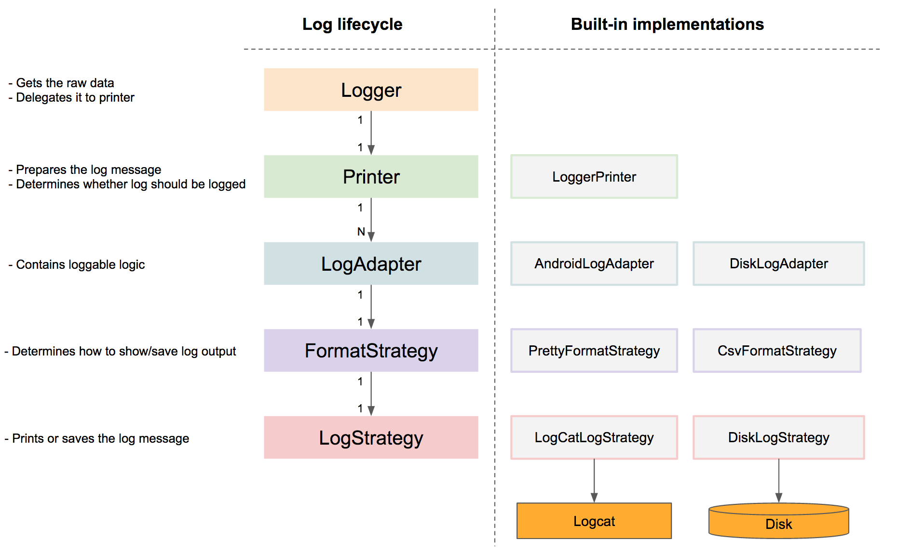

# Logger 全面解析（二）：相关源码探讨 - LogCat

  

上面是一张自己画的架构图，Looger 源码中 14 个 Java 文件，其中 3 个独立类，4 个接口以及 7 个接口实现类。

一般情况下，部分类的作用如下：

* `Logger`: 供外部调用以获取日志相关的原始数据，代理了 `LoggerPrinter` 类的日志打印方法，
* `LoggerPrinter`: 准备要打印出来的日志内容，比如：
 * 对 JSON 和 XML 字符串进行解析
 * 获得方法调用过程的栈
 * 遍历 `LogAdapter` 打印出日志
* `AndroidLogAdapter`: 通过 `PrettyFormatStrategy` 在 Logcat 中打印出格式化后的日志信息。
* `DiskLogAdapter`: 通过 `CsvFormatStrategy` 在 SD 卡的 looger 目录下以 csv 文件格式保存日志信息。

接下来，看下官方提供的 Logger 工作图：



根据该工作图，开始下面的代码分析。

## Logger

```Java
public final class Logger {

  @NonNull private static Printer printer = new LoggerPrinter();

  private Logger() {
    //no instance
  }

  public static void printer(@NonNull Printer printer) {
    Logger.printer = checkNotNull(printer);
  }

  public static void addLogAdapter(@NonNull LogAdapter adapter) {
    printer.addAdapter(checkNotNull(adapter));
  }

  public static void clearLogAdapters() {
    printer.clearLogAdapters();
  }

  public static Printer t(@Nullable String tag) { ... }
  public static void v( ... ) { printer.v( ... ); }
  public static void d( ... ) { printer.d( ... ); }
  public static void i( ... ) { printer.i( ... ); }
  public static void w( ... ) { printer.w( ... ); }
  public static void e( ... ) { printer.e( ... ); }
}
```

Logger 类可看做是一个代理类，代理了 `Printer` 的行为。如果想从一开始就去自定义这些行为的话，我们可以自定义一个实现了 `Printer` 接口的类，并通过 `Logger.printer()` 方法传入。


## LoggerPrinter

```Java
class LoggerPrinter implements Printer {

  /**
   * It is used for json pretty print
   */
  private static final int JSON_INDENT = 2;

  /**
   * Provides one-time used tag for the log message
   */
  private final ThreadLocal<String> localTag = new ThreadLocal<>();

  private final List<LogAdapter> logAdapters = new ArrayList<>();

  @Override public Printer t(String tag) {
    if (tag != null) {
      localTag.set(tag);
    }
    return this;
  }

  @Nullable private String getTag() {
    String tag = localTag.get();
    if (tag != null) {
      localTag.remove();
      return tag;
    }
    return null;
  }

  @Override public void json(@Nullable String json) {
    if (Utils.isEmpty(json)) {
      d("Empty/Null json content");
      return;
    }
    try {
      json = json.trim();
      if (json.startsWith("{")) {
        JSONObject jsonObject = new JSONObject(json);
        String message = jsonObject.toString(JSON_INDENT);
        d(message);
        return;
      }
      if (json.startsWith("[")) {
        JSONArray jsonArray = new JSONArray(json);
        String message = jsonArray.toString(JSON_INDENT);
        d(message);
        return;
      }
      e("Invalid Json");
    } catch (JSONException e) {
      e("Invalid Json");
    }
  }

  @Override public void xml(@Nullable String xml) {
    if (Utils.isEmpty(xml)) {
      d("Empty/Null xml content");
      return;
    }
    try {
      Source xmlInput = new StreamSource(new StringReader(xml));
      StreamResult xmlOutput = new StreamResult(new StringWriter());
      Transformer transformer = TransformerFactory.newInstance().newTransformer();
      transformer.setOutputProperty(OutputKeys.INDENT, "yes");
      transformer.setOutputProperty("{http://xml.apache.org/xslt}indent-amount", "2");
      transformer.transform(xmlInput, xmlOutput);
      d(xmlOutput.getWriter().toString().replaceFirst(">", ">\n"));
    } catch (TransformerException e) {
      e("Invalid xml");
    }
  }

  // 两个 log() 方法
  // ...
}
```

### `ThreadLocal<String> localTag`

主要是用于 `t()` 方法添加的一次性的 TAG，用过一次之后就会删除。

### `List<LogAdapter> logAdapters`

存储你添加了的所有「日志适配器」的引用，打印日志时会进行遍历打印。比如说，如果你添加了两个适配器：

```Java
Logger.clearLogAdapters();  //
Logger.addLogAdapter(new AndroidLogAdapter());
Logger.addLogAdapter(new DiskLogAdapter());

Logger.d("multi adapter log.")
```

那么最终会在 Logcat 产生一条日志，在手机 Disk 中产生一条日志。

### `json()`

方法主要是为了 "准备" 好当前要打印的 JSON 字符串，如果为空则直接提示 **Empty/Null json content**，否则判断是 `JSONObject` 还是 `JSONArray` 在通过 `toString(JSON_INDENT)` 方法解析成 "准备好的字符串"（解析过程出错的话，会打印出 error 级别日志 **Invalid Json**），如下图：


**为什么要进行这个准备过程？**

`PrettyFormatStrategy` 类中有这样一段代码：

```Java
private void logContent(int logType, @Nullable String tag, @NonNull String chunk) {
    checkNotNull(chunk);

    String[] lines = chunk.split(System.getProperty("line.separator"));
    for (String line : lines) {
      logChunk(logType, tag, HORIZONTAL_LINE + " " + line);
    }
  }
```

作用是：将 "准备好的字符串" 通过 `\n` 进行分割，然后再一行一行的打印出来。

### `xml()`

该方法的作用类似 `json()` 也是为了 "准备" 字符串


献上一个 xml 字符的姿势，如下：

```Java
String xmltest = "<aaa ERRMSG=\"错误提示\"><bbb XM=\"姓名\" GJ=\"国籍\" ZJLX=\"证件类型\" DSRZJHM=\"证件号码\"></bbb></aaa>";
Logger.xml(xmltest);

D/PRETTY_LOGGER: ┌──────────────────────────────────────────────────────────
D/PRETTY_LOGGER: │ <?xml version="1.0" encoding="UTF-8"?>
D/PRETTY_LOGGER: │ <aaa ERRMSG="错误提示">
D/PRETTY_LOGGER: │   <bbb XM="姓名" GJ="国籍" ZJLX="证件类型" DSRZJHM="证件号码"/>
D/PRETTY_LOGGER: │ </aaa>
D/PRETTY_LOGGER: └──────────────────────────────────────────────────────────
```

### 两个 `log()` 方法

```Java
/**
 * This method is synchronized in order to avoid messy of logs' order.
 */
private synchronized void log(int priority,
                              @Nullable Throwable throwable,
                              @NonNull String msg,
                              @Nullable Object... args) {
  checkNotNull(msg);

  String tag = getTag();
  String message = createMessage(msg, args);
  log(priority, tag, message, throwable);
}

@Override public synchronized void log(int priority,
                                       @Nullable String tag,
                                       @Nullable String message,
                                       @Nullable Throwable throwable) {
  if (throwable != null && message != null) {
    message += " : " + Utils.getStackTraceString(throwable);
  }
  if (throwable != null && message == null) {
    message = Utils.getStackTraceString(throwable);
  }
  if (Utils.isEmpty(message)) {
    message = "Empty/NULL log message";
  }

  // 遍历适配器
  for (LogAdapter adapter : logAdapters) {
    if (adapter.isLoggable(priority, tag)) {
      adapter.log(priority, tag, message);
    }
  }
}
```

* 第一个 `log()` 方法主要是由 `printer` 调用：获取 TAG 和 参数替换字符串（如 `%s` 换成 `args` 参数中的字符串 ）。
* 第二个 `log` 方法主要是由第一个 `log` 方法调用：获取 Throwable 中的字符串信息，模拟代码如下。

```java
try {
    float a = 1 / 0;
} catch (Exception e) {
    Logger.e(e,"123", "AAA");
}
// 方法 `Utils.getStackTraceString(throwable);` 的返回值如下：

java.lang.ArithmeticException: divide by zero
	at com.zhuanghongji.logger.MainActivity.onCreate(MainActivity.java:32)
	at android.app.Activity.performCreate(Activity.java:6342)
	at android.app.Instrumentation.callActivityOnCreate(Instrumentation.java:1113)
	at android.app.ActivityThread.performLaunchActivity(ActivityThread.java:2523)
	at android.app.ActivityThread.handleLaunchActivity(ActivityThread.java:2636)
	at android.app.ActivityThread.access$1000(ActivityThread.java:180)
	at android.app.ActivityThread$H.handleMessage(ActivityThread.java:1494)
	at android.os.Handler.dispatchMessage(Handler.java:111)
	at android.os.Looper.loop(Looper.java:207)
	at android.app.ActivityThread.main(ActivityThread.java:5811)
	at java.lang.reflect.Method.invoke(Native Method)
	at com.android.internal.os.ZygoteInit$MethodAndArgsCaller.run(ZygoteInit.java:907)
	at com.android.internal.os.ZygoteInit.main(ZygoteInit.java:768)

// 最终打印出来的结果
E/PRETTY_LOGGER: ┌───────────────────────────────────
E/PRETTY_LOGGER: │ Thread: main
E/PRETTY_LOGGER: ├┄┄┄┄┄┄┄┄┄┄┄┄┄┄┄┄┄┄┄┄┄┄┄┄┄┄┄┄┄┄┄┄┄┄┄
E/PRETTY_LOGGER: │ Activity.performCreate  (Activity.java:6342)
E/PRETTY_LOGGER: │    MainActivity.onCreate  (MainActivity.java:34)
E/PRETTY_LOGGER: ├┄┄┄┄┄┄┄┄┄┄┄┄┄┄┄┄┄┄┄┄┄┄┄┄┄┄┄┄┄┄┄┄┄┄┄
E/PRETTY_LOGGER: │ 123 : java.lang.ArithmeticException: divide by zero
E/PRETTY_LOGGER: │ 	at com.zhuanghongji.logger.MainActivity.onCreate(MainActivity.java:32)
E/PRETTY_LOGGER: │ 	at android.app.Activity.performCreate(Activity.java:6342)
E/PRETTY_LOGGER: │ 	at android.app.Instrumentation.callActivityOnCreate(Instrumentation.java:1113)
E/PRETTY_LOGGER: │ 	at android.app.ActivityThread.performLaunchActivity(ActivityThread.java:2523)
E/PRETTY_LOGGER: │ 	at android.app.ActivityThread.handleLaunchActivity(ActivityThread.java:2636)
E/PRETTY_LOGGER: │ 	at android.app.ActivityThread.access$1000(ActivityThread.java:180)
E/PRETTY_LOGGER: │ 	at android.app.ActivityThread$H.handleMessage(ActivityThread.java:1494)
E/PRETTY_LOGGER: │ 	at android.os.Handler.dispatchMessage(Handler.java:111)
E/PRETTY_LOGGER: │ 	at android.os.Looper.loop(Looper.java:207)
E/PRETTY_LOGGER: │ 	at android.app.ActivityThread.main(ActivityThread.java:5811)
E/PRETTY_LOGGER: │ 	at java.lang.reflect.Method.invoke(Native Method)
E/PRETTY_LOGGER: │ 	at com.android.internal.os.ZygoteInit$MethodAndArgsCaller.run(ZygoteInit.java:907)
E/PRETTY_LOGGER: │ 	at com.android.internal.os.ZygoteInit.main(ZygoteInit.java:768)
E/PRETTY_LOGGER: └───────────────────────────────────
```

## PrettyFormatStrategy


其实一个相对完整 Logger 日志（如下图）其实上可以看做是拆分成多条 Logcat 日志打印出来的。分类的话，可以分成以下几个部分：

* TopBorder: `┌────────────────────────────────────`
* MiddleBorder: `├┄┄┄┄┄┄┄┄┄┄┄┄┄┄┄┄┄┄┄┄┄┄┄┄┄┄┄┄┄┄┄┄┄┄┄┄┄┄┄┄┄┄`
* BottomBorder: `└──────────────────────────────────────────`
* Content: `│ 具体内容`

将 "准备好的字符串" 美观地打印出来就是 `PrettyFormatStrategy` 的目的所在。

Android 中对每条 Logcat 的内容长度是有限制的：

> Android's max limit for a log entry is ~4076 bytes, so 4000 bytes is used as chunk size since default charset is UTF-8

`PrettyFormatStrategy` 类的主要方法如下：

```Java
// 打印一条完整的 Logger 日志（线程信息、方法调用栈、PrettyFormat 后的日志内容）
@Override public void log(int priority, @Nullable String onceOnlyTag, @NonNull String message) {
  checkNotNull(message);

  String tag = formatTag(onceOnlyTag);

  logTopBorder(priority, tag);
  logHeaderContent(priority, tag, methodCount);

  //get bytes of message with system's default charset (which is UTF-8 for Android)
  byte[] bytes = message.getBytes();
  int length = bytes.length;
  if (length <= CHUNK_SIZE) {
    if (methodCount > 0) {
      logDivider(priority, tag);
    }
    logContent(priority, tag, message);
    logBottomBorder(priority, tag);
    return;
  }
  if (methodCount > 0) {
    logDivider(priority, tag);
  }
  for (int i = 0; i < length; i += CHUNK_SIZE) {
    int count = Math.min(length - i, CHUNK_SIZE);
    //create a new String with system's default charset (which is UTF-8 for Android)
    logContent(priority, tag, new String(bytes, i, count));
  }
  logBottomBorder(priority, tag);
}

// 打印线程信息、方法调用栈
@SuppressWarnings("StringBufferReplaceableByString")
  private void logHeaderContent(int logType, @Nullable String tag, int methodCount) {
  StackTraceElement[] trace = Thread.currentThread().getStackTrace();
  if (showThreadInfo) {
    logChunk(logType, tag, HORIZONTAL_LINE + " Thread: " + Thread.currentThread().getName());
    logDivider(logType, tag);
  }
  String level = "";

  int stackOffset = getStackOffset(trace) + methodOffset;

  //corresponding method count with the current stack may exceeds the stack trace. Trims the count
  if (methodCount + stackOffset > trace.length) {
    methodCount = trace.length - stackOffset - 1;
  }

  for (int i = methodCount; i > 0; i--) {
    int stackIndex = i + stackOffset;
    if (stackIndex >= trace.length) {
      continue;
    }
    StringBuilder builder = new StringBuilder();
    builder.append(HORIZONTAL_LINE)
        .append(' ')
        .append(level)
        .append(getSimpleClassName(trace[stackIndex].getClassName()))
        .append(".")
        .append(trace[stackIndex].getMethodName())
        .append(" ")
        .append(" (")
        .append(trace[stackIndex].getFileName())
        .append(":")
        .append(trace[stackIndex].getLineNumber())
        .append(")");
    level += "   ";
    logChunk(logType, tag, builder.toString());
  }
}

// 通过日志策略去输出日志内容
private void logChunk(int priority, @Nullable String tag, @NonNull String chunk) {
  checkNotNull(chunk);

  logStrategy.log(priority, tag, chunk);
}

private int getStackOffset(@NonNull StackTraceElement[] trace) {
  checkNotNull(trace);

  for (int i = MIN_STACK_OFFSET; i < trace.length; i++) {
    StackTraceElement e = trace[i];
    String name = e.getClassName();
    if (!name.equals(LoggerPrinter.class.getName()) && !name.equals(Logger.class.getName())) {
      return --i;
    }
  }
  return -1;
}

// 拼接「全局 TAG」和「单条日志 TAG」
@Nullable private String formatTag(@Nullable String tag) {
  if (!Utils.isEmpty(tag) && !Utils.equals(this.tag, tag)) {
    return this.tag + "-" + tag;
  }
  return this.tag;
}

// 通过构建者模式去构建一个 PrettyFormatStrategy
public static class Builder {

  // ...

  @NonNull public PrettyFormatStrategy build() {
    if (logStrategy == null) {
      // 真正打印日志的策略，默认为 Logcat
      logStrategy = new LogcatLogStrategy();
    }
    return new PrettyFormatStrategy(this);
  }
}
```

## LogcatLogStrategy

```Java
/**
 * LogCat implementation for {@link LogStrategy}
 *
 * This simply prints out all logs to Logcat by using standard {@link Log} class.
 */
public class LogcatLogStrategy implements LogStrategy {

  static final String DEFAULT_TAG = "NO_TAG";

  @Override public void log(int priority, @Nullable String tag, @NonNull String message) {
    checkNotNull(message);

    if (tag == null) {
      tag = DEFAULT_TAG;
    }

    Log.println(priority, tag, message);
  }
}
```
