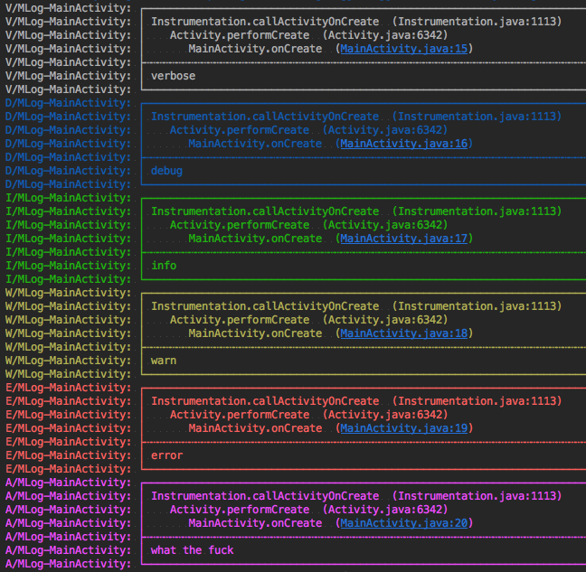

# Logger 全面解析（四）：封装自己的日志库

如果我们直接把 Logger 代码写在正常业务逻辑里面，碰巧有一天 Logger 不能满足我们的需求了，可能就需要一行一行的去修改代码，这多麻烦啊。

> 使用第三方库的最佳姿势就是，在其上面再包装一层。

下面我们来尝试用最简单的逻辑对 Logger 进行一层包装：

```Java
/**
 * Logger 上层包装（主要是为了简化后面可能需要更换「日志库」的工作）
 * <p> 当前最新版 Logger: implementation 'com.orhanobut:logger:2.2.0'
 */
public class MLog {

    private static boolean sIsLogEnable;

    private MLog() {
        // no instance
    }

    public static void init(final boolean isTestApk) {
        // 定义 MLog 是否打印日志
        // （可结合 PrettyFormatStrategy 和 CsvFormatStrategy 的 isLoggable 一起使用）
        sIsLogEnable = isTestApk;

        // pretty
        FormatStrategy pretty = PrettyFormatStrategy.newBuilder()
                .showThreadInfo(false)  // (Optional) Whether to show thread info or not. Default true
                .methodCount(3)         // (Optional) How many method line to show. Default 2
                .methodOffset(1)        // 因为多了一层封装调用逻辑，所以可适当 +1 （默认值 5）
                .tag("MLog")   // (Optional) Global tag for every log. Default PRETTY_LOGGER
                .build();

        Logger.addLogAdapter(new AndroidLogAdapter(pretty) {
            @Override
            public boolean isLoggable(int priority, @Nullable String tag) {
                // return isTestApk;  // 只要是测试包都进行 Logcat 打印
                return BuildConfig.DEBUG;
            }
        });

        // csv  当前 2.2.0 版本的 Logger 好像有点问题，可到 GitHub issue 中追踪相关信息
        FormatStrategy csv = CsvFormatStrategy.newBuilder()
                .date(new Date())
                .dateFormat(new SimpleDateFormat("yyMMddHHmmss"))
                .tag("MLog")
                .build();
        Logger.addLogAdapter(new DiskLogAdapter(csv) {
            @Override
            public boolean isLoggable(int priority, @Nullable String tag) {
                // return priority >= Log.WARN;  // 只要是 warn 级别及以上都写入 Disk
                return BuildConfig.DEBUG;
            }
        });
    }

    /**
     * General log function that accepts all configurations as parameter
     */
    public static void log(int priority, @Nullable String tag, @Nullable String message, @Nullable Throwable throwable) {
        if (!sIsLogEnable) {
            return;
        }
        Logger.log(priority, tag, message, throwable);
    }

    public static void d(@Nullable String tag, @NonNull String message, @Nullable Object... args) {
        if (!sIsLogEnable) {
            return;
        }
        Logger.t(tag).d(message, args);
    }

    public static void d(@Nullable String tag, @Nullable Object object) {
        if (!sIsLogEnable) {
            return;
        }
        Logger.t(tag).d(object);
    }

    public static void e(@Nullable String tag, @NonNull String message, @Nullable Object... args) {
        if (!sIsLogEnable) {
            return;
        }
        Logger.t(tag).e(message, args);
    }

    public static void e(@Nullable String tag, @Nullable Throwable throwable, @NonNull String message, @Nullable Object... args) {
        if (!sIsLogEnable) {
            return;
        }
        Logger.t(tag).e(throwable, message, args);
    }

    public static void i(@Nullable String tag, @NonNull String message, @Nullable Object... args) {
        if (!sIsLogEnable) {
            return;
        }
        Logger.t(tag).i(message, args);
    }

    public static void v(@Nullable String tag, @NonNull String message, @Nullable Object... args) {
        if (!sIsLogEnable) {
            return;
        }
        Logger.t(tag).v(message, args);
    }

    public static void w(@Nullable String tag, @NonNull String message, @Nullable Object... args) {
        if (!sIsLogEnable) {
            return;
        }
        Logger.t(tag).w(message, args);
    }

    /**
     * Tip: Use this for exceptional situations to log
     * ie: Unexpected errors etc
     */
    public static void wtf(@Nullable String tag, @NonNull String message, @Nullable Object... args) {
        if (!sIsLogEnable) {
            return;
        }
        Logger.t(tag).wtf(message, args);
    }

    /**
     * Formats the given json content and print it
     */
    public static void json(@Nullable String tag, @Nullable String json) {
        if (!sIsLogEnable) {
            return;
        }
        Logger.t(tag).json(json);
    }

    /**
     * Formats the given xml content and print it
     */
    public static void xml(@Nullable String tag, @Nullable String xml) {
        if (!sIsLogEnable) {
            return;
        }
        Logger.t(tag).xml(xml);
    }
}
```

测试代码：

```Java
public class App extends Application {

    @Override
    public void onCreate() {
        super.onCreate();
        MLog.init(true);
    }
}

public class MainActivity extends AppCompatActivity {

    private static final String TAG = "MainActivity";

    @Override
    protected void onCreate(Bundle savedInstanceState) {
        super.onCreate(savedInstanceState);
        setContentView(R.layout.activity_main);

        MLog.v(TAG, "verbose");
        MLog.d(TAG, "debug");
        MLog.i(TAG, "info");
        MLog.w(TAG, "warn");
        MLog.e(TAG, "error");
        MLog.wtf(TAG, "what the fuck");
    }
}
```

测试日志截图：


