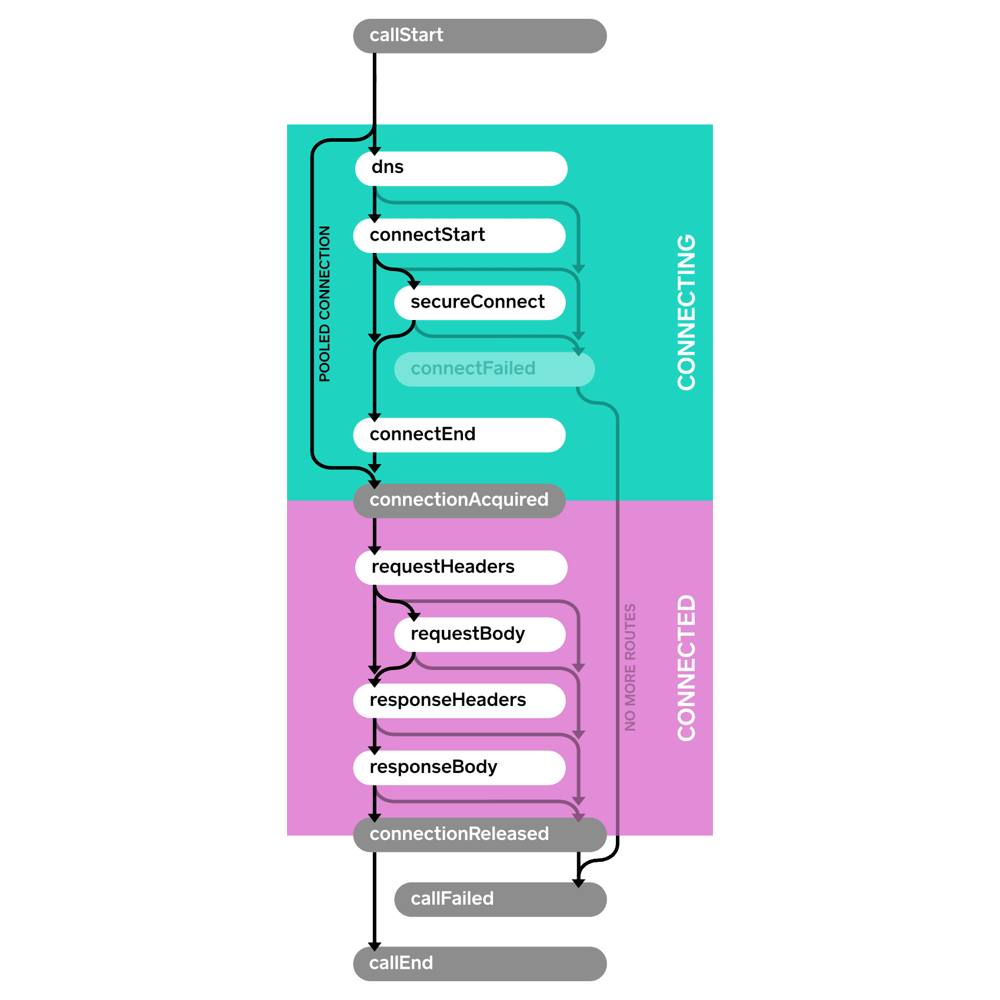

# Events

Events 允许你捕获应用程序的 HTTP 调用指标。使用事件监控：
* **应用程序发出的 HTTP 调用的大小和频率**  
如果你发起的 Call 太多，或者 Call 太大，你应该知道这个！
* **这些调用在底层网络上的性能**  
如果网络性能不足，则需要改进网络或减少使用网络。


## 事件监听

实现 [EventListener](https://square.github.io/okhttp/3.x/okhttp/okhttp3/EventListener.html) 的子类并覆写你感兴趣的事件的方法。在没有重定向或重试的成功 HTTP 调用中，下面的流程图描述了事件序列。

<image src="./res/events.png" width="480" />

下面是一个事件监听器示例，使用时间戳打印每个事件。

```java
class PrintingEventListener extends EventListener {
  private long callStartNanos;

  private void printEvent(String name) {
    long nowNanos = System.nanoTime();
    if (name.equals("callStart")) {
      callStartNanos = nowNanos;
    }
    long elapsedNanos = nowNanos - callStartNanos;
    System.out.printf("%.3f %s%n", elapsedNanos / 1000000000d, name);
  }

  @Override public void callStart(Call call) {
    printEvent("callStart");
  }

  @Override public void callEnd(Call call) {
    printEvent("callEnd");
  }

  @Override public void dnsStart(Call call, String domainName) {
    printEvent("dnsStart");
  }

  @Override public void dnsEnd(Call call, String domainName, List<InetAddress> inetAddressList) {
    printEvent("dnsEnd");
  }

  ...
}
```

然后我们发起几个 Call：

```java
Request request = new Request.Builder()
    .url("https://publicobject.com/helloworld.txt")
    .build();

System.out.println("REQUEST 1 (new connection)");
try (Response response = client.newCall(request).execute()) {
  // Consume and discard the response body.
  response.body().source().readByteString();
}

System.out.println("REQUEST 2 (pooled connection)");
try (Response response = client.newCall(request).execute()) {
  // Consume and discard the response body.
  response.body().source().readByteString();
}
```

监听器打印出相应的事件：

```
REQUEST 1 (new connection)
0.000 callStart
0.010 dnsStart
0.017 dnsEnd
0.025 connectStart
0.117 secureConnectStart
0.586 secureConnectEnd
0.586 connectEnd
0.587 connectionAcquired
0.588 requestHeadersStart
0.590 requestHeadersEnd
0.591 responseHeadersStart
0.675 responseHeadersEnd
0.676 responseBodyStart
0.679 responseBodyEnd
0.679 connectionReleased
0.680 callEnd
REQUEST 2 (pooled connection)
0.000 callStart
0.001 connectionAcquired
0.001 requestHeadersStart
0.001 requestHeadersEnd
0.002 responseHeadersStart
0.082 responseHeadersEnd
0.082 responseBodyStart
0.082 responseBodyEnd
0.083 connectionReleased
0.083 callEnd
```

注意第二次调用没有触发连接事件。它重用了第一个请求的连接，从而显着提高了性能。


## EventListener.Factory

在前面的示例中，我们使用了一个字段 `callStartNanos` 来跟踪每个事件的已用时间。这很方便，但如果多个调用同时执行，它将无法工作。为了适应这种情况，请使用一个 `Factory` 来为每个 `Call` 创建一个新的 `EventListener`。这允许每个监听器保持特定于 Call 的状态。

这个 [factory 示例](https://github.com/square/okhttp/blob/master/samples/guide/src/main/java/okhttp3/recipes/PrintEvents.java) 为每个 Call 创建唯一 ID，并使用该 ID 区分 Call 的日志消息。


```java
class PrintingEventListener extends EventListener {
  public static final Factory FACTORY = new Factory() {
    final AtomicLong nextCallId = new AtomicLong(1L);

    @Override public EventListener create(Call call) {
      long callId = nextCallId.getAndIncrement();
      System.out.printf("%04d %s%n", callId, call.request().url());
      return new PrintingEventListener(callId, System.nanoTime());
    }
  };

  final long callId;
  final long callStartNanos;

  public PrintingEventListener(long callId, long callStartNanos) {
    this.callId = callId;
    this.callStartNanos = callStartNanos;
  }

  private void printEvent(String name) {
    long elapsedNanos = System.nanoTime() - callStartNanos;
    System.out.printf("%04d %.3f %s%n", callId, elapsedNanos / 1000000000d, name);
  }

  @Override public void callStart(Call call) {
    printEvent("callStart");
  }

  @Override public void callEnd(Call call) {
    printEvent("callEnd");
  }

  ...
}
```

我们可以使用此监听器来对比一对并发的 HTTP 请求：

```java
Request washingtonPostRequest = new Request.Builder()
    .url("https://www.washingtonpost.com/")
    .build();
client.newCall(washingtonPostRequest).enqueue(new Callback() {
  ...
});

Request newYorkTimesRequest = new Request.Builder()
    .url("https://www.nytimes.com/")
    .build();
client.newCall(newYorkTimesRequest).enqueue(new Callback() {
  ...
});
```

在家庭 WiFi 上进行对比，显示 Times(`0002`) 比 Post(`0001`) 稍早完成：

```
0001 https://www.washingtonpost.com/
0001 0.000 callStart
0002 https://www.nytimes.com/
0002 0.000 callStart
0002 0.010 dnsStart
0001 0.013 dnsStart
0001 0.022 dnsEnd
0002 0.019 dnsEnd
0001 0.028 connectStart
0002 0.025 connectStart
0002 0.072 secureConnectStart
0001 0.075 secureConnectStart
0001 0.386 secureConnectEnd
0002 0.390 secureConnectEnd
0002 0.400 connectEnd
0001 0.403 connectEnd
0002 0.401 connectionAcquired
0001 0.404 connectionAcquired
0001 0.406 requestHeadersStart
0002 0.403 requestHeadersStart
0001 0.414 requestHeadersEnd
0002 0.411 requestHeadersEnd
0002 0.412 responseHeadersStart
0001 0.415 responseHeadersStart
0002 0.474 responseHeadersEnd
0002 0.475 responseBodyStart
0001 0.554 responseHeadersEnd
0001 0.555 responseBodyStart
0002 0.554 responseBodyEnd
0002 0.554 connectionReleased
0002 0.554 callEnd
0001 0.624 responseBodyEnd
0001 0.624 connectionReleased
0001 0.624 callEnd
```

`EventListener.Factory` 也可以将指标限制为一部分调用。下面示例随机捕获 10％ 的指标：

```java
class MetricsEventListener extends EventListener {
  private static final Factory FACTORY = new Factory() {
    @Override public EventListener create(Call call) {
      if (Math.random() < 0.10) {
        return new MetricsEventListener(call);
      } else {
        return EventListener.NONE;
      }
    }
  };

  ...
}
```


## 失败事件

当操作失败时，失败方法会被回调。This is `connectFailed()` for failures while building a connection to the server, and `callFailed()` when the HTTP call fails permanently. 发生故障时，`start` 事件可能没有相应的 `end` 事件。




## 重试和跟进的事件

OkHttp 具有弹性，可以自动从某些连接故障中恢复。在这种情况下，the `connectFailed()` event is not terminal and not followed by `callFailed()`。尝试重试时，事件监听器将接收多个相同类型的事件。

单个 HTTP 调用可能需要进行后续请求以处理身份验证质询，重定向和 HTTP 层超时。在这种情况下，可以尝试多个连接，请求和响应。后续行动是单个 Call 可能触发相同类型的多个事件的另一个原因。


## 可用性

事件在 OkHttp 3.11 中作为公共 API 提供。未来版本可能会引入新的事件类型; 你将需要覆盖相应的方法来处理它们。
