# Android Studio 中的调试技巧

写代码不可避免会出现 BUG，出现时就需要 DEBUG。如果看日志分析不出问题所在，可能就需要打断点去调试。  

本文通过总结 Android Studio 的一些调试技巧来加强我们发现并解决 BUG 的能力，而不是仅仅停留在「断点单步执行」上。

## 概述

先来看一段代码：  

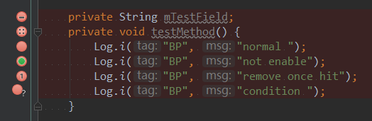  

上图中左侧是我们打的断点，因为断点所在代码类型不一样或断点设置不一样，所呈现的图标也不一样。  

在断点位置右键可对该断点进行设置，如下图  ：

* 变量（相关设置窗口）  
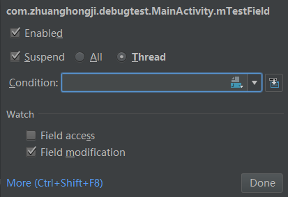  

* 方法（相关设置窗口）  
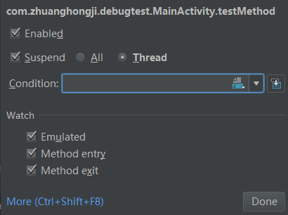

* 普通代码（相关设置窗口）  
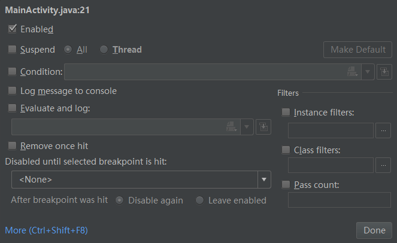

断点大致可分为以下几类：

* 普通断点
* 条件断点
* 日志断点
* 方法断点
* 异常断点

## 调试基础

如何进入调试模式？  

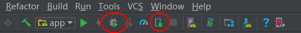    

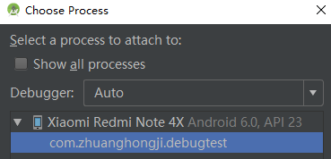  

一般来说，下好断点后我们有两种方式调试一个 Debuggable 的 Apk ：
* **Debug App**：重新编译并安装该应用（上图左红圈按钮）
* **Attach Debugger to Android process**：点击后需要选择对应的进程（上图右红圈按钮）

其中第二种方式较为常用（因为不用重新进行编译），只要运行过程中触发到断点就可以直接进入调试模式。  

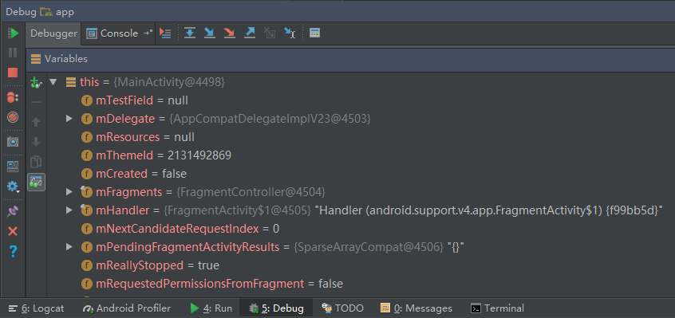  

介绍下上面各个调试相关按钮的功能：  

|图标|名称|功能描述|  
|--|--|--|  
|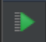|Resume Program|当你运行到某个断点的时候，点击之后会继续程序的运行<br>（后面如果有断点的话会暂停在该断点出）
||Pause Program| 暂停运行
||Stop App|停止程序
|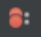|View Breakpoints|查看所有断点
||Mute Breakpoints|沉默所有断点<br>（选中后所有断点图标的主色调都会编程灰白色，并且不会触发任何断点）
||Get Thread Dump|显示线程相关信息
|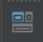|Restore Layout|TODO
||Settings|设置
|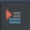|Show Excution Points|TODO
|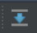|Step Over|单步执行，可以简单理解为“执行到下一行代码”
||Step Into|进入当前方法内部
||Force Step Into|TODO
||Step Out|跳出当前方法|
|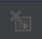|Drop Frame|TODO
|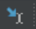|Run To Cursor|直接运行到“浮标”所在的那行代码
||Evaluate Expression|进行表达式求值

## 条件断点

假设你的断点设置在一个循环列表里面，但你只对这个列表的某一个元素感兴趣，希望循环到该元素时才触发断点。**设置条件断点也很简单，在断点上右键弹出并设置你的条件即可**。

先看一个打了条件断点的代码：  

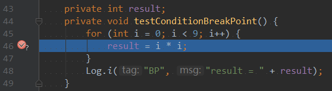    

为该断点设置的条件 (假设我们预期 “i等于7时” 才触发断点)：

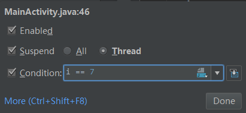  

触发断点后，查看Debugger面板：  

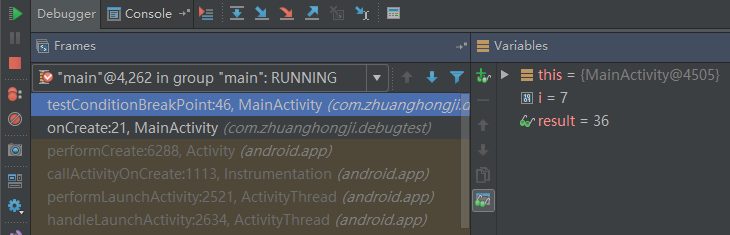  

* 面板左侧：显示了方法调用栈及对应信息：方法名，行号，类名和包名
* 面板右侧：显示了当前各个变量的值

## 日志断点

很多时候，调试是为了打印日志来定位异常代码来缩小范围，然后再使用断点找到问题所在。所以，经常要做的事情就是添加日志代码，比如输出函数参数、返回值或其他一些有用信息。  

* 如果是通过 **添加代码** 打印相关日志，就需要重新编译整个应用，少则几十秒多则几分钟。  
* 如果是通过 **日志断点** 打印相关日志，就可以完全避免编译这些毫无意义的等待。  

再来看一段代码：  

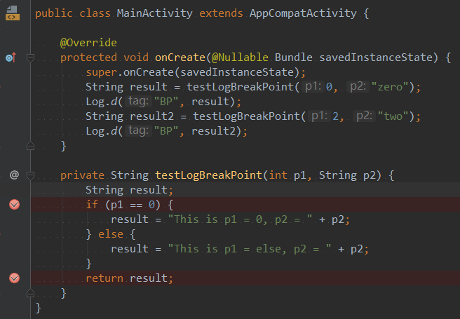  

在想要打印日志的地方下断点，然后右键该断点并进行相关设置：

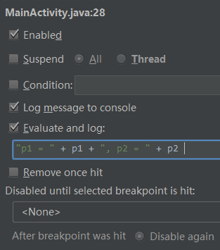

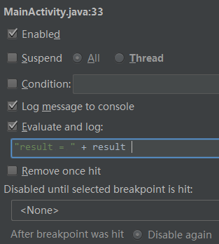  

* 将 `Suspend` 属性取消勾选 这样虽然还叫做“断点”，但程序并不会在该断点断下来)。
* 然后勾选 `Log message to console` 和 `Evaluate and log` (这样就会根据你指定的表达式将信息打印到控制台)。   

最后，通过 **Debug App** 或 **Attack process** 方式运行程序。在 **Console** 面板下，不仅可以看到你打印的 **断点日志**，还可以看到 **正常Log类打印出来的日志**。如下图：  

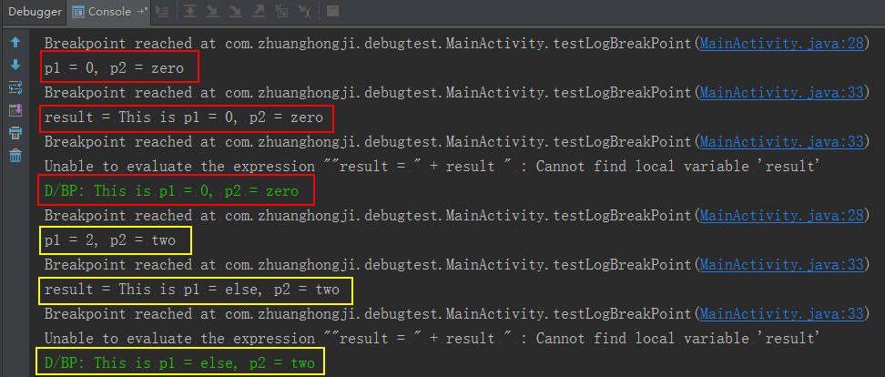  


## 方法断点

传统的调试方法是以“行”为单位的，即“单步调试”。  但很多时候我们只关心某个函数的参数或返回值。**使用方法断点，我们可以再函数级别进行调试**。

  

设置方法断点有两种方式：

* 在方法行打上断点 (注意看，左边的图标跟普通断点的图标是不一样的噢)。
* 通过断点设置窗口 (View BreakPoints -> Add -> Java Method Breakpoints)。


## 异常断点

在有些情况下，我们只对某些特定的异常感兴趣，而且希望程序在发生该异常时就能断下来，就像保存现场一样。Android Studio已经赋予了我们这个能力，即 **异常断点**。    

具体设置方法：**打开 "View Breakpoints" ，点击加号并添加你感兴趣的异常**  

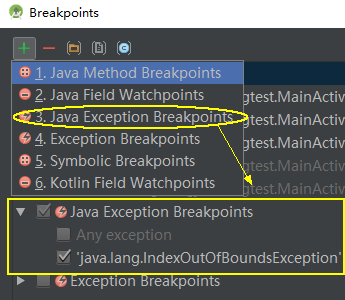  

上图中我们设置了关心的异常 `IndexOutOfBoundsException`，下面我们写一段测试代码：

```java
public class MainActivity extends AppCompatActivity {

    @Override
    protected void onCreate(@Nullable Bundle savedInstanceState) {
        super.onCreate(savedInstanceState);
        String[] strs = new String[]{"0", "1"};
        Log.w("BP", strs[2]);  // Index out of bounds
    }
}

```
上面这段测试代码，如果是直接编译运行的话会导致App闪退。而如果是通过调试模式运行的话则会触发 **Java Exception Breakpoints**，代码编辑器会直接显示触发断点的代码，并在 Debug 面板上显示相关信息，如下图：  

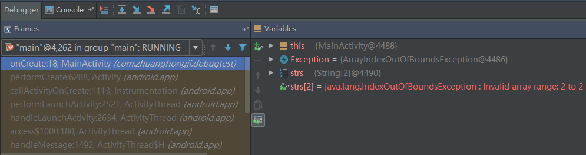

注：如果此时你触发的是一个 `NullPointerException`，则不会触发异常断点 (因为还没有添加到 “感兴趣” 列表中)。


**Q: 有同学会想，如果我捕捉了异常还会触发异常断点吗？**  
A：即使进行了 try...catch... 捕捉异常，断点依然会在 catch 之前触发

**Q: 还有同学会想，如果我对所有的异常或未知的异常感兴趣呢？**  
A：目前我也没找到好解决办法，试了“勾选 Any Exception”、“添加 Exception”、“添加 UndeclaredThrowableException” 这几种方法，都未能快速定位到异常代码，知道的同学可以PR下。

## Field WatchPoint

前面我们添加“异常断点”并且点击“加号”后，显示的第二个项 **Java Field Watchpoints** 是干什么的呢？  

有木有这样一种场景：某个变量的值莫名奇妙地不知道被谁修改了？  

Java虽然是值传递，但引用也可以是值。所有的对象都存放在堆上面，而堆是被所有线程共享的。因此，在复杂情况下，你根本不知道这些共享变量是被谁修改了，也不知道具体的函数调用路径。哥，这很危险。

> 在多线程环境下，不变性是一个很重要的特性，高并发性语言（如 Erlang、Scala 等）都对这种不变性有着一定程度的支持。

废话了这么多，现在进入正题。  

**Field WatchPoint** 就是我们解决上面难题的关键所在，使用它使得我们可以在某个 `Field` 被访问或者被修改的时候触发断点，设置方法有两种：

1. 直接在某个变量的声明处下断点。
2. 在 `View BreakPoints` 中进行设置。

对于第一种，断点的图标和普通断点的图标是不一样的，右键断点可以进行相关设置：

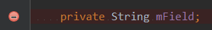  

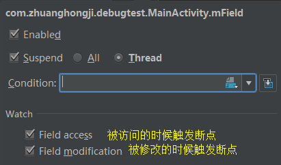

而第二种，是在 `View BreakPoints` 中直接指定某个类的某个变量：

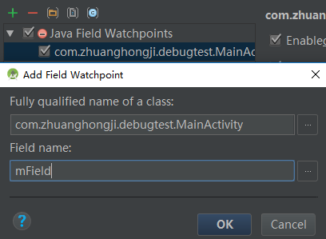  

示例代码：

```Java
public class MainActivity extends AppCompatActivity {

    private String mField;

    @Override
    protected void onCreate(@Nullable Bundle savedInstanceState) {
        super.onCreate(savedInstanceState);
        mField = "ABC";         // 1. 修改值
        changeFieldMethod1();
    }

    private void changeFieldMethod1() {
        changeFieldMethod2();
    }

    private void changeFieldMethod2() {
        mField = "Android";     // 2. 修改值
        Log.i("BP", "mField = " + mField);   // 3. 访问值
    }
}
```

我们对 `mField` 设置了 **Field WatchPoint** 并同时勾选了 **Field access** 和 **Field modification**，因此在1、2和3的位置都会触发断点。当在位置2触发断点的时候，Debug面板的显示内容如下图：

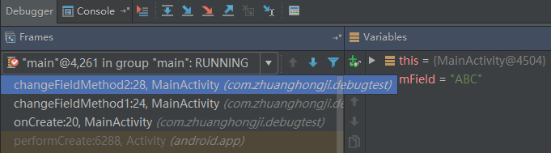  

在上图中我们可以看到函数的具体调用路径，以及未执行触发断点代码前所观察变量的值。

## Evaluate Expression

**Evaluate Expression** 可以直接理解为“计算表达式的值”，是一个非常实用的功能，可以在断点处直接进入一个求值环境（前面提到过该功能的按钮图标及含义），执行任何你感兴趣的表达式或代码片段：  

### 表达式求值  

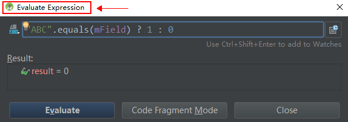  

### 代码片段求值  

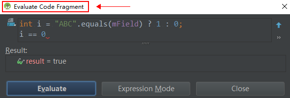  

## 小结

上面介绍了“各种断点”、“变量观察”、“表达式求值”等功能及其相关演示，实际上调试相关知识远不止这么多。  

比如，打开 **View BreakPoint** 设置窗口，如下图：

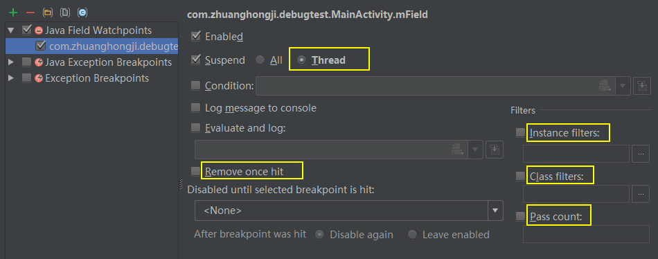  

我们可以对感兴趣的 **特定对象**、**特定类** 进行下断点，也可以设置 **断点次数** 或设置触发断点的 **特定线程** 等。  


## 参考文章：  

* [Android Studio 你不知道的调试技巧](http://mp.weixin.qq.com/s/ujlhpujNwJfQx4qcDEGaPA)
