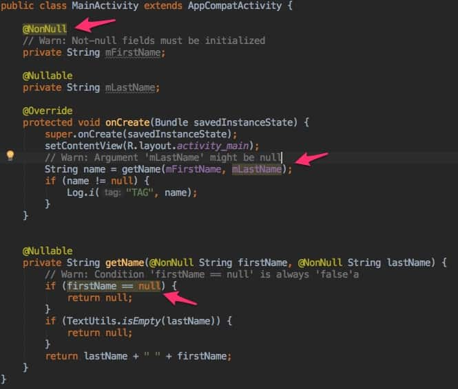
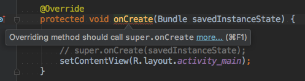

# 通过注解改进代码检查

Android 通过 [注解支持库](https://developer.android.com/topic/libraries/support-library/features.html?hl=zh-cn#annotations) 支持各种注解，使得可以向 [Lint](https://developer.android.com/studio/write/lint.html?hl=zh-cn "使用 Lint 改进你的代码") 之类的代码检查工具提供提示，帮助检测一些工具无法推断出来的细微代码问题。

例如，在 Android 中资源 ID 使用 `int` 标识字符串、图形、颜色和其它资源类型，检测工具是无法告诉你何时应该指定字符串资源或颜色资源的。

## 添加支持注解库依赖项

将以下代码行添加到 `build.gradle` 文件的 `dependencies` 块中，向你的项目添加 `support-annotations` 依赖项：

```groovy
dependencies {
    // ...

    implementation 'com.android.support:support-annotations:27.1.1'
}
```

然后，在显示的工具栏或同步通知中，点击 **Sync Now**。

> 如果你在自己的库模块中使用注解，注解将作为 Android 归档 (AAR) 工件的一部分以 XML 格式添加到 annotations.zip 文件中。添加 support-annotations 依赖项不会为你的库的任何下游用户引入依赖关系。

## 注解表

### Nullness 注解

|注解符号|注解说明
|--|--
|@Nullable|可以为 `null`
|@NonNull|不可以为 `null`

### 资源注解

|注解符号|注解说明
|--|--
|@StringRes|`R.string`
|@DrawableRes|`R.drawable`
|@DimenRes|`R.dimen`
|@ColorRes|`R.color`
|@InterpolatorRes|`R.interpolator`
|@AnyRes|任意类型的 `R` 资源

### 线程注解

|注解符号|注解说明
|--|--
|@MainThread|运行在主线程
|@UiThread|运行在 UI 线程
|@WorkerThread|运行在后台线程
|@BinderThread|运行在Binder线程中
|@AnyThread|可以运行在任意线程中

### 值约束注解

|注解符号|注解说明
|--|--
|@IntRange|验证整型或长整型参数值是否位于指定范围内
|@FloatRange|检查浮点或双整型参数值是否位于指定的浮点值范围内
|@Size|检查集合或数组的大小，以及字符串的长度

### 权限注解

|注解符号|注解说明
|--|--
|@RequiresPermission|验证方法调用方的权限

### 返回值注解

|注解符号|注解说明
|--|--
|@CheckResult|验证实际使用的是方法的结果还是返回值

### CallSuper 注解

|注解符号|注解说明
|--|--
|@CallSuper|验证替换方法是否会调用方法的超类实现

### Typedef 注解

|注解符号|注解说明
|--|--
|@IntDef|以便能够创建整型和字符串集的枚举注解来验证其他类型的代码引用
|@StringDef|见上

### 代码可访问性注解

|注解符号|注解说明
|--|--
|@VisibleForTesting|指示一个代码块的可见性是否高于让代码变得可测试所需要的水平
|@Keep|可以确保如果在构建时缩减代码，标注的元素不会移除


## 详细分析

### Nullness 注解

`@Nullable` 和 `@NonNull` 注解，用来检查给定变量、参数或返回值是否为 `null`。

例如：

* 如果一个包含 `null` 值的局部变量作为已附加 `@NonNull` 注解的参数传递到某个方法，则构建代码将生成一个指示非 `null` 冲突的警告。
* 对于通过 `@Nullable` 标记的方法的结果，如果不先检查其是否为 `null`，那么在尝试引用它时将生成 nullness 警告。

> 只有在每次使用方法时都应明确检查是否为 `null` 的情况下，才应对方法返回值使用 `@Nullable`



Android Studio 支持通过运行 `nullability` 分析，在你的代码中自动推断和插入 nullness 注解。我们把上面的 `getName()` 方法改成如下形式：

```Java
private String getName(String firstName, String lastName) {
    if (firstName == null) {
        return null;
    }
    if (TextUtils.isEmpty(lastName)) {
        return null;
    }
    return lastName + " " + firstName;
}
```

然后执行 **Analyze** > **Infer Nullity**，会发现 IDE 自动帮我们加了两个注解，代码如下：

```Java
@Nullable
private String getName(@Nullable String firstName, String lastName) {
    if (firstName == null) {
        return null;
    }
    if (TextUtils.isEmpty(lastName)) {
        return null;
    }
    return lastName + " " + firstName;
}
```

### 资源注解

例如，添加 `@StringRes` 注解，以检查资源参数是否包含 `R.string` 引用，如下面所示：

```Java
public abstract void setTitle(@StringRes int resId) { … }
```

在代码检查期间，如果参数中未传入 R.string 引用，注解将生成警告。

尽管你可以使用 `@ColorRes` 指定某个参数应为颜色资源，但是颜色整型（`RRGGBB` 或 `AARRGGBB` 格式）无法识别为颜色资源。请改用 `@ColorInt` 注解指示某个参数必须为颜色整型。

```Java
@Override
protected void onCreate(Bundle savedInstanceState) {
    super.onCreate(savedInstanceState);
    setContentView(R.layout.activity_main);
    // 正确用法
    testColorRes(android.R.color.black);
    testColorInt(0xFF000000);

    // 错误用法
    // Error: Expected resource of type color
    testColorRes(0xFF000000);
    // Error: Should pass resolved color instead of
    // resource id here: getResources().getColor(android.R.color.black)
    testColorInt(android.R.color.black);
}

public void testColorRes(@ColorRes int colorRes) {
    // ....
}

public void testColorInt(@ColorInt int colorRes) {
    // ....
}
```


### 线程注解

线程注解的一个常见用途：  

* 验证 `AsyncTask` 类中的方法替换，因为此类会执行后台操作并将结果仅发布到 UI 线程上。

**如果某个类中的所有方法具有相同的线程要求，你可以向该类添加一个线程注解，以验证该类中的所有方法是否均从相同类型的线程调用。**

> 注：
* 构建工具会将 `@MainThread` 和 `@UiThread` 注解视为可互换，因此，你可以从 `@MainThread` 方法调用 `@UiThread` 方法，反之亦然。
* 不过，如果系统应用在不同线程上带有多个视图，UI 线程可与主线程不同。因此，你应：
  * 使用 `@UiThread` 标注与应用的视图层次结构关联的方法
  * 使用 `@MainThread` 仅标注与应用生命周期关联的方法。


### 值约束注解

`@IntRange`: 下面的示例可以确保 alpha 参数包含 0 至 255 范围内的整数值：

```Java
public void setAlpha(@IntRange(from=0,to=255) int alpha) { … }
```

`@FloatRange`: 下面的示例可以确保 alpha 参数包含 0.0 至 1.0 的浮点值：

```Java
public void setAlpha(@FloatRange(from=0.0, to=1.0) float alpha) {...}
```

`@Size` 注解可用于验证以下质量：

* 最小大小（例如 `@Size(min=2)`）
* 最大大小（例如 `@Size(max=2)`）
* 确切大小（例如 `@Size(2)`）
* 表示大小必须为此倍数的数字（例如 `@Size(multiple=2)`）

例如，`@Size(min=1)` 可以检查某个集合是否不为空，`@Size(3)` 可以验证某个数组是否刚好包含三个值。

### 权限注解

使用 `@RequiresPermission` 注解可以验证方法调用方的权限:

* 要检查有效权限列表中是否存在某个权限，请使用 `anyOf` 属性
* 要检查是否存在一组权限，请使用 `allOf` 属性

例如，下面的示例会标注 `setWallpaper()` 方法，以确保方法的调用方拥有 `permission.SET_WALLPAPERS` 权限：

```Java
@RequiresPermission(Manifest.permission.SET_WALLPAPER)
public abstract void setWallpaper(Bitmap bitmap) throws IOException;
```

下面的示例要求 `copyFile()` 方法的调用方同时具有外部存储空间的读写权限：

```Java
@RequiresPermission(allOf = {
    Manifest.permission.READ_EXTERNAL_STORAGE,
    Manifest.permission.WRITE_EXTERNAL_STORAGE})
public static final void copyFile(String dest, String source) {
    ...
}
```

对于 `intent` 权限，请将权限要求添加到定义 `intent` 操作名称的字符串字段上：

```Java
@RequiresPermission(android.Manifest.permission.BLUETOOTH)
public static final String ACTION_REQUEST_DISCOVERABLE =
            "android.bluetooth.adapter.action.REQUEST_DISCOVERABLE";
```

对于你需要单独读写权限的内容提供程序的权限，请在 `@RequiresPermission.Read` 或 `@RequiresPermission.Write` 注解中包含每个权限要求：

```Java
@RequiresPermission.Read(@RequiresPermission(READ_HISTORY_BOOKMARKS))
@RequiresPermission.Write(@RequiresPermission(WRITE_HISTORY_BOOKMARKS))
public static final Uri BOOKMARKS_URI = Uri.parse("content://browser/bookmarks");
```

### 间接权限

如果权限依赖于提供给方法参数的特定值，请对参数本身使用 `@RequiresPermission`，而不用列出具体权限。

例如，`startActivity(Intent)` 方法会对传递到方法的 `intent` 使用间接权限：

```Java
public abstract class Context {
  // ...
  public abstract void startActivity(@RequiresPermission Intent intent);
}
```

在你使用间接权限时，构建工具将执行数据流分析以检查传递到方法的参数是否具有任何 `@RequiresPermission` 注解。随后，它们会对方法本身强制参数的任何现有注解。

在 `startActivity(Intent)` 示例中，当一个不具有相应权限的 `intent` 传递到方法时，`Intent` 类中的注解会针对 `startActivity(Intent` 的无效使用生成警告，如下图所示：  


构建工具会在 `startActivity(Intent)` 上从 `Intent` 类中相应 `intent` 操作名称的注解生成警告：

```Java
@SdkConstant(SdkConstantType.ACTIVITY_INTENT_ACTION)
@RequiresPermission(Manifest.permission.CALL_PHONE)
public static final String ACTION_CALL = "android.intent.action.CALL";
```

如果需要，在标注方法的参数时，你可以将 `@RequiresPermission` 替换为 `@RequiresPermission.Read` 和/或 `@RequiresPermission.Write`。不过，间接权限 `@RequiresPermission` 不应与读取或写入权限注解搭配使用。


### 返回值注解

使用 `@CheckResult` 注解可以验证实际使用的是方法的结果还是返回值。添加注释来阐明可能令人困惑的方法的结果，而不是使用 `@CheckResult` 标注每个非空方法。例如，新 Java 开发者经常误认为 `<String>.trim()` 会移除原始字符串中的空格。使用 `@CheckResult` 标注方法会在调用方未对方法返回值作任何处理的地方标记 `<String>.trim()` 的使用。

下面的示例会标注 `checkPermissions()` 方法，以确保实际引用方法的返回值。它还会将 `enforcePermission()` 方法指定为要向开发者建议的替换方法：

```Java
@CheckResult(suggest="#enforcePermission(String,int,int,String)")
public abstract int checkPermission(@NonNull String permission, int pid, int uid);
```

### CallSuper 注解

使用 `@CallSuper` 注解可以验证替换方法是否会调用方法的超类实现。下面的示例会标注 `onCreate()` 方法，以确保任何替换方法实现都会调用 `super.onCreate()`：

```Java
@CallSuper
protected void onCreate(Bundle savedInstanceState) {
    // ...
}
```



### Typedef 注解

使用 `@IntDef` 和 `@StringDef` 注解，以便能够创建整型和字符串集的枚举注解来验证其他类型的代码引用。Typedef 注解可以确保特定参数、返回值或字段引用特定的常量集。它们还可以完成代码以自动提供允许的常量。

Typedef 注解使用 `@interface` 声明新的枚举注解类型。`@IntDef` 和 `@StringDef` 注解以及 `@Retention` 可以标注新注解，并且为定义枚举的类型所必需。`@Retention(RetentionPolicy.SOURCE)` 注解可以告知编译器不将枚举的注解数据存储在 `.class` 文件中。

下面的示例说明了创建注解的具体步骤，此注解可以确保作为方法参数传递的值引用一个定义的常量：

```Java
import android.support.annotation.IntDef;
// ...
public abstract class ActionBar {
    // ...
    // Define the list of accepted constants and declare the NavigationMode annotation
    @Retention(RetentionPolicy.SOURCE)
    @IntDef({NAVIGATION_MODE_STANDARD, NAVIGATION_MODE_LIST, NAVIGATION_MODE_TABS})
    public @interface NavigationMode {}

    // Declare the constants
    public static final int NAVIGATION_MODE_STANDARD = 0;
    public static final int NAVIGATION_MODE_LIST = 1;
    public static final int NAVIGATION_MODE_TABS = 2;

    // Decorate the target methods with the annotation
    @NavigationMode
    public abstract int getNavigationMode();

    // Attach the annotation
    public abstract void setNavigationMode(@NavigationMode int mode);
```

在你构建此代码时，如果 mode 参数不引用一个定义的常量（`NAVIGATION_MODE_STANDARD`、`NAVIGATION_MODE_LIST` 或 `NAVIGATION_MODE_TABS`），则会生成警告。

你还可以组合 `@IntDef` 和 `@IntRange`，以指示整型可以是给定的常量集或某个范围内的值。

### 允许将常量与标志相结合

如果用户可以将允许的常量与标志（例如，`|`、`&` 和 `^`，等等）相结合，则你可以通过 flag 属性定义一个注解，以检查某个参数或返回值是否会引用有效模式。下面的示例将使用一组有效的 DISPLAY_ 常量创建 `DisplayOptions` 注解：

```Java
import android.support.annotation.IntDef;
// ...
@IntDef(flag=true, value={
        DISPLAY_USE_LOGO,
        DISPLAY_SHOW_HOME,
        DISPLAY_HOME_AS_UP,
        DISPLAY_SHOW_TITLE,
        DISPLAY_SHOW_CUSTOM
})

@Retention(RetentionPolicy.SOURCE)
public @interface DisplayOptions {}
// ...
```

在你使用注解标志构建代码时，如果经过修饰的参数或返回值不引用有效模式，则将生成警告。

### 代码可访问性注解

使用 `@VisibleForTesting` 和 `@Keep` 注解可以表示方法、类或字段的可访问性。
* `@VisibleForTesting` 注解: 指示一个代码块的可见性是否高于让代码变得可测试所需要的水平。
* `@Keep` 注解: 可以确保如果在构建时缩减代码，标注的元素不会移除。

> `@Keep` 注解一般会添加到通过反射访问的方法和类中，以阻止编译器将代码视为未使用。

## 参考文档

* [使用注解改进代码检查](https://developer.android.com/studio/write/annotations.html?hl=zh-cn#adding-annotations)
