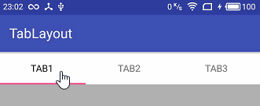
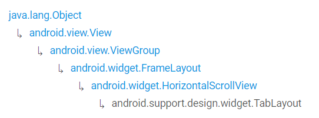
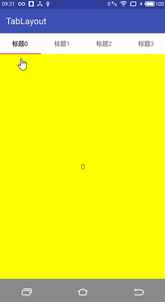
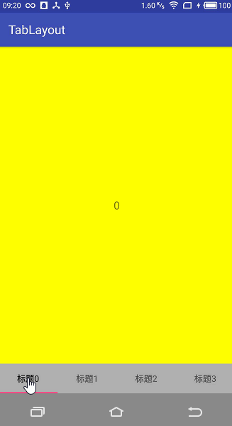

# TabLayout 基本使用

  

  

TabLayout 提供了一个水平的布局来显示 Tab 标签，比如：

```java
TabLayout tabLayout = ...;
tabLayout.addTab(tabLayout.newTab().setText("TAB1"));
tabLayout.addTab(tabLayout.newTab().setText("TAB2"));
tabLayout.addTab(tabLayout.newTab().setText("TAB3"));
```

你也通过 `TabItem` 往 `TabLayout` 里面添加 Tab：

```xml
<android.support.design.widget.TabLayout
        android:layout_height="wrap_content"
        android:layout_width="match_parent">
    <android.support.design.widget.TabItem
            android:text="TAB1"/>
    <android.support.design.widget.TabItem
            android:icon="TAB2"/>
    <android.support.design.widget.TabItem
            android:icon="TAB3"/>
</android.support.design.widget.TabLayout>
```

## 结合ViewPager一起使用

通过 `setupWithViewPager(ViewPager)` 方法你可以将这两者联动起来，同时 `TabLayout` 会自动填充来自 `PagerAdapter` 的 PageTitle，比如：

| 顶部位置 | 底部位置
| -- | --
|  | 

```xml
<!-- 底部位置的布局代码 -->
<?xml version="1.0" encoding="utf-8"?>
<LinearLayout
    xmlns:android="http://schemas.android.com/apk/res/android"
    android:layout_width="match_parent"
    android:layout_height="match_parent"
    android:orientation="vertical"
    android:background="@color/colorBackground">
    <android.support.design.widget.TabLayout
        android:id="@+id/tabLayout"
        android:layout_height="wrap_content"
        android:layout_width="match_parent"
        android:background="@color/white"/>
    <android.support.v4.view.ViewPager
        android:id="@+id/viewPager"
        android:layout_width="match_parent"
        android:layout_height="match_parent"/>
</LinearLayout>
```

```java
public class MainActivity extends AppCompatActivity {
    private TabLayout mTabLayout;
    private ViewPager mViewPager;

    @Override
    protected void onCreate(Bundle savedInstanceState) {
        super.onCreate(savedInstanceState);
        setContentView(R.layout.activity_main);
        mTabLayout = (TabLayout) findViewById(R.id.tabLayout);
        mViewPager = (ViewPager) findViewById(R.id.viewPager);
        mViewPager.setAdapter(new CustomPagerAdapter(this));
        mTabLayout.setupWithViewPager(mViewPager);
    }

    public class CustomPagerAdapter extends PagerAdapter{
        private List<View> mViews;
        CustomPagerAdapter(Context context) {
            mViews = new ArrayList<>();
            for (int i = 0; i < 4; i++) {
                TextView tv = new TextView(context);
                tv.setText(String.valueOf(i));
                tv.setBackgroundColor(Color.YELLOW);
                tv.setTextSize(18);
                tv.setGravity(Gravity.CENTER);
                mViews.add(tv);
            }
        }

        @Override
        public int getCount() {
            return mViews.size();
        }

        @Override
        public boolean isViewFromObject(View view, Object object) {
            return view == object;
        }

        @Override
        public Object instantiateItem(ViewGroup container, int position) {
            View v = mViews.get(position);
            container.addView(v);
            return v;
        }

        @Override
        public void destroyItem(ViewGroup container, int position, Object object) {
            container.removeView(mViews.get(position));
        }

        @Override
        public CharSequence getPageTitle(int position) {
            return "标题" + position;
        }
    }
}
```

同时，你也可以将TabLayout直接作为ViewPager的一部分，直接在Layout资源文件中定义（此时可以注释掉 `mTabLayout.setupWithViewPager(mViewPager);` 这一行代码）：

```xml
<?xml version="1.0" encoding="utf-8"?>
<LinearLayout
    xmlns:android="http://schemas.android.com/apk/res/android"
    android:layout_width="match_parent"
    android:layout_height="match_parent"
    android:orientation="vertical"
    android:background="@color/colorBackground">
    <android.support.v4.view.ViewPager
        android:layout_width="match_parent"
        android:layout_height="match_parent"
        android:id="@+id/viewPager">
    <!--layout_gravity属性可控制TabLayout的位置-->
    <android.support.design.widget.TabLayout
        android:id="@+id/tabLayout"
        android:layout_width="match_parent"
        android:layout_height="wrap_content"
        android:background="@android:color/transparent"
        android:layout_gravity="bottom"/>
    </android.support.v4.view.ViewPager>
</LinearLayout>
```

## 事件监听

```java
TabLayout.OnTabSelectedListener listener = new TabLayout.OnTabSelectedListener() {
      @Override
      public void onTabSelected(TabLayout.Tab tab) {
          Log.i(TAG, "the text of tab selected = " + tab.getText());
      }

      @Override
      public void onTabUnselected(TabLayout.Tab tab) {
          Log.i(TAG, "the text of tab unselected = " + tab.getText());
      }

      @Override
      public void onTabReselected(TabLayout.Tab tab) {
          Log.i(TAG, "the text of tab reselected = " + tab.getText());
      }
  };
  // mTabLayout.setOnTabSelectedListener(listener);     // 已不推荐使用
  mTabLayout.addOnTabSelectedListener(listener);        // 添加监听事件
  // mTabLayout.removeOnTabSelectedListener(listener);  // 删除监听事件
  // mTabLayout.clearOnTabSelectedListeners(listener);  // 清空监听事件
```

依次点击“标题1”“标题2”“标题3”“标题3”可得到下面的日志：

> 其中第一行日志 `...selected = 标题0` 是默认selected的

```
the text of tab selected = 标题0
the text of tab unselected = 标题0
the text of tab selected = 标题1
the text of tab unselected = 标题1
the text of tab selected = 标题2
the text of tab unselected = 标题2
the text of tab selected = 标题3
the text of tab reselected = 标题3
```


## XML属性

|属性|描述
|----|----
|tabBackground|
|tabContentStart|
|tabGravity|
|tabIndicatorColor|
|tabIndicatorHeight|
|tabMaxWidth|设置每个tab的最大宽度
|tabMinWidth|设置每个tab的最小宽度
|tabMode|
|tabPadding|
|tabPaddingBottom|
|tabPaddingEnd|
|tabPaddingStart|
|tabPaddingTop|
|tabSelectedTextColor|
|tabTextAppearance|
|tabTextColor|
