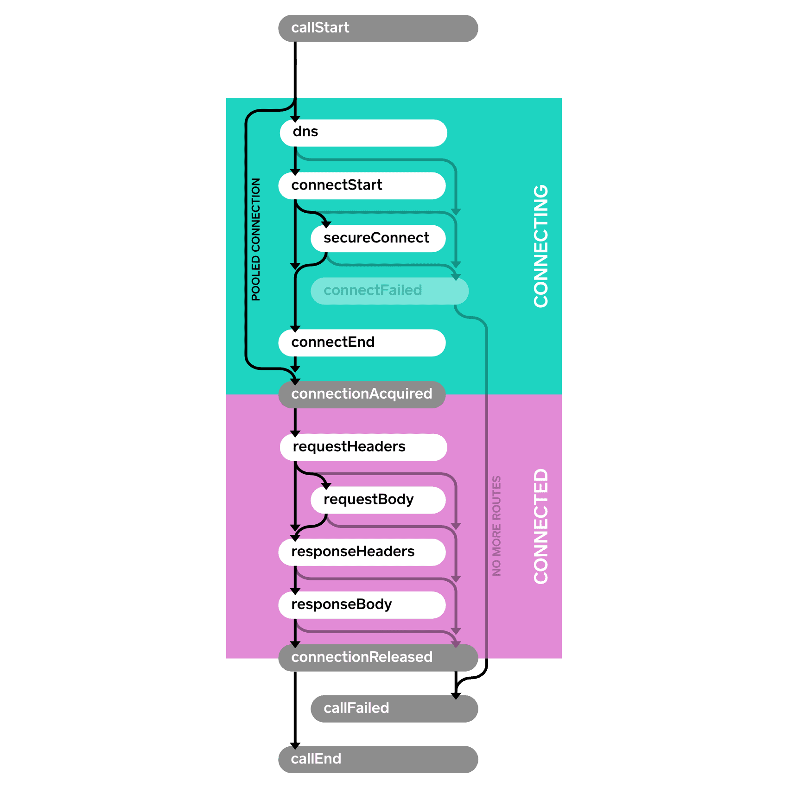
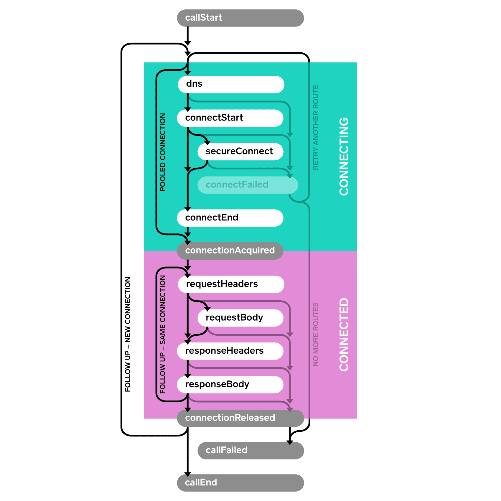

# OkHttp 基本使用

## 概述

[OkHttp](https://github.com/square/okhttp) 是美国一家移动支付公司 Square 开源的网络库，在官方 [website](https://square.github.io/okhttp/) 中是这样描述的：

<blockquote>
HTTP 是现代应用程序通过网络进行数据交换和媒体的一种方式，高效地执行 HTTP 可以加快你的负载并节省带宽。而 OkHttp 是一个默认就很搞笑的 HTTP 客户端：

* HTTP/2 支持允许对同一主机的所有请求共享套接字 (socket)。
* 连接池减少了请求延迟 (如果 HTTP/2 不可用)。
* 透明 GZIP 缩小了下载大小。
* 响应缓存可以完全避免重复的网络请求。

当网络很糟糕时，OkHttp 坚持不懈：

* 能够从常见的连接问题中无声地恢复。
* 如果你的服务有多个 IP 地址，如果第一次连接失败，OkHttp 将尝试备用地址。这对于 IPv4 + IPv6 和在冗余数据中心中托管的服务来说是必需的。
* OkHttp 支持现代 TLS 功能 (TLS 1.3，ALPN，证书固定)。

使用 OkHttp 很容易：

* 它的请求/响应 API 采用流畅的构建器和不变性设计。
* 它支持同步阻塞调用和带回调的异步调用。
</blockquote>

OkHttp 有一个依赖库 [Okio](https://github.com/square/okio/)，Okio 是一个小型但性能很好的 I/O 库。OkHttp 可以和 Okio 1.x (Java 实现) 或 Okio 2.x (升级到 Kotlin) 一起工作。

当前 OkHttp 的最新版本是 `3.14.1`，该版本只能工作在 Android 5.0+ (API 21+) 和 Java 8+。如果你想支持 Android 2.3+ (API 9+) 和 Java 7+ 的话，可以使用 `3.12.x` 的版本。官方在 GitHub README 上有说明，因为升级版本是一件挺困难的事，所以 `3.12.x` 的分支会进行关键补丁直到 2020 年 12 月 31 日。

## 添加依赖

GRADLE

```groovy
implementation 'com.squareup.okhttp3:okhttp:(insert latest version)'
```

MAVEN

```xml
<dependency>
  <groupId>com.squareup.okhttp3</groupId>
  <artifactId>okhttp</artifactId>
  <version>(insert latest version)</version>
</dependency>
```


## 官方示例

### GET 请求

> 下面的代码是通过一个 URL 获取其内容并打印出来。

关键代码：

```java
OkHttpClient client = new OkHttpClient();
String run(String url) throws IOException {
  Request request = new Request.Builder()
      .url(url)
      .build();

  Response response = client.newCall(request).execute();
  return response.body().string();
}
```

完整代码：

```java
public class GetExample {
  OkHttpClient client = new OkHttpClient();

  String run(String url) throws IOException {
        Request request = new Request.Builder()
                .url(url)
                .build();
        Response response = client.newCall(request).execute();
        return response.body().string();
  }

  public static void main(String[] args) throws IOException {
    GetExample example = new GetExample();
    String response = example.run("https://raw.github.com/square/okhttp/master/README.md");
    System.out.println(response);
  }
}
```

打印日志 (只截取了开头部分)：

```java
OkHttp
======

An HTTP & HTTP/2 client for Android and Java applications. For more information see [the website][1] and [the wiki][2].

Download
--------

Download [the latest JAR][3] or grab via Maven:

...
```

### POST 请求

> 下面的代码演示了如何 post 数据到服务端：

关键代码：

```java
public static final MediaType JSON
    = MediaType.parse("application/json; charset=utf-8");

OkHttpClient client = new OkHttpClient();

String post(String url, String json) throws IOException {
  RequestBody body = RequestBody.create(JSON, json);
  Request request = new Request.Builder()
      .url(url)
      .post(body)
      .build();
  Response response = client.newCall(request).execute();
  return response.body().string();
}
```

完整代码：

```java
public class PostExample {
  public static final MediaType JSON = MediaType.get("application/json; charset=utf-8");

  OkHttpClient client = new OkHttpClient();

  String post(String url, String json) throws IOException {
        RequestBody body = RequestBody.create(JSON, json);
        Request request = new Request.Builder()
                .url(url)
                .post(body)
                .build();
        Response response = client.newCall(request).execute();
        return response.body().string();
  }

  String bowlingJson(String player1, String player2) {
    return "{'winCondition':'HIGH_SCORE',"
        + "'name':'Bowling',"
        + "'round':4,"
        + "'lastSaved':1367702411696,"
        + "'dateStarted':1367702378785,"
        + "'players':["
        + "{'name':'" + player1 + "','history':[10,8,6,7,8],'color':-13388315,'total':39},"
        + "{'name':'" + player2 + "','history':[6,10,5,10,10],'color':-48060,'total':41}"
        + "]}";
  }

  public static void main(String[] args) throws IOException {
    PostExample example = new PostExample();
    String json = example.bowlingJson("Jesse", "Jake");
    String response = example.post("http://www.roundsapp.com/post", json);
    System.out.println(response);
  }
}
```

打印日志：

```java
http://www.roundsapp.com/160361002
```

## 其它示例

下面的演示示例使用了 [wanandroid.com](http://www.wanandroid.com) 的开放 API :

```
首页 Banner
http://www.wanandroid.com/banner/json

方法：GET
参数：无
```

可直接点击在网页端查看返回结果：[http://www.wanandroid.com/banner/json](http://www.wanandroid.com/banner/json)

下面的 Android 代码一起演示了同步请求和异步请求：

```java
public class MainActivity extends AppCompatActivity {

    public static final String TAG = "MainActivity";

    private OkHttpClient mOkHttpClient;
    private Request mRequest;

    @Override
    protected void onCreate(Bundle savedInstanceState) {
        super.onCreate(savedInstanceState);
        setContentView(R.layout.activity_main);

        String testUrl = "http://www.wanandroid.com/banner/json";

        mOkHttpClient = new OkHttpClient();
        mRequest = new Request.Builder().url(testUrl).build();

        testExecute();
        testEnqueue();
    }

    /** 同步请求 */
    private void testExecute() {
        new Thread(new Runnable() {
            @Override
            public void run() {
                try {
                    Response response = mOkHttpClient.newCall(mRequest).execute();
                    ResponseBody responseBody = response.body();
                    if (responseBody != null) {
                        Log.i(TAG, "testExecute body = " + responseBody.string());
                    }
                } catch (IOException e) {
                    e.printStackTrace();
                }
            }
        }).start();
    }

    /** 异步请求 */
    private void testEnqueue() {
        mOkHttpClient.newCall(mRequest).enqueue(new Callback() {
            @Override
            public void onFailure(@NonNull Call call, @NonNull IOException e) {
                Log.w(TAG, "testEnqueue onFailure");
            }

            @Override
            public void onResponse(@NonNull Call call, @NonNull Response response) throws IOException {
                final ResponseBody responseBody =  response.body();
                if (responseBody != null) {
                    Log.i(TAG, "testEnqueue body = " + responseBody.string());
                }
            }
        });
    }
}
```

不管是同步还是异步，上述示例中最终的响应结果是相同，如下：

```
{"data":[{"desc":"","id":15,"imagePath":"http://www.wanandroid.com/blogimgs/ec492618-d03e-4380-81df-5a990228a37e.jpg","isVisible":1,"order":0,"title":"当当网图书满200立减120，满400-250，本站福利","type":0,"url":"http://www.wanandroid.com/blog/show/2234"},{"desc":"","id":6,"imagePath":"http://www.wanandroid.com/blogimgs/62c1bd68-b5f3-4a3c-a649-7ca8c7dfabe6.png","isVisible":1,"order":1,"title":"我们新增了一个常用导航Tab~","type":0,"url":"http://www.wanandroid.com/navi"},{"desc":"一起来做个App吧","id":10,"imagePath":"http://www.wanandroid.com/blogimgs/50c115c2-cf6c-4802-aa7b-a4334de444cd.png","isVisible":1,"order":1,"title":"一起来做个App吧","type":0,"url":"http://www.wanandroid.com/blog/show/2"},{"desc":"","id":7,"imagePath":"http://www.wanandroid.com/blogimgs/ffb61454-e0d2-46e7-bc9b-4f359061ae20.png","isVisible":1,"order":2,"title":"送你一个暖心的Mock API工具","type":0,"url":"http://www.wanandroid.com/blog/show/10"},{"desc":"","id":4,"imagePath":"http://www.wanandroid.com/blogimgs/ab17e8f9-6b79-450b-8079-0f2287eb6f0f.png","isVisible":1,"order":0,"title":"看看别人的面经，搞定面试~","type":1,"url":"http://www.wanandroid.com/article/list/0?cid=73"},{"desc":"","id":3,"imagePath":"http://www.wanandroid.com/blogimgs/fb0ea461-e00a-482b-814f-4faca5761427.png","isVisible":1,"order":1,"title":"兄弟，要不要挑个项目学习下?","type":1,"url":"http://www.wanandroid.com/project"},{"desc":"加个友情链接吧~","id":11,"imagePath":"http://www.wanandroid.com/blogimgs/84810df6-adf1-45bc-b3e2-294fa4e95005.png","isVisible":1,"order":1,"title":"加个友情链接吧~","type":1,"url":"http://www.wanandroid.com/ulink"},{"desc":"","id":2,"imagePath":"http://www.wanandroid.com/blogimgs/90cf8c40-9489-4f9d-8936-02c9ebae31f0.png","isVisible":1,"order":2,"title":"JSON工具","type":1,"url":"http://www.wanandroid.com/tools/bejson"},{"desc":"","id":5,"imagePath":"http://www.wanandroid.com/blogimgs/acc23063-1884-4925-bdf8-0b0364a7243e.png","isVisible":1,"order":3,"title":"微信文章合集","type":1,"url":"http://www.wanandroid.com/blog/show/6"}],"errorCode":0,"errorMsg":""}
```

有两点需要注意的是：

* 发起同步请求时不能在主线程发起，否则会报错 `android.os.NetworkOnMainThreadException`。
* 异步请求返回响应结果时，代码并不是运行在主线程的，所以不能直接进行 UI 相关的操作。

## Wiki 文档

下面是官方 [GitHub Wiki](https://github.com/square/okhttp/wiki) 内容的简单翻译，以便你对 OkHttp 有进一步的了解。

### Calls

HTTP 客户端的工作是接受你的请求并生成其响应。这看起来很简单，但在实践中却很棘手。

**Request**

每个 HTTP 请求都包含：
* 一个 URL
* 一个方法 (如 `GET` 或 `POST`)
* 一系列的响应头 (`headers`)

请求还可以包含一个主体 (`body`)：一个特定内容类型的数据流。


**Responses**

请求对应的响应带有响应码 (例如 `200` 表示成功，或 `404` 表示未找到)、响应头及其自己的可选主体。


**重写请求**

当你向 OkHttp 提供一个 HTTP 请求时，你相当于站在一个更高的层次去描述这个请求：“请使用这些请求头来获取此 URL 的数据”。

为了正确性和效率，OkHttp 会在发起这个请求之前重写你的请求。

OkHttp 可能会在原始请求中添加确实的请求头，包括：

* `Content-Length`
* `Transfer-Encoding`
* `User-Agent`
* `Host`
* `Connection`
* `Content-Type`。

比如说：

* OkHttp 会添加一个 `Accept-Encoding` 请求头来为响应做压缩，除非该响应头已存在。
* 如果你已经有 `cookies` 的话，OkHttp 会添加一个 `Cookie` 请求头。

某些请求会有缓存的响应结果。当这个缓存的响应没有刷新时，OkHttp 会发起一个条件化的 **GET** 请求来下载响应结果，如果它比缓存还新的话就会更新缓存。当然，这需要你在请求头中添加 `If-Modified-Since` 和 `If-None-Match`。


**重写响应**

如果你使用了透明压缩，OkHttp 将删除相应的响应头 `Content-Encoding` 和 `Content-Length`，因为它们不适用于解压缩响应主体。

如果条件化的 **GET** 请求成功，来自网络和缓存的响应结果则会根据规范进行合并。


**后续请求**

当你请求的 URL 被移除后，Web 服务器将返回一个响应码 `302` 来指明对应文档内容的新 URL。OkHttp 将自动进行重定向来检索最终的响应。

如果响应发出授权验证，OkHttp 将询问 [`Authenticator`](http://square.github.io/okhttp/3.x/okhttp/okhttp3/Authenticator.html) (如果已配置）来满足这个授权验证。如果验证者提供了凭证，则会使用包含的凭据重试该请求。


**重试请求**

有时连接可能会直白失败：池连接失效并断开连接，或者无法访问 Web 服务器本身。OkHttp 将使用不同的路由重试该请求，如果其中一个可用的话。


**Calls**

通过重写、重定向、后续请求和重试，你简单的请求可能会产生许多请求和响应。OkHttp 使用了 `Call` 来模拟满足你的请求任务，尽管这需要许多的中间请求和响应。通常情况下，这不会很多！令人欣慰的一点是，如果你的 URL 被重定向或者故障转移到备用 IP 地址，你的代码会继续执行。

`Call` 的执行有两种方式：

* **同步**：你的线程会阻塞，直到响应可读。
* **异步**：将请求排入任何线程，并在响应可读时在另一个线程获得 [回调](http://square.github.io/okhttp/3.x/okhttp/okhttp3/Callback.html)。

你可以在任意线程取消 `Call`。如果该 `Call` 尚未完成，会导致失败！正在写入请求主体或读取响应主体的代码将在 `Call` 取消时将遭受到 `IOException`。


**调度**

对于同步调用来说，你可以自带线程并负责管理你同时发出的请求数。同时连接太多请求的话会浪费资源，太少的话则会导致延迟。

对于异步调用来说，`Dispatcher` 实现了最大同时请求的策略。你可以设置每个网络服务器的最大值 (默认为 5)，和总体最大值 (默认为 64)。


### Connections

即使你只提供了 URL，但 OkHttp 会使用三种类型与你的 Web 服务器进行连接：
* URL
* 地址
* 路由

**URLs**

URLs (如 `https://github.com/square/okhttp`) 是 HTTP 和 Internet 的基础。除了作为 Web 上所有内容通用的标识和分散的命名之外，它们还指定了如何访问对应的 Web 资源。

URLs 是抽象的：

* 它们指定 `call` 可以是明文的 (`http`) 或加密的 (`https`)，但没有指定使用哪种加密算法。它们也没有指定如何验证对等方的证书 (the [HostnameVerifier](http://developer.android.com/reference/javax/net/ssl/HostnameVerifier.html)) 或可以信任哪些证书 (the [SSLSocketFactory](http://developer.android.com/reference/org/apache/http/conn/ssl/SSLSocketFactory.html))。
* 它们不指定是否应使用特定代理服务器或如何使用该代理服务器进行身份验证。

URLs 也是具体的：每个 URL 标识一个特定路径 (如 `/square/okhttp`) 和查询参数 (如 `?q=sharks&lang=en`)。每个 Web 服务器都托管许多 URLs。


**Addresses**

Addresses 指定一个 Web 服务器 (如 `github.com`) 以及连接到该服务器所需的所有 **静态** 配置：
* 端口号
* HTTPS 设置
* 首选网络协议 (如 HTTP/2 或 SPDY) 。

共享相同地址的 URLs 也可以共享相同的底层 TCP 套接字连接。共享连接具有显著的性能优势：

* 更低的延迟
* 更高的吞吐量 (得益于 [TCP slow start](http://www.igvita.com/2011/10/20/faster-web-vs-tcp-slow-start/))
* 节省电量

OkHttp 使用的 [ConnectionPool](http://square.github.io/okhttp/3.x/okhttp/okhttp3/ConnectionPool.html) 能够自动重用 HTTP/1.x 连接，并多路复用 HTTP/2 和 SPDY 连接。

在 OkHttp 中，address 的某些字段来自 URL (scheme、主机名、端口)，其余字段来自 [OkHttpClient](http://square.github.io/okhttp/3.x/okhttp/okhttp3/OkHttpClient.html)。


**Routes**

路由能够提供实际连接到 Web 服务器所需的 **动态** 信息。这是要尝试的特定 IP 地址 (由 DNS 查询发现)，要使用的确切代理服务器 (如果正在使用 [ProxySelector](http://developer.android.com/reference/java/net/ProxySelector.html)) ，以及要协商的 TLS 版本 (对于 HTTPS 连接) 。

单个地址可能有很多路由。例如，托管在多个数据中心中的 Web 服务器可能会在其 DNS 响应中生成多个 IP 地址。


**Connections**

当你使用 OkHttp 请求 URL 时，它做了以下事情：

1. 它使用 URL 并配置 OkHttpClient 来创建一个 **address**。这个 address 指定了我们将如何连接到 Web 服务器。
2. 它尝试从连接池中检索具有该 address 的连接。
3. 如果它在池中找不到连接，则会选择要尝试的 **路由**。这通常意味着发出 DNS 请求以获取服务器的 IP 地址。然后，如有必要的话它会选择 TLS 版本和代理服务器。
4. 如果它是新路由，则通过构建一个直连的套接字连接和一个 TLS 通道 (通过 HTTP 代理的 HTTPS)，或一个直连的 TLS 连接。它根据需要进行 TLS 握手。
5. 它发送 HTTP 请求并读取响应。

如果连接出现问题，OkHttp 将选择另一条理由再次尝试连接。这允许 OkHttp 在服务器地址的子集无法访问时进行恢复。当连接池里的连接过时或者尝试的 TLS 版本不支持时，这同样显得很有用。

收到响应后，连接将返回到池中，以便可以将其重新用于将来的请求。一段时间不活动后，连接将从池中逐出。


### Recipes

我们已经写了一些 recipes，演示了如何使用 OkHttp 解决常见问题。仔细阅读它们，了解这一切是如何协同工作的。你可以自由剪切和粘贴这些示例，这本就是他们的目的所在。

**同步 Get**

下面的代码片段，演示了：

* 下载一个文件
* 打印其响应头
* 将其响应主体作为字符串打印出来

> 响应主体 `ResponseBody` 的 `string()` 方法对于小文档来说是非常方便和高效的。但如果响应主体很大的话 (大于 1MB)，应避免使用 `string()` 因为它会将整个文档加载到内存中。在这种情况下，应该将响应主体作为流来处理。

```java
private final OkHttpClient client = new OkHttpClient();

public void run() throws Exception {
  Request request = new Request.Builder()
      .url("https://publicobject.com/helloworld.txt")
      .build();

  try (Response response = client.newCall(request).execute()) {
    if (!response.isSuccessful()) throw new IOException("Unexpected code " + response);

    Headers responseHeaders = response.headers();
    for (int i = 0; i < responseHeaders.size(); i++) {
      System.out.println(responseHeaders.name(i) + ": " + responseHeaders.value(i));
    }

    System.out.println(response.body().string());
  }
}
```

**异步 Get**

下面的代码片段，演示了：

* 在工作线程上下载文件，并在响应可读时进行回调
* 回调是在响应头准备好之后进行的
* 阅读响应正文可能仍会阻止

> OkHttp 目前没有提供异步 APIs 来接收部分响应主体。

```java
private final OkHttpClient client = new OkHttpClient();

public void run() throws Exception {
  Request request = new Request.Builder()
      .url("http://publicobject.com/helloworld.txt")
      .build();

  client.newCall(request).enqueue(new Callback() {
    @Override public void onFailure(Call call, IOException e) {
      e.printStackTrace();
    }

    @Override public void onResponse(Call call, Response response) throws IOException {
      try (ResponseBody responseBody = response.body()) {
        if (!response.isSuccessful()) throw new IOException("Unexpected code " + response);

        Headers responseHeaders = response.headers();
        for (int i = 0, size = responseHeaders.size(); i < size; i++) {
          System.out.println(responseHeaders.name(i) + ": " + responseHeaders.value(i));
        }

        System.out.println(responseBody.string());
      }
    }
  });
}
```

**访问 Headers**

通常情况下，HTTP Headers 的工作方式如 `Map<String, String>`：

* 每个字段都有一个值或没有
* 但是一些标题允许多个值，例如 Guava 的 [Multimap](http://docs.guava-libraries.googlecode.com/git/javadoc/com/google/common/collect/Multimap.html)。

例如，HTTP 响应提供多个 `Vary` headers 是合法且常见的。OkHttp 的 API 试图使两种情况都显得自然。

当写入请求头时，可使用 `header(name, value)` 设置唯一的 `name` 的值为 `value`。如果存在现有值，则在添加新值之前将它们删除。使用 `addHeader(name, value)` 添加一个请求头的值，无需删除当前对应存在的值。

当读取响应头时，可使用 `header(name)` 返回指定 `name` 的最后一次出现的值。通常这也是唯一的！如果没有值，`header(name)` 会返回 `null`。要将所有字段的值作为列表读取，请使用 `headers(name)`。

要访问所有标头，请使用Headers支持按索引访问的类。

```java
private final OkHttpClient client = new OkHttpClient();

public void run() throws Exception {
  Request request = new Request.Builder()
      .url("https://api.github.com/repos/square/okhttp/issues")
      .header("User-Agent", "OkHttp Headers.java")
      .addHeader("Accept", "application/json; q=0.5")
      .addHeader("Accept", "application/vnd.github.v3+json")
      .build();

  try (Response response = client.newCall(request).execute()) {
    if (!response.isSuccessful()) throw new IOException("Unexpected code " + response);

    System.out.println("Server: " + response.header("Server"));
    System.out.println("Date: " + response.header("Date"));
    System.out.println("Vary: " + response.headers("Vary"));
  }
}
```


**POST 一个字符串**

使用 HTTP POST 将请求主体发送到服务端。下面的示例将一个 markdown 文档发布到一个会将 markdown 呈现为 HTML 的 Web 服务端。由于整个请求主体会同时存在内存中，因此需避免使用此 API 发布大型 (大于1 MB) 的文档。

```java
public static final MediaType MEDIA_TYPE_MARKDOWN
    = MediaType.parse("text/x-markdown; charset=utf-8");

private final OkHttpClient client = new OkHttpClient();

public void run() throws Exception {
  String postBody = ""
      + "Releases\n"
      + "--------\n"
      + "\n"
      + " * _1.0_ May 6, 2013\n"
      + " * _1.1_ June 15, 2013\n"
      + " * _1.2_ August 11, 2013\n";

  Request request = new Request.Builder()
      .url("https://api.github.com/markdown/raw")
      .post(RequestBody.create(MEDIA_TYPE_MARKDOWN, postBody))
      .build();

  try (Response response = client.newCall(request).execute()) {
    if (!response.isSuccessful()) throw new IOException("Unexpected code " + response);

    System.out.println(response.body().string());
  }
}
```


**POST 流**

这里我们将请求主体作为流去 POST。这个请求主体的内容在写入时生成。下面的示例中，内容直接流入 [Okio](https://github.com/square/okio) 缓冲接收器。你的程序可能更青睐于一个 `OutputStream`，你可以从中获得 `BufferedSink.outputStream()`。

```java
public static final MediaType MEDIA_TYPE_MARKDOWN
      = MediaType.parse("text/x-markdown; charset=utf-8");

  private final OkHttpClient client = new OkHttpClient();

  public void run() throws Exception {
    RequestBody requestBody = new RequestBody() {
      @Override public MediaType contentType() {
        return MEDIA_TYPE_MARKDOWN;
      }

      @Override public void writeTo(BufferedSink sink) throws IOException {
        sink.writeUtf8("Numbers\n");
        sink.writeUtf8("-------\n");
        for (int i = 2; i <= 997; i++) {
          sink.writeUtf8(String.format(" * %s = %s\n", i, factor(i)));
        }
      }

      private String factor(int n) {
        for (int i = 2; i < n; i++) {
          int x = n / i;
          if (x * i == n) return factor(x) + " × " + i;
        }
        return Integer.toString(n);
      }
    };

    Request request = new Request.Builder()
        .url("https://api.github.com/markdown/raw")
        .post(requestBody)
        .build();

    try (Response response = client.newCall(request).execute()) {
      if (!response.isSuccessful()) throw new IOException("Unexpected code " + response);

      System.out.println(response.body().string());
    }
  }
```


**POST 一个文件**

将文件用作请求主体是很容易的，示例如下：

```java
public static final MediaType MEDIA_TYPE_MARKDOWN
    = MediaType.parse("text/x-markdown; charset=utf-8");

private final OkHttpClient client = new OkHttpClient();

public void run() throws Exception {
  File file = new File("README.md");

  Request request = new Request.Builder()
      .url("https://api.github.com/markdown/raw")
      .post(RequestBody.create(MEDIA_TYPE_MARKDOWN, file))
      .build();

  try (Response response = client.newCall(request).execute()) {
    if (!response.isSuccessful()) throw new IOException("Unexpected code " + response);

    System.out.println(response.body().string());
  }
}
```


**POST 表单参数**

使用 `FormBody.Builder` 建立一个请求，请求主体就像是一个 HTML `<form>` 标签。名称和值将使用与 HTML 兼容的表单 URL 编码进行编码。

```java
private final OkHttpClient client = new OkHttpClient();

public void run() throws Exception {
  RequestBody formBody = new FormBody.Builder()
      .add("search", "Jurassic Park")
      .build();
  Request request = new Request.Builder()
      .url("https://en.wikipedia.org/w/index.php")
      .post(formBody)
      .build();

  try (Response response = client.newCall(request).execute()) {
    if (!response.isSuccessful()) throw new IOException("Unexpected code " + response);

    System.out.println(response.body().string());
  }
}
```


**POST 一个 multipart 请求**

`MultipartBody.Builder` 可以构建与 HTML 文件上载表单兼容的复杂请求主体。multipart 请求主体的每个部分本身都是一个请求主体，并且可以定义自己的请求头。如果存在，这些请求头应该描述部分的主体，例如它的 `Content-Disposition`。对于 `Content-Length` 和 `Content-Type` 请求头信息，如果它们可用的话会被自动添加。

```java
/**
 * The imgur client ID for OkHttp recipes. If you're using imgur for anything other than running
 * these examples, please request your own client ID! https://api.imgur.com/oauth2
 */
private static final String IMGUR_CLIENT_ID = "...";
private static final MediaType MEDIA_TYPE_PNG = MediaType.parse("image/png");

private final OkHttpClient client = new OkHttpClient();

public void run() throws Exception {
  // Use the imgur image upload API as documented at https://api.imgur.com/endpoints/image
  RequestBody requestBody = new MultipartBody.Builder()
      .setType(MultipartBody.FORM)
      .addFormDataPart("title", "Square Logo")
      .addFormDataPart("image", "logo-square.png",
          RequestBody.create(MEDIA_TYPE_PNG, new File("website/static/logo-square.png")))
      .build();

  Request request = new Request.Builder()
      .header("Authorization", "Client-ID " + IMGUR_CLIENT_ID)
      .url("https://api.imgur.com/3/image")
      .post(requestBody)
      .build();

  try (Response response = client.newCall(request).execute()) {
    if (!response.isSuccessful()) throw new IOException("Unexpected code " + response);

    System.out.println(response.body().string());
  }
}
```


**使用 Moshi 解析 JSON 响应**

[Moshi](https://github.com/square/moshi) 是一个方便的 API 来在 JSON 和 Java 对象之间进行转换。在这里，我们使用它来解码来自 GitHub API 的 JSON 响应。

请注意，`ResponseBody.charStream()` 使用 `Content-Type` 响应头来选择解码响应主体时要使用的字符集。如果未指定 charset 则默认为 `UTF-8`。

```java
private final OkHttpClient client = new OkHttpClient();
private final Moshi moshi = new Moshi.Builder().build();
private final JsonAdapter<Gist> gistJsonAdapter = moshi.adapter(Gist.class);

public void run() throws Exception {
  Request request = new Request.Builder()
      .url("https://api.github.com/gists/c2a7c39532239ff261be")
      .build();
  try (Response response = client.newCall(request).execute()) {
    if (!response.isSuccessful()) throw new IOException("Unexpected code " + response);

    Gist gist = gistJsonAdapter.fromJson(response.body().source());

    for (Map.Entry<String, GistFile> entry : gist.files.entrySet()) {
      System.out.println(entry.getKey());
      System.out.println(entry.getValue().content);
    }
  }
}

static class Gist {
  Map<String, GistFile> files;
}

static class GistFile {
  String content;
}
```


**响应缓存**

要缓存响应，你需要一个可以读取和写入的缓存目录，以及缓存大小的限制。缓存目录应该是私有的，不受信任的应用程序不应该能够读取其内容！

让多个缓存同时访问同一缓存目录是错误的。大多数应用程序应该只调用 `new OkHttpClient()` 一次，进行缓存相关的配置，并在任何地方使用相同的实例。否则，两个缓存实例将相互踩踏，破坏响应缓存，并可能导致程序崩溃。

响应缓存使用 HTTP 标头进行所有配置。你可以添加类似 `Cache-Control: max-stale=3600` 的请求头，OkHttp 的缓存将遵循这些请求头。你的网络服务器会配置会通过使用自己的响应头配置响应的缓存时间，例如 `Cache-Control: max-age=9600`。有些缓存的响应头会响应强制缓存，强制网络响应，或强制使用条件 `GET` 验证网络响应。

```java
private final OkHttpClient client;

public CacheResponse(File cacheDirectory) throws Exception {
  int cacheSize = 10 * 1024 * 1024; // 10 MiB
  Cache cache = new Cache(cacheDirectory, cacheSize);

  client = new OkHttpClient.Builder()
      .cache(cache)
      .build();
}

public void run() throws Exception {
  Request request = new Request.Builder()
      .url("http://publicobject.com/helloworld.txt")
      .build();

  String response1Body;
  try (Response response1 = client.newCall(request).execute()) {
    if (!response1.isSuccessful()) throw new IOException("Unexpected code " + response1);

    response1Body = response1.body().string();
    System.out.println("Response 1 response:          " + response1);
    System.out.println("Response 1 cache response:    " + response1.cacheResponse());
    System.out.println("Response 1 network response:  " + response1.networkResponse());
  }

  String response2Body;
  try (Response response2 = client.newCall(request).execute()) {
    if (!response2.isSuccessful()) throw new IOException("Unexpected code " + response2);

    response2Body = response2.body().string();
    System.out.println("Response 2 response:          " + response2);
    System.out.println("Response 2 cache response:    " + response2.cacheResponse());
    System.out.println("Response 2 network response:  " + response2.networkResponse());
  }

  System.out.println("Response 2 equals Response 1? " + response1Body.equals(response2Body));
}
```

* 要防止响应使用缓存，请使用 [`CacheControl.FORCE_NETWORK`](http://square.github.io/okhttp/3.x/okhttp/okhttp3/CacheControl.html#FORCE_NETWORK)。
* 要防止使用网络，请使用 [`CacheControl.FORCE_CACHE`](http://square.github.io/okhttp/3.x/okhttp/okhttp3/CacheControl.html#FORCE_CACHE)。

> 警告：如果你使用 `FORCE_CACHE` 并且响应需要网络，OkHttp 将返回 `504 Unsatisfiable Request` 响应。


**取消一个 Call**

使用 `Call.cancel()` 立即停止正在进行的 call 请求。如果某个线程当前正在写一个请求或正在读取一个响应，它将收到一个 `IOException`。当不再需要 call 时，你可以使用它来 conserve 网络; 例如，当你的用户导航离开应用程序时，同步和异步调用都可以取消。

```java
private final ScheduledExecutorService executor = Executors.newScheduledThreadPool(1);
private final OkHttpClient client = new OkHttpClient();

public void run() throws Exception {
  Request request = new Request.Builder()
      .url("http://httpbin.org/delay/2") // This URL is served with a 2 second delay.
      .build();

  final long startNanos = System.nanoTime();
  final Call call = client.newCall(request);

  // Schedule a job to cancel the call in 1 second.
  executor.schedule(new Runnable() {
    @Override public void run() {
      System.out.printf("%.2f Canceling call.%n", (System.nanoTime() - startNanos) / 1e9f);
      call.cancel();
      System.out.printf("%.2f Canceled call.%n", (System.nanoTime() - startNanos) / 1e9f);
    }
  }, 1, TimeUnit.SECONDS);

  System.out.printf("%.2f Executing call.%n", (System.nanoTime() - startNanos) / 1e9f);
  try (Response response = call.execute()) {
    System.out.printf("%.2f Call was expected to fail, but completed: %s%n",
        (System.nanoTime() - startNanos) / 1e9f, response);
  } catch (IOException e) {
    System.out.printf("%.2f Call failed as expected: %s%n",
        (System.nanoTime() - startNanos) / 1e9f, e);
  }
}
```

**Timeouts**

当对等方无法访问时，可使用 timeouts 来使 call 失败。网络分区可能是由于客户端连接问题，服务器可用性问题或其他任何问题。OkHttp 支持连接、读取和写入超时。

```java
private final OkHttpClient client;

public ConfigureTimeouts() throws Exception {
  client = new OkHttpClient.Builder()
      .connectTimeout(10, TimeUnit.SECONDS)
      .writeTimeout(10, TimeUnit.SECONDS)
      .readTimeout(30, TimeUnit.SECONDS)
      .build();
}

public void run() throws Exception {
  Request request = new Request.Builder()
      .url("http://httpbin.org/delay/2") // This URL is served with a 2 second delay.
      .build();

  try (Response response = client.newCall(request).execute()) {
    System.out.println("Response completed: " + response);
  }
}
```


**Call 的单独配置**

所有的 HTTP 客户端配置都包含在 `OkHttpClient` 中，包括代理设置，超时和缓存。当你需要更改单个 Call 的配置时，请使用 `OkHttpClient.newBuilder()`，这将返回与原始客户端共享相同连接池、调度程序和配置的构建器。在下面的示例中，我们发出一个请求，其中 500 毫秒超时，另一个请求 3000 毫秒超时。

```java
private final OkHttpClient client = new OkHttpClient();

public void run() throws Exception {
  Request request = new Request.Builder()
      .url("http://httpbin.org/delay/1") // This URL is served with a 1 second delay.
      .build();

  // Copy to customize OkHttp for this request.
  OkHttpClient client1 = client.newBuilder()
      .readTimeout(500, TimeUnit.MILLISECONDS)
      .build();
  try (Response response = client1.newCall(request).execute()) {
    System.out.println("Response 1 succeeded: " + response);
  } catch (IOException e) {
    System.out.println("Response 1 failed: " + e);
  }

  // Copy to customize OkHttp for this request.
  OkHttpClient client2 = client.newBuilder()
      .readTimeout(3000, TimeUnit.MILLISECONDS)
      .build();
  try (Response response = client2.newCall(request).execute()) {
    System.out.println("Response 2 succeeded: " + response);
  } catch (IOException e) {
    System.out.println("Response 2 failed: " + e);
  }
}
```


**处理身份验证**

OkHttp 可以自动重试未经身份验证的请求。当响应是 `401 Not Authorized`，`Authenticator` 会被要求提供凭证。实现上，应该构建一个包含缺少凭据的新请求，如果没有可用的凭据，则返回 `null` 以跳过重试。

使用 `Response.challenges()` 来获取任何身份验证的 schemes 和 realms。在完成 `Basic` 验证时，使用 `Credentials.basic(username, password)` 编码请求头。

```java
private final OkHttpClient client;

public Authenticate() {
  client = new OkHttpClient.Builder()
      .authenticator(new Authenticator() {
        @Override public Request authenticate(Route route, Response response) throws IOException {
          if (response.request().header("Authorization") != null) {
            return null; // Give up, we've already attempted to authenticate.
          }

          System.out.println("Authenticating for response: " + response);
          System.out.println("Challenges: " + response.challenges());
          String credential = Credentials.basic("jesse", "password1");
          return response.request().newBuilder()
              .header("Authorization", credential)
              .build();
        }
      })
      .build();
}

public void run() throws Exception {
  Request request = new Request.Builder()
      .url("http://publicobject.com/secrets/hellosecret.txt")
      .build();

  try (Response response = client.newCall(request).execute()) {
    if (!response.isSuccessful()) throw new IOException("Unexpected code " + response);

    System.out.println(response.body().string());
  }
}
```

为避免在身份验证不起作用时进行多次重试，你可以返回 `null` 以放弃。例如，你可能希望在尝试这些确切凭据时跳过重试：

```java
if (credential.equals(response.request().header("Authorization"))) {
  return null; // If we already failed with these credentials, don't retry.
 }
```

当你达到应用程序定义的尝试限制时，你也可以跳过重试：

```java
if (responseCount(response) >= 3) {
  return null; // If we've failed 3 times, give up.
}
```

以上代码依赖于此 `responseCount()` 方法：

```java
private int responseCount(Response response) {
  int result = 1;
  while ((response = response.priorResponse()) != null) {
    result++;
  }
  return result;
}
```


### HTTPS

OkHttp 试图平衡两个相互竞争的问题：

* 连接到尽可能多的主机：这包括运行最新版本的 [boringssl](https://boringssl.googlesource.com/boringssl/) 的高级主机，和运行较旧版本 [OpenSSL](https://www.openssl.org/) 的较少过时的主机。
* 连接的安全性：这包括使用证书验证远程 Web 服务器以及使用强密码交换的数据的隐私。

在协商与 HTTPS 服务器的连接时，OkHttp 需要知道要提供哪些 TLS 版本和密码套件。希望最大化连接的客户端将包括过时的 [TLS versions](http://square.github.io/okhttp/3.x/okhttp/okhttp3/TlsVersion.html) 和 [cipher suites](http://square.github.io/okhttp/3.x/okhttp/okhttp3/CipherSuite.html)。想要最大化安全性的严格客户端将仅限于最新的 TLS 版本和最强的密码套件。

[ConnectionSpec](http://square.github.io/okhttp/3.x/okhttp/okhttp3/ConnectionSpec.html) 实现了特定的安全性与连接性决策。

OkHttp 包含三个内置连接规范：

* `MODERN_TLS`: 一种连接到现代 HTTPS 服务器的安全配置。
* `COMPATIBLE_TLS`: 一种安全配置，可连接到安全但非当前的 HTTPS 服务器。
* `CLEARTEXT`: 一种用于 `http://URL` 的不安全配置。

默认情况下，OkHttp 将尝试 `MODERN_TLS` 连接，`COMPATIBLE_TLS` 如果现代配置失败，则回退到连接。

每个规范中的 TLS 版本和密码套件都可以随每个版本而变化。例如，在 OkHttp 2.2 中，我们放弃了对 SSL 3.0 的支持以响应 [POODLE](http://googleonlinesecurity.blogspot.ca/2014/10/this-poodle-bites-exploiting-ssl-30.html) 攻击。在 OkHttp 2.3 中，我们放弃了对 [RC4](http://en.wikipedia.org/wiki/RC4#Security) 的支持。与你的桌面 Web 浏览器一样，保持与 OkHttp 的最新状态是保持安全的最佳方式。

你可以使用一组自定义 TLS 版本和密码套件构建自己的连接规范。例如，此配置仅限于三个备受推崇的密码套件。它的缺点是它需要 Android 5.0+ 和类似的网络服务器。

```java
ConnectionSpec spec = new ConnectionSpec.Builder(ConnectionSpec.MODERN_TLS)  
    .tlsVersions(TlsVersion.TLS_1_2)
    .cipherSuites(
          CipherSuite.TLS_ECDHE_ECDSA_WITH_AES_128_GCM_SHA256,
          CipherSuite.TLS_ECDHE_RSA_WITH_AES_128_GCM_SHA256,
          CipherSuite.TLS_DHE_RSA_WITH_AES_128_GCM_SHA256)
    .build();

OkHttpClient client = new OkHttpClient.Builder()
    .connectionSpecs(Collections.singletonList(spec))
    .build();
```


**固定证书**

默认情况下，OkHttp 信任主机平台的证书颁发机构。此策略可最大限度地提高连接性，但它受到诸如 [2011 DigiNotar attack](http://www.computerworld.com/article/2510951/cybercrime-hacking/hackers-spied-on-300-000-iranians-using-fake-google-certificate.html) 等证书颁发机构的攻击。它还假定你的 HTTPS 服务器的证书由证书颁发机构签名。

使用 [CertificatePinner](http://square.github.io/okhttp/3.x/okhttp/okhttp3/CertificatePinner.html) 限制受信任的证书和证书颁发机构。证书锁定可提高安全性，但会限制服务器团队更新其 TLS 证书的能力。**没有服务器的 TLS 管理员的祝福，请不要使用固定证书！**

```java
public CertificatePinning() {
  client = new OkHttpClient.Builder()
      .certificatePinner(new CertificatePinner.Builder()
          .add("publicobject.com", "sha256/afwiKY3RxoMmLkuRW1l7QsPZTJPwDS2pdDROQjXw8ig=")
          .build())
      .build();
}

public void run() throws Exception {
  Request request = new Request.Builder()
      .url("https://publicobject.com/robots.txt")
      .build();

  Response response = client.newCall(request).execute();
  if (!response.isSuccessful()) throw new IOException("Unexpected code " + response);

  for (Certificate certificate : response.handshake().peerCertificates()) {
    System.out.println(CertificatePinner.pin(certificate));
  }
}
```


**自定义可信证书**

完整的代码示例显示了如何使用你自己的集合替换主机平台的证书颁发机构。同上所述，**如果没有服务器的TLS管理员的祝福，请不要使用自定义证书！**

```java
private final OkHttpClient client;

public CustomTrust() {
  SSLContext sslContext = sslContextForTrustedCertificates(trustedCertificatesInputStream());
  client = new OkHttpClient.Builder()
      .sslSocketFactory(sslContext.getSocketFactory())
      .build();
}

public void run() throws Exception {
  Request request = new Request.Builder()
      .url("https://publicobject.com/helloworld.txt")
      .build();

  Response response = client.newCall(request).execute();
  System.out.println(response.body().string());
}

private InputStream trustedCertificatesInputStream() {
  ... // Full source omitted. See sample.
}

public SSLContext sslContextForTrustedCertificates(InputStream in) {
  ... // Full source omitted. See sample.
}
```


### Events

Events 允许你捕获应用程序的 HTTP 调用指标。使用事件监控：
* 应用程序发出的 HTTP 调用的大小和频率：如果你发起的 Call 太多，或者 Call 太大，你应该知道这个！
* 这些调用在底层网络上的性能：如果网络性能不足，则需要改进网络或减少使用网络。


**事件监听**

实现 [EventListener](https://square.github.io/okhttp/3.x/okhttp/okhttp3/EventListener.html) 的子类并覆写你感兴趣的事件的方法。在没有重定向或重试的成功 HTTP 调用中，下面的流程图描述了事件序列。

<image src="./res/events.png" width="600" />

下面是一个事件监听器示例，使用时间戳打印每个事件。

```java
class PrintingEventListener extends EventListener {
  private long callStartNanos;

  private void printEvent(String name) {
    long nowNanos = System.nanoTime();
    if (name.equals("callStart")) {
      callStartNanos = nowNanos;
    }
    long elapsedNanos = nowNanos - callStartNanos;
    System.out.printf("%.3f %s%n", elapsedNanos / 1000000000d, name);
  }

  @Override public void callStart(Call call) {
    printEvent("callStart");
  }

  @Override public void callEnd(Call call) {
    printEvent("callEnd");
  }

  @Override public void dnsStart(Call call, String domainName) {
    printEvent("dnsStart");
  }

  @Override public void dnsEnd(Call call, String domainName, List<InetAddress> inetAddressList) {
    printEvent("dnsEnd");
  }

  ...
}
```

然后我们发起几个 `Call`：

```java
Request request = new Request.Builder()
    .url("https://publicobject.com/helloworld.txt")
    .build();

System.out.println("REQUEST 1 (new connection)");
try (Response response = client.newCall(request).execute()) {
  // Consume and discard the response body.
  response.body().source().readByteString();
}

System.out.println("REQUEST 2 (pooled connection)");
try (Response response = client.newCall(request).execute()) {
  // Consume and discard the response body.
  response.body().source().readByteString();
}
```

监听器打印出相应的事件：

```
REQUEST 1 (new connection)
0.000 callStart
0.010 dnsStart
0.017 dnsEnd
0.025 connectStart
0.117 secureConnectStart
0.586 secureConnectEnd
0.586 connectEnd
0.587 connectionAcquired
0.588 requestHeadersStart
0.590 requestHeadersEnd
0.591 responseHeadersStart
0.675 responseHeadersEnd
0.676 responseBodyStart
0.679 responseBodyEnd
0.679 connectionReleased
0.680 callEnd
REQUEST 2 (pooled connection)
0.000 callStart
0.001 connectionAcquired
0.001 requestHeadersStart
0.001 requestHeadersEnd
0.002 responseHeadersStart
0.082 responseHeadersEnd
0.082 responseBodyStart
0.082 responseBodyEnd
0.083 connectionReleased
0.083 callEnd
```

注意第二次调用没有触发连接事件。它重用了第一个请求的连接，从而显着提高了性能。


**EventListener.Factory**

在前面的示例中，我们使用了一个字段 `callStartNanos` 来跟踪每个事件的已用时间。这很方便，但如果多个调用同时执行，它将无法工作。为了适应这种情况，请使用一个 `Factory` 来为每个 `Call` 创建一个新的 `EventListener`。这允许每个监听器保持特定于 Call 的状态。

这个 [factory 示例](https://github.com/square/okhttp/blob/master/samples/guide/src/main/java/okhttp3/recipes/PrintEvents.java) 为每个 Call 创建唯一 ID，并使用该 ID 区分 Call 的日志消息。


```java
class PrintingEventListener extends EventListener {
  public static final Factory FACTORY = new Factory() {
    final AtomicLong nextCallId = new AtomicLong(1L);

    @Override public EventListener create(Call call) {
      long callId = nextCallId.getAndIncrement();
      System.out.printf("%04d %s%n", callId, call.request().url());
      return new PrintingEventListener(callId, System.nanoTime());
    }
  };

  final long callId;
  final long callStartNanos;

  public PrintingEventListener(long callId, long callStartNanos) {
    this.callId = callId;
    this.callStartNanos = callStartNanos;
  }

  private void printEvent(String name) {
    long elapsedNanos = System.nanoTime() - callStartNanos;
    System.out.printf("%04d %.3f %s%n", callId, elapsedNanos / 1000000000d, name);
  }

  @Override public void callStart(Call call) {
    printEvent("callStart");
  }

  @Override public void callEnd(Call call) {
    printEvent("callEnd");
  }

  // ...
}
```

我们可以使用此监听器来对比一对并发的 HTTP 请求：

```java
Request washingtonPostRequest = new Request.Builder()
    .url("https://www.washingtonpost.com/")
    .build();
client.newCall(washingtonPostRequest).enqueue(new Callback() {
  ...
});

Request newYorkTimesRequest = new Request.Builder()
    .url("https://www.nytimes.com/")
    .build();
client.newCall(newYorkTimesRequest).enqueue(new Callback() {
  ...
});
```

在家庭 WiFi 上进行对比，显示 Times(`0002`) 比 Post(`0001`) 稍早完成：

```
0001 https://www.washingtonpost.com/
0001 0.000 callStart
0002 https://www.nytimes.com/
0002 0.000 callStart
0002 0.010 dnsStart
0001 0.013 dnsStart
0001 0.022 dnsEnd
0002 0.019 dnsEnd
0001 0.028 connectStart
0002 0.025 connectStart
0002 0.072 secureConnectStart
0001 0.075 secureConnectStart
0001 0.386 secureConnectEnd
0002 0.390 secureConnectEnd
0002 0.400 connectEnd
0001 0.403 connectEnd
0002 0.401 connectionAcquired
0001 0.404 connectionAcquired
0001 0.406 requestHeadersStart
0002 0.403 requestHeadersStart
0001 0.414 requestHeadersEnd
0002 0.411 requestHeadersEnd
0002 0.412 responseHeadersStart
0001 0.415 responseHeadersStart
0002 0.474 responseHeadersEnd
0002 0.475 responseBodyStart
0001 0.554 responseHeadersEnd
0001 0.555 responseBodyStart
0002 0.554 responseBodyEnd
0002 0.554 connectionReleased
0002 0.554 callEnd
0001 0.624 responseBodyEnd
0001 0.624 connectionReleased
0001 0.624 callEnd
```

`EventListener.Factory` 也可以将指标限制为一部分调用。下面示例随机捕获 10％ 的指标：

```java
class MetricsEventListener extends EventListener {
  private static final Factory FACTORY = new Factory() {
    @Override public EventListener create(Call call) {
      if (Math.random() < 0.10) {
        return new MetricsEventListener(call);
      } else {
        return EventListener.NONE;
      }
    }
  };

  ...
}
```


**失败事件**

当操作失败时，失败方法会被回调。This is `connectFailed()` for failures while building a connection to the server, and `callFailed()` when the HTTP call fails permanently. 发生故障时，`start` 事件可能没有相应的 `end` 事件。




**重试和跟进的事件**

OkHttp 具有弹性，可以自动从某些连接故障中恢复。在这种情况下，the `connectFailed()` event is not terminal and not followed by `callFailed()`。尝试重试时，事件监听器将接收多个相同类型的事件。

单个 HTTP 调用可能需要进行后续请求以处理身份验证质询，重定向和 HTTP 层超时。在这种情况下，可以尝试多个连接，请求和响应。后续行动是单个 Call 可能触发相同类型的多个事件的另一个原因。




**可用性**

事件在 OkHttp 3.11 中作为公共 API 提供。未来版本可能会引入新的事件类型; 你将需要覆盖相应的方法来处理它们。


## 总结

// TBD