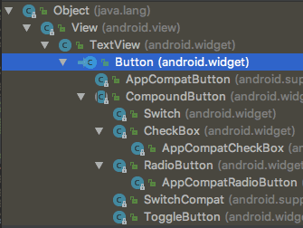
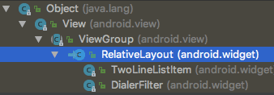
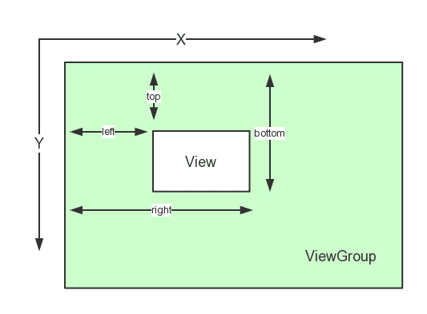
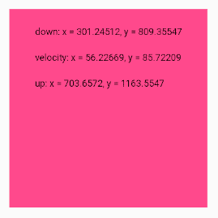
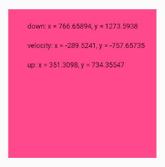
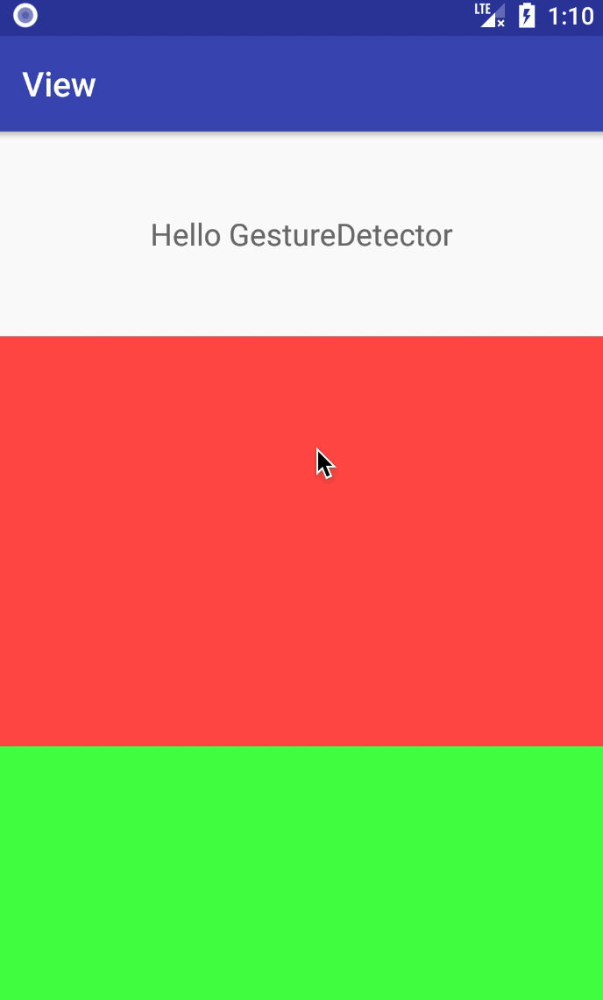

# 深入理解 View：基础知识

很多时候仅仅使用系统提供的控件是不能满足需求的，因此我们需要具有根据需求自定义控件的能力。自定义控件需要对 Android 的 View 体系具有深入的理解，只有这样才能写出性能更佳、扩展性更好的自定义控件。


## 什么是 View

`View` 是界面层控件的一种抽象，是 Android 中 `TextView` `Button` `RelativeLayout` `ListView` 等所有控件的共同基类。在 Android 的设计中，`ViewGroup` 也是继承自 `View` 的，用于表示「控件组」。也就是说，`View` 本身可以作为单个控件，也可以作为一组控件。

下面是 `View` 一些继承关系的源码或示意图：

```java
public class View implements Drawable.Callback, KeyEvent.Callback,
        AccessibilityEventSource {
    // ...
}

public abstract class ViewGroup extends View implements ViewParent,
        ViewManager {
    // ...
}
```

| Button | RelativeLayout
| -- | --
|  | 

理解这些继承关系有助于我们理解 View 的工作机制，有助于我们更加优雅地去自定义一个继承自 `View` `ViewGroup` 甚至「系统控件」的控件。

## View 的位置参数

View 的位置主要由它的「左上角」「右下角」两个顶点来决定的，分别对应以下四个属性：

* `top`: 左上角纵坐标
* `left`: 左上角横坐标
* `right`: 右下角横坐标
* `bottom`: 右下角纵坐标

上述四个坐标都是相对于 View 的父容器来说的，是相对坐标。

在 Android 中，x 轴和 y 轴的正方向分别为「右」和「下」，示意图如下：



由上图可分析出 View 宽高和坐标的关系如下：

```
width = right - left
height = bottom - top
```

在 `View` 类的源码中，可以看到这四个属性的定义：

```java
/**
 * The distance in pixels from the left edge of this view's parent
 * to the left edge of this view.
 */
protected int mLeft;

/**
 * The distance in pixels from the left edge of this view's parent
 * to the right edge of this view.
 */
protected int mRight;

/**
 * The distance in pixels from the top edge of this view's parent
 * to the top edge of this view.
 */
protected int mTop;

/**
 * The distance in pixels from the top edge of this view's parent
 * to the bottom edge of this view.
 */
protected int mBottom;
```

> 可以看到，源码中的注释是用「当前 View」与「当前 View 的父容器」的边距来描述这四个属性的，这样相对用坐标来描述显得更清晰一点。

同时，`View` 类也提供了对应的获取方法：

```java
public final int getLeft() {
    return mLeft;
}

public final int getRight() {
    return mRight;
}

public final int getTop() {
    return mTop;
}

public final int getBottom() {
    return mBottom;
}
```

这些方法使用了 `final` 修饰，是不能重写的。另外需要注意的是，获取到的值的单位都是「像素」。

从 Android 3.0 开始，`View` 额外增加了几个参数：

* `x` `y`: 左上角相对父容器的坐标。
* `translationX` `translationY`: 左上角坐标相对父容器的偏移量，默认值都是 `0`

那么，上述提到的几个参数的换算关系如下：

```
x = left + translationX
y = top + translationY
```

> `left` 和 `top` 表示的是左上角的原始位置信息，其值是不变的。

再后来，`View` 类又添加了几个参数：

```java
/**
 * A Property wrapper around the <code>x</code> functionality handled by the
 * {@link View#setX(float)} and {@link View#getX()} methods.
 */
public static final Property<View, Float> X = new FloatProperty<View>("x") {...};
public static final Property<View, Float> Y = new FloatProperty<View>("y") {...};
public static final Property<View, Float> Z = new FloatProperty<View>("z") {...};


/**
 * A Property wrapper around the <code>translationX</code> functionality handled by the
 * {@link View#setTranslationX(float)} and {@link View#getTranslationX()} methods.
 */
public static final Property<View, Float> TRANSLATION_X = new FloatProperty<View>("translationX") {...};
public static final Property<View, Float> TRANSLATION_Y = new FloatProperty<View>("translationY") {...};
public static final Property<View, Float> TRANSLATION_Z = new FloatProperty<View>("translationZ") {...};
```

这样的设计多了一个 `Z` 轴的概念，使得 `View` 就可以通过设置 `Z` 轴的参数来添加阴影，从而具有了三维的显示效果。


## MotionEvent

在手指触碰屏幕后所产生的一系列事件中，通常有以下几种：

```java
public final class MotionEvent extends InputEvent implements Parcelable {
    public static final int ACTION_DOWN    = 0;  // 手指刚触摸屏幕
    public static final int ACTION_UP      = 1;  // 手指刚离开屏幕
    public static final int ACTION_MOVE    = 2;  // 手指在屏幕上移动
    public static final int ACTION_CANCEL  = 3;
    public static final int ACTION_OUTSIDE = 4;
    // ...
}
```

正常情况下，只需考虑以下两种情况：

1. 点击屏幕后立即松开，事件序列为 `DOWN` -> `UP`。
2. 点击屏幕后移动一段距离再松开，事件序列为 `DOWN` -> `MOVE` ... `MOVE` -> `UP`。

通过 `MotionEvent` 对象我们可以得到点击事件发生时位置坐标：

* `getX()`/`getY()`: 获取相对于 **当前 View** 左上角的 x 和 y 坐标。
* `getRawX()`/`getRawY()`: 获取相对于 **手机屏幕** 左上角的 x 和 y 坐标。


## ViewConfiguration

`ViewConfiguration` 类中定义了一个 `int` 类型的 `mTouchSlop` 变量，**用来表示系统所能识别出的被认为是滑动的最小距离**，其具体值大小跟设备有关。也就是说，如果你的手指在屏幕上触摸滑动的距离小于这个值，系统就不会认为你是在进行滑动操作。

```java
/**
 * Contains methods to standard constants used in the UI for timeouts, sizes, and distances.
 */
public class ViewConfiguration {

    private final int mTouchSlop;

    /**
     * @return Distance in pixels a touch can wander before we think the user is scrolling
     */
    public int getScaledTouchSlop() {
        return mTouchSlop;
    }

    // ...
}
```

在实际开发过程中，我们可以通过 `ViewConfiguration.get(context).getScaledTouchSlop()` 获取到这个值。这个值有什么用呢？当我们在自定义 View 中处理滑动时，可以利用这个常量来做一些过滤，以得到更好的用户体验。

另外，`ViewConfiguration` 类中还定义了其它一些 View 相关配置的变量和获取方法，比如：

* `mScrollbarSize`：滚动条的宽或高的大小，单位 `dp`。
* `mDoubleTapSlop`: 视为双击操作时，第一次点击和第二次点击之间的最大距离，单位 `dp`
。


## VelocityTracker

`VelocityTracker` 是一个用于追踪触摸滑动速度的辅助类，包括水平和竖直方向的速度。

使用方法很简单，在 `View` 的 `onTouchEvent()` 方法中获取 `VelocityTracker` 实例并添加 `event` 以追踪当前触摸事件的速度：

```java
VelocityTracker velocityTracker = VelocityTracker.obtain();
mVelocityTracker.addMovement(event);
```

然后通过以下方式来获取速度：

```java
velocityTracker.computeCurrentVelocity(1000);
float xVelocity = velocityTracker.getXVelocity();
float yVelocity = velocityTracker.getYVelocity();
```

需要注意的是：

* 在获取横纵轴的速度之前，必须先通过 `computeCurrentVelocity(int units)` 方法计算速度。
* 获取的速度是指「一段时间内触摸点滑动的像素数」，这段时间是在调用计算方法 `computeCurrentVelocity()` 时传入的。
* 当触摸点是「从左往右」或「从上到下」时，速度是正值；反之，是负值。

上述例子中，这段时间设为 1000 ms，假设你在这段时间内从左往右移动了 100 像素，那么水平速度就是 「100 每 1000 毫秒」。公式如下：

```
速度 = (终点位置 - 起点位置) / 时间段
```

最后，当不需要使用 `VelocityTracker` 的时候，需要调用其 `clear()` 方法进行重置，以及调用其 `recycle()` 方法进行回收：

```java
velocityTracker.clear();    // 重置
velocityTracker.recycle();  // 回收
```

下面的代码示例显示了「刚触摸时的坐标」「触摸移动时的速度」「离开触摸点时的坐标」：

```java
public class VelocityTrackerView extends View {

    private float mXDown = 0;
    private float mYDown = 0;

    private float mXVelocity = 0;
    private float mYVelocity = 0;

    private float mXUp = 0;
    private float mYUp = 0;

    private Paint mPaint;
    private VelocityTracker mVelocityTracker;

    public VelocityTrackerView(Context context) {
        this(context, null);
    }

    public VelocityTrackerView(Context context, @Nullable AttributeSet attrs) {
        this(context, attrs, 0);
    }

    public VelocityTrackerView(Context context, @Nullable AttributeSet attrs, int defStyleAttr) {
        super(context, attrs, defStyleAttr);
        mPaint = new Paint();
        mPaint.setTextSize(36);
    }

    @Override
    protected void onDraw(Canvas canvas) {
        super.onDraw(canvas);
        canvas.save();
        String downDesc = "down: x = " + mXDown + ", y = " + mYDown;
        String velocityDesc = "velocity: x = " + mXVelocity + ", y = " + mYVelocity;
        String upDesc = "up: x = " + mXUp + ", y = " + mYUp;

        canvas.drawText(downDesc, 100, 100, mPaint);
        canvas.drawText(velocityDesc, 100, 200, mPaint);
        canvas.drawText(upDesc, 100, 300, mPaint);
        canvas.restore();
    }

    @Override
    public boolean onTouchEvent(MotionEvent event) {
        switch (event.getAction()) {
            case MotionEvent.ACTION_DOWN:
                mVelocityTracker = VelocityTracker.obtain();
                mXDown = event.getRawX();
                mYDown = event.getRawY();
                break;
            case MotionEvent.ACTION_MOVE:
                mVelocityTracker.addMovement(event);
                mVelocityTracker.computeCurrentVelocity(1000);
                mXVelocity = mVelocityTracker.getXVelocity();
                mYVelocity = mVelocityTracker.getYVelocity();
                break;
            case MotionEvent.ACTION_UP:
            case MotionEvent.ACTION_CANCEL:
                mVelocityTracker.clear();
                mVelocityTracker.recycle();
                mXUp = event.getRawX();
                mYUp = event.getRawY();
                break;
            default:
                break;
        }
        invalidate();
        return true;
    }
}
```

| 从左上角滑动到右下角 | 从右下角滑动到左上角
| -- | --
|  | 


## GestureDetector

`GestureDetector` 用于辅助检测用户的单击、滑动、双击、长按、双击等行为，用法如下：

首先，需要实现 `GestureDetector.OnGestureListener` 接口（或创建对应的接口对象），然后通过该接口对象创建 `GestureDetector` 对象：

```java
GestureDetector.OnGestureListener onGestureListener =
    new GestureDetector.OnGestureListener() {
        @Override
        public boolean onDown(MotionEvent e) {
            // 手指轻触屏幕的瞬间触发
            return false;
        }

        @Override
        public void onShowPress(MotionEvent e) {
          // 用户触摸屏幕但还未移动或离开
          // 通常用于反馈用户，告知该触摸行为已被系统识别
        }

        @Override
        public boolean onSingleTapUp(MotionEvent e) {
            // 手指轻触然后离开，单击行为
            return false;
        }

        @Override
        public boolean onScroll(MotionEvent e1, MotionEvent e2, float distanceX, float distanceY) {
            // 手指按下屏幕然后拖动
            return false;
        }

        @Override
        public void onLongPress(MotionEvent e) {
            // 长按行为
        }

        @Override
        public boolean onFling(MotionEvent e1, MotionEvent e2, float velocityX, float velocityY) {
            // 然后触摸屏幕快速拖动后离开，快速滑动行为
            return false;
        }
    };

mGestureDetector = new GestureDetector(context, onGestureListener);
```

然后，通过 `GestureDetector` 的 `onTouchEvent()` 方法接管目标 View 的触摸事件：

```java
// ...

@Override
public boolean onTouchEvent(MotionEvent event) {
    return mGestureDetector.onTouchEvent(event);
}
```

另外，`GestureDetector` 还提供了一个检测双击的监听器 `OnDoubleTapListener`：

```java
public interface OnDoubleTapListener {

    // 确认了的单击行为，而不是双击中的一次单击
    boolean onSingleTapConfirmed(MotionEvent e);

    // 两次连续的单击行为
    boolean onDoubleTap(MotionEvent e);

    // 表示发生了双击的操作，含 down, move 和 up 事件
    boolean onDoubleTapEvent(MotionEvent e);
}
```

更多内容如 `OnContextClickListener` `SimpleOnGestureListener` `GestureHandler` 有待你的探索，下面我们来写个示例：

```java
// 自定义一个 Layout:
// 单击时增大第一个子 View 的透明度
// 双击时增大第二个子 View 的透明度
// 滑动时改变第一个子 View 的高度（向下滑动增大高度，向下则减小高度）
public class GestureDetectorLayout extends LinearLayout {

    public static final String TAG = "GestureDetectorLayout";

    private GestureDetector mGestureDetector;
    private GestureDetector.OnGestureListener mOnGestureListener;
    private GestureDetector.OnDoubleTapListener mOnDoubleTapListener;

    public GestureDetectorLayout(Context context) {
        this(context, null);
    }

    public GestureDetectorLayout(Context context, @Nullable AttributeSet attrs) {
        this(context, attrs, 0);
    }

    public GestureDetectorLayout(Context context, @Nullable AttributeSet attrs, int defStyleAttr) {
        super(context, attrs, defStyleAttr);
        initListener();
        mGestureDetector = new GestureDetector(context, mOnGestureListener);
        mGestureDetector.setOnDoubleTapListener(mOnDoubleTapListener);
        mGestureDetector.setIsLongpressEnabled(false);
    }

    @Override
    public boolean onTouchEvent(MotionEvent event) {
        return mGestureDetector.onTouchEvent(event);
    }

    private void initListener() {
        mOnGestureListener = new GestureDetector.OnGestureListener() {
            @Override
            public boolean onDown(MotionEvent e) {
                return true;  // 返回 true 让事件继续往下传递
            }

            @Override
            public void onShowPress(MotionEvent e) {
            }

            @Override
            public boolean onSingleTapUp(MotionEvent e) {
                return false;
            }

            @Override
            public boolean onScroll(MotionEvent e1, MotionEvent e2, float distanceX, float distanceY) {
                Log.i(TAG, "onScroll distanceY = " + distanceY);
                View firstChild = getChildAt(0);
                if (firstChild == null) {
                    return false;
                }
                ViewGroup.LayoutParams params = firstChild.getLayoutParams();
                params.height -= distanceY;
                firstChild.setLayoutParams(params);
                return true;
            }

            @Override
            public void onLongPress(MotionEvent e) {
            }

            @Override
            public boolean onFling(MotionEvent e1, MotionEvent e2, float velocityX, float velocityY) {
                return false;
            }
        };

        mOnDoubleTapListener = new GestureDetector.OnDoubleTapListener() {
            @Override
            public boolean onSingleTapConfirmed(MotionEvent e) {
                Log.i(TAG, "onSingleTapConfirmed");
                View firstChild = getChildAt(0);
                if (firstChild == null) {
                    return false;
                }
                float alpha = firstChild.getAlpha();
                firstChild.setAlpha((float) (alpha * 0.8));
                return true;
            }

            @Override
            public boolean onDoubleTap(MotionEvent e) {
                Log.i(TAG, "onDoubleTap");
                View secondChild = getChildAt(1);
                if (secondChild == null) {
                    return false;
                }
                float alpha = secondChild.getAlpha();
                secondChild.setAlpha((float) (alpha * 0.8));
                return true;
            }

            @Override
            public boolean onDoubleTapEvent(MotionEvent e) {
                Log.i(TAG, "onDoubleTapEvent");
                return false;
            }
        };
    }
}
```

```xml
<!-- 布局文件 activity_main.xml -->
<?xml version="1.0" encoding="utf-8"?>
<LinearLayout xmlns:android="http://schemas.android.com/apk/res/android"
    android:layout_width="match_parent"
    android:layout_height="match_parent"
    android:orientation="vertical">

    <TextView
        android:id="@+id/tv_hello"
        android:layout_width="match_parent"
        android:layout_height="120dp"
        android:gravity="center"
        android:textSize="18sp"
        android:text="Hello GestureDetector"/>


    <com.zhuanghongji.view.GestureDetectorLayout
        xmlns:android="http://schemas.android.com/apk/res/android"
        android:layout_width="match_parent"
        android:layout_height="match_parent"
        android:orientation="vertical">

        <View
            android:layout_width="match_parent"
            android:layout_height="240dp"
            android:background="#aaFF0000"/>

        <View
            android:layout_width="match_parent"
            android:layout_height="0dp"
            android:layout_weight="1"
            android:background="#aa00FF00"/>

    </com.zhuanghongji.view.GestureDetectorLayout>

</LinearLayout>
```

```java
// MainActivity
public class MainActivity extends AppCompatActivity {

    public static final String TAG = "MainActivity";

    @Override
    protected void onCreate(Bundle savedInstanceState) {
        super.onCreate(savedInstanceState);
        setContentView(R.layout.activity_main);

        final GestureDetector detector = new GestureDetector(this,
                new GestureDetector.SimpleOnGestureListener() {
                    @Override
                    public boolean onDown(MotionEvent e) {
                        Log.i(TAG, "onDown");
                        return true;    // 返回 true 让事件继续往下传递
                    }

                    @Override
                    public boolean onDoubleTap(MotionEvent e) {
                        Log.i(TAG, "onDoubleTap");
                        return super.onDoubleTap(e);
                    }

                    @Override
                    public boolean onScroll(MotionEvent e1, MotionEvent e2, float distanceX, float distanceY) {
                        Log.i(TAG, "onScroll");
                        return super.onScroll(e1, e2, distanceX, distanceY);
                    }

                    @Override
                    public boolean onDoubleTapEvent(MotionEvent e) {
                        Log.i(TAG, "onDoubleTapEvent");
                        return super.onDoubleTapEvent(e);
                    }
                });

        TextView tvHello = findViewById(R.id.tv_hello);
        tvHello.setOnTouchListener(new View.OnTouchListener() {
            @Override
            public boolean onTouch(View v, MotionEvent event) {
                return detector.onTouchEvent(event);
            }
        });
    }
}
```

编译运行，多次单击 -> 多次双击 -> 多次单击 -> 上下滑动，效果图如下：



> 注意事项：
> * 需要在 `onDown()` 方法中返回 `true`，否则事件无法传递，也就无法监听到 `onScroll()` `onDoubleTap()` 之类的回调事件。
> * 在 `onScroll()` 方法中的 `distanceX` `distanceY` 并不是起点到终点的绝对距离，可以理解为起点坐标减去终点坐标得到的对应值。也就是说：
>   * 从左滑到右时 `distanceX` 为负值；
>   * 从右滑到左时 `distanceX` 为正值。
>   * 从上到下时 `distanceY` 为负值；
>   * 从下到上时 `distanceY` 为正值。

另外要特别说明下，在上面的实例代码中，`MainActivity` 使用了 `SimpleOnGestureListener` 来处理手势监听，这样你就只覆写你需要监听的手势对应的方法就好了。而不必像自定义布局 `GestureDetectorLayout` 中的那样实现每一个监听器接口的方法，不管你是否需要用到。

```java
public static class SimpleOnGestureListener implements OnGestureListener, OnDoubleTapListener,
            OnContextClickListener {
    // ...
}

public GestureDetector(Context context, OnGestureListener listener) {
    this(context, listener, null);
}

public GestureDetector(Context context, OnGestureListener listener, Handler handler) {
    if (handler != null) {
        mHandler = new GestureHandler(handler);
    } else {
        mHandler = new GestureHandler();
    }
    // 设置 OnGestureListener
    mListener = listener;   
    // 设置 OnDoubleTapListener
    if (listener instanceof OnDoubleTapListener) {
        setOnDoubleTapListener((OnDoubleTapListener) listener);
    }
    // 设置 OnContextClickListener
    if (listener instanceof OnContextClickListener) {
        setContextClickListener((OnContextClickListener) listener);
    }
    init(context);
}

public void setOnDoubleTapListener(OnDoubleTapListener onDoubleTapListener) {
    mDoubleTapListener = onDoubleTapListener;
}

public void setContextClickListener(OnContextClickListener onContextClickListener) {
    mContextClickListener = onContextClickListener;
}
```

类似 `SimpleOnGestureListener` 的设计是很值得借鉴的：

* 假设你在写一个组件，组件中需要暴露多个监听器接口给用户进行设置。
* 这时你可以写一个静态内部类，并让该静态内部类默认实现了所有监听器的接口方法。
* 最后再暴露一个方法，让组件使用者可以通过设置这个静态内部类，来有选择的实现组件监听器的回调方法。
