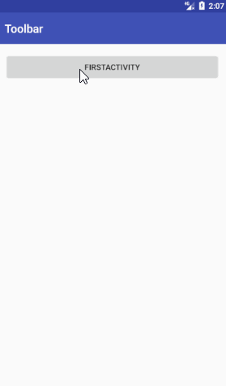
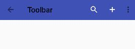

# Toolbar 使用总结

## 基本效果演示与相关代码

  

上图是 Toolbar 的一个基本效果，图中内容有：

1. 导航按钮
2. Logo图表
3. 标题
4. 副标题
5. 操作按钮（搜索、加号、收藏、设置）

相关代码：

```xml
<android.support.v7.widget.ToolbarÂ
    android:id="@+id/toolbar"
    android:layout_width="match_parent"
    android:layout_height="wrap_content"
    android:background="@color/colorPrimary"
    app:logo="@drawable/ic_account_circle_white_24dp"
    app:navigationIcon="@drawable/ic_arrow_back_white_24dp"
    app:subtitle="SubTitle"
    app:subtitleTextColor="#FFFFFF"
    app:title="Title"
    app:titleTextColor="#FFFFFF"/>
```

```xml
<menu xmlns:android="http://schemas.android.com/apk/res/android"
      xmlns:app="http://schemas.android.com/apk/res-auto">
    <item
        android:id="@+id/action_search"
        android:icon="@drawable/ic_search_white_24dp"
        android:title="搜索"
        app:showAsAction="always"/>
    <item
        android:id="@+id/action_add"
        android:icon="@drawable/ic_add_white_24dp"
        android:title="加号"
        app:showAsAction="always"/>
    <item
        android:id="@+id/action_bookmark"
        android:icon="@drawable/ic_bookmark_border_white_24dp"
        android:title="收藏"
        app:showAsAction="never"/>
    <item
        android:id="@+id/action_setting"
        android:icon="@drawable/ic_build_white_24dp"
        android:title="设置"
        app:showAsAction="never"/>
</menu>
```

```java
Toolbar mToolbar = (Toolbar) findViewById(R.id.toolbar);
// 创建操作菜单和设置对应点击事件
mToolbar.inflateMenu(R.menu.menu_main);
mToolbar.setOnMenuItemClickListener(new Toolbar.OnMenuItemClickListener() {
    @Override
    public boolean onMenuItemClick(MenuItem item) {
        Toast.makeText(FirstActivity.this,
                "你点击了" + item.getTitle(), Toast.LENGTH_SHORT).show();
        return true;
    }
});

// 设置导航按钮点击事件
mToolbar.setNavigationOnClickListener(new View.OnClickListener() {
    @Override
    public void onClick(View v) {
        finish();
    }
});
```

在上面的代码中，我们在 xml 布局文件中定义了导航按钮图标、Logo、标题、副标题等信息。其实在 java 代码中也是可以进行设置的：

```java
mToolbar.setNavigationIcon(R.drawable.ic_keyboard_arrow_left_white_24dp);
mToolbar.setLogo(R.drawable.ic_account_box_white_36dp);
mToolbar.setTitle("标题");
mToolbar.setSubtitle("子标题");
```

## 以 Actionbar 的形式使用

在 [Toolbar 官方文档](https://developer.android.com/reference/android/support/v7/widget/Toolbar.html) 中写道：Toolbar 是一个概括化的 ActionBar，可以放置在布局文件中。  

传统的 ActionBar 是 Activity 不透明的 `window decor`，是由框架控制的；而 Toolbar 可以放置在 View 的任何一个层级中。应用程序可以通过 `setSupportActionBar()` 方法指定一个 Toolbar 作为 Activity的 ActionBar。

下面来实践一下：

```xml
<android.support.v7.widget.Toolbar
    android:id="@+id/toolbar"
    android:layout_width="match_parent"
    android:layout_height="?attr/actionBarSize"
    android:background="?attr/colorPrimary"/>
```

```java
// ...
setSupportActionBar(mToolbar);
ActionBar actionBar = getSupportActionBar();
if (actionBar != null){
    actionBar.setDisplayHomeAsUpEnabled(true);
}

@Override
public boolean onCreateOptionsMenu(Menu menu) {
    // 为ActionBar扩展菜单项
    MenuInflater inflater = getMenuInflater();
    inflater.inflate(R.menu.menu_main, menu);
    return super.onCreateOptionsMenu(menu);
}

@Override
public boolean onOptionsItemSelected(MenuItem item) {
    switch (item.getItemId()){
        case R.id.action_search:
            return true;
        case R.id.action_add:
            return true;
        case R.id.action_bookmark:
            return true;
        case R.id.action_setting:
            return true;
        case android.R.id.home: // 对ActionBar的up/home按钮做出反应
            finish();
            return true;
        default: return super.onOptionsItemSelected(item);
    }
}
```

效果图如下：  



另外，有两点需要特殊说明一下：

```java
// NavigationIcon的设定在setSupportActionBar()之后才有用
// 否则会出现默认的backButton
mToolbar.setNavigationIcon(R.drawable.ic_arrow_back_white_24dp);

// 同样，如果想通过Toolbar设置菜单点击事件，也需要在setSupportActionBar()之后设定
mToolbar.setOnMenuItemClickListener(onMenuItemClickListener);
```
