# React 基础知识和使用方式

## 基础知识

官网对 [React](https://reactjs.org/) 的描述很简洁：一个用于构建用户界面的 JavaScript 库。

一句话就想打发了？不不不，官网上说了，React 有着以下特点：

* 声明式的 UI 使得你的代码更加可靠和更加容易调试。
* 创建管理各自状态的封装组件，通过各种组合可以轻松的构成复杂界面。
* 组件将应用状态和 DOM 拆分开来，传递数据也简单。
* 可以随时引入 React 来开发新功能，跟你当前的技术栈无关，也无需重写已有代码。
* 同时，你也可以通过 [React Native](https://facebook.github.io/react-native/) 来开发原生应用。

噢，我知道了，能给我几个示例看看？好，页面往上拉..

### 示例：一个简单的组件

React 组件实现了一个 `render()` 方法，可以通过该方法处理输入数据，然后返回要显示的内容。比如：

```js
class HelloMessage extends React.Component {
  render() {
    return (
      <div>
        Hello {this.props.name}
      </div>
    );
  }
}

ReactDOM.render(
  <HelloMessage name="Taylor" />,
  mountNode
);
```

显示效果如下：


在上面的示例代码中：
* 我们先是定义了一个 `<HelloMessage />` 组件，然后在 `ReactDOM` 绘制该组件时向其传入了一个属性名为 `name`、属性值为 `Taylor` 的 `props` 属性。
* 在 `<HelloMessage />` 组件内部的 `render()` 方法中，我们通过 `this.props.name` 获取到了 `name` 属性对应的值 `Taylor`。

补充说明下，示例代码中我们是通过 ES6 中的 class 来实现一个组件的，实际上我们也可以通过一个函数来实现一个组件 (即函数组件)，比如：

```js
function Welcome(props) {
  return <h1>Hello, {props.name}</h1>;
}
```

### 示例：一个有状态的组件

在前面 "一个简单的组件" 示例中，我们可以获取到外部传入的数据。实际上，组件中除了可以有外部传入数据 (通过 `this.props` 获取) 外，还可以有其内部的状态数据 (通过 `this.state` 获取)。两者的一个主要区别在于：当状态数据发生变化时组件会主动调用 `render()` 方法进行重新渲染。

示例代码如下：

```js
class Timer extends React.Component {
  constructor(props) {
    super(props);
    this.state = { seconds: 0 };
  }

  tick() {
    this.setState(state => ({
      seconds: state.seconds + 1
    }));
  }

  componentDidMount() {
    this.interval = setInterval(() => this.tick(), 1000);
  }

  componentWillUnmount() {
    clearInterval(this.interval);
  }

  render() {
    return (
      <div>
        Seconds: {this.state.seconds}
      </div>
    );
  }
}

ReactDOM.render(<Timer />, mountNode);
```

效果动态图如下 (可忽略右边的绿边，GIF 捕捉器不太友好导致)：

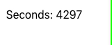

上面代码示例中，我们定义了一个 `<Timer />` 组件：
* 在组件构造函数中定义了一个名为 `seconds` 的状态数据。
* 在组件完成装载时设置了一个每秒执行一次 `tick()` 方法的定时器。
* 在组件将要卸载时会清空定时器资源。
* 每执行一次 `tick()` 方法都会使得 `seconds` 累加 `1`，因为该状态数据发生了变化，所以会触发组件的 `render()` 方法重新渲染页面。

值得注意的是，在 `tick()` 方法中，我们是通过 `this.setState()` 方法来改变状态数据的，因为只有这样才能触发 `render()` 方法进行重新渲染。也就是说，如果你只是通过 `this.seconds += 1` 来改变状态数据的话，数据的值会变，但是页面不会重新渲染。 


### 示例：一个简单的应用

了解了组件 `props` 和 `state` 的基本使用后，我们来创建一个简单的 TODO 应用。

```js
class TodoList extends React.Component {
  render() {
    return (
      <ul>
        {
          this.props.items.map(item => (
            <li key={item.id}>{item.text}</li>
          ))
        }
      </ul>
    );
  }
}

class TodoApp extends React.Component {
  constructor(props) {
    super(props);
    this.state = { items: [], text: '' };
    this.handleChange = this.handleChange.bind(this);
    this.handleSubmit = this.handleSubmit.bind(this);
  }

  render() {
    // 注：在 HTML 中可以通过 htmlFor 属性规定 label 与哪个表单元素绑定
    return (
      <div>
        <h3>TODO</h3>
        <TodoList items={this.state.items} />
        <form onSubmit={this.handleSubmit}>
          <label htmlFor="new-todo">
            What needs to be done?
          </label>
          <input
            id="new-todo"
            onChange={this.handleChange}
            value={this.state.text}
          />
          <button>
            Add #{this.state.items.length + 1}
          </button>
        </form>
      </div>
    );
  }

  handleChange(e) {
    this.setState({ text: e.target.value });
  }

  handleSubmit(e) {
    e.preventDefault();
    if (!this.state.text.length) {
      return;
    }
    const newItem = {
      text: this.state.text,
      id: Date.now()
    };
    this.setState(state => ({
      items: state.items.concat(newItem),
      text: ''
    }));
  }
}

ReactDOM.render(<TodoApp />, mountNode);
```

| 动态效果图 | 页面渲染结构 |
| -- | --
| 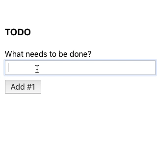 | 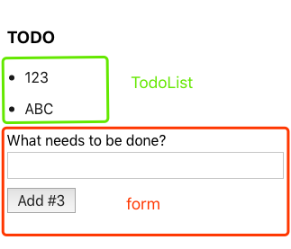

应用的主要逻辑都在 `<TodoApp />` 组件中做了实现。

从页面渲染结构上来看，可以将其分为三个部分：
* 标题
* 组件 `<TodoList />`，传入的 `this.state.items` 会作为列表的数据源。
* Form 表单，组件中的 `this.state.text` 与表单中的输入框进行了相关联。

从数据上来看，组件 `<TodoApp />` 有两个状态数据：
* `items`：数组，存储着待办事项的 `text` 描述和 `id` 标识。
* `text`: 输入框的文本。


### 示例：如何在组件中使用第三方库

现在知道怎么通过 React 写一个简单应用了，那我们如何通过强大的 JS 第三方库来编写代码呢？不慌，React 的使用非常灵活，并提供了可以调用第三方库或框架的接口。

不如我们来演示下如何通过 [remarkable](https://github.com/jonschlinkert/remarkable) 库来实时渲染 `<textarea>` 里的 markdown 语法内容？好，示例代码这就献上：

```js
class MarkdownEditor extends React.Component {
  constructor(props) {
    super(props);
    this.handleChange = this.handleChange.bind(this);
    this.state = { value: 'Hello, **world**!' };
  }

  handleChange(e) {
    this.setState({ value: e.target.value });
  }

  // 通过 Remarkable 对象的 render 方法
  // 来解析、构造并返回一个 "供 HTML 显示的内容对象"
  getRawMarkup() {
    const md = new Remarkable();
    return { __html: md.render(this.state.value) };
  }

  render() {
    return (
      <div className="MarkdownEditor">
        <h3>Input</h3>
        <label htmlFor="markdown-content">
          Enter some markdown
        </label>
        <textarea
          id="markdown-content"
          onChange={this.handleChange}
          defaultValue={this.state.value}
        />
        <h3>Output</h3>
        <div
          className="content"
          dangerouslySetInnerHTML={this.getRawMarkup()}
        />
      </div>
    );
  }
}

ReactDOM.render(<MarkdownEditor />, mountNode);
```

动态效果图如下：

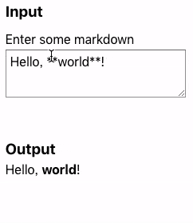


## React 的几个使用姿势

从一开始 React 就被设计为支持「逐步采用」的使用模式，也就是说，你可以根据需要尽可能少或尽可能多的使用 React。这样的话，无论你是想体验下，亦或是想为简单的 HTML 页面添加一些交互性，再亦或是想启动复杂的应用程序，通过 React 你都能实现。在下面的内容中，你应该能获取到一些相关知识或信息。

### 在线代码

如果你之前没用过 React 并且现在想快速体验下，你可以在 [CodePen](https://reactjs.org/redirect-to-codepen/hello-world) 或 [CodeSandbox](https://codesandbox.io/s/new) 上尝试下 Hello World 模板。

CodePen 示例图:

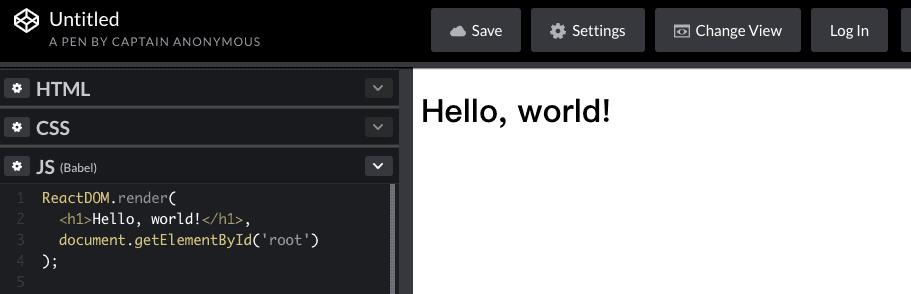

CodeSandbox 示例图:

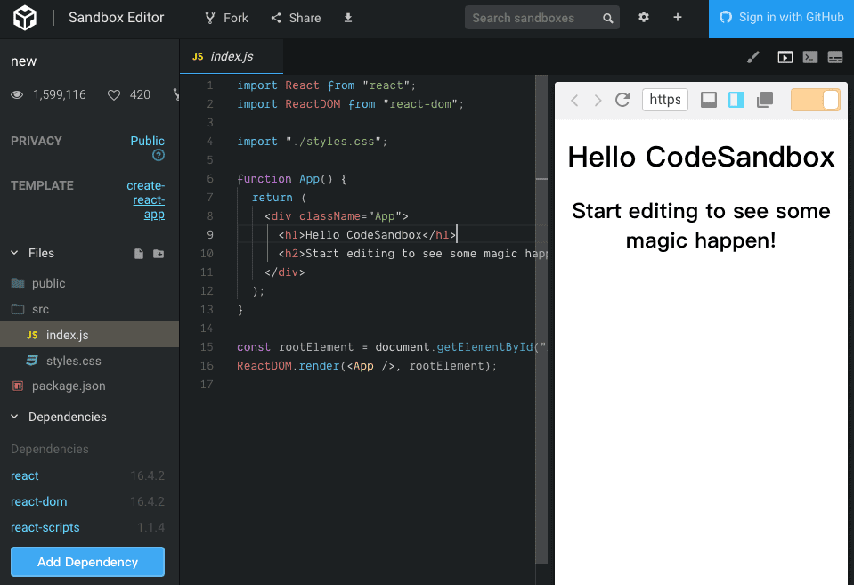

两者的主要区别在于：

* CodePen 会隐藏了比较多的项目工程细节，使得你可以专注于使用 React 来编写相关代码，但这样的话你就很难知道这工程背后的细节究竟是做了什么工作。
* 而 CodeSandbox 看起来像是一个网页版的 IDE，你可以看到整个项目的文件结构，并且可以轻松的管理项目相关的依赖，使得你对整个项目都有着一个基本的了解。

> 温馨提示：CodeSandbox 的项目模板后面我们会讲到。


### 单个文件示例

如果你更喜欢使用自己的文本编辑器，可以点击 [single-file-example.html](https://raw.githubusercontent.com/reactjs/reactjs.org/master/static/html/single-file-example.html) 下载一个 HTML 文件，然后在本地进行 React 的代码编写，并在本地浏览器中打开和预览显示效果。

> 注意：该文件会在运行时会进行代码转换，这个转换过程相对缓慢，所以建议仅作简单演示使用。

该文件的关键代码如下：

```html
<!DOCTYPE html>
<html>
  <head>
    <meta charset="UTF-8" />
    <title>Hello World</title>
    <script src="https://unpkg.com/react@16/umd/react.development.js"></script>
    <script src="https://unpkg.com/react-dom@16/umd/react-dom.development.js"></script>

    <!-- Don't use this in production: -->
    <script src="https://unpkg.com/babel-standalone@6.15.0/babel.min.js"></script>
  </head>
  <body>
    <div id="root"></div>
    <script type="text/babel">

      <!-- write more react code here ... -->

      ReactDOM.render(
        <h1>Hello, world!</h1>,
        document.getElementById('root')
      );
    </script>
  </body>
</html>
```

在本地 Chrome 中打开该网页后，然后打开开发者工具，你会发现 Elements 是酱紫的 (注意右侧代码高亮部分)：

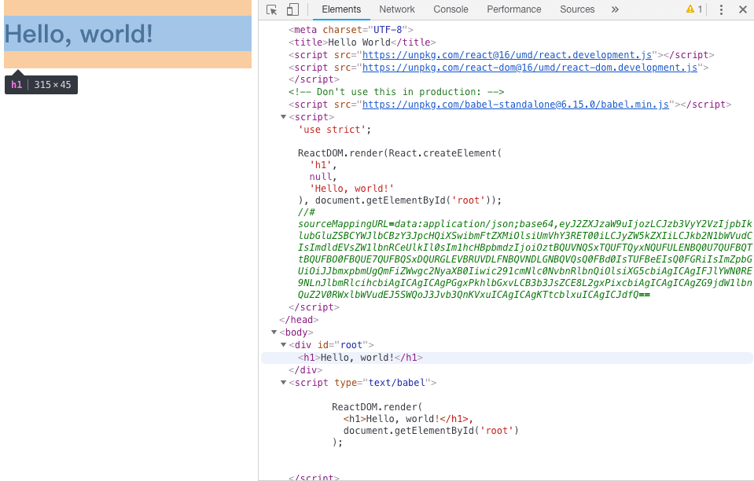

对比源代码文件，你是不是发现了什么？哈哈 ..


### 添加 React 到网站

官网这样描述该姿势：你可以在一分钟内将 React 添加到 HTML 页面。

官方提供了一个 [完整示例 (点击下载)](https://gist.github.com/gaearon/6668a1f6986742109c00a581ce704605/archive/f6c882b6ae18bde42dcf6fdb751aae93495a2275.zip)，我们先来过下该示例中的代码，然后再一步步分析应该怎样去添加。

该示例中只有两个文件：

index.html:

```html
<!DOCTYPE html>
<html>
  <head>
    <meta charset="UTF-8" />
    <title>Add React in One Minute</title>
  </head>
  <body>

    <h2>Add React in One Minute</h2>
    <p>This page demonstrates using React with no build tooling.</p>
    <p>React is loaded as a script tag.</p>

    <!-- We will put our React component inside this div. -->
    <div id="like_button_container"></div>

    <!-- Load React. -->
    <!-- Note: when deploying, replace "development.js" with "production.min.js". -->
    <script src="https://unpkg.com/react@16/umd/react.development.js" crossorigin></script>
    <script src="https://unpkg.com/react-dom@16/umd/react-dom.development.js" crossorigin></script>

    <!-- Load our React component. -->
    <script src="like_button.js"></script>

  </body>
</html>
```

like_button.js:

```js
'use strict';

// 注意关注这个 e 噢，班主任在台上别走神
const e = React.createElement;

class LikeButton extends React.Component {
  constructor(props) {
    super(props);
    this.state = { liked: false };
  }

  render() {
    if (this.state.liked) {
      return 'You liked this.';
    }

    return e(
      'button',
      { onClick: () => this.setState({ liked: true }) },
      'Like'
    );
  }
}

const domContainer = document.querySelector('#like_button_container');
ReactDOM.render(e(LikeButton), domContainer);
```

运行后效果图是酱紫的：

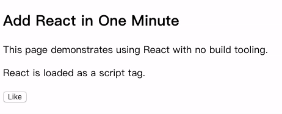

`Like` 按钮实际上是一个 React 组件，点击前以 `button` 的形式呈现，点击后以文本 `You liked this.` 的形式呈现。同时，该组件仅仅会在 `<div id="like_button_container"></div>` 中渲染，不会影响页面原有的逻辑和显示。

下面开始分析如何添加 React 到网站 (一步两步.. 魔鬼的步伐)：

**第 1 步：将 DOM 容器添加到 HTML 中**

首先，打开要编辑的 HTML 页面，并添加一个空的 `<div>` 标签作为 React 内容渲染的容器。例如：

```html
<!-- ... existing HTML ... -->

<div id="like_button_container"></div>

<!-- ... existing HTML ... -->
```

我们给了该 `<div>` 一个独特的 `id` HTML 属性，稍后我们会在 JavaScript 代码中找到它并在其内部渲染 React 组件。


**第 2 步：添加要执行的脚本**

在 `</body>` 标签之前添加三个 `<script>` 标签，以执行相关的 JavaScript 代码：

```html
  <!-- ... other HTML ... -->

  <!-- Load React. -->
  <!-- Note: when deploying, replace "development.js" with "production.min.js". -->
  <script src="https://unpkg.com/react@16/umd/react.development.js" crossorigin></script>
  <script src="https://unpkg.com/react-dom@16/umd/react-dom.development.js" crossorigin></script>

  <!-- Load our React component. -->
  <script src="like_button.js"></script>

</body>
```

前两个标签加载的是 React 本身，第三个标签加载的是我们自己的组件代码。

**第 3 步：创建一个 React 组件**

创建一个 `like_button.js` 文件，该文件里面的代码定义了一个 `LikeButton` 组件，正如前面的代码所示，下面我们来重点关注下最后两行：

```js
// ... the starter code you pasted ...

const domContainer = document.querySelector('#like_button_container');
ReactDOM.render(e(LikeButton), domContainer);
```

这两行代码先是找到我们前面提到的 `<div>`，再在其内部渲染我们的 `LikeButton` 组件。

**Done, Only 3 Steps !**

到这里就完成 "将 React 组件添加到你的网站" 的所有步骤了。

但要注意的是，在将你的网站部署到生产环境之前，需要确保部署的 HTML 加载的是以 `react.production.min.js` 结尾的 React 版本。该版相对之前的 `react.development.js` 来说，体积更小，从而用户页面的加载速度会更快。

修改成 `production` 后，清空 Chrome 的缓存并刷新页面。在开发者工具中观察加载文件的大小和对应的速度：

```html
<script src="https://unpkg.com/react@16/umd/react.production.min.js" crossorigin></script>
<script src="https://unpkg.com/react-dom@16/umd/react-dom.production.min.js" crossorigin></script>
```

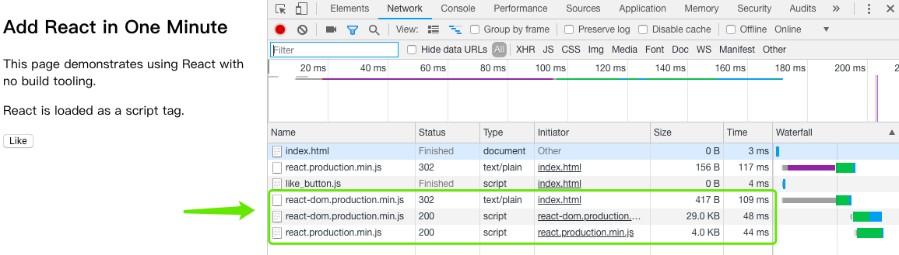

仔细看示例代码的话，会发现在 like_button.js 中我们还没有使用到 JSX，我们使用了 React 中的 `createElement()` 函数：

```js
const e = React.createElement;

// Display a "Like" <button>
return e(
  'button',
  { onClick: () => this.setState({ liked: true }) },
  'Like'
);
```

如果我们想改为使用 JSX 的话，可以写成这样：

```js
// Display a "Like" <button>
return (
  <button onClick={() => this.setState({ liked: true })}>
    Like
  </button>
);
```

But.. 使用 JSX 需要添加 babel 来做一些转换工作：

```html
<script src="https://unpkg.com/babel-standalone@6/babel.min.js"></script>
```

使用 JSX 的简单示例前面已经演示过了 (前面的 "单个文件示例")，这里就不再演示了。


### 创建一个新的 React 应用

React 团队针对一些应用场景推荐了一些解决方案：

* 如果你正在 **学习 React** 或 **创建新的单页应用程序**，请使用 [Create React App](https://reactjs.org/docs/create-a-new-react-app.html#create-react-app)。
* 如果你正在构建一个与 **Node.js 的服务器渲染网页**，尝试 [Next.js](https://reactjs.org/docs/create-a-new-react-app.html#nextjs)。
* 如果你正在构建一个 **面向静态内容的网站**，请尝试 [Gatsby](https://reactjs.org/docs/create-a-new-react-app.html#gatsby)。
* 如果你正在构建 **组件库** 或 **与现有代码库集成**，请尝试 [更灵活的工具链](https://reactjs.org/docs/create-a-new-react-app.html#more-flexible-toolchains)。

假设我们现在只是想学习 React，那么可以通过 `create-react-app` 创建一个新的 React 应用。

**Create React App** 是一个学习 React 的舒适环境，也是在 React 中构建新的单页应用的最佳方式。在使用 **Create React App** 之前，你需要在自己的计算机上安装 Node (>= 6) 和 npm (>= 5.2)。

执行下面命令，创建并启动一个新的项目：

```shell
npx create-react-app my-app
cd my-app
npm start
```

启动后，执行的脚本会自动在浏览器打开 `http://localhost:3000/`，网页显示内容如下：

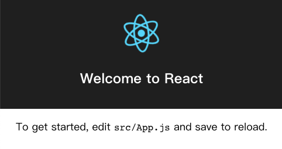

另外，这个新创建项目的文件结构是酱紫的：

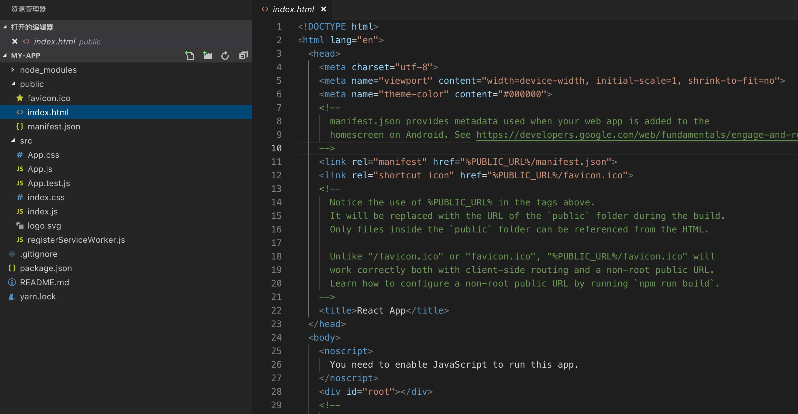

index.js:

```js
import React, { Component } from 'react';
import logo from './logo.svg';
import './App.css';

class App extends Component {
  render() {
    return (
      <div className="App">
        <header className="App-header">
          
          <h1 className="App-title">Welcome to React</h1>
        </header>
        <p className="App-intro">
          To get started, edit <code>src/App.js</code> and save to reload.
        </p>
      </div>
    );
  }
}

export default App;
```

App.js:

```js
import React from 'react';
import ReactDOM from 'react-dom';
import './index.css';
import App from './App';
import registerServiceWorker from './registerServiceWorker';

ReactDOM.render(<App />, document.getElementById('root'));
registerServiceWorker();
```

package.json:

```js
{
  "name": "my-app",
  "version": "0.1.0",
  "private": true,
  "dependencies": {
    "react": "^16.5.2",
    "react-dom": "^16.5.2",
    "react-scripts": "1.1.5"
  },
  "scripts": {
    "start": "react-scripts start",
    "build": "react-scripts build",
    "test": "react-scripts test --env=jsdom",
    "eject": "react-scripts eject"
  }
}
```


如果需要部署到生产环境时，可执行 `npm run build` 命令，然后对应脚本会在 `build` 文件夹中编译出优化版的应用程序代码。我们一起来试下：

```shell
zhuanghongji-mbp:my-app zhuanghongji$ npm run build

> my-app@0.1.0 build /Users/zhuanghongji/Documents/Develop/React/my-app
> react-scripts build

Creating an optimized production build...
Compiled successfully.

File sizes after gzip:

  37.34 KB  build/static/js/main.d1cb61c2.js
  299 B     build/static/css/main.c17080f1.css

The project was built assuming it is hosted at the server root.
You can control this with the homepage field in your package.json.
For example, add this to build it for GitHub Pages:

  "homepage" : "http://myname.github.io/myapp",

The build folder is ready to be deployed.
You may serve it with a static server:

  yarn global add serve
  serve -s build

Find out more about deployment here:

  http://bit.ly/2vY88Kr

```

打出来的 build 目录下的文件是这样的：

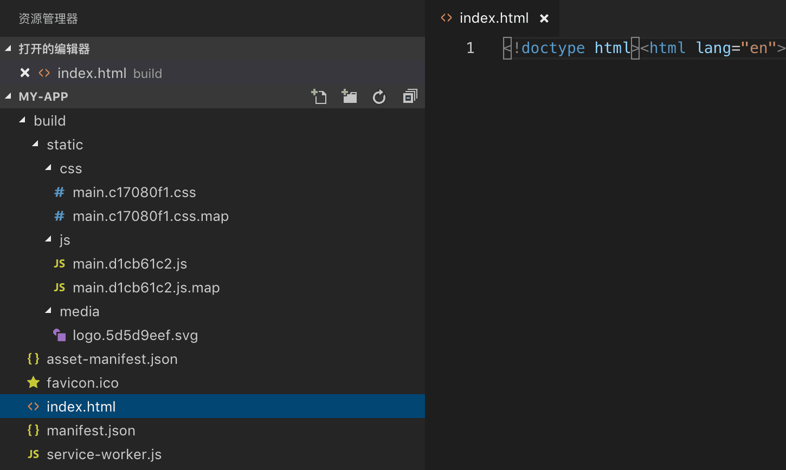

打开上面的 `index.html` 之后发现页面是完全空白的。哈！回头看看 build 时的输出日志，看看有木有什么关键提示：

```shell
The project was built assuming it is hosted at the server root.
You can control this with the homepage field in your package.json.
For example, add this to build it for GitHub Pages:

  "homepage" : "http://myname.github.io/myapp",

...
```

哈，真有！该提示主要是说：默认情况下构建脚本会认为当前项目是位于服务器根目录下的，吐过需要改变该行为，可以在 `package.json` 中添加 `homepage` 配置实现。比如说，我们想构建在本地目录下，可以加一行 `"homepage": "./",`，然后再次执行 `npm run build` 进行构建。此后，我们打开新的 `index.html` 就可以看到页面中的内容了。

那为什么添加 `"homepage": "./"` 之前网页的内容显示不出来呢？

通过 Chrome 开发者工具对比两个网页：

添加前 (显示空白)：

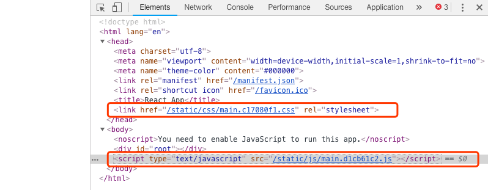  

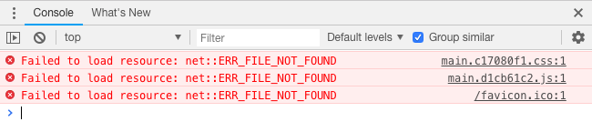

添加后 (显示预期内容)：

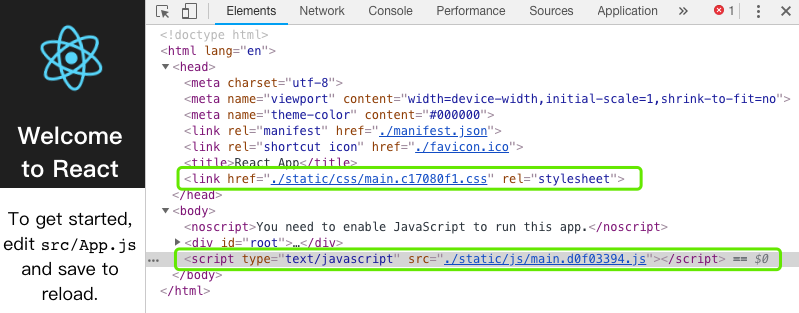

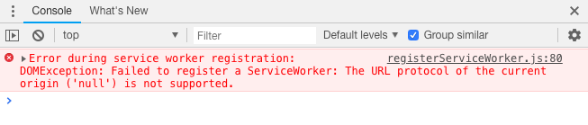

如圈中的代码所示，前者中的 js 文件因为 "路径" 导致加载异常，从而导致没有内容显示。


## 总结

在这篇文章中，我们了解了 React 的基本使用，同时也掌握了几个 "如何搭建学习 React 环境" 的姿势。万丈高楼平地起，到此，平地就有了。