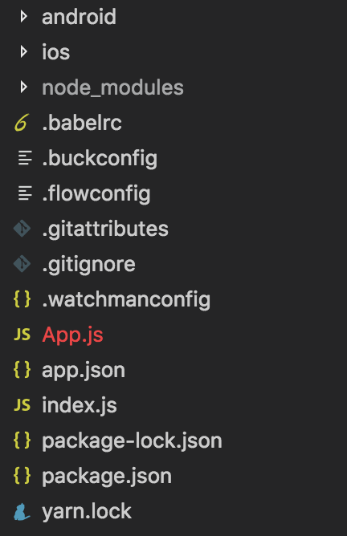
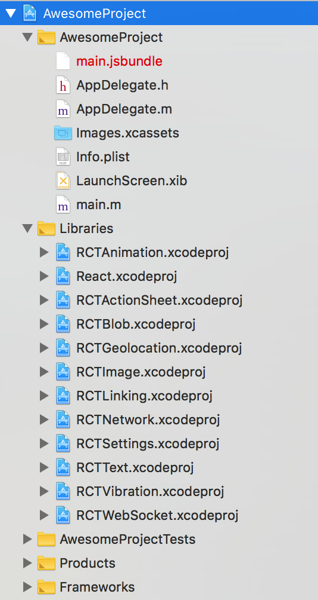
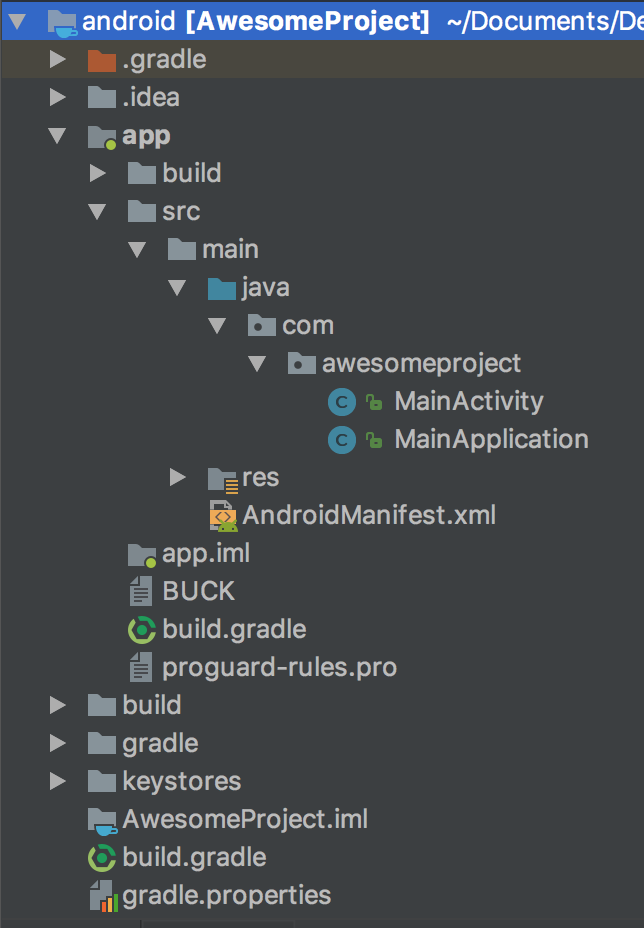
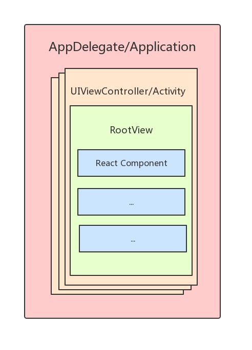

# 一个刚初始化好的 React Native 项目是怎样的

本文主要分为 4 个部分：
* 初始化并运行项目
* React Native 相关代码
* iOS 相关代码
* Android 相关代码

## 初始化并运行项目

通过下面的命令行初始化一个 RN 项目：
```shell
$ react-native init AwesomeProject
```

执行该命令后，命令行窗口会输出以下提示信息：
```
This will walk you through creating a new React Native project in /Users/zhuanghongji/.../ReactNative/AwesomeProject
Using yarn v1.3.2

Installing react-native...
yarn add v1.3.2
info No lockfile found.
[1/4] 🔍  Resolving packages...
[2/4] 🚚  Fetching packages...
[3/4] 🔗  Linking dependencies...
[4/4] 📃  Building fresh packages...
...

info To upgrade, run the following command:
$ curl -o- -L https://yarnpkg.com/install.sh | bash
success Saved 547 new dependencies.
├─ @babel/code-frame@7.0.0-beta.47
├─ ...
Setting up new React Native app in /Users/zhuanghongji/.../ReactNative/AwesomeProject

Adding React...
yarn add v1.3.2
[1/4] 🔍  Resolving packages...
[2/4] 🚚  Fetching packages...
[3/4] 🔗  Linking dependencies...
[4/4] 📃  Building fresh packages...
...

Adding Jest...
yarn add v1.3.2
[1/4] 🔍  Resolving packages...
[2/4] 🚚  Fetching packages...
[3/4] 🔗  Linking dependencies...
[4/4] 📃  Building fresh packages...
...

To run your app on iOS:
   cd /Users/zhuanghongji/Documents/Develop/ReactNative/AwesomeProject
   react-native run-ios
   - or -
   Open ios/AwesomeProject.xcodeproj in Xcode
   Hit the Run button
To run your app on Android:
   cd /Users/zhuanghongji/Documents/Develop/ReactNative/AwesomeProject
   Have an Android emulator running (quickest way to get started), or a device connected
   react-native run-android
```

从上述提示信息可知，我们可以通过不同的命令使得 RN 项目运行在不同的平台上：
* `$ react-native run-ios`：运行在 iOS 平台上。
* `$ react-native run-android`：运行在 Android 平台上。

接下来，通过 `cd AwesomeProject` 进入项目目录，然后执行 `npm install` 安装相关依赖，部分输出日志如下：

```shell
npm WARN rm not removing ..
npm WARN rm not removing ..
...
added 163 packages, removed 122 packages and updated 826 packages in 39.559s
```

在开发模式下，不管你是想运行在 iOS 平台还是 Android 平台，执行运行命令后，都会先启动启动一个 JS 服务器：  


启动对应模拟器后，在两个平台上的运行效果分别如下：

| iOS | Android
| -- | --
|  | 

由截图可看出，两个平台显示效果大致相同，但中部的内容提示有所不同：
* 在 iOS 中，修改 `App.js` 文件后，通过 `Cmd + R` 快捷键重新加载内容，通过 `Cmd + D` 快捷键或摇晃手机打开「开发菜单」。
* 在 Android 中，修改 `App.js` 文件后，通过双击 `R` 键重新加载内容，通过摇晃手机或点击 `menu` 按钮就打开「开发菜单」。

> 在 Android 官方模拟器中，我们可以 `Cmd + M` 快捷键执行点击 `menu` 按钮操作。

注：如果你现在的 RN 版本是 0.60+，启动后看到的页面可能是下图酱紫的 (由 React-Native-Community 自主设计的新启动页，点击相关项可自动在电脑浏览器上打开对应文档网页或推特网页)：


## React Native 相关代码

通过 VSCode 打开该 React Native 项目后，可以看到代码结构是这样的：  



因为该项目是同时支持 iOS 和 Android 两个平台的，所以 React Native 项目中会同时包含有 iOS 和 Android 的完整子项目。

* `iOS` : 完整的 iOS 子项目，可用 Xcode 直接打开。
* `Android` : 完整的 Android 子项目，可用 Android Studio 直接打开。
* `node_modules` : 存放 `npm install` 安装的模块（依赖代码）。
* `.babelrc` : babel 的配置文件，React Native 默认使用 babel 编译 JavaScript 代码。
* `App.js` : App 根组件，可以在这里导入整个项目的路由
* `app.json` : 项目说明文件（主要给原生 app 打包用，比如项目名称、应用名称等）。
* `index.js` : iOS 和 Android 平台的入口文件，通常用来注册 React Native App 根组件。
* `package-lock.json` : 记录了当前状态下，实际安装的各个 npm package 的具体来源和版本号。
* `package.json` : npm 的包管理文件。


扩展：`package.json` 和 `package-lock.json` 的区别？
* `package.json` 定义了依赖的版本范围，具体安装的是什么版本是在执行 `npm install` 之后才能确定的。
* `package-lock.json` 记录了实际上的具体安装版本。
* 这样区分开来的好处是，当你在持续集成上重复 build 是，得到的 artifact 是一样的，因为依赖的版本都被锁住了。

项目中具体的 js 代码分别如下：

app.js :
```json
{
  "name": "AwesomeProject",
  "displayName": "AwesomeProject"
}
```

package.js :
```json
{
  "name": "AwesomeProject",
  "version": "0.0.1",
  "private": true,
  "scripts": {
    "start": "node node_modules/react-native/local-cli/cli.js start",
    "test": "jest"
  },
  "dependencies": {
    "react": "16.3.1",
    "react-native": "0.55.4"
  },
  "devDependencies": {
    "babel-jest": "22.4.4",
    "babel-preset-react-native": "4.0.0",
    "jest": "22.4.4",
    "react-test-renderer": "16.3.1"
  },
  "jest": {
    "preset": "react-native"
  }
}
```

index.js :
```JavaScript
import { AppRegistry } from 'react-native';
import App from './App';

AppRegistry.registerComponent('AwesomeProject', () => App);
```

App.js :
```js
import React, { Component } from 'react';
import {
  Platform,
  StyleSheet,
  Text,
  View
} from 'react-native';

const instructions = Platform.select({
  ios: 'Press Cmd+R to reload,\n' +
    'Cmd+D or shake for dev menu',
  android: 'Double tap R on your keyboard to reload,\n' +
    'Shake or press menu button for dev menu',
});

type Props = {};
export default class App extends Component<Props> {
  render() {
    return (
      <View style={styles.container}>
        <Text style={styles.welcome}>
          Welcome to React Native!
        </Text>
        <Text style={styles.instructions}>
          To get started, edit App.js
        </Text>
        <Text style={styles.instructions}>
          {instructions}
        </Text>
      </View>
    );
  }
}

const styles = StyleSheet.create({
  container: {
    flex: 1,
    justifyContent: 'center',
    alignItems: 'center',
    backgroundColor: '#F5FCFF',
  },
  welcome: {
    fontSize: 20,
    textAlign: 'center',
    margin: 10,
  },
  instructions: {
    textAlign: 'center',
    color: '#333333',
    marginBottom: 5,
  },
});
```

## iOS 相关代码

通过 Xcode 打开 `ios` 目录下的 Android 项目后，可以看到代码结构是这样的：  



AppDelegate.h:

```objc
#import <UIKit/UIKit.h>

@interface AppDelegate : UIResponder <UIApplicationDelegate>

@property (nonatomic, strong) UIWindow *window;

@end
```

AppDelegate.m
```objc
#import "AppDelegate.h"

#import <React/RCTBundleURLProvider.h>
#import <React/RCTRootView.h>

@implementation AppDelegate

- (BOOL)application:(UIApplication *)application didFinishLaunchingWithOptions:(NSDictionary *)launchOptions
{
  NSURL *jsCodeLocation;

  jsCodeLocation = [[RCTBundleURLProvider sharedSettings] jsBundleURLForBundleRoot:@"index" fallbackResource:nil];

  RCTRootView *rootView = [[RCTRootView alloc] initWithBundleURL:jsCodeLocation
                                                      moduleName:@"AwesomeProject"
                                               initialProperties:nil
                                                   launchOptions:launchOptions];
  rootView.backgroundColor = [[UIColor alloc] initWithRed:1.0f green:1.0f blue:1.0f alpha:1];

  self.window = [[UIWindow alloc] initWithFrame:[UIScreen mainScreen].bounds];
  UIViewController *rootViewController = [UIViewController new];
  rootViewController.view = rootView;
  self.window.rootViewController = rootViewController;
  [self.window makeKeyAndVisible];
  return YES;
}

@end
```

main.m
```objc
#import <UIKit/UIKit.h>

#import "AppDelegate.h"

int main(int argc, char * argv[]) {
  @autoreleasepool {
    return UIApplicationMain(argc, argv, nil, NSStringFromClass([AppDelegate class]));
  }
}
```

## Android 相关代码

通过 Android Studio 打开 `android` 目录下的 Android 项目后，可以看到代码结构是这样的：  



MainApplication.java:

```java
public class MainApplication extends Application implements ReactApplication {

  private final ReactNativeHost mReactNativeHost = new ReactNativeHost(this) {
    @Override
    public boolean getUseDeveloperSupport() {
      return BuildConfig.DEBUG;
    }

    @Override
    protected List<ReactPackage> getPackages() {
      return Arrays.<ReactPackage>asList(
          new MainReactPackage()
      );
    }

    @Override
    protected String getJSMainModuleName() {
      return "index";
    }
  };

  @Override
  public ReactNativeHost getReactNativeHost() {
    return mReactNativeHost;
  }

  @Override
  public void onCreate() {
    super.onCreate();
    SoLoader.init(this, /* native exopackage */ false);
  }
}
```

MainActivity.java:

```java
public class MainActivity extends ReactActivity {

    /**
     * Returns the name of the main component registered from JavaScript.
     * This is used to schedule rendering of the component.
     */
    @Override
    protected String getMainComponentName() {
        return "AwesomeProject";
    }
}
```

app/build.gradle :

```js
apply plugin: "com.android.application"

import com.android.build.OutputFile

project.ext.react = [
    entryFile: "index.js"
]

apply from: "../../node_modules/react-native/react.gradle"

/**
 * Set this to true to create two separate APKs instead of one:
 *   - An APK that only works on ARM devices
 *   - An APK that only works on x86 devices
 * The advantage is the size of the APK is reduced by about 4MB.
 * Upload all the APKs to the Play Store and people will download
 * the correct one based on the CPU architecture of their device.
 */
def enableSeparateBuildPerCPUArchitecture = false

/**
 * Run Proguard to shrink the Java bytecode in release builds.
 */
def enableProguardInReleaseBuilds = false

android {
    compileSdkVersion 23
    buildToolsVersion "23.0.1"

    defaultConfig {
        applicationId "com.awesomeproject"
        minSdkVersion 16
        targetSdkVersion 22
        versionCode 1
        versionName "1.0"
        ndk {
            abiFilters "armeabi-v7a", "x86"
        }
    }
    splits {
        abi {
            reset()
            enable enableSeparateBuildPerCPUArchitecture
            universalApk false  // If true, also generate a universal APK
            include "armeabi-v7a", "x86"
        }
    }
    buildTypes {
        release {
            minifyEnabled enableProguardInReleaseBuilds
            proguardFiles getDefaultProguardFile("proguard-android.txt"), "proguard-rules.pro"
        }
    }
    // applicationVariants are e.g. debug, release
    applicationVariants.all { variant ->
        variant.outputs.each { output ->
            // For each separate APK per architecture, set a unique version code as described here:
            // http://tools.android.com/tech-docs/new-build-system/user-guide/apk-splits
            def versionCodes = ["armeabi-v7a":1, "x86":2]
            def abi = output.getFilter(OutputFile.ABI)
            if (abi != null) {  // null for the universal-debug, universal-release variants
                output.versionCodeOverride =
                        versionCodes.get(abi) * 1048576 + defaultConfig.versionCode
            }
        }
    }
}

dependencies {
    compile fileTree(dir: "libs", include: ["*.jar"])
    compile "com.android.support:appcompat-v7:23.0.1"
    compile "com.facebook.react:react-native:+"  // From node_modules
}

// Run this once to be able to run the application with BUCK
// puts all compile dependencies into folder libs for BUCK to use
task copyDownloadableDepsToLibs(type: Copy) {
    from configurations.compile
    into 'libs'
}
```

project/build.gradle:

```js
// Top-level build file where you can add configuration options common to all sub-projects/modules.

buildscript {
    repositories {
        jcenter()
    }
    dependencies {
        classpath 'com.android.tools.build:gradle:3.0.1'

        // NOTE: Do not place your application dependencies here; they belong
        // in the individual module build.gradle files
    }
}

allprojects {
    repositories {
        mavenLocal()
        jcenter()
        maven {
            // All of React Native (JS, Obj-C sources, Android binaries) is installed from npm
            url "$rootDir/../node_modules/react-native/android"
        }
    }
}
```


对于 iOS 和 Android 的原生代码，我们来做下分析：
* 每个 App 都需要一个 "东西" 来全局管理整个应用，比如监听应用的创建和销毁、应用前后台的切换事件等 (这个 "东西" 在 iOS 中称为 `AppDelegate`，而在 Android 中称为 `Application`)。在应用创建的时候，RN 会进行一些初始化操作。
* 一个 App 中是有很多个页面的，一个页面在 iOS 中可视为是一个 `UIViewController`，而在 Android 中可视为是一个 `Activity`。
* 一个页面一般是由多个视图组成的，视图在 iOS 和 Android 中都称为 `View`。我们知道 RN 中的组件 ( `Component` ) 在渲染时实际上是原生的视图，那么我们在原生上就需要提供一个 "视图容器" 来管理 RN 渲染时的视图，这个容器视图就是原生代码中的 `rootView` 了。

文字有点抽象？那上张图：



简单来说：
* 一个 AppDelgate 或 Application
* 含 N 个 UIViewController 或 Activity (N >= 1)
* 含 N * ( X | Y | Z ) 个 React Component (不同页面组件个数可能不一样)


## 总结

在这边文章中，我们知道了怎么初始化并运行一个 React Native 项目，同时也知道了刚初始化好的 React Native 项目的大体结构。至于原生是怎样去初始化一个 RootView 的、两个平台又怎样传默认参数等问题实际上需要比较大的篇幅去描述，这里就不展开了，读者可以自己阅读原生代码或搜索相关文章进行了解。