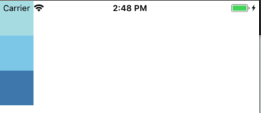
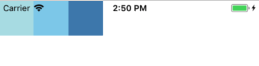
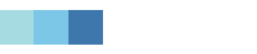
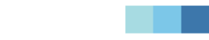
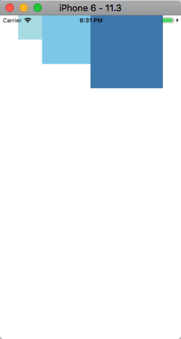
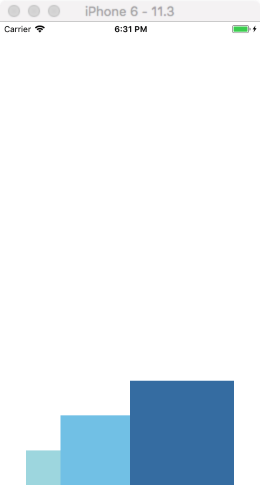
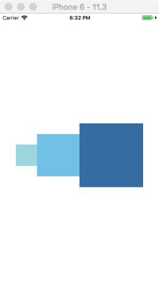

# 使用 Flexbox 布局

在 RN 中我们可以使用 flexbox 规则来指定某个组件的子元素布局。

Flexbox 是被设计来在不同的屏幕上提供一致的布局结构。

一般来说，通过 `flexDirection` `alignItems` 和 `justifyContent` 这三个样式的不同组合能够满足大多数的布局要求，

> React Native 中的 Flexbox 的工作原理和 web 上的 CSS 基本一致，当然也存在少许差异。首先是默认值不同：`flexDirection` 的默认值是 `column` 而不是 `row`，而 `flex` 也只能指定一个数字值。

## Flex Direction

在组件的 `style` 添加 `flexDirection` 样式可以决定布局的 **主轴**。
* `colum`: 子元素沿着竖直方向排列
* `row`: 子元素沿着水平方向排列

默认值是 `column`，竖直方向。

```js
export default class App extends Component<Props> {
  render() {
    return (
      // Try setting `flexDirection` to `row`.
      <View style={{flex: 1, flexDirection: `column`}}>
        <View style={{width: 50, height: 50, backgroundColor: 'powderblue'}} />
        <View style={{width: 50, height: 50, backgroundColor: 'skyblue'}} />
        <View style={{width: 50, height: 50, backgroundColor: 'steelblue'}} />
      </View>
    );
  }
}
```

| column | row
| -- | --
|  | 

## Justify Content

在组件的 `style` 中指定 `justifyContent` 可以决定其子元素沿着主轴的 **排列方式**。子元素是应该靠近主轴的起始端还是末尾段分布呢？亦或应该均匀分布？对应的这些可选项有：
* `flex-start`: 子元素靠近主轴的起始端。
* `flex-end`: 子元素靠近主轴的末尾端。
* `center`: 子元素聚集在主轴的中间位置。
* `space-around`: 每个子元素两边都存在相等的间距。
* `space-between`: 首尾两个子元素与父容器的间距为 0，每个子元素之间的间距相等。
* `space-evenly`: 父容器首位、每个子元素之间的间距都是相等的。


| justifyContent | 显示效果
| -- | --
| flex-start | 
| flex-end | 
| center | 
| space-around | 
| space-between | 
| space-evenly | 


## Align Items

在组件的 `style` 中指定 `alignItems` 可以决定其子元素沿着次轴（与主轴垂直的轴，比如若主轴方向为 `row`，则次轴方向为 `column`）的排列方式。子元素是应该靠近次轴的起始端还是末尾段分布呢？亦或应该均匀分布？对应的这些可选项有

* `flex-start`
* `flex-end`
* `center`
* `stretch`: 拉伸

```js
export default class App extends Component<Props> {
  render() {
    return (
      // Try setting `flexDirection` to `column`.
      <View style={{flex: 1, flexDirection: `row`, justifyContent: 'center', alignItems: 'flex-start'}}>
        <View style={{width: 50, height: 50, backgroundColor: 'powderblue'}} />
        <View style={{width: 100, height: 100, backgroundColor: 'skyblue'}} />
        <View style={{width: 150, height: 150, backgroundColor: 'steelblue'}} />
      </View>
    );
  }
}
```

| flex-start | flex-end | center
| -- | -- | --
|  |  | 


> 注意：要使 `stretch` 选项生效的话，子元素在次轴方向上不能有固定的尺寸。以下面的代码为例：只有将子元素样式中的 `width: 50` 去掉之后，`alignItems: 'stretch'` 才能生效。

```js
export default class App extends Component<Props> {
  render() {
    return (
      // Try setting `flexDirection` to `row`.
      <View style={{flex: 1, flexDirection: `row`, justifyContent: 'center', alignItems: 'stretch'}}>
        <View style={{width: 50, backgroundColor: 'powderblue'}} />
        <View style={{width: 100, height: 100, backgroundColor: 'skyblue'}} />
        <View style={{width: 150, height: 150, backgroundColor: 'steelblue'}} />
      </View>
    );
  }
}
```

