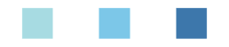
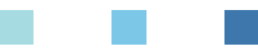

# React Native - 详解 Flexbox 和 Layout Props

## Flexbox 

在 RN 中我们可以通过使用 Flexbox 规则来指定某个 **组件子元素** 的布局。Flexbox 是被设计来在不同的屏幕上提供一致布局结构的一个规范。

一般来说，通过 `flexDirection`、`alignItems` 和 `justifyContent` 的不同组合能够满足大多数的布局要求。

> React Native 中 Flexbox 的工作原理和 Web 上的 CSS 基本一致，但存在着少许差异。比如默认值不同，`flexDirection` 的默认值是 `column` 而不是 `row`，还有 `flex` 只能指定一个数字值等。

### Flex Direction

在组件的 `style` 中添加 `flexDirection` 属性值可以决定布局的主轴及其子元素的排列方向。

* `colum`: 主轴为竖直，子元素从上到下进行排列（默认值）。
* `colum-reverse`: 主轴为竖直，子元素从下到上进行排列。
* `row`: 主轴为横向，子元素从左到右进行排列。
* `row-reverse`: 主轴为横向，子元素从右到左进行排列。


```js
export default class App extends Component<Props> {
  render() {
    return (
      // Try setting `flexDirection` to `row`.
      <View style={{flex: 1, flexDirection: `column`}}>
        <View style={{width: 50, height: 50, backgroundColor: 'powderblue'}} />
        <View style={{width: 50, height: 50, backgroundColor: 'skyblue'}} />
        <View style={{width: 50, height: 50, backgroundColor: 'steelblue'}} />
      </View>
    );
  }
}
```

| column | row
| -- | --
|  | 

### Justify Content

在组件的 `style` 中指定 `justifyContent` 属性值可以决定其子元素沿着主轴的排列方式。子元素是应该靠近主轴的起始端还是末尾段分布呢？亦或应该均匀分布？对应的这些可选项有：

* `flex-start`: 子元素靠近主轴的起始端。
* `flex-end`: 子元素靠近主轴的末尾端。
* `center`: 子元素集中在主轴的中间位置。
* `space-around`: 每个子元素两边都存在相等的间距。
* `space-between`: 首尾两个子元素与父容器的间距为 0，每个子元素之间的间距相等。
* `space-evenly`: 父容器首位、每个子元素之间的间距都是相等的。


| justifyContent | 显示效果
| -- | --
| flex-start | 
| flex-end | 
| center | 
| space-around | 
| space-between | 
| space-evenly | 


### Align Items

在组件的 `style` 中指定 `alignItems` 属性值可以决定其子元素沿着次轴的排列方式。子元素是应该靠近次轴的起始端还是末尾段分布呢？亦或应该均匀分布？对应的这些可选项有

* `flex-start`：子元素靠近次轴的起始端。
* `flex-end`：子元素靠近次轴的末尾端。
* `center`子元素集中在次轴的中间位置。
* `stretch`: 拉伸 

> 次轴：即与主轴垂直的轴。若主轴方向为 `row`，则次轴方向为 `column`。

```js
export default class App extends Component<Props> {
  render() {
    return (
      // Try setting `flexDirection` to `column`.
      <View style={{flex: 1, flexDirection: `row`, justifyContent: 'center', alignItems: 'flex-start'}}>
        <View style={{width: 50, height: 50, backgroundColor: 'powderblue'}} />
        <View style={{width: 100, height: 100, backgroundColor: 'skyblue'}} />
        <View style={{width: 150, height: 150, backgroundColor: 'steelblue'}} />
      </View>
    );
  }
}
```

| flex-start | flex-end | center
| -- | -- | --
|  |  | 


> 注意：要使 `stretch` 选项生效的话，子元素在次轴方向上不能有固定的尺寸。以下面的代码为例：只有将子元素样式中的 `width: 50` 去掉之后，`alignItems: 'stretch'` 才能生效。

```js
export default class App extends Component<Props> {
  render() {
    return (
      // Try setting `flexDirection` to `row`.
      <View style={{flex: 1, flexDirection: `row`, justifyContent: 'center', alignItems: 'stretch'}}>
        <View style={{width: 50, backgroundColor: 'powderblue'}} />
        <View style={{width: 100, height: 100, backgroundColor: 'skyblue'}} />
        <View style={{width: 150, height: 150, backgroundColor: 'steelblue'}} />
      </View>
    );
  }
}
```


## Layout Props

在上面的内容中我们已经介绍了一些基础知识，但在实际开发中要运用好布局还需要很多其它的样式。下面的内容参考自官方文档的 [Layout Props](https://facebook.github.io/react-native/docs/layout-props)，相对完整地列举了对布局有影响的样式。


> 注意：main axis 译为「主轴」，cross axis 译为「交叉轴」。

### `alignContent`

`alignContent` 控制行(rows)如何在交叉方向上对齐，会覆盖 parent 的 `alignContent`。详情可参考 [align-content](https://developer.mozilla.org/en-US/docs/Web/CSS/align-content)。

可选值如下：

* `flex-start`
* `flex-end`
* `center`
* `stretch`
* `space-between`
* `space-around`

听起来有些拗口，我们来换个说法。`alignContent` 的布局效果和 `alignItems` 的完全一致，只不过前者只对多行的 item 才有效果，而后者对单行和多行都有效。

来看个示例：

```js
export default class App extends Component {
  render() {
    return (
      <View style={styles.container}>
       <View style={styles.block} />
       <View style={styles.block} />
       {/* 如果你注释下面这个 View，会发现因不能换行导致 alignContent 不生效 */}
       <View style={styles.block} />
     </View>
    );
  }
}

const styles = StyleSheet.create({
  container: {
    width: 320,
    height: 320,
    flexDirection: 'row',
    // 'wrap' 使得可换行
    flexWrap: 'wrap',
    alignContent: 'space-around',
    // alignContent: 'flex-end',
    backgroundColor: 'yellow',
  },
  block: {
    width: 120,
    height: 48,
    backgroundColor: 'green',
    margin: 16,
  },
});
```

| `alignContent: 'space-around'` | `alignContent: 'flex-end'`
| -- | --
|  | 

### `alignItems`

`alignItems` 控制 children 在交叉方向上的对齐方式。比如说，如果 children 是垂直排列的，那么 `alignItems` 将控制它们如何在水平方向对齐。其工作方式同 CSS 中的 `align-items` (默认值 `stretch`)，详情可参考 [align-items](https://developer.mozilla.org/en-US/docs/Web/CSS/align-items)。

可选值如下：

* `flex-start`
* `flex-end`
* `center`
* `stretch`
* `baseline`

### `alignSelf`

`alignSelf` 控制单个 child 如何在交叉方向上对齐，会覆盖 parent 的 `alignItems`。其工作方式同 CSS 中的 `align-self` (默认值 `auto`)，详情可参考 [align-self](https://developer.mozilla.org/en-US/docs/Web/CSS/align-self)。

可选值如下：

* `auto`
* `flex-start`
* `flex-end`
* `center`
* `stretch`
* `baseline`

`alignSelf` 与 `alignItems` 的主要区别在于，前者是在 item 内部定义的，它的默认值是 `auto`，向上取 parent 的 `alignItems` 的值。如果对 `alignSelf` 属性进行自定义，则会覆盖 parent 中 `alignItems` 的效果。

来看个示例代码：

```js
export default class App extends Component {
  render() {
    return (
      <View style={styles.container}>
       <View style={styles.block} />
       <View style={styles.block} />
       <View style={[styles.block, { alignSelf: 'flex-end' }]}/>
     </View>
    );
  }
}

const styles = StyleSheet.create({
  container: {
    width: 320,
    height: 320,
    flexDirection: 'row',
    alignItems: 'center',
    backgroundColor: 'yellow',
  },
  block: {
    width: 60,
    height: 48,
    backgroundColor: 'green',
    margin: 16,
  },
});
```


可以看到，本来 container 是希望其中的 item 在垂直方向上是居中的，但因第三个 item 自己本身带了 `alignSelf: 'flex-end'` 样式，该样式覆盖了 parent 中的 `alignItems` 样式，所以最终第三个 item 是对齐到了 container 底部的。


### `aspectRatio`

顾名思义，`aspectRatio` 是宽高比的意思。如果你将该值设为 `0.5` 则表示 `width / height = 0.5`，即宽度是高度的 `0.5` 倍。宽高比控制未完整定义尺寸的节点(node)的大小。`aspectRatio` 是非标准属性，仅适用于 React Native 而不适用于 CSS。

可选值为 `number`。

示例如下：

```js
export default class App extends Component {
  render() {
    return (
      <View style={styles.container} />
    );
  }
}

const styles = StyleSheet.create({
  container: {
    width: 320,
    aspectRatio: 0.50,
    // aspectRatio: 1,
    backgroundColor: 'yellow',
  },
});
```

| `aspectRatio: 0.50` | `aspectRatio: 1`
| -- | --
|  | 


### `borderBottomWidth`

控制底部的边界线宽度。


### `borderEndWidth`

控制结尾处的边界线宽度：

* 如果当前方向是 `ltr`，则等同于 `borderRightWidth`。
* 如果当前方向是 `rtl`，则等同于 `borderLeftWidth`。


### `borderLeftWidth`

控制左边的边界线宽度。


### `borderRightWidth`

控制右边的边界线宽度。


### `borderStartWidth`

控制开始处的边界线宽度：

* 如果当前方向是 `ltr`，则等同于 `borderLeftWidth`。
* 如果当前方向是 `rtl`，则等同于 `borderRightWidth`。


### `borderTopWidth`

控制顶部的边界线宽度。


### `borderWidth`

控制边界线宽度。


### `bottom`

可通过 `bottom` 控制此组件偏移其底边的逻辑像素数。

其工作方式类似于 CSS 中的 `bottom`，当在 React Native 中你必须使用 points 或 percentages。Ems 和其它的单位是不支持的。

可选值为 number 或 string，比如 `30`、`10%` 等。

来看个示例 (`top`、`right` 和 `left` 的使用与 `bottom` 类似)：

```js
export default class App extends Component {
  render() {
    return (
      <View style={styles.container}>
        <View style={styles.block1}/>
        <View style={styles.block2}/>
      </View>
    );
  }
}

const styles = StyleSheet.create({
  container: {
    width: 320,
    height: 320,
    backgroundColor: 'yellow',
  },
  block1: {
    height: 120,
    backgroundColor: 'red',
  },
  block2: {
    width: 120,
    height: 200,
    backgroundColor: 'green',
    bottom: 30,
    // top: 30,
    // right: 30,
    // left: 30,
  }
});
```

| `bottom` | `top` | `right` | `left`
| -- | -- | -- | --
|  |  |  | 


### `direction`

`direction` 用于指定用户界面的方向流。默认值为 `inherit`，但根节点除外，因为根节点将具有基于当前区域设置的值。详情可参考 [https://facebook.github.io/yoga/docs/rtl/](https://facebook.github.io/yoga/docs/rtl/)。

可选值有：

* `inherit`
* `ltr`
* `rtl`


### `display`

`display` 可用于设置该组件的显示类型 (display type)。

其工作方式类似于 CSS 中的 `display`，但只支持 `flex` 和 `none`。默认值为 `flex`。


### `end`

* 当 `direction` 为 `ltr` 时，等同于 `right`。
* 当 `direction` 为 `rtl` 时，等同于 `left`。


### `flex`

在 React Native 中，`flex` 的工作方式与 CSS 中的不太一样。`flex` 是一个 number 而不是 string，它是根据 [Yoga](https://github.com/facebook/yoga) 库进行工作的。

* 当 `flex` 为正数时，它使得组件变得可伸缩，并且其大小与 flex 的值是正相关的。所以设置 `flex` 为 2 的组件所占据的空间是设置为 1 的组件的两倍。
* 当 `flex` 为零时，组件的带下则根据其 `width` 和 `height` 而定，是非伸缩的。
* 当 `flex` 为 -1 时，组件通常根据其 `width` 和 `height` 来确定大小。但是，如果没有足够的空间，组件将缩小到它的 `minWidth` 和 `minHeight`。

> flexGrow, flexShrink, and flexBasis work the same as in CSS.


### `flexBasis`

略。


### `flexDirection`

`flexDirection` 可用于指定容器的主轴方向。比如可选值 `row` 表示从左到右，可选值 `cloumn` 表示从上到下。其工作方式类似于 CSS，但默认值为 `column`。


### `flexGrow`

略。


### `flexShrink`

略。


### `flexWrap`

`flexWrap` 可用于控制当其 children 超出其容器本身结尾处时是否换行。其工作方式与 CSS 类似，详情可参考 [flex-wrap](https://developer.mozilla.org/en-US/docs/Web/CSS/flex-wrap)。

要注意的是，与 `alignItems: stretch` (默认) 一起使用时 `flexWrap` 是不生效的，所以你可能需要使用 `alignItems: flex-start`。


### `height`

用于设置组件的高度。


### `justifyContent`

用于设置其 children 在主轴方向上的对其方式。比如说，如果 children 是垂直分布的，则 `justifyContent` 则控制他们如何在垂直方向上对齐。


### `left`

略。


### `margin`

设置组件的外边距，其效果等同于同时给 `marginTop`、`marginLeft`、`marginBottom` 和 `marginRight` 设置一样的值。


### `marginBottom`

略。


### `marginEnd`

略。


### `marginHorizontal`

其效果等同于同时给 `marginLeft` 和 `marginRight` 设置一样的值。


### `marginLeft`

略。


### `marginRight`

略。


### `marginStart`

略。


### `marginTop`

略。


### `marginVertical`

其效果等同于同时给 `marginTop` 和 `marginBottom` 设置一样的值。


### `maxHeight`

可用于设置组件的最大高度，单位为逻辑像素。


### `maxWidth`

可用于设置组件的最大宽度，单位为逻辑像素。


### `minHeight`

可用于设置组件的最小高度，单位为逻辑像素。


### `minWidth`

可用于设置组件的最小宽度，单位为逻辑像素。


### `overflow`


`overflow` controls how children are measured and displayed. `overflow: hidden` causes views to be clipped while `overflow: scroll` causes views to be measured independently of their parents main axis. It works like `overflow` in CSS (default: visible). `overflow: visible` only works on iOS. On Android, all views will clip their children.

详情见 [overflow](https://developer.mozilla.org/en/docs/Web/CSS/overflow)。

可选值有：

* `visible`
* `hidden`
* `scroll`


### `padding`

设置内边距，等同于同时设置 `paddingTop`、`paddingBottom`、`paddingLeft` 和 `paddingRight`。详情见 [padding](https://developer.mozilla.org/en-US/docs/Web/CSS/padding)。

值类型为 `number` 或 `string`。


### `paddingBottom`

设置底内边距。


### `paddingEnd`

设置尾内边距。当 direction 为 `ltr` 时，等同于设置 `paddingRight`。当 direction 为 `rtl` 时，等同于设置 `paddingLeft`。

值类型为 `number` 或 `string`。


### `paddingHorizontal`

设置水平内边距。等同于同时设置 `paddingLeft` 和 `paddingRight`。

值类型为 `number` 或 `string`。


### `paddingLeft`

设置左内边距。

值类型为 `number` 或 `string`。


### `paddingRight`

设置右内边距。

值类型为 `number` 或 `string`。


### `paddingStart`

设置头内边距。当 direction 为 `ltr` 时，等同于设置 `paddingLeft`。当 direction 为 `rtl` 时，等同于设置 `paddingRight`。

值类型为 `number` 或 `string`。


### `paddingTop`

设置顶部内边距。


### `paddingVertical`

设置垂直内边距。等同于同时设置 `paddingTop` 和 `paddingBottom`。

值类型为 `number` 或 `string`。


### `position`

`position` 在 React Native 中的使用与常规的 CSS 相似，但默认情况下一切都是默认为 `relative` 的，因此 `absolute` 定位始终是相对于父布局的。

如果你想要使用相对其父布局的特定数量的逻辑像素来定位一个子项，可以设置子项样式的 `position` 为 `relative`。但如果你不想根据其父布局来定位一个子项，请不要使用样式，使用组件树。

查看 [yoga](https://github.com/facebook/yoga) 获取更多关于 `position` 在 React Native 和 CSS 差异的详情。

可选值：

* `absolute` 
* `relative`


### `right`

略。


### `start`

略。


### `top`

略。


### `width`

设置组件的宽度。使用方式与 CSS 中的类似，但在 React Native 中你必须使用 points 或 percentages，Ems 和其它单位是不支持的。详情见 [width](https://developer.mozilla.org/en-US/docs/Web/CSS/width)。

可选值类型为 `number` 和 `string`。


### `zIndex`

可以通过 `zIndex` 控制哪些组件显示在其它组件之上，当通常情况下你是不使用的。组件其根据其在文档 (documents) 树中的顺序进行渲染的，因此后面的组件会覆盖前面的组件。如果你有动画或自定义模态界面 (不想要该行为) 的话，`zIndex` 可能会很有有用。

它的工作方式类似于 CSS 中的 `z-index` 属性 - 具有较大 `zIndex` 值的组件会绘制在顶部。想象 z-direction 是从手机屏幕指向你眼球的方向。详情见 [z-index](https://developer.mozilla.org/en-US/docs/Web/CSS/z-index)。

在 iOS 中，`zIndex` 可能需要 `View` 为彼此兄弟界面时才能有效。

可选值类型为 `number`。