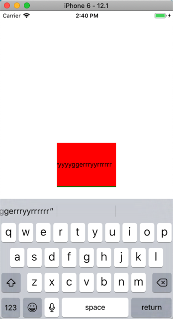
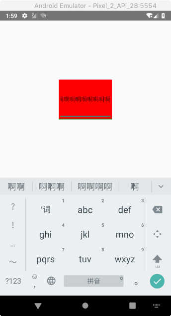
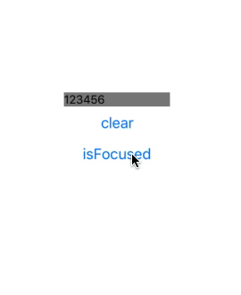

# React Native - 通过 TextInput 处理文本输入

## TextInput 基础

`TextInput` 是一个允许用户输入文本的基本组件，它有着一个 `onChangeText` 方法属性，每次文本发生变化时都会回调该方法，也有着一个 `onSubmitEditing` 方法属性，当文本被 “submit” 时会触发调用。

接下面我们通过一个示例来学习 `TextInput` 的基本使用，实现一个实时文本翻译小程序：把非空格的输入字符转换为 `1`，输入的空格则转换为 `0`。

示例代码如下：

```js
export default class App extends Component<Props> {
  constructor(props) {
    super(props)
    this.state = {
      text: ''
    }
  }

  render() {
    return (
      <View style={styles.container}>
        <Text style={styles.textff}>
          {this.state.text.split('').map(char => {
            return char === ' ' ? '0' : '1'
          }).join('')}
        </Text>
        <TextInput
          style={styles.textInput}
          placeholder='请输入你要翻译的字符'
          onChangeText={(text) => {
            this.setState({
              text: text
            })
          }}
        />
      </View>
    )
  }
}

const styles = StyleSheet.create({
  container: {
    flex: 1,
    flexDirection: 'column',
    justifyContent: 'center',
    alignItems: 'center',
  },
  textInput: {
    width: 300,
    height: 60,
    marginTop: 40,
    padding: 20,
    backgroundColor: 'yellow',
  }
});
```


在上述示例中，我们将 `text` 存储在 `state` 中，因为它会随着用户的输入发生变化。通过文本输入我们可以做很多东西，比如说在用户输入的时候进行验证等。


## TextInput 全面了解

`TextInput` 除了提供 `onChangeText` 和 `onSubmitEditing` 属性之外还提供了很多其它有用的属性，可用来控制自动完成、自动大小写、键盘类型和占位文字等行为或显示内容。 

> 通过 `onChangeText` 事件来读取用户输入是目前从 `TextInput` 中取值的唯一方法。

要注意的是，官方文档上写明有些属性是仅在 `multiline` 为 `true` 或者为 `false` 时才有效地。比如文档上说，当 `multiline = false` 时，为元素的添加某一边框样式 (`borderBottomColor`、`borderLeftWidth` ...) 是不生效的，但在实际测试中发现其实是生效的。这一点令我感到很疑惑，验证示例如下：

```js
export default class App extends Component {
  render() {
    return (
      <View style={styles.container}>
        <TextInput style={styles.textInput} multiline={false}/>
      </View>
    );
  }
}

const styles = StyleSheet.create({
  container: {
    flex: 1,
    justifyContent: 'center',
    alignItems: 'center',
  },
  textInput: {
    width: 128,
    height: 96,
    backgroundColor: 'red',
    borderBottomWidth: 2,
    borderColor: 'green',
  },
});
```

| iOS | Android
| -- | --
|  |  


从上面的实例代码和显示效果图可以看出，即使我们将 `multiline` 属性设置为了 `false`，但 `TextInput` 的 `borderBottomWidth` 和 `borderColor` 依然生效。 

如果你再看仔细点的话，可以发现默认情况下 Android 的 `TextInput` 会有一个底边框。该边框还带有系统提供的 background image 的内边距 (padding)，这是无法改变的。避免该现象的解决方案有两个：

1. 不设置指定高度，系统会处理好底边框的正确显示位置。
2. 将 `underlineColorAndroid` 设置为 `transparent` 来达到一个不显示的效果。

注意，在 Android 中长按选择文本时会导致应用 Activity 的 `windowSoftInputMode` 参数变为 `adjustResize`。这可能导致有着 `position: 'absolute'` 样式的组件在键盘出现时有些异常。要解决这个问题，你需要在 AndroidManifest.xml 中明确指定合适的 [windowSoftInputMode](https://developer.android.com/guide/topics/manifest/activity-element.html) 值，或者是自己监听事件来处理布局变化。

> 实际开发过程中，你还会发现 `TextInput` 在两个平台上的行为有些不一致。
> 
> 比如说，在 iOS 平台上 `TextInput` 可能会自动显示清空按钮，而在 Andorid 平台上上却不会。要想解决这个问题，可能你就得自己定义一个输入组件来抹平这个差异。
> 
> 具体实现可参考 [beeshell](https://github.com/meituan/beeshell) 这个库提供的 Input 组件。

下面我们来一一了解 `TextInput` 组件支持的属性和方法。

### 属性

#### `allowFontScaling`

控制字体是否要根据系统辅助选项设置中的字体大小来进行缩放。默认值为 `true`。

值类型为 `bool`。


#### `autoCapitalize`

控制 `TextInput` 是否要自动将特定字符切换为大写。该属性对于一些键盘类型 (如 `name-phone-pad`) 是不支持的。

可选值如下：

* `characters`: 所有字符串。
* `words`: 单词首字母。
* `sentences`: 语句首字母 (默认值)。
* `none`: 不自动对任何字符转换成大写。


#### `autoCorrect`


If false, disables auto-correct. The default value is true. 

> 在 demo 中使用时，不管是 `true` 还是 `false`，在显示上未见到相关差异。


#### `autoFocus`

如果为 `true` 的话，在 `componentDidMount` 中输入框会自动获得焦点。默认值为 `false`。

值类型为 `bool`。


#### `blurOnSubmit`


如果为 `true`，文本框会在提交的时候失焦。对于单行输入框来说默认值为 `true`，多行输入框则为 `false`。注意：对于多行输入框来说，如果将 `blurOnSubmit` 设为 `true`，则在按下回车键时就会失去焦点同时触发 `onSubmitEditing` 事件，而不会换行。

值类型为 `bool`。


#### `caretHidden`

如果为 `true`，则隐藏光标。默认值为 `false`。

值类型为 `bool`。


#### `clearButtonMode`

文本框右侧清除按钮的类型。仅在单行模式下可用，默认值为 `never`。

仅在 iOS 平台可用，可选值有：

* `never`: 从不显示，不关有木有输入值。
* `while-editing`: 正在输入时显示，可以理解为有获得焦点时 (前提是有输入值)。
* `unless-editing`: 不再输入时显示，可以理解为失去得焦点时(前提是有输入值)。
* `always`: 始终显示 (前提是有输入值)。


#### `clearTextOnFocus`

如果为 `true`，每次开始输入的时候都会清除文本框的内容。

值类型为 `bool`。


#### `contextMenuHidden`

If true, context menu is hidden. The default value is false. 

> 不明觉厉。


#### `dataDetectorTypes`

设置 text input 内能被转化为可点击 URL 的数据的类型。当且仅当 `multiline={true}` 和 `editable={false}` 时起作用。默认情况下不检测任何数据类型。

仅 iOS 可用，可接受一个类型值或类型值的数组，可用类型值如下：

* `phoneNumber`
* `link`
* `address`
* `calendarEvent`
* `none`
* `all`


#### `defaultValue`

提供一个文本框中的初始值。当用户开始输入的时候，值就可以改变。在一些简单的使用情形下，如果你不想用监听消息然后更新 `value` 属性的方法来保持属性和状态同步的时候，就可以用 `defaultValue` 来代替。

值类型为 `string`。


#### `disableFullscreenUI`

当值为 `false` 时, 如果 text input 的周围有少量可用空间的话（比如说，当手机横过来时），操作系统可能会将这个 text input 设置为全屏模式。当值为 `true` 时, 这个特性不可用，text input 就是普通的模式。默认为 `false`。

仅 Android 可用，值类型为 `bool`。


#### `editable`

如果为 `false`，文本框是不可编辑的。默认值为 `true`。


#### `enablesReturnKeyAutomatically`

如果为 `true`，键盘会在文本框内没有文字的时候禁用确认按钮。默认值为 `false`。

值类型为 `bool`。


#### `inlineImageLeft`

指定一个图片放置在左侧。图片必须放置在 `/android/app/src/main/res/drawable` 目录下，经过编译后按如下形式引用（无路径无后缀）：

```xml
<TextInput
 inlineImageLeft='search_icon'
/>
```

仅 Android 平台可用，值类型为 `string`。


#### `inlineImagePadding`

给放置在左侧的图片设置 padding 样式。

仅 Android 平台可用，值类型为 `number`。


#### `keyboardAppearance`

指定键盘的颜色。

可选值有：

* `default`
* `light`
* `dark`


#### `keyboardType`

决定弹出的何种软键盘的，譬如 `numeric`（纯数字键盘）。

这些值在所有平台都可用：

* `default`
* `number-pad`
* `decimal-pad`
* `numeric`
* `email-address`
* `phone-pad`

下面的值仅iOS可用：

* `ascii-capable`
* `numbers-and-punctuation`
* `url`
* `name-phone-pad`
* `twitter`
* `web-search`
  
下面的值仅Android可用：

* `visible-password`


#### `maxLength`

限制文本框中最多的字符数。使用这个属性而不用 JS 逻辑去实现，可以避免闪烁的现象。


#### `multiline`

如果为 `true`，文本框中可以输入多行文字。默认值为 `false`。注意，Android 上如果设置 `multiline={true}`，文本默认会垂直居中，可通过设置 `textAlignVertical: 'top'` 样式来使其居顶显示。


#### `numberOfLines`

设置输入框的行数。当 `multiline` 设置为 `true` 时使用它，可以占据对应的行数。

值类型为 `number`。


#### `onBlur`

当文本框失去焦点的时候调用此回调函数。

值类型为 `function`。

#### `onChange`

当文本框内容变化时调用此回调函数。回调参数为 `{ nativeEvent: { eventCount, target, text}}`。

值类型为 `function`。


#### `onChangeText`

当文本框内容变化时调用此回调函数。改变后的文字内容会作为参数传递。

值类型为 `function`。

> 注：通过 `onChange` 和 `onChangeText` 都是可以拿到最终变化后文本的，但 `onChangeText` 回调函数的参数直接就是我们最终要拿到的值了，而 `onChange` 回调函数则需要通过 `e.nativeEvent.text` 的方式去获取。
> 
> 想要表达的是：在我们自定义原生组件的时候，可以通过类似的设计来简化调用者的使用。

值类型为 `function`。

#### `onContentSizeChange`

当输入内容大小变化时调用该回调函数。回调参数为 `{ nativeEvent: { contentSize: { width, height }}}`。仅当 `multiline={true}` 时可能会被调用。

值类型为 `function`。


#### `onEndEditing`

当文本输入结束后 (比如失去焦点或点击了 return 键) 调用此回调函数。

值类型为 `function`。


#### `onFocus`

当文本框获得焦点的时候调用此回调函数。回调参数为 `{ nativeEvent: { target }}`。

值类型为 `function`。


#### `onKeyPress`

当一个键被按下的时候调用此回调。传递给回调函数的参数为 `{ nativeEvent: { key: keyValue }}`，其中 keyValue 即为被按下的键。会在 `onChange` 之前调用。注意：在Android 上只有软键盘会触发此事件，物理键盘不会触发。

值类型为 `function`。


#### `onLayout`

当组件加载或者布局变化的时候调用，回调参数为 `{ nativeEvent: { layout: { x, y, width, height}, target }}`。

值类型为 `function`。


#### `onScroll`

在内容滚动时持续调用，传回参数的格式形如 `{ nativeEvent: { contentOffset: { x, y }}}`。也可能包含其他和滚动事件相关的参数，但是在 Android 上，出于性能考虑，不会提供 `contentSize` 参数。

值类型为 `function`。


#### `onSelectionChange`

长按选择文本时，选择范围变化时调用此函数，传回参数的格式形如 `{ nativeEvent: { selection: { start, end }}}`。

值类型为 `function`。


#### `onSubmitEditing`

此回调函数当软键盘的确定/提交按钮被按下的时候调用此函数。如果 `multiline={true}`，此属性不可用。

值类型为 `function`。


#### `placeholder`

占位字符串，如果没有任何文字输入，会显示此字符串。

值类型为 `string`。


#### `placeholderTextColor`

占位字符串显示的文字颜色。

值类型为 `color`。


#### `returnKeyLabel`

设置 return 键的文本。可使用该属性来替换 `returnKeyType`。

仅 Android 可用，值类型为 `string`。


#### `returnKeyType`

决定“确定”按钮显示的内容。在 Android 上你还可以使用 returnKeyLabel。

下列这些选项是跨平台可用的：

* `done`
* `go`
* `next`
* `search`
* `send`
  
下列这些选项仅 Android 可用：

* `none`
* `previous`
  
下列这些选项仅 iOS 可用：

* `default`
* `emergency-call`
* `google`
* `join`
* `route`
* `yahoo`


#### `scrollEnabled`

如果为 `false`，则文本内容不可滚动，仅当 `multiline={true}` 时有效。默认值为 `true`。

值类型为 `bool`。


#### `secureTextEntry`

如果为 `true`，文本框会遮住之前输入的文字 (显示为圆点)，这样类似密码之类的敏感文字可以更加安全。默认值为 `false`。`multiline={true}` 时不可用。

值类型为 `bool`。


#### `selection`

设置选中文字的范围（指定首尾的索引值）。如果首尾为同一索引位置，则相当于指定光标的位置。

值类型为 `object: {start: number,end: number}`。


#### `selectionColor`

设置输入框高亮时的颜色（还包括光标）。

值类型为 `color`。


#### `selectionState`

An instance of `DocumentSelectionState`, this is some state that is responsible for maintaining selection information for a document.

Some functionality that can be performed with this instance is:

* `blur()`
* `focus()`
* `update()`

仅 iOS 可用。


#### `selectTextOnFocus`

如果为 `true`，当获得焦点的时候，所有的文字都会被选中。

值类型为 `bool`。


#### `spellCheck`

如果设置为 `false`，则禁用拼写检查的样式（比如错误拼写的单词下的红线）。默认值继承自`autoCorrect`。

值类型为 `bool`。


#### `textContentType`

略，请参考官方文档。


#### `style`

略。


#### `textBreakStrategy`

在 Android API Level 23+ 的平台上设置文字断行策略, 可能值有：

* `simple`
* `highQuality`
* `balanced` 

仅 Android 可用，默认值为 `simple`。


#### `underlineColorAndroid`

文本框的下划线颜色(译注：如果要去掉文本框的边框，请将此属性设为透明 `transparent`)。

值类型为 `string`。


#### `value`

文本框中的文字内容。

`TextInput` 是一个受约束的 (Controlled) 的组件，意味着如果提供了 value 属性，原生值会被强制与 value 属性保持一致。在大部分情况下这都工作的很好，不过有些情况下会导致一些闪烁现象，一个常见的原因就是通过不改变 `value` 来阻止用户进行编辑。

下面两个属性都不会导致闪烁：

* 如果你希望阻止用户输入，可以考虑设置 `editable={false}`。
* 如果你是希望限制输入的长度，可以考虑设置 `maxLength` 属性。

值类型为 `string`。


### 方法

#### `clear()`

```js
clear();
```

清空 `TextInput` 的所有文本。


#### `isFocused()` 

当输入当前处于聚焦状态时返回 `true`；否则返回 `false`。 


上述 `clear()` 和 `isFocused()` 两个方法的使用示例如下：

```js
export default class App extends Component {
  render() {
    return (
      <View style={styles.container}>
        <TextInput 
          style={styles.textInput} 
          ref={ref => this.textInput = ref}
          defaultValue="123456"
        />
        <Button title="clear" onPress={() => this.textInput.clear()} />
        <Button title="isFocused" onPress={() => alert(this.textInput.isFocused())} />
      </View>
    );
  }
}

const styles = StyleSheet.create({
  container: {
    flex: 1,
    justifyContent: 'center',
    alignItems: 'center',
  },
  textInput: {
    width: 128,
    backgroundColor: 'white',
    padding: 0,
    backgroundColor: 'grey',
  },
});
```

 


* 点击 clear 按钮清空输入框文本。
* 第一次点击 isFocused 按钮弹出结果为 false，说明输入框未获得焦点。
* 点击输入框让其获得焦点。
* 再次点击 isFocused 按钮弹出结果为 true，说明输入框已获得焦点。