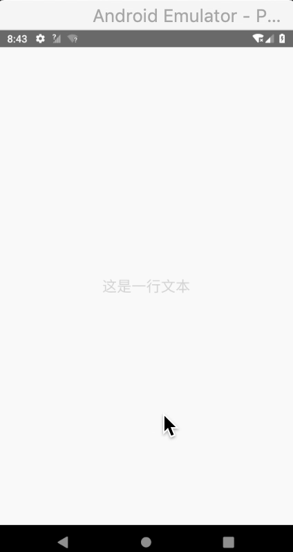

# React Native - 完全理解事件处理

移动应用上的交互主要是触摸，比如点击按钮、在列表上滚动和在地图进行缩放等。RN 既提供了用于处理常见触摸手机的组件，也提供了用于识别复杂手势的手势响应系统。

这篇文章可能有点长，根据以下四个部分由浅入深进行展开：

* **简单组件**：通过 `Button` 和 `Text` 组件接收点击事件。
* **Touchables 系列组件**：这四个 Touchables 组件之间的差异和联系。
* **PanResponder API**：基本知识、基本用法及其实际应用示例。
* **手势响应系统**：基本知识及其使用示例等。

## 简单组件

### Button

一个 `Button` 组件接收点击事件的简单示例：
```js
<Button
  onPress={() => {
    Alert.alert('You tapped the button!');
  }}
  title="Press Me"
/>
```

按钮文字为 `Press Me`，点击时会弹出一个内容为 `You tapped the button!` 的对话框。

要注意的是，RN 默认提供 `Button` 组件在 iOS 和 Andoroid 上的显示效果不一样的：

* 在 iOS 上默认会渲染成一个蓝色的标签状按钮。
* 在 Android 上默认会渲染成一个蓝色圆角巨星带白色文本的按钮。

颜色可以通过 `Button` 的 `color` 属性进行指定，对比图如下：


另一个相对复杂点的 `Button` 示例如下：

```js
export default class App extends Component<Props> {

  _onPressButton() {
    Alert.alert('You tapped the button!')
  }

  render() {
    return (
      <View style={styles.container}>
        <View style={styles.buttonContainer}>
          <Button
            onPress={this._onPressButton}
            title="Press Me"
          />
        </View>
        <View style={styles.buttonContainer}>
          <Button
            onPress={this._onPressButton}
            title="Press Me"
            color="#841584"
          />
        </View>
        <View style={styles.alternativeLayoutButtonContainer}>
          <Button
            onPress={this._onPressButton}
            title="This looks great!"
          />
          <Button
            onPress={this._onPressButton}
            title="OK!"
            color="#841584"
          />
        </View>
      </View>
    )
  }
}

const styles = StyleSheet.create({
  container: {
    flex: 1,
    justifyContent: 'center',
  },
  buttonContainer: {
    margin: 20
  },
  alternativeLayoutButtonContainer: {
    margin: 20,
    flexDirection: 'row',
    justifyContent: 'space-between'
  }
})
```

| iOS | Android
| -- | --
|  | 

> 上述效果图，注意观察按钮和弹出框样式在两个平台上的差异。

### Text

仔细查看 [Text](https://facebook.github.io/react-native/docs/text) 组件的文档可以发现，它也是支持 `onPress` 点击事件的。而且相比 `Button` 组件还多支持了 `onLongPress` 长按事件，示例如下：

```js
export default class App extends Component {
  render() {
    return (
      <View style={styles.container}>
        {/* <Button 
          title="按钮" 
          onPress={() => alert('onPress 事件')}
          disabled={true}
        /> */}
        <Text 
          style={styles.text}
          onPress={() => alert('onPress 事件')}
          onLongPress={() => alert('onLongPress 事件')}
          disabled={true}
        >这是一行文本</Text>
      </View>
    );
  }
}

const styles = StyleSheet.create({
  container: {
    flex: 1,
    justifyContent: 'center',
    alignItems: 'center',
  },
  text: {
    // color: 'black',
    fontSize: 20,
  },
});
```

| iOS | Android
| -- | --
|  | 

在上面的示例代码中，我们故意将 `Text` 组件的 `disabled` 属性设置为 `false`，发现在 iOS 平台上还是能正常触发 `onPress` 和 `onLongPress` 事件的，而 Android 则不能触发。

除此之外还有几点 `Text` 文字颜色上的差异要注意下：

* `disable={true}` 状态下，两个平台中文字显示的颜色不一样。
* 在 `0.55.4` RN 版本中发现，如果不在 `style` 指定 `color` 样式，Android 平台上显示的文字颜色默认为白色，而在 iOS 平台上默认为黑色。


## Touchables 系列组件

### 概述

如果 RN 默认提供的 `Button` 和 `Text` 组件满足不了你对点击事件的需求，可以尝试使用 RN 另外提供的 `Touchables` 系列组件。

`Touchables` 系列组件不仅能识别触摸事件，还能在识别到事件时进行一定的反馈显示。`Touchables` 系列组件一共有四个，都没有提供默认样式，需要根据你自己的需要进行指定，简单列举如下：

* [TouchableHighlight](https://facebook.github.io/react-native/docs/touchablehighlight.html): 比较常用，此组件的背景会在用户手指按下时变暗。
* [TouchableOpacity](https://facebook.github.io/react-native/docs/touchableopacity.html): 也比较常用，在用户手指按下时会降低按钮透明度，但不会改变背景颜色。
* [TouchableNativeFeedback](https://facebook.github.io/react-native/docs/touchablenativefeedback.html): 仅 Android 平台可用，在用户手指按下时形成类似墨水涟漪的视觉效果。
* [TouchableWithoutFeedback](https://facebook.github.io/react-native/docs/touchablewithoutfeedback.html): 无任何视觉反馈。

示例如下：

```js
export default class App extends Component<Props> {

  _onPressButton() {
    Alert.alert('You tapped the button!')
  }

  _onLongPressButton() {
    Alert.alert('You long-pressed the button!')
  }

  render() {
    return (
      <View style={styles.container}>
        <TouchableHighlight onPress={this._onPressButton} underlayColor="white">
          <View style={styles.button}>
            <Text style={styles.buttonText}>TouchableHighlight</Text>
          </View>
        </TouchableHighlight>
        <TouchableOpacity onPress={this._onPressButton}>
          <View style={styles.button}>
            <Text style={styles.buttonText}>TouchableOpacity</Text>
          </View>
        </TouchableOpacity>
        <TouchableNativeFeedback
          onPress={this._onPressButton}
          background={Platform.OS === 'android' ? TouchableNativeFeedback.SelectableBackground() : ''}>
          <View style={styles.button}>
            <Text style={styles.buttonText}>TouchableNativeFeedback</Text>
          </View>
        </TouchableNativeFeedback>
        <TouchableWithoutFeedback
          onPress={this._onPressButton}
        >
          <View style={styles.button}>
            <Text style={styles.buttonText}>TouchableWithoutFeedback</Text>
          </View>
        </TouchableWithoutFeedback>
        <TouchableHighlight onPress={this._onPressButton} onLongPress={this._onLongPressButton} underlayColor="white">
          <View style={styles.button}>
            <Text style={styles.buttonText}>Touchable with Long Press</Text>
          </View>
        </TouchableHighlight>
      </View>
    )
  }
}

const styles = StyleSheet.create({
  container: {
    paddingTop: 60,
    alignItems: 'center'
  },
  button: {
    marginBottom: 30,
    width: 260,
    alignItems: 'center',
    backgroundColor: '#2196F3'
  },
  buttonText: {
    padding: 20,
    color: 'white'
  }
})
```

| iOS | Android
| -- | --
|  | 

### 区别和联系

仔细看上面示例的效果图，可以在「不同组件」和「不同平台」对比出四个组件在显示上的差异。在实际开发中，我们要根据实际需要去使用其中一个或多个组件来满足需求。因为 `Button` 在两个平台上的显示不一致，所以实际上我们可能还需要封装其中一个 Touchables 组件来达到在两个平台上显示效果一致的目的。

仔细查看官方提供的文档可知，`TouchableHighlight`、`TouchableOpacity` 和 `TouchableNativeFeedback` 这三个组件支持 `TouchableWithoutFeedback` 组件的所有属性，然后这三个组件再分别提供一些独有的属性。所以下面我们分析官方文档时，先从 `TouchableWithoutFeedback` 组件开始。

### TouchableWithoutFeedback

官方文档说了，除非你有充分的理由，否则不要使用 `TouchableWithoutFeedback` 这个组件。因为一般情况下，我们都是需要对用户的触摸交互进行一定反馈的。

注意，`TouchableWithoutFeedback` 组件仅支持一个子节点，不能多也不能少，否则你会收到满屏的红色炸弹：


如果你希望包含多个子组件，可以包装在一个 `View` 内。

`TouchableWithoutFeedback` 组件常见属性如下：

#### `delayLongPress`

从 `onPressIn` 开始，到 `onLongPress` 被调用的延迟时间。

值类型为 `number`，单位是毫秒。


#### `delayPressIn`

从触摸操作开始到 `onPressIn` 被调用的延迟时间。

值类型为 `number`，单位是毫秒。


#### `delayPressOut`

从触摸操作结束开始到onPressOut被调用的延迟。

值类型为 `number`，单位是毫秒。


#### `disabled`

如果设为 `true`，则禁止此组件的一切交互。

值类型为 `bool`。


#### `hitSlop`

这一属性定义了按钮的外延范围。这一范围也会使 `pressRetentionOffset` 变得更大。 

> 注意：触摸范围不会超过父视图的边界，也不会影响原先和本组件层叠的视图 (保留原先的触摸优先级)。

值类型为 `object: {top: number, left: number, bottom: number, right: number}`。


#### `onBlur`

失去焦点时会回调该方法。

值类型为 `function`。


#### `onFocus`

获得焦点时会回调该方法。

值类型为 `function`。


#### `onLayout`

当加载或者布局改变的时候被调用，参数为：`{nativeEvent: {layout: {x, y, width, height}}}`。

值类型为 `function`。


#### `onLongPress`

长按时会回调该方法。

值类型为 `function`。


#### `onPress`

当触摸操作结束时调用，但如果被取消了则不调用 (譬如响应者被一个滚动操作取代)。

值类型为 `function`。


#### `onPressIn`

在组件被触摸的瞬间调用，在 `onPress` 之前调用。在某些场景下，可用于发起网络请求。

值类型为 `function`。


#### `onPressOut`

在组件不再被触摸 (触摸点离开组件) 时调用，在 `onPress` 之前调用。

值类型为 `function`。


#### `pressRetentionOffset`

在当前视图不能滚动的前提下指定这个属性，可以决定当手指移开多远距离之后，会不再激活按钮。但如果手指再次移回范围内，按钮会被再次激活。只要视图不能滚动，你可以来回多次这样的操作。确保你传入一个常量来减少内存分配。

值类型为 `object: {top: number, left: number, bottom: number, right: number}`。


### TouchableHighlight

`TouchableHighlight` 组件可用于封装视图，使其可正确响应触摸操作。当按下时，封装视图的不透明度会降低，同时会有一个底层的颜色透过而被用户看到，使得视图变暗或变量。

在底层实现上，实际会创建一个新的视图到视图层级中，如果使用的方法不正确，有时候会导致一些不希望出现的视觉效果。比如，没有给视图的 `backgroundColor` 显式声明一个不透明的颜色。

`TouchableHighlight` 和 `TouchableWithoutFeedback` 一样，都只支持一个子节点。如果希望包含多个子组件，也同样可以用一个 `View` 来包装它们。

示例：

```js
export default class App extends Component {
  constructor(props) {
    super(props)
    this.state = { count: 0 }
  }

  onPress = () => {
    this.setState({
      count: this.state.count + 1
    })
  }

 render() {
    return (
      <View style={styles.container}>
        <TouchableHighlight
         style={styles.button}
         onPress={this.onPress}
        >
         <Text style={styles.text}> Touch Here </Text>
        </TouchableHighlight>
        <View style={[styles.countContainer]}>
          <Text style={[styles.countText]}>
            { this.state.count !==  0 ? this.state.count : null}
          </Text>
        </View>
      </View>
    )
  }
}

const styles = StyleSheet.create({
  container: {
    flex: 1,
    justifyContent: 'center',
    paddingHorizontal: 10,
  },
  button: {
    alignItems: 'center',
    backgroundColor: '#DDDDDD',
  },
  countContainer: {
    alignItems: 'center',
    padding: 12,
  },
  countText: {
    color: '#FF00FF',
  },
  text: {
    padding: 12,
    backgroundColor: 'red'
  }
})
```

| 点击前 | 点击时
| -- | --
|  | 
</p>

相比 `TouchableWithoutFeedback`，`TouchableHighlight` 多了以下属性：

* `activeOpacity`: 指定封装的视图在被触摸操作激活时以多少不透明度显示（0到1之间，默认值为0.85），值类型为 `number`。
* `onHideUnderlay`: 底层的颜色被隐藏的时候调用，值类型为 `function`。
* `onShowUnderlay`: 当底层的颜色被显示的时候调用，值类型为 `function`。
* `underlayColor`: 有触摸操作时显示出来的底层的颜色，值类型为 `color`。

### TouchableOpacity

本组件用于封装视图，使其可以正确响应触摸操作。当按下的时候，封装的视图的不透明度会降低。

不透明度的变化是通过把子元素封装在一个 `Animated.View` 中来实现的，这个动画视图会被添加到视图层级中，少数情况下有可能会影响到布局。

> 注：此组件与 `TouchableHighlight` 的区别在于并没有额外的颜色变化，更适于一般场景。

我们将 `TouchableHighlight` 示例代码中的 `TouchableHighlight` 直接替换成 `TouchableOpacity`，效果图如下：

| 点击前 | 点击时
| -- | --
|  | 
</p>


相比 `TouchableWithoutFeedback`，`TouchableOpacity` 多了以下属性：

* `activeOpacity`:  指定封装的视图在被触摸操作激活时以多少不透明度显示（0到1之间）。值类型为 `number`，默认值为 0.2。

同时 `TouchableOpacity` 有一个 `setOpacityTo()` 方法，将本组件的不透明度设为指定值（伴有过渡动画）。方法原型如下：

```js
setOpacityTo((value: number), (duration: number));
```

### TouchableNativeFeedback

本组件用于封装视图，使其可以正确响应触摸操作（仅限 Android 平台）。在 Android 设备上，这个组件利用原生状态来渲染触摸的反馈。

目前它只支持一个单独的 `View` 实例作为子节点。在底层实现上，实际会创建一个新的 `RCTView` 节点替换当前的子 `View`，并附带一些额外的属性。

原生触摸操作反馈的背景可以使用 `background` 属性来自定义。

相比 `TouchableWithoutFeedback`，`TouchableNativeFeedback` 多了以下属性：

* `background`: 决定在触摸反馈的时候显示什么类型的背景。它接受一个有着 `type` 属性和一些基于 `type` 属性的额外数据的对象。我们推荐选用本组件的几个静态方法来创建这个对象。值类型为 `backgroundPropType`。
* `useForeground`: Set to true to add the ripple effect to the foreground of the view, instead of the background. This is useful if one of your child views has a background of its own, or you're e.g. displaying images, and you don't want the ripple to be covered by them. Check TouchableNativeFeedback.canUseNativeForeground() first, as this is only available on Android 6.0 and above. If you try to use this on older versions you will get a warning and fallback to background. 值类型为 `bool`。

`TouchableNativeFeedback` 有着以下方法：

* `SelectableBackground()`: 会创建一个对象，表示安卓主题默认的对于被选中对象的背景(?android:attr/selectableItemBackground)。
* `SelectableBackgroundBorderless()`: 会创建一个对象，表示安卓主题默认的对于被选中的无边框对象的背景(?android:attr/selectableItemBackgroundBorderless)。只适用于Android API level 21+。
* `Ripple(color: string, borderless: boolean)`: 会创建一个对象，当按钮被按下时产生一个涟漪状的背景，你可以通过color参数来指定颜色，如果参数borderless是true，那么涟漪还会渲染到视图的范围之外（参见原生的actionbar buttons作为该效果的一个例子）。这个背景类型只在Android API level 21+适用。

> 因为 `TouchableNativeFeedback` 仅适用于 Android 平台，且比较受于 `Android API 21` 的限制，在实际开发中较少适用。

上面基本已经介绍完了 Touchables 系列组件，下面先补充一些相关知识点吧：

**长按**：在一些场景下，你可能想要检测用户是否长时间按住一个视图。这些长按的操作可以通过任何 `Touchables` 相关组件的 `onLongPress` 方法属性进行处理。

**双指缩放**：如果在 `ScrollView` 中只放置一个组件，则可以用来实现缩放操作。设置其 `maximumZoomScale` 和 `minimumZoomScale` 属性即可以使用户能够缩放其中的内容。

**在列表中上下滑动和在视图上左右滑动**：

* `ScrollView` 可以在垂直或水平方向滚动，还可以配置 `pagingEnabled` 属性来让用户整屏整屏的滑动。此外，水平方向的滑动还可以使用 `Android` 上的 `ViewPagerAndroid` 组件。
* `ListView` 则是一种特殊的 `ScrollView`，用于显示比较长的垂直列表。它还可以显示分区块的头部和尾部，类似 `iOS` 上的 `UITableView` 控件。

**处理其他的手势**：如果你想实现视图的拖拽，或是实现自定义的手势，可参阅 [PanResponder API](https://facebook.github.io/react-native/docs/panresponder.html) 或 [Gesture Responder System](https://facebook.github.io/react-native/docs/gesture-responder-system.html) 文档。


## PanResponder API

### 概述 

`PanResponder` 类可以将多点触摸操作协调成一个手势。它使得一个单点触摸可以接受更多的触摸操作，也可以用于识别简单的多点触摸手势。

默认情况下 `PanResponder` 会通过 `InteractionManager` 来阻止长时间运行的 JS 事件打断当前的手势活动。

它提供了一个对触摸响应系统响应器的可预测的包装。对于每一个处理函数，它在原生事件之外提供了一个新的 `gestureState` 对象：

```js
onPanResponderMove: (event, gestureState) => {}
```

原生事件是指由以下字段组成的合成触摸事件：

* `nativeEvent`
  * `changedTouches` - 在上一次事件之后，所有发生变化的触摸事件的数组集合（即上一次事件后，所有移动过的触摸点）
  * `identifier` - 触摸点的 ID
  * `locationX` - 触摸点相对于父元素的横坐标
  * `locationY` - 触摸点相对于父元素的纵坐标
  * `pageX` - 触摸点相对于根元素的横坐标
  * `pageY` - 触摸点相对于根元素的纵坐标
  * `target` - 触摸点所在的元素 ID
  * `timestamp` - 触摸事件的时间戳，可用于移动速度的计算
  * `touches` - 当前屏幕上的所有触摸点的集合

一个 `gestureState` 对象有如下的字段：

* `stateID` - 触摸状态的 ID。在屏幕上有至少一个触摸点的情况下，这个 ID 会一直有效。
* `moveX` - 最近一次移动时的屏幕横坐标
* `moveY` - 最近一次移动时的屏幕纵坐标
* `x0` - 当响应器产生时的屏幕坐标
* `y0` - 当响应器产生时的屏幕坐标
* `dx` - 从触摸操作开始时的累计横向路程
* `dy` - 从触摸操作开始时的累计纵向路程
* `vx` - 当前的横向移动速度
* `vy` - 当前的纵向移动速度
* `numberActiveTouches` - 当前在屏幕上的有效触摸点的数量

基本用法示例如下：

```js
componentWillMount: function() {
  this._panResponder = PanResponder.create({
    // 要求成为响应者：
    onStartShouldSetPanResponder: (evt, gestureState) => true,
    onStartShouldSetPanResponderCapture: (evt, gestureState) => true,
    onMoveShouldSetPanResponder: (evt, gestureState) => true,
    onMoveShouldSetPanResponderCapture: (evt, gestureState) => true,

    onPanResponderGrant: (evt, gestureState) => {
      // 开始手势操作。给用户一些视觉反馈，让他们知道发生了什么事情

      // gestureState.{x,y} 现在会被设置为 0
    },
    onPanResponderMove: (evt, gestureState) => {
      // 最近一次的移动距离为 gestureState.move{X,Y}

      // 从成为响应者开始时的累计手势移动距离为 gestureState.d{x,y}
    },
    onPanResponderTerminationRequest: (evt, gestureState) => true,
    onPanResponderRelease: (evt, gestureState) => {
      // 用户放开了所有的触摸点，且此时视图已经成为了响应者
      // 一般来说这意味着一个手势操作已经成功完成
    },
    onPanResponderTerminate: (evt, gestureState) => {
      // 另一个组件已经成为了新的响应者，所以当前手势将被取消
    },
    onShouldBlockNativeResponder: (evt, gestureState) => {
      // 返回一个布尔值，决定当前组件是否应该阻止原生组件成为JS响应者
      // 默认返回true。目前暂时只支持 Android
      return true;
    },
  });
},

render: function() {
  return (
    <View {...this._panResponder.panHandlers} />
  );
},
``` 

### 实际应用示例

下面我们来实现一个简单的拖拽 View 的例子：

```js
export default class App extends Component {
  
  state = {
    bg: 'yellow',
    top: 0,
    left: 0,
  }

  top = 0
  left = 0

  panResponder = PanResponder.create({
    onStartShouldSetPanResponder: () => true,
    onMoveShouldSetPanResponder: () => true,
    onPanResponderGrant: () => {
      const { top, left } = this.state
      this.top = top
      this.left = left
      this.setState({ bg: 'red' })
    },
    onPanResponderMove: (evt, gestureState) => {
      this.setState({
        top: this.top + gestureState.dy,
        left: this.left + gestureState.dx
      })
    },
    onPanResponderRelease: (evt, gestureState) => {
      this.setState({
        bg: 'yellow',
        top: this.top + gestureState.dy,
        left: this.left + gestureState.dx
      })
    }
  })

  render() {
    const { bg, top, left } = this.state 
    const newStyle = {
      backgroundColor: bg,
      top: top,
      left: left,
    }
    return (
      <View 
        {...this.panResponder.panHandlers}
        style={[styles.container, newStyle]}
      >
        <Text> ^_^ </Text>
      </View>
    )
  }
}

const styles = StyleSheet.create({
  container: {
    position: 'absolute',
    width: 128,
    height: 128,
    justifyContent: 'center',
    alignItems: 'center',
  },
})
```

运行成功后，效果图如下：


触摸时视图背景色变为红色，视图会跟着触摸位置移动而移动，释放触摸时背景色变回黄色。


## 手势响应系统

用户之所以会觉得 web app 和原生 app 在体验上有巨大的差异，触摸响应是一大关键因素。用户的每一个操作都应该具有下列属性：

**反馈/高亮**：让用户看到他们到底按到了什么东西，以及松开手后会发生什么。取消功能 —— 当用户正在触摸操作时，应该是可以通过把手指移开来终止操作。这些特性使得用户在使用 App 时体验更好，因为它们可以让用户大胆试用，而不必担心点错了什么。


### 响应者的生命周期

一个 View 只要实现了正确的协商方法，就可以成为触摸事件的响应者。

**我们通过两个方法去询问一个 View 是否愿意成为响应者：**

* `View.props.onStartShouldSetResponder: (evt) => true`：在用户开始触摸的时候（手指刚刚接触屏幕的瞬间），是否愿意成为响应者？
* `View.props.onMoveShouldSetResponder: (evt) => true`：如果 View 不是响应者，那么在每一个触摸点开始移动（没有停下也没有离开屏幕）时再询问一次：是否愿意响应触摸交互呢？


**如果 View 返回 true，并开始尝试成为响应者，那么会触发下列事件之一：**

* `View.props.onResponderGrant: (evt) => {}`：View 现在要开始响应触摸事件了。这也是需要做高亮的时候，使用户知道他到底点到了哪里。
* `View.props.onResponderReject: (evt) => {}`：响应者现在另有其人且暂时不会放权，请另作安排。


**如果 View 已经开始响应触摸事件了，那么下列这些处理函数会被一一调用：**

* `View.props.onResponderMove: (evt) => {}`：用户正在屏幕上移动手指时，没有停下也没有离开屏幕。
* `View.props.onResponderRelease: (evt) => {}`：触摸操作结束时触发，比如手指抬起离开屏幕。
* `View.props.onResponderTerminationRequest: (evt) => true`：有其它组件请求接替响应者，当前的 View 是否放权？返回 true 的话则释放响应者权力。
* `View.props.onResponderTerminate: (evt) => {}`：响应者权力已经交出。这可能是由于其他 View 通过 `onResponderTerminationRequest` 请求的，也可能是由操作系统强制夺权（比如 iOS 上的控制中心或是通知中心）。


`evt` 是一个合成事件，它包含以下结构：

* `nativeEvent`
  * `changedTouches`：在上一次事件之后，所有发生变化的触摸事件的数组集合（即上一次事件后，所有移动过的触摸点）
  * `identifier`：触摸点的 ID
  * `locationX`：触摸点相对于当前元素的横坐标
  * `locationY`：触摸点相对于当前元素的纵坐标
  * `pageX`：触摸点相对于根元素的横坐标
  * `pageY`：触摸点相对于根元素的纵坐标
  * `target`：触摸点所在的元素 ID
  * `timestamp`：触摸事件的时间戳，可用于移动速度的计算
  * `touches`：当前屏幕上的所有触摸点的集合


### 捕获 ShouldSet 事件处理

`onStartShouldSetResponder` 与 `onMoveShouldSetResponder` 是以冒泡的形式调用的，即 **嵌套最深的节点最先调用**。这意味着当多个 View 同时在 `*ShouldSetResponder` 中返回 `true` 时，最底层的 View 将优先夺权。在多数情况下这并没有什么问题，因为这样可以确保所有控件和按钮是可用的。

但是有些时候，某个父 View 会希望能先成为响应者。我们可以利用“捕获期”来解决这一需求。响应系统在从最底层的组件开始冒泡之前，会首先执行一个“捕获期”，在此期间会触发 `on*ShouldSetResponderCapture` 系列事件。因此，如果某个父 View 想要在触摸操作开始时阻止子组件成为响应者，那就应该处理 `onStartShouldSetResponderCapture` 事件并返回 `true` 值。

* `View.props.onStartShouldSetResponderCapture: (evt) => true`
* `View.props.onMoveShouldSetResponderCapture: (evt) => true`