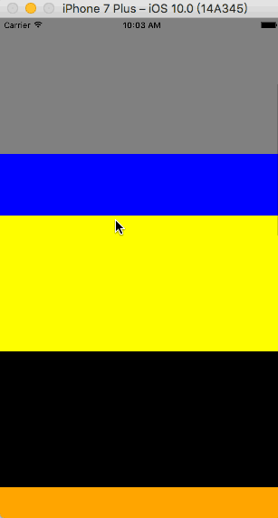

# 使用 ScrollView

## 概述

`ScrollView` 是一个通用的可滚动的容器组件，你可以在其中放入各种各样的组件或视图。通过其 `horizontal` 属性可以控制是横向滚动，亦或是垂直滚动。

下面是一个在 `ScrollView` 中混杂了图片和文字的组件：

先准备三张图片 (示例将图片放置在了 `./res/images/` 目录下)：

| a.jpg | b.jpg | c.jpg
| -- | -- | --
|  |  | 

```js
// 默认是垂直方向
export default class App extends Component<Props> {
  render() {
    return (
      <ScrollView>
        <Image source={require('./res/images/a.jpg')}/>
        <Text style={{color: 'red'}}>上面是图A</Text>
        <Image source={require('./res/images/b.jpg')}/>
        <Text style={{color: 'red'}}>------- 上面是图B</Text>
        <Image source={require('./res/images/c.jpg')}/>
        <Text style={{color: 'red'}}>-------------- 上面是图C</Text>
      </ScrollView>
    )
  }
}
```


```js
// 显式指定水平方向
export default class App extends Component<Props> {
  render() {
    return (
      <ScrollView horizontal={true}>
        <Image source={require('./res/images/a.jpg')}/>
        <Text style={{color: 'red'}}>上面是图A</Text>
        <Image source={require('./res/images/b.jpg')}/>
        <Text style={{color: 'red'}}>------- 上面是图B</Text>
        <Image source={require('./res/images/c.jpg')}/>
        <Text style={{color: 'red'}}>-------------- 上面是图C</Text>
      </ScrollView>
    )
  }
}
```


`ScrollView` 适合用来显示数量不多的滚动元素，因为放置在 `ScollView` 中的所有组件都会被渲染，即使有些组件因为内容太长被挤出了屏幕外。


## 官方文档

### 介绍

据官方文档描述，RN 中的 `ScrollView` 实际上是在原生平台的 ScrollView 上包装了一层，然后提供了与触摸锁定的 "响应器 (responder)" 系统。

如果你去看 Andorid 部分的 React Native 代码会发现，RN 的 ScrollView 其实是直接继承自 Android 的 ScrollView 的，部分源码如下：

```java
package com.facebook.react.views.scroll;

/**
 * A simple subclass of ScrollView that doesn't dispatch measure and layout to its children and has
 * a scroll listener to send scroll events to JS.
 *
 * <p>ReactScrollView only supports vertical scrolling. For horizontal scrolling,
 * use {@link ReactHorizontalScrollView}.
 */
public class ReactScrollView extends ScrollView implements ReactClippingViewGroup, ViewGroup.OnHierarchyChangeListener, View.OnLayoutChangeListener {
    ...

    @Override
    protected void onMeasure(int widthMeasureSpec, int heightMeasureSpec) {
      MeasureSpecAssertions.assertExplicitMeasureSpec(widthMeasureSpec, heightMeasureSpec);

      setMeasuredDimension(
          MeasureSpec.getSize(widthMeasureSpec),
          MeasureSpec.getSize(heightMeasureSpec));
    }

    @Override
    protected void onLayout(boolean changed, int l, int t, int r, int b) {
      // Call with the present values in order to re-layout if necessary
      scrollTo(getScrollX(), getScrollY());
    }

    @Override
    protected void onScrollChanged(int x, int y, int oldX, int oldY) {
      super.onScrollChanged(x, y, oldX, oldY);

      mActivelyScrolling = true;

      if (mOnScrollDispatchHelper.onScrollChanged(x, y)) {
        if (mRemoveClippedSubviews) {
          updateClippingRect();
        }

        ReactScrollViewHelper.emitScrollEvent(
          this,
          mOnScrollDispatchHelper.getXFlingVelocity(),
          mOnScrollDispatchHelper.getYFlingVelocity());
      }
    }
}

/**
 * Similar to {@link ReactScrollView} but only supports horizontal scrolling.
 */
public class ReactHorizontalScrollView extends HorizontalScrollView implements
    ReactClippingViewGroup {
    ...
}
```

**以下内容摘选自 React Native 中文网：**

记住 ScrollView 必须有一个确定的高度才能正常工作，因为它实际上所做的就是将一系列不确定高度的子组件装进一个确定高度的容器 (通过滚动操作)。要给 ScrollView 一个确定的高度的话，要么直接给它设置高度 (不建议)，要么确定所有的父容器都有确定的高度。一般来说我们会给 ScrollView 设置 `flex: 1` 以使其自动填充父容器的空余空间，但前提条件是所有的父容器本身也设置了 flex 或者指定了高度，否则就会导致无法正常滚动，你可以使用元素查看器来查找具体哪一层高度不正确。

ScrollView 内部的其他响应者尚无法阻止 ScrollView 本身成为响应者。

`ScrollView` 和 `FlatList` 应该如何选择？`ScrollView` 会简单粗暴地把所有子元素一次性全部渲染出来。其原理浅显易懂，使用上自然也最简单。然而这样简单的渲染逻辑自然带来了性能上的不足。想象一下你有一个特别长的列表需要显示，可能有好几屏的高度。创建和渲染那些屏幕以外的JS组件和原生视图，显然对于渲染性能和内存占用都是一种极大的拖累和浪费。

这就是为什么我们还有专门的 `FlatList` 组件。`FlatList` 会惰性渲染子元素，只在它们将要出现在屏幕中时开始渲染。这种惰性渲染逻辑要复杂很多，因而API在使用上也更为繁琐。除非你要渲染的数据特别少，否则你都应该尽量使用 `FlatList`，哪怕它们用起来更麻烦。

此外 `FlatList` 还可以方便地渲染行间分隔线，支持多列布局，无限滚动加载等等。


### 属性

ScrollView 的属性比较多，我们挑几个来重点讲下。

**`contentContainerStyle`**

这些样式会应用到一个内层的内容容器上，所有的子视图都会包裹在内容容器内。示例：

```js
return (
  <ScrollView contentContainerStyle={styles.contentContainer}>
  </ScrollView>
);
...
const styles = StyleSheet.create({
  contentContainer: {
    paddingVertical: 20
  }
});
```

也就是说，ScrollView 的所有子视图与 ScrollView 中间实际上还有一个 "内容容器视图"。在 Android 原生中，ScrollView 是只能有一个 "子视图" (假设是 A) 的，A 内部的子视图个数则不再受限制，可以将 A 理解上前面提到的 "内容容器视图"。

·

**`keyboardDismissMode`**

用户拖拽滚动视图的时候，是否要隐藏软键盘。

* `none`: 默认值，拖拽时不隐藏软键盘。
* `on-drag`: 当拖拽开始的时候隐藏软键盘。
* `interactive`: 仅 iOS 支持，软键盘伴随拖拽操作同步地消失，并且如果往上滑动会恢复键盘。

·

**`endFillColor`**

有时候滚动视图会占据比实际内容更多的空间。这种情况下可以使用此属性，指定以某种颜色来填充多余的空间，以避免设置背景和创建不必要的绘制开销。

·

**`scrollEventThrottle`**

单词 `throttle` 意为节流，这个属性控制在滚动过程中，`scroll` 事件被调用的频率（单位是每秒事件数量）。更大的数值能够更及时的跟踪滚动位置，不过可能会带来性能问题，因为更多的信息会通过 bridge 传递。默认值为0，意味着每次视图被滚动，`scroll` 事件只会被调用一次。

·

**`stickyHeaderIndices`**

一个子视图下标的数组，用于决定哪些成员会在滚动之后固定在屏幕顶端。举个例子，传递 `stickyHeaderIndices={[0]}` 会让第一个成员固定在滚动视图顶端。这个属性不能和 `horizontal={true}` 一起使用。

示例 (注意灰色子视图):




### 方法

**`flashScrollIndicators()`**

暂时显示滚动指示器。

·

**`scrollTo(([y]: number), object, ([x]: number), ([animated]: boolean), ([duration]: number));`**

使用平滑动画立即滚动到给定的 x，y 偏移，自定义动画持续时间 (仅限于 Android)。


**`scrollToEnd(([options]: {animated: boolean, duration: number}));`**

如果是垂直 ScrollView 则滚动到底部，如果是水平 ScrollView 则向右滚动。


## 总结

一般来说 ScrollView 的使用频率还是蛮高的，在实际使用过程 (生产环境) 中发现，如果 ScrollView 中的内容比较多的话渲染会有点慢，有点小白屏的感觉。另外，ScrollView 并没有提供直接的上拉到底部的回调方法，虽然可以通过一些折中手段实现，但终究没有像在 FaltList 中直接使用回调方法那样优雅。