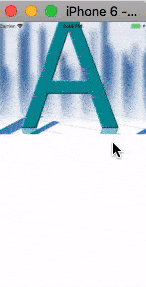

# 使用 ScrollView

`ScrollView` 是一个通用的可滚动的容器组件，你可以在其中放入各种各样的组件或视图。通过其 `horizontal` 属性可以控制是横向滚动，亦或是垂直滚动。

下面是一个在 `ScrollView` 中混杂了图片和文字的组件：

先准备三张图片（示例将图片放置在了 `./res/images/` 目录下）：

| a.jpg | b.jpg | c.jpg
| -- | -- | --
|  |  | 

```js
// 代码片段 1
export default class App extends Component<Props> {
  render() {
    return (
      <ScrollView>
        <Image source={require('./res/images/a.jpg')}/>
        <Text style={{color: 'red'}}>上面是图A</Text>
        <Image source={require('./res/images/b.jpg')}/>
        <Text style={{color: 'red'}}>------- 上面是图B</Text>
        <Image source={require('./res/images/c.jpg')}/>
        <Text style={{color: 'red'}}>-------------- 上面是图C</Text>
      </ScrollView>
    )
  }
}

// 代码片段 2
export default class App extends Component<Props> {
  render() {
    return (
      <ScrollView horizontal={true}>
        <Image source={require('./res/images/a.jpg')}/>
        <Text style={{color: 'red'}}>上面是图A</Text>
        <Image source={require('./res/images/b.jpg')}/>
        <Text style={{color: 'red'}}>------- 上面是图B</Text>
        <Image source={require('./res/images/c.jpg')}/>
        <Text style={{color: 'red'}}>-------------- 上面是图C</Text>
      </ScrollView>
    )
  }
}
```

| 代码片段1: vertical | 代码片段2: horizontal
| -- | --
|  | 


`ScrollView` 适合用来显示数量不多的滚动元素，因为放置在 `ScollView` 中的所有组件都会被渲染，即使有些组件因为内容太长被挤出了屏幕外。
