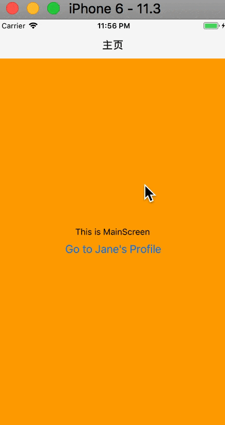
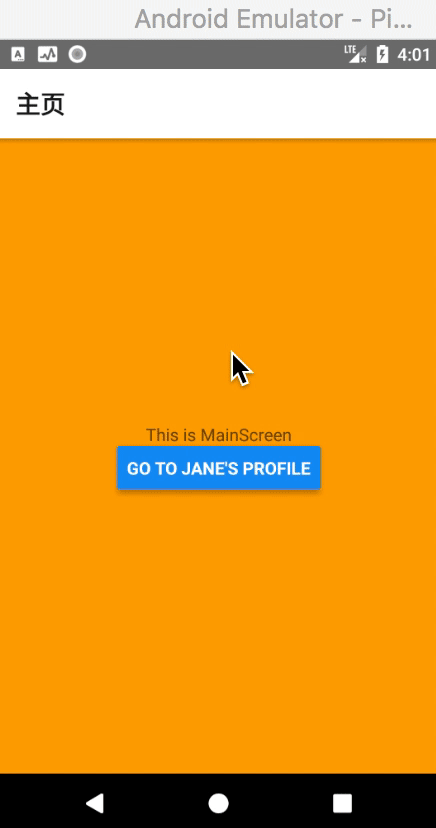

# React Native - 页面间的导航跳转

移动应用通常会由多个页面组成，功能相近 (处于同一模块) 的页面还可以组成一个栈，然后再由栈组成应用。在 React Native 中，页面的呈现、跳转也是由组件进行管理的 (正所谓一切皆组件)，这个特殊的组件称为 "导航器 (Navigator)"。

本文总结了 React Native 中几个常用的导航组件 (navigation components)。
* 如果你刚开始接触 navigation，使用 [React navigation](https://facebook.github.io/react-native/docs/navigation.html#react-navigation) 是个不错的选择。
* 如果你只针对 iOS 平台开发，并且想和原生外观一致，那么可以选择 [NavigatorIOS](https://facebook.github.io/react-native/docs/navigation.html#navigatorios)。

React Navigation 提供了一个易于使用的导航解决方案，能够在 iOS 和 Android上 呈现常见堆栈导航和选项卡式导航模式。由于这是一个 JavaScript 的实现，它在与诸如 [redux](https://reactnavigation.org/docs/redux-integration.html) 等状态管理库进行集成时，能提供了最大的可配置性和灵活性。NavigatorIOS 提供了 iOS 本地 `UINavigationController` 类的包装，无法在 Android 上运行。


如果你希望在 iOS 和 Android 上实现原生的外观和感觉，或者将 React Native 集成到原生管理导航的应用中，可以考虑使用以下两个库：
  * [native-navigation](http://airbnb.io/native-navigation/)
  * [react-native-navigation](https://github.com/wix/react-native-navigation)


> 注：站在 2019-07 这个时间点回头看，不用犹豫，直接上 `react-navigation` 就好了。因为使用 React Native 开发时你不可能是只针对 iOS 平台，而且如今 `react-navigation` 已经发展到 3.x 版本，相对来说已经发展得很成熟。除非你是想通过原生来管理路由，不然好像也没有其它选择。当然，管理 React Native 应用路由的一个比较好的做法可能是 Native 和 react-navigation 相结合。


## React Navigation

如今社区推荐的导航方案是使用一个单独的导航库 `react-navigation`，它使得开发者只需几行代码即可设置应用的各个页面。

首先，在你项目中进行安装：

```shell
$ npm install --save react-navigation
```

```
npm WARN eslint-plugin-react-native@3.2.1 requires a peer of eslint@^3.17.0 || ^4.0.0 but none is installed. You must install peer dependencies yourself.

+ react-navigation@2.0.4
added 17 packages in 9.099s
```

然后，你就可以快速创建多页面的应用了，举个栗子：

### 先创建两个页面 Main 和 Profile 

`./src/screens/MainScreen.js` :

```js
import React, { Component } from 'react'
import {
  StyleSheet,
  View,
  Text,
  Button,
} from 'react-native'

export default class MainScreen extends Component {

  static navigationOptions = {
    title: '主页'
  }

  render() {
    const { navigate } = this.props.navigation
    return (
      <View style={styles.container}>
        <Text>This is MainScreen</Text>
        <Button
          title="Go to Jane's Profile"
          onPress={() => {
            navigate('Profile', { name: 'Jane' })
          }}
        />
      </View>
    )
  }
}

const styles = StyleSheet.create({
  container: {
    flex: 1,
    justifyContent: 'center',
    alignItems: 'center',
    backgroundColor: 'orange'
  }
})
```

`./src/screens/ProfileScreen.js` :

```js
import React, { Component } from 'react'
import {
  StyleSheet,
  View,
  Text,
} from 'react-native'

export default class ProfileScreen extends Component {

  static navigationOptions = ({ navigation }) => ({
    title: `${navigation.state.params.name}'s Profile`,
  })

  render() {
    // const name = this.props.navigation.state.params.name
    const { params } = this.props.navigation.state
    return (
      <View style={styles.container}>
        <Text>This is ProfileScreen of {params.name} </Text>
      </View>
    )
  }
}

const styles = StyleSheet.create({
  container: {
    flex: 1,
    justifyContent: 'center',
    alignItems: 'center',
    backgroundColor: 'green'
  }
})
```

### 其它相关代码

`./index.js` : 

```js
import { AppRegistry } from 'react-native';
import App from './App';

AppRegistry.registerComponent('AwesomeProject', () => App);
```

`./App.js` :

```js
import {
  StackNavigator
} from 'react-navigation'

import MainScreen from "./src/screens/MainScreen";
import ProfileScreen from "./src/screens/ProfileScreen";

const App = StackNavigator({
  Main: { screen: MainScreen },
  Profile: { screen: ProfileScreen }
})

export default App
```

### 效果图

| iOS | Android
| -- | --
|  |  

*从 "主页面" 跳转到 "个人介绍页面"，同时携带了一个 `name` 参数作为标题显示。*

React Navigation 的路由写法使其非常容易扩展导航逻辑，或是整合到 `redux` 中。由于路由可以嵌套使用，因而开发者可以根据不同页面编写不同的导航逻辑，且彼此互不影响。

React Navigation 中的视图是原生组件，同时用到了运行在原生线程上的 `Animated` 动画库，因而性能表现十分流畅。此外其动画形式和手势都非常便于定制。

要想详细了解 `React Navigation`，可以阅读这一篇英文的 [入门文档](https://reactnavigation.org/docs/en/getting-started.html)。


## 总结

在实际使用中，React Navigation 能满足绝大多数场景的使用，但是在 3.x 版本中新增了一些东西，比如我们创建页面栈时不再使用 `StackNavigator(...)` 而是使用 `createStackNavigator(...)`、在 Navigator 和 App 之间多可一个 `AppContainer` 的中间层等。