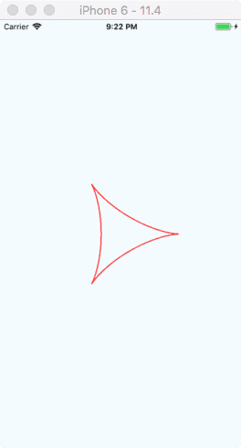

# React Native - 显示图片

本文主要包含以下内容：

* 概述
  * 静态的图片资源
  * 静态的非图片资源
  * 使用混合应用中的图片资源
  * 网络图片
  * Uri 数据图片
  * 缓存控制 (仅 iOS)
  * 本地文件系统中的图片
  * 为什么不在所有情况下都自动指定尺寸
  * 资源属性是一个对象
  * 背景图片与嵌套写法
  * iOS 边框圆角的注意事项
  * 在主线程外解码图片
  * 在 Android 上支持 GIF 和 WebP 格式图片
* 常用属性
* 常用方法

## 概述

### 静态的图片资源

React Native 提供了一个统一的方式来在 iOS 和 Android 应用中管理图片和其它媒体资源。在应用中添加图片时可以放在源代码结构的任意位置，然后通过类似下面的代码来引用它：

```js
// 测试1：未设置宽高
<Image source={require('./my-icon.png')}/>

// 测试2：假设长宽都为 240
<Image
  style={{width: 240, height: 240}}
  source={require('./my-icon.png')}
/>
```

| 原图 | ios | Android | ios 240 | Android 240
|--|--|--|--|--
|  |  |  |  | 


图片的查找方式与 JS 模块的查找方式一样。在上面的示例代码中，packager 会在 "与当前 require `my-icon.png` 图片的组件的相同目录" 下去查找该图片资源。另外，如果你在对应目录下同时存在 `my-icon.ios.png` 和 `my-icon.android.png` 文件，packager 就会根据当前平台去选择对应的那张。

我们都知道，不同的手机屏幕密度可能是不一样的，这种情况下你可以通过使用 `@2x` 和 `@3x` 后缀来针对屏幕密度进行提供图片。假设你的代码结构是这样：

```
.
├── button.js
└── img
    ├── check@2x.png
    └── check@3x.png
```

并且其中的 `button.js` 代码含有：

```js
<Image source={require('./img/check.png')} />
```

则 packager 打包时会包含 require 到的所有图片资源，并且在使用时根据屏幕密度来提供对应图片。举个例子，在 iPhone7 上会使用 `check@2x.png` 而在 iPhone7 Plus 或 Nexus5 上会使用 `check@3x.png`。特别地，如果没有对应屏幕密度的图片资源，则自动会选择最接近对应的那张。

> 注：如果你是在 Windows 上进行开发，那么在你添加新的图片资源到项目中后，可能需要重启下 packager 才能正常加载新的图片。

下面是你得到的一些益处：

* 该系统在 iOS 和 Android 上是一致的。
* 图片放在与 JavaScript 代码一致的目录下，包含在了组件内部。
* 没有全局命名空间，不需要担心命名冲突。
* 只有实际上应用到的图片才会打包到你的应用中。
* 添加和修改图片资源不需要重新编译应用，只需跟平常一样刷新下模拟器就可以了。
* packager 知道图片的尺寸，不需要在代码中重复声明。
* 可以通过 [npm](https://www.npmjs.com/) 包管理器来发布图片资源。

为了使该图片资源机制正常工作，require 中的图片名字必须是一个静态字符串。

> 不能使用变量，因为 require 是在编译时期执行，而非运行时期执行！

```js
// 正确
<Image source={require("./my-icon.png")} />;

// 错误
var icon = this.props.active ? "my-icon-active" : "my-icon-inactive";
<Image source={require("./" + icon + ".png")} />;

// 正确
var icon = this.props.active
  ? require("./my-icon-active.png")
  : require("./my-icon-inactive.png");
<Image source={icon} />;
```

注意，通过这种方式引用的图片资源需要包含图片的尺寸信息 (宽度，高度)，如果你需要动态缩放图片 (例如通过 `flex`)，你可能需要手动在 style 属性中设置 `{ width: undefined, height: nulundefinedl}`。


### 静态的非图片资源

上面描述的 require 语法也可以用来静态地加载你项目中的声音、视频或者文档文件。支持大多数常见的文件类型，包括 `.mp3` `.wav` `.mp4` `.mov` `.htm` 和 `.pdf`，完整列表见 [packager defaults](https://github.com/facebook/react-native/blob/master/local-cli/util/Config.js#L68) 。

你可以通过创建一个包配置文件来添加对其它类型文件的支持，配置项完整列表见 [packager config file](https://github.com/facebook/metro/blob/master/packages/metro/src/defaults.js#L14-L44) 。

警告，视频必须使用绝对位置尺寸来代替 `flexGrow`，因为目前还未能从非图片资源中获取到尺寸信息。另外要说明的一点是，对于直接链接到 Xcode 或者 Android Assets 目录的视频，不存在该限制。


### 使用混合应用中的图片资源

如果你编写的是一个混合 App (一部分 UI 使用 React Native，而其它 UI 则使用平台原生代码开发)，你也是可以使用已经打包到 App 中的图片资源的。

对于放置在 Xcode asset 类目中或是在 Android drawable 目录中的图片资源，直接使用不带扩展名的图片名称即可。

我们先来在 iOS 和 Android 的子项目中添加一个命名为 `hybrid.png` 的图片：


然后编写引用该图片资源的代码：

```js
<Image source={{ uri: "hybrid" }} style={{ width: 160, height: 160 }} />
```

执行 `react-native run-ios` 和 `react-native run-android` 重新编译并运行应用，显示结果如下：

| iOS | Android
| -- | --
|  | 

另外，对于放置在 Android 的 assets 目录中的图片 (前面提到的是 drawable 目录)，可以添加特别的 `asset:/` 前缀进行引用：

```js
<Image
  source={{ uri: "asset:/test.png" }}
  style={{ width: 160, height: 160 }}
/>
```

注意：这些做法没有任何安全检查，你自己需要确保这些图片在应用中确实存在，并且还需要指定具体尺寸。


### 网络图片

大多数要在 App 中显示的图片并不能在编译时获得，又或者有时候你需要通过动态载入图片来减小打包后的二进制文件大小。这时与静态资源的引用有点不同，在加载时你必须手动指定图片的尺寸。同时，建议你使用 https 以满足 [iOS App Transport Security](https://facebook.github.io/react-native/docs/running-on-device#app-transport-security) 的要求。

```js
// 正确
<Image 
  source={{ uri: 'https://facebook.github.io/react/logo-og.png' }}
  style={{width: 400, height: 400}} 
/>

// 错误
<Image 
  source={{uri: 'https://facebook.github.io/react/logo-og.png'}} 
/>
```

示例，加载的图片是网上随意找的小猪佩奇：

```js
<Image
  source={{ uri: 'https://timgsa.baidu.com/timg?image&quality=80&size=b9999_10000&sec=1532626236105&di=55a74815b7a1c001f9cb0980e9e717e2&imgtype=0&src=http%3A%2F%2Fimg.mp.itc.cn%2Fupload%2F20170406%2F89ebc087620343f2ac7ab8c2dd6aee0f_th.jpeg' }}
  style={{ width: 400, height: 400 }}
/>
```

显示效果如下：

| iOS | Android
| -- | --
|  | 


**网络图片的请求参数**

你可以在 Image 组件的 source 属性中指定一些请求参数，比如：

```js
<Image
  source={{
    uri: "https://facebook.github.io/react/logo-og.png",
    method: "POST",
    headers: {
      Pragma: "no-cache"
    },
    body: "Your Body goes here"
  }}
  style={{ width: 400, height: 400 }}
/>
```


## Uri 数据图片

有时候你拿到的可能是图片编码后的数据，此时可以使用 `'data:'` 格式来显示该图片。与加载网络图片相同，你需要手动指定图片的尺寸。

> 建议仅对非常小的图片使用 base64 数据，比如一些小图标。

```js
// 记得指定宽高
<Image
  style={{
    width: 51,
    height: 51,
    resizeMode: Image.resizeMode.contain,
  }}
  source={{
    uri: "data:image/png;base64,iVBORw0KGgoAAAANSUhEUgAAADMAAAAzCAYAAAA6oTAqAAAAEXRFWHRTb2Z0d2FyZQBwbmdjcnVzaEB1SfMAAABQSURBVGje7dSxCQBACARB+2/ab8BEeQNhFi6WSYzYLYudDQYGBgYGBgYGBgYGBgYGBgZmcvDqYGBgmhivGQYGBgYGBgYGBgYGBgYGBgbmQw+P/eMrC5UTVAAAAABJRU5ErkJggg=="
  }}
/>
```

| iOS | Android
| -- | --
|  | 


注意：对于网络和 base64 数据的图片需要手动指定尺寸。


### 缓存控制 (仅 iOS)

在某些情况下你可能仅仅想展示一张已经在本地缓存的图片，例如一个低分辨率的占位符，直到高分辨率的图片可用。又或者你无所谓图片是否过时，而且也不在乎显示过时的图片，节省带宽相对更重要。缓存资源属性提供给了你控制网络层与缓存交互的方式。

* `default`: 使用原生平台默认策略。
* `reload`: URL 的数据将从原始地址加载。不使用现有的缓存数据。
* `force-cache`: 现有的缓存数据将用于满足请求，忽略其期限或到期日。如果缓存中没有对应请求的数据，则从原始地址加载。
* `only-if-cached`: 现有的缓存数据将用于满足请求，忽略其期限或到期日。如果缓存中没有对应请求的数据，则不尝试从原始地址加载，并且认为请求是失败的。

```js
<Image
  source={{
    uri: 'https://facebook.github.io/react/logo-og.png',
    cache: 'only-if-cached'
  }}
  style={{ width: 400, height: 400 }}
/>
```


### 本地文件系统中的图片

参考相册 [CameraRoll](https://facebook.github.io/react-native/docs/cameraroll) 这个例子来看如何使用在 `Images.xcassets` 以外的本地资源。


### 最合适的相册图片

iOS 会为同一张图片在相册中保存多个不同尺寸的副本。为了性能考虑，从这些副本中挑出最合适的尺寸显得尤为重要。对于一处 200x200 大小的缩略图，显然不应该选择最高质量的 3264x2448 大小的图片。如果恰好有匹配的尺寸，那么 React Native 会自动为你选好。如果没有，则会选择最接近的尺寸进行缩放，但也至少缩放到比所需尺寸大出 50%，以使图片看起来仍然足够清晰。这一切过程都是自动完成的，所以你不用操心自己去完成这些繁琐且易错的代码。


### 为什么不在所有情况下都自动指定尺寸

在浏览器中，如果你不给图片指定尺寸，那么浏览器会首先渲染一个 0x0 大小的元素占位，然后下载图片，在下载完成后再基于正确的尺寸来渲染图片。这样做的最大问题是 UI 会在图片加载的过程中上下跳动，使得用户体验非常糟糕。

在 React Native 中我们有意避免了这一行为。如此一来开发者就需要做更多工作来提前知晓远程图片的尺寸 (或宽高比)，但我们相信这样可以带来更好的用户体验。然而，从已经打包好的应用资源文件中读取图片 (使用 `require('my-icon')` 语法)则无需指定尺寸，因为它们的尺寸在加载时就可以立刻知道。

比如这样一个引用 `require('my-icon')` 的实际输出结果可能是：

```js
{"__packager_asset":true,"uri":"my-icon.png","width":591,"height":573}
```


### 资源属性是一个对象

在 React Native 中，相对 Web 值得一提的一个变动是当我们把 `src` 属性改为了 `source` 属性，而且并不接受字符串，正确的值是一个带有 `uri` 属性的对象。

```js
<Image source={{ uri: "something.jpg" }} />
```

深层次的考虑是，这样可以使我们在对象中添加一些元数据 (metadata)。

假设你在使用 `require('./my-icon.png')`，那么我们就会在其中添加真实文件路径以及尺寸等信息 (这只是举个例子，未来的版本中 require 的具体行为可能会变化)。此外这也是考虑了未来的扩展性，比如我们可能会加入精灵图 (sprites)的支持：在输出 `{uri: ...}` 的基础上，我们可以进一步输出裁切信息 `{ uri: ..., crop: {left: 10, top: 50, width: 20, height: 40 }}`，这样理论上就可以在现有的代码中无缝支持精灵图的切分。

对于开发者来说，则可以在其中标注一些有用的属性，例如图片的尺寸，这样可以使图片自己去计算将要显示的尺寸 (而不必在样式中写死)。请在这一数据结构中自由发挥，存储你可能需要的任何图片相关的信息。


### 背景图片与嵌套写法

开发者们常面对的一种需求就是类似 web 中的背景图 `background-image`。要实现这一用例，只需使用 `<ImageBackground>` 组件 (其 props 与 `Image` 完全相同)，然后把需要背景图的子组件嵌入其中即可。

也可能你并不需要使用 `<ImageBackground>`，因为它的实现其实非常简单，实质就是对图片使用了绝对定位。你可以阅读其源码，然后思考你是否有更好更简单的布局方案。

```js
return (
  <ImageBackground source={ ... }>
    <Text>Inside</Text>
  </ImageBackground>
);
```

全屏背景图片的实例：

```js
<View style={{flex: 1}}>
  <ImageBackground
    source={require('./background.jpg')}
    style={{flex: 1, width: null, height: null, resizeMode: Image.resizeMode.contain}}
  >
    <Text style={{margin: 48, color: 'blue'}}>这是要显示的文本</Text>
  </ImageBackground>
</View>
```

| iOS | Android
| -- | --
|  | 


### iOS 边框圆角的注意事项

请注意下列边框圆角样式目前在 iOS 的图片组件上还不支持：

* `borderTopLeftRadius`
* `borderTopRightRadius`
* `borderBottomLeftRadius`
* `borderBottomRightRadius`


### 在主线程外解码图片

图片解码有可能会需要超过一帧的时间。在 web 上这是页面掉帧的一大因素，因为解码是在主线程中完成的。然而在 React Native 中，图片解码则是在另一线程中完成的。在实际开发中，一般对图片还没下载完成时的场景都做了处理 (添加 loading 等)，而图片解码时显示的占位符只占用几帧时间，并不需要你改动代码去额外处理。


### 在 Android 上支持 GIF 和 WebP 格式图片

默认情况下 Android 是不支持 GIF 和 WebP 格式的。你需要在android/app/build.gradle文件中根据需要手动添加以下模块：

```groovy
dependencies {
  // 如果你需要支持Android4.0(API level 14)之前的版本
  implementation 'com.facebook.fresco:animated-base-support:1.10.0'

  // 如果你需要支持GIF动图
  implementation 'com.facebook.fresco:animated-gif:1.10.0'

  // 如果你需要支持WebP格式，包括WebP动图
  implementation 'com.facebook.fresco:animated-webp:1.10.0'
  implementation 'com.facebook.fresco:webpsupport:1.10.0'

  // 如果只需要支持WebP格式而不需要动图
  implementation 'com.facebook.fresco:webpsupport:1.10.0'
}
```


## 常用属性

**`blurRadius`**

模糊半径，即为图片添加一个指定半径的模糊滤镜，类型为 `number`。

注：如果你需要做毛玻璃的显示效果，可以使用 [react-native-community/react-native-blur](https://github.com/react-native-community/react-native-blur) 这个库。其示例效果如下：


·

**`resizeMode`**

决定当 "组件尺寸" 和 "图片尺寸" 不成比例的时候如何调整图片的大小：
* `cover`: 在 "保持图片宽高比" 的前提下缩放图片，直到宽度和高度都大于等于容器视图的尺寸 (如果容器有 padding 内衬的话，则相应减去)。译注：这样图片完全覆盖甚至超出容器，容器中不留任何空白。
* `contain`: 在 "保持图片宽高比" 的前提下缩放图片，直到宽度和高度都小于等于容器视图的尺寸 (如果容器有 padding 内衬的话，则相应减去)。译注：这样图片完全被包裹在容器中，容器中可能留有空白。
* `stretch`: 拉伸图片且 "不维持宽高比"，直到宽高都刚好填满容器。
* `repeat`: 重复平铺图片直到填满容器。图片会 "维持原始尺寸"，但是当尺寸超过容器时会在保持宽高比的前提下缩放到能被容器包裹。
* `center`: 居中不拉伸。

·

**`resizeMethod`**

当图片实际尺寸和容器样式尺寸不一致时，决定以怎样的策略来调整图片的尺寸。默认为 `auto`，仅适用于 Android 平台。
* `auto`: 使用启发式算法来在resize和scale中自动决定。
* `resize`: 在图片解码之前，使用软件算法对其在内存中的数据进行修改。当图片尺寸比容器尺寸大得多时，应该优先使用此选项。
* `scale`: 对图片进行缩放。和 `resize` 相比，`scale` 速度更快 (一般有硬件加速)，而且图片质量更优。在图片尺寸比容器尺寸小或者只是稍大一点时，应该优先使用此选项。

·

**`loadingIndicatorSource`**

在真正图片加载过程 (还没加载完) 中所显示的图片，在加载网络图片的场景下特别有用。其类型如下：

```js
loadingIndicatorSource: PropTypes.oneOfType([
    //该属性与source的定义相似，但是不支持多图。
    PropTypes.shape({
      uri: PropTypes.string,
    }),
    // Opaque type returned by require('./image.jpg')
    PropTypes.number,
  ]),
```


## 常用方法

**`Image.getSize(uri, success, [failure]);`**

在显示图片前获取图片的宽高(以像素为单位)。如果图片地址不正确或下载失败,此方法也会失败。

要获取图片的尺寸,首先需要加载或下载图片(同时会被缓存起来)。这意味着理论上你可以用这个方法来预加载图片，虽然此方法并没有针对这一用法进行优化，而且将来可能会换一些实现方案使得并不需要完整下载图片即可获取尺寸。所以更好的预加载方案是使用下面那个专门的预加载方法。

此方法不能用于静态图片资源。

·

**`Image.prefetch(url);`**

预加载一个远程图片(将其下载到本地磁盘缓存)。

·

**`Image.queryCache(urls);`**

查询图片缓存状态。根据图片 URL 地址返回缓存状态，比如 "disk" (缓存在磁盘文件中) 或是 "memory" (缓存在内存中)。


## 总结

`Image` 组件在 React Native 开发中使用十分频繁的一个组件，如果能够对其有一个全面的了解，对日常开发效率的提高有很大的帮助。