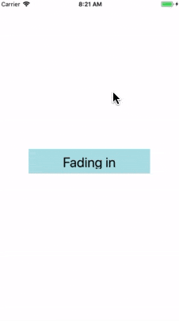

# React Native - 动画

动画对于创建出色的用户体验非常重要。
* 固定物体在开始移动时必须克服惯性。
* 运动中的物体具有动力，很少立即停止。

动画允许你在界面中传达物理上可信的动作。

React Native 提供了两个互补的动画系统：
* `Animated`: 用于特定值的粒度和交互式控制
* `LayoutAnimation`: 用于动画全局布局事务的。

本文内容有：
* [`Animated` API](#animated-api)
  * [配置动画](#配置动画)
  * [组合动画](#组合动画)
  * [合成动画值](#合成动画值)
  * [插值](#插值)
  * [跟踪动态值](#跟踪动态值)
  * [跟踪手势](#跟踪手势)
  * [响应当前的动画值](#响应当前的动画值)
  * [启用原生动画驱动](#启用原生动画驱动)
    * [警告](#警告)
  * [记住](#记住)
  * [Additional examples](#additional-examples)
* [`LayoutAnimation` API](#layoutanimation-api)
* [其他要注意的地方](#其他要注意的地方)

## `Animated` API

[`Animated`](../apis/animated.md) 的 API 设计使得开发者可以非常容易地实现各种各样的动画和交互方式，并且具备极高的性能。`Animated` 旨在以声明的形式来定义动画的输入与输出，在其中建立一个可配置的变化函数，然后使用简单的 `start` / `stop` 方法来控制动画按顺序执行。

`Animated` 仅封装了四个可以动画化的组件：`View`、`Text`、`Image`和`ScrollView`，但你也可以通过 `Animated.createAnimatedComponent()` 来封装你自己的组件。

下面是一个在加载时带有淡入动画效果的视图示例：

```js
import React, { Component } from 'react';
import { Animated, Text, View, StyleSheet } from 'react-native';

class FadeInView extends Component {
  state = {
    fadeAnim: new Animated.Value(0),  // 该组件透明度初始值设为 0
  }

  componentDidMount() {
    Animated.timing(                  // 随时间变化执行动画
      this.state.fadeAnim,            // 动画中要修改的变量(透明度)
      {
        toValue: 1,                   // 变量(透明度)最终的值，透明度为1时表示完全不透明
        duration: 10000,              // 动画的持续时间
      }).start();                     // 开始执行动画
  }

  render() {
    let { fadeAnim } = this.state
    return (
      <Animated.View                  // 可动画的 View 组件
        style={{
          ...this.props.style,
          opacity: fadeAnim           // 将透明度指定为动画相关联的变量
        }}
      >
        {this.props.children}
      </Animated.View>
    )
  }
}

// 然后你就可以在组件中像使用 View 那样去使用 FadeInView 了
export default class App extends Component {
  render() {
    return (
      <View style={styles.container}>
        <FadeInView style={{width: 250, height: 50, backgroundColor: 'powderblue'}}>
          <Text style={styles.text}>Fading in</Text>
        </FadeInView>
      </View>
      // FadeInView: StyleSheet.create doesn't return a plain javascript object,
      // so the ... operator can't be applied.
    );
  }
}

const styles = StyleSheet.create({
  container: {
    flex: 1,
    justifyContent: 'center',
    alignItems: 'center',
  },
  text: {
    fontSize: 28,
    textAlign: 'center',
    margin: 10,
  },
});
```

| iOS | Android
| -- | --
|  | 

我们来分解一下这个过程。在 `FadeInView` 的构造函数里，我们创建了一个名为 `fadeAnim` 的 `Animated.Value`，并放在 `state` 中。而`View`的透明度是和这个值绑定的。

组件加载时，不透明度首先为 0。然后，启动基于 `fadeAnim` 变量的 easing 动画，该变量值将更新页面上每一帧的所有相关映射 (在上述示例中，是「不透明度」)，该变量值在 10000 毫秒后变为最终值 1。

上述的变化是以一种优化了的方式完成的，相对于调用 `setState` 和 `re-rendering` 来说更快。

整个过程的配置是声明式的，所以我们能够实现进一步的优化，即序列化配置并在高优先级的线程执行动画。

### 配置动画

动画的配置项比较多，比如：
* 自定义的缓动函数
* 预定义的缓动函数
* 延迟
* 持续时间
* 衰减因子
* 弹簧常数
* ...

我们可以根据动画的类型对这些配置项进行调整。

`Animated` 提供了几种动画类型，最常用的是 `Animated.timing()`。它支持使用一个「预定义」或「自定义」的缓动函数 (easing function) 来随着时间设置某个动画值。在动画中，缓动函数通常用于传达对象的逐渐加速和减速数据。

默认情况下，`timing` 会采用 easeInOut 函数来表现出一个「逐渐加速」到「全速」，然后再「逐渐减速」到「停止结束」的效果。你可以通过 `缓动参数` 来指定不同的缓动函数，同时支持指定 `动画的持续时间` 和 `动画开始前的延迟时间`。

比如说，我们想创建一个持续 2 秒的动画，动画对象在移动到最终位置之前轻微的倒退一下：

```javascript
Animated.timing(this.state.xPosition, {
  toValue: 100,
  easing: Easing.back(),
  duration: 2000
}).start();
```

你可以在 [Configuring animations](../apis/animated.md#configuring-animations) 章节通过查看 `Animated` API  了解更多内置的动画配置参数。

### 组合动画

动画是可以通过组合进行「顺序执行 (sequence)」或「同时执行 (parallel)」的。顺序执行动画可以在执行完上一个动画后马上执行下一个动画，也可以延迟一段时间再执行下一个动画。`Animated` API 提供了一系列的方法，比如 `sequence()` 和 `delay()`，它们中的每一个都接收一组要执行的动画并且自动在需要的时候调用 `start()` / `stop()`。

例如，下面的动先画滑行到停止，然后再平行旋转的同时弹回来:

```javascript
Animated.sequence([
  // decay, then spring to start and twirl
  Animated.decay(position, {
    // coast to a stop
    velocity: { x: gestureState.vx, y: gestureState.vy }, // velocity from gesture release
    deceleration: 0.997
  }),
  Animated.parallel([
    // after decay, in parallel:
    Animated.spring(position, {
      toValue: { x: 0, y: 0 } // return to start
    }),
    Animated.timing(twirl, {
      // and twirl
      toValue: 360
    })
  ])
]).start(); // start the sequence group
```

默认情况下，如果其中一个动画被停止或中断了，那么组内其它所有的动画也会被停止。`Animated.Parallel` 有一个 `stopTogether` 属性，设置为 `false` 的话就可以禁用自动停止。

在 `Animated` 文档的 **组合动画** 一节中列出了所有的组合方法。


### 合成动画值

你可以使用加、减、乘、除、取余等运算来 **把两个动画值合成为一个新的动画值**。

在某些情况下，一个动画值需要通过计算反转另一个动画值。下面的示例是比例倒置 (2x -> 0.5x):

```javascript
const a = new Animated.Value(1);
const b = Animated.divide(1, a);  // 除法

Animated.spring(a, {
  toValue: 2
}).start();
```

### 插值

> 插值 (Interpolation)

每个属性都可以先通过插值来运行。插值将「输入范围」映射到「输出范围」。通常使用线性插值，但也支持缓动函数。默认情况下，它会根据给定的范围外推曲线，但也可以对输出值进行限制。

将「0-1 范围」转换为「0-100 范围」的简单映射是:

```javascript
value.interpolate({
  inputRange: [0, 1],
  outputRange: [0, 100]
});
```

例如，你可能想到你的 `Animated.Value` 从 0 到 1，但动画位置从 150px 到 0px，不透明度从 0 到 1。从上面的例子中修改 `style` 可以很容易地做到这一点:

```javascript
  style={{
    opacity: this.state.fadeAnim, // Binds directly
    transform: [{
      translateY: this.state.fadeAnim.interpolate({
        inputRange: [0, 1],
        outputRange: [150, 0]  // 0 : 150, 0.5 : 75, 1 : 0
      }),
    }],
  }}
```

`interpolate()` 还支持定义多个区间段落，常用来定义静止区间等。举个例子，要让输入在接近 -300 时取相反值，然后在输入接近 -100 时到达 0，然后在输入接近 0 时又回到 1，接着一直到输入到 100 的过程中逐步回到 0，最后形成一个始终为 0 的静止区间，对于任何大于 100 的输入都返回 0。具体写法如下：

```javascript
value.interpolate({
  inputRange: [-300, -100, 0, 100, 101],
  outputRange: [300, 0, 1, 0, 0]
});
```

它的最终映射结果如下：

```
Input | Output
------|-------
  -400|    450
  -300|    300
  -200|    150
  -100|      0
   -50|    0.5
     0|      1
    50|    0.5
   100|      0
   101|      0
   200|      0
```

`interpolate()` 还支持到字符串的映射，从而可以实现颜色以及带有单位的值的动画变换。  

例如你可以像下面这样实现一个旋转动画：

```javascript
value.interpolate({
  inputRange: [0, 360],
  outputRange: ["0deg", "360deg"]
});
```

`interpolate()` 还支持任意的渐变函数，其中有很多已经在 `Easing` 类中定义了。`interpolation` 还支持限制输出区间 `outputRange`。你可以通过设置 `extrapolate`、`extrapolateLeft` 或 `extrapolateRight` 属性来限制输出区间。默认值是 `extend` (允许超出)，不过你可以使用 `clamp` 选项来阻止输出值超过 `outputRange`。


### 跟踪动态值

动画中所设的值还可以通过跟踪别的值得到。你只要把 `toValue` 设置成另一个动态值而不是一个普通数字就行了。比如我们可以用弹跳动画来实现聊天头像的闪动，又比如通过 `timing` 设置 `duration:0` 来实现快速的跟随。它们还可以使用插值来进行组合：

```javascript
Animated.spring(follower, { toValue: leader }).start();
Animated.timing(opacity, {
  toValue: pan.x.interpolate({
    inputRange: [0, 300],
    outputRange: [1, 0]
  })
}).start();
```

The `leader` and `follower` animated values would be implemented using `Animated.ValueXY()`. 是一个方便的处理 2D 交互的办法，譬如旋转或拖拽。它是一个简单的包含了两个`Animated.Value`实例的包装，然后提供了一系列辅助函数，使得`ValueXY`在许多时候可以替代`Value`来使用。比如在上面的代码片段中，`leader`和`follower`可以同时为`valueXY`类型，这样 x 和 y 的值都会被跟踪。


### 跟踪手势

`Animated.event` 是 Animated 中与输入有关的部分，允许手势或其它事件直接绑定到动态值上。它通过一个结构化的映射语法来完成，使得复杂事件对象中的值可以被正确的解开。第一层是一个数组，允许同时映射多个值，然后数组的每一个元素是一个嵌套的对象。

在下面的例子里，你可以发现 `scrollX` 被映射到了 `event.nativeEvent.contentOffset.x` (`event` 通常是回调函数的第一个参数)，并且 `pan.x` 和 `pan.y` 分别映射到 `gestureState.dx` 和 `gestureState.dy`（`gestureState` 是传递给 `PanResponder` 回调函数的第二个参数）。

For example, when working with horizontal scrolling gestures, you would do the following in order to map `event.nativeEvent.contentOffset.x` to `scrollX` (an `Animated.Value`):

```javascript
 onScroll={Animated.event(
   // scrollX = e.nativeEvent.contentOffset.x
   [{ nativeEvent: {
        contentOffset: {
          x: scrollX
        }
      }
    }]
 )}
```

When using `PanResponder`, you could use the following code to extract the x and y positions from `gestureState.dx` and `gestureState.dy`. We use a `null` in the first position of the array, as we are only interested in the second argument passed to the `PanResponder` handler, which is the `gestureState`.

```javascript
onPanResponderMove={Animated.event(
  [null, // ignore the native event
  // extract dx and dy from gestureState
  // like 'pan.x = gestureState.dx, pan.y = gestureState.dy'
  {dx: pan.x, dy: pan.y}
])}
```

### 响应当前的动画值

你可能会注意到这里没有一个明显的方法来在动画的过程中读取当前的值——这是出于优化的角度考虑，有些值只有在原生代码运行阶段中才知道。如果你需要在 JavaScript 中响应当前的值，有两种可能的办法：

* `spring.stopAnimation(callback)` 会停止动画并且把最终的值作为参数传递给回调函数`callback`——这在处理手势动画的时候非常有用。
* `spring.addListener(callback)` 会在动画的执行过程中持续异步调用 `callback` 回调函数，提供一个最近的值作为参数。这在用于触发状态切换的时候非常有用，譬如当用户拖拽一个东西靠近的时候弹出一个新的气泡选项。不过这个状态切换可能并不会十分灵敏，因为它不像许多连续手势操作（如旋转）那样在 60fps 下运行。

`Animated` is designed to be fully serializable so that animations can be run in a high performance way, independent of the normal JavaScript event loop. This does influence the API, so keep that in mind when it seems a little trickier to do something compared to a fully synchronous system. Check out `Animated.Value.addListener` as a way to work around some of these limitations, but use it sparingly since it might have performance implications in the future.

### 启用原生动画驱动

`Animated` 的 API 是可序列化的（即可转化为字符串表达以便通信或存储）。通过启用 [原生驱动](http://facebook.github.io/react-native/blog/2017/02/14/using-native-driver-for-animated.html)，我们在启动动画前就把其所有配置信息都发送到原生端，利用原生代码在 UI 线程执行动画，而不用每一帧都在两端间来回沟通。如此一来，动画一开始就完全脱离了 JS 线程，因此此时即便 JS 线程被卡住，也不会影响到动画了。

在动画中启用原生驱动非常简单。只需在开始动画之前，在动画配置中加入一行`useNativeDriver: true`，如下所示：

```javascript
Animated.timing(this.state.animatedValue, {
  toValue: 1,
  duration: 500,
  useNativeDriver: true // <-- 加上这一行
}).start();
```

动画值在不同的驱动方式之间是不能兼容的。因此如果你在某个动画中启用了原生驱动，那么所有和此动画依赖相同动画值的其他动画也必须启用原生驱动。

原生驱动还可以在`Animated.event`中使用。 This is specially useful for animations that follow the scroll position as without the native driver, the animation will always run a frame behind the gesture due to the async nature of React Native.

```javascript
<Animated.ScrollView // <-- 使用可动画化的ScrollView组件
  scrollEventThrottle={1} // <-- 设为1以确保滚动事件的触发频率足够密集
  onScroll={Animated.event(
    [
      {
        nativeEvent: {
          contentOffset: { y: this.state.animatedValue }
        }
      }
    ],
    { useNativeDriver: true } // <-- 加上这一行
  )}
>
  {content}
</Animated.ScrollView>
```

You can see the native driver in action by running the [RNTester app](https://github.com/facebook/react-native/blob/master/RNTester/), then loading the Native Animated Example. You can also take a look at the [source code](https://github.com/facebook/react-native/blob/master/RNTester/js/NativeAnimationsExample.js) to learn how these examples were produced.

#### 警告

Not everything you can do with `Animated` is currently supported by the native driver. The main limitation is that you can only animate non-layout properties: things like `transform` and `opacity` will work, but flexbox and position properties will not. When using `Animated.event`, it will only work with direct events and not bubbling events. This means it does not work with `PanResponder` but does work with things like `ScrollView#onScroll`.

When an animation is running, it can prevent `VirtualizedList` components from rendering more rows. If you need to run a long or looping animation while the user is scrolling through a list, you can use `isInteraction: false` in your animation's config to prevent this issue.

### 记住

While using transform styles such as `rotateY`, `rotateX`, and others ensure the transform style `perspective` is in place. At this time some animations may not render on Android without it. Example below.

```javascript
<Animated.View
  style={{
    transform: [
      { scale: this.state.scale },
      { rotateY: this.state.rotateY },
      { perspective: 1000 } // without this line this Animation will not render on Android while working fine on iOS
    ]
  }}
/>
```

### Additional examples

The RNTester app has various examples of `Animated` in use:

* [AnimatedGratuitousApp](https://github.com/facebook/react-native/tree/master/RNTester/js/AnimatedGratuitousApp)
* [NativeAnimationsExample](https://github.com/facebook/react-native/blob/master/RNTester/js/NativeAnimationsExample.js)

## `LayoutAnimation` API

`LayoutAnimation`允许你在全局范围内`创建`和`更新`动画，这些动画会在下一次渲染或布局周期运行。它常用来更新 flexbox 布局，因为它可以无需测量或者计算特定属性就能直接产生动画。尤其是当布局变化可能影响到父节点（譬如“查看更多”展开动画既增加父节点的尺寸又会将位于本行之下的所有行向下推动）时，如果不使用`LayoutAnimation`，可能就需要显式声明组件的坐标，才能使得所有受影响的组件能够同步运行动画。

注意尽管`LayoutAnimation`非常强大且有用，但它对动画本身的控制没有`Animated`或者其它动画库那样方便，所以如果你使用`LayoutAnimation`无法实现一个效果，那可能还是要考虑其他的方案。

另外，如果要在**Android**上使用 LayoutAnimation，那么目前还需要在`UIManager`中启用：:

```javascript
// 在执行任何动画代码之前，比如在入口文件App.js中执行
UIManager.setLayoutAnimationEnabledExperimental &&
  UIManager.setLayoutAnimationEnabledExperimental(true);
```

```js
import React from 'react';
import {
  NativeModules,
  LayoutAnimation,
  Text,
  TouchableOpacity,
  StyleSheet,
  View,
} from 'react-native';

const { UIManager } = NativeModules;

UIManager.setLayoutAnimationEnabledExperimental &&
  UIManager.setLayoutAnimationEnabledExperimental(true);

export default class App extends React.Component {
  state = {
    w: 100,
    h: 100,
  };

  _onPress = () => {
    // Animate the update
    LayoutAnimation.spring();
    this.setState({w: this.state.w + 15, h: this.state.h + 15})
  }

  render() {
    return (
      <View style={styles.container}>
        <View style={[styles.box, {width: this.state.w, height: this.state.h}]} />
        <TouchableOpacity onPress={this._onPress}>
          <View style={styles.button}>
            <Text style={styles.buttonText}>Press me!</Text>
          </View>
        </TouchableOpacity>
      </View>
    );
  }
}

const styles = StyleSheet.create({
  container: {
    flex: 1,
    alignItems: 'center',
    justifyContent: 'center',
  },
  box: {
    width: 200,
    height: 200,
    backgroundColor: 'red',
  },
  button: {
    backgroundColor: 'black',
    paddingHorizontal: 20,
    paddingVertical: 15,
    marginTop: 15,
  },
  buttonText: {
    color: '#fff',
    fontWeight: 'bold',
  },
});
```

This example uses a preset value, you can customize the animations as you need, see [LayoutAnimation.js](https://github.com/facebook/react-native/blob/master/Libraries/LayoutAnimation/LayoutAnimation.js) for more information.

## 其他要注意的地方

### `requestAnimationFrame`

`requestAnimationFrame` 是一个对浏览器标准 API 的兼容实现，你可能已经熟悉它了。它接受一个函数作为唯一的参数，并且在下一次重绘之前调用此函数。一些基于 JavaScript 的动画库高度依赖于这一 API。通常你不必直接调用它——那些动画库会替你管理好帧的更新。

### `setNativeProps`

正如[直接操作](direct-manipulation.md)文档所说，`setNativeProps`方法可以使我们直接修改基于原生视图的组件的属性，而不需要使用`setState`来重新渲染整个组件树。

如果我们要更新的组件有一个非常深的内嵌结构，并且没有使用`shouldComponentUpdate`来优化，那么使用`setNativeProps`就将大有裨益。

如果你发现你的动画丢帧（低于 60 帧每秒），可以尝试使用`setNativeProps`或者`shouldComponentUpdate`来优化它们。Or you could run the animations on the UI thread rather than the JavaScript thread [with the useNativeDriver option](http://facebook.github.io/react-native/blog/2017/02/14/using-native-driver-for-animated.html). 你还可以考虑将部分计算工作放在动画完成之后进行，这时可以使用[InteractionManager](interactionmanager.md)。你还可以使用应用内的开发者菜单中的“FPS Monitor”工具来监控应用的帧率。
