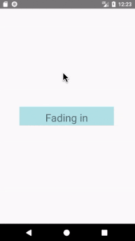

# React Native - 动画系统

流畅、有意义的动画对于移动应用用户体验来说是非常重要的。现实生活中的物体在开始移动和停下来的时候都具有一定的惯性，我们在界面中也可以使用动画来实现契合物理规律的交互。

React Native 提供了两个互补的动画系统：
* `Animated`: 用于创建精细的交互控制的动画。
* `LayoutAnimation`: 用于全局的布局动画。

本文内容有：
* Animated API 
* LayoutAnimation API 
* 注意事项


## Animated API

Animated API 的设计使得开发者可以非常容易地实现各种各样的动画和交互方式，并且具备极高的性能。`Animated` 旨在以声明的形式来定义动画的输入与输出，在其中建立一个可配置的变化函数，然后使用简单的 `start` / `stop` 方法来控制动画按顺序执行。

`Animated` 默认仅封装了四个可以动画化的组件：`View`、`Text`、`Image` 和 `ScrollView`。如果你有额外的需求，也可以通过 `Animated.createAnimatedComponent()` 来封装你自己的组件。

下面是一个在加载时带有淡入动画效果的视图示例：

```js
import React, { Component } from 'react';
import { Animated, Text, View, StyleSheet } from 'react-native';

class FadeInView extends Component {
  state = {
    fadeAnim: new Animated.Value(0),  // 该组件透明度初始值设为 0
  }

  componentDidMount() {
    Animated.timing(                  // 随时间变化执行动画
      this.state.fadeAnim,            // 动画中要修改的变量(透明度)
      {
        toValue: 1,                   // 变量(透明度)最终的值，透明度为 1 时表示完全不透明
        duration: 10000,              // 动画的持续时间
      }).start();                     // 开始执行动画
  }

  render() {
    let { fadeAnim } = this.state
    return (
      <Animated.View                  // 可动画的 View 组件
        style={{
          ...this.props.style,
          opacity: fadeAnim           // 将透明度指定为动画相关联的变量
        }}
      >
        {this.props.children}
      </Animated.View>
    )
  }
}
```

```js
// 然后你就可以在组件中像使用 View 那样去使用 FadeInView 了
export default class App extends Component {
  render() {
    return (
      <View style={styles.container}>
        <FadeInView style={{width: 250, height: 50, backgroundColor: 'powderblue'}}>
          <Text style={styles.text}>Fading in</Text>
        </FadeInView>
      </View>
      // FadeInView: StyleSheet.create doesn't return a plain javascript object,
      // so the ... operator can't be applied.
    );
  }
}

const styles = StyleSheet.create({
  container: {
    flex: 1,
    justifyContent: 'center',
    alignItems: 'center',
  },
  text: {
    fontSize: 28,
    textAlign: 'center',
    margin: 10,
  },
});
```

在 iOS 和 Android 的动态效果图分别如下：

| iOS | Android
| -- | --
|  | 

我们来分解一下这个过程。在 `FadeInView` 的构造函数里，我们创建了一个名为 `fadeAnim` 的 `Animated.Value` 状态变量，在 `render` 函数中该状态变量是与 `Animated.View` 的透明度相绑定的。

组件装载时 `fadeAnim` 的初始值为 0，即完全透明 (视图属性 `opacity` 意为 "不透明度")。然后启动一个基于 `fadeAnim` 变量的 easing 动画，使得`fadeAnim` 的值逐渐变大并最终变为 1，这个变化过程持续 10000 毫秒。在这个变化过程中，`fadeAnim` 变量值的变化是会与页面上每一帧的变化相映射的。

上述的 UI 变化 (动画) 是以一种优化了的方式完成的，这种方式相对于直接调用 `setState` 和 `re-rendering` 来说速度更快、性能更好。正因为这整个动画过程的配置都是声明式的，所以我们能够实现进一步的优化，即通过序列化配置以在高优先级的线程来执行动画。


**配置动画**

动画的配置项比较多，比如：
* 自定义的缓动函数
* 预定义的缓动函数
* 延迟
* 持续时间
* 衰减因子
* 弹簧常数
* ...

我们可以根据动画的类型对这些配置项进行调整。

`Animated` 提供了几种动画类型，最常用的是 `Animated.timing()`。它支持使用一个 "预定义" 或 "自定义" 的缓动函数 (easing function) 来随着时间设置某个动画值。在动画中，缓动函数通常用于传达对象的逐渐加速、减速数据。

默认情况下，`timing` 会采用 easeInOut 函数来表现出一个 "逐渐加速" 到 "全速" ，然后再 "逐渐减速" 到 "停止结束" 的效果。你可以通过 `缓动参数` 来指定不同的缓动函数，支持指定 `动画的持续时间` 和 `动画开始前的延迟时间`。

比如说，我们想创建一个持续 2 秒的动画，动画对象在移动到最终位置之前轻微的倒退一下：

```javascript
Animated.timing(this.state.xPosition, {
  toValue: 100,
  easing: Easing.back(),
  duration: 2000
}).start();
```


**组合动画**

动画是可以通过组合进行顺序执行 (sequence)」或同时执行 (parallel)。
* 顺序执行动画：在执行完上一个动画后马上执行下一个动画，或者延迟一段时间后再执行下一个动画。
* 同时执行动画：同时执行将组合中的动画，没有先后逻辑。
  
`Animated` API 提供了一系列的方法，比如 `sequence()` 和 `delay()` 等。它们中的每一个都接收一组要执行的动画，并且会自动在需要的时候调用 `start()` / `stop()` 方法。

例如，下面的动先画滑行到停止，然后再平行旋转的同时弹回来:

```javascript
// decay: 衰减
// spring: 弹簧，跳跃
// twirl: 旋转，转动
// easing: 释放
Animated.sequence([
  // decay, then spring to start and twirl
  Animated.decay(position, {
    // coast to a stop
    velocity: { x: gestureState.vx, y: gestureState.vy }, // velocity from gesture release
    deceleration: 0.997
  }),
  Animated.parallel([
    // after decay, in parallel:
    Animated.spring(position, {
      toValue: { x: 0, y: 0 } // return to start
    }),
    Animated.timing(twirl, {
      // and twirl
      toValue: 360
    })
  ])
]).start(); // start the sequence group
```

默认情况下，如果其中一个动画被停止或中断了，那么组内其它所有的动画也会被停止。`Animated.Parallel` 有一个 `stopTogether` 属性，设置为 `false` 的话就可以禁用自动停止。


**合成动画值**

你可以使用加、减、乘、除、取余等运算来把两个动画值合成为一个新的动画值。

在某些情况下，一个动画值需要通过计算来反转另一个动画值。在下面的示例中，演示了如何进行比例倒置 (2x -> 0.5x):

```javascript
const a = new Animated.Value(1);
const b = Animated.divide(1, a);  // 除法

Animated.spring(a, {
  toValue: 2
}).start();
```

**插值 (Interpolation)**

每个属性都可以通过插值来运行，插值会将输入范围映射到输出范围。通常我们会使用线性插值，但也支持缓动函数。默认情况下，缓东函数会推断出给定范围的曲线，当然你也可以让它夹住 (clamp) 输出值。

> 原文：Each property can be run through an interpolation first. An interpolation maps input ranges to output ranges, typically using a linear interpolation but also supports easing functions. By default, it will extrapolate the curve beyond the ranges given, but you can also have it clamp the output value.

举个栗子，我们将 "0-1" 的范围转换为 "0-100" 范围的一个简单映射是:

```javascript
value.interpolate({
  inputRange: [0, 1],
  outputRange: [0, 100]
});
```

在实际应用中，你可能想到你的 `Animated.Value` 是从 0 到 1，而预期动画位置是从 150px 到 0px，不透明度是从 0 到 1。基于前面提到的例子，我们可以修改 `style` 来比较容易地做到这一点:

```javascript
style={{
  opacity: this.state.fadeAnim,  // 直接绑定，不做变换
  transform: [{                  // 对 fadeAnim 做一个插值变换来做一个 Y 轴移动动画
    translateY: this.state.fadeAnim.interpolate({    
      inputRange: [0, 1],
      outputRange: [150, 0]      // 比如当 fadeAnim 为 0 时变换为 150, 当为 0.5 时变换为 75, 当为 1 时变换为 0
    }),
  }],
}}
```

`interpolate()` 还支持定义多个区间段落，可利用该特性来定义静止区间。

举个需求栗子：
* 要让输入在接近 -300 时取相反值
* 然后在输入接近 -100 时到达 0
* 然后在输入接近 0 时又回到 1
* 接着一直到输入到 100 的过程中逐步回到 0，
* 最后形成一个始终为 0 的静止区间，即对于任何大于 100 的输入都返回 0。

具体代码写法如下：

```javascript
value.interpolate({
  inputRange: [-300, -100, 0, 100, 101],
  outputRange: [300, 0, 1, 0, 0]
});
```

它的最终映射结果如下：

```
Input | Output
------|-------
  -400|    450
  -300|    300
  -200|    150
  -100|      0
   -50|    0.5
     0|      1
    50|    0.5
   100|      0
   101|      0
   200|      0
```

`interpolate()` 也支持字符串的映射，从而可以实现颜色以及带有单位的值的动画变换。  

例如你可以像下面这样实现一个旋转动画：

```javascript
value.interpolate({
  inputRange: [0, 360],
  outputRange: ["0deg", "360deg"]
});
```

`interpolate()` 也支持任意的渐变函数，其中有很多已经在 `Easing` 类中定义了，包括二次、指数、贝塞尔等曲线以及 step、bounce 等方法。。`interpolation` 还支持限制输出区间 `outputRange`。你可以通过设置 `extrapolate`、`extrapolateLeft` 或 `extrapolateRight` 属性来限制输出区间。默认值是 `extend` (允许超出)，不过你可以使用 `clamp` 选项来阻止输出值超过 `outputRange`。

对动画的实践不多，没法深入探讨。贴一个 TypeScript 中的类型定义出来，可能容易理解一点：

```ts
export namespace Animated {

  ...

  class Animated {
    // Internal class, no public API.
  }

  class AnimatedWithChildren extends Animated {
    // Internal class, no public API.
  }

  class AnimatedInterpolation extends AnimatedWithChildren {
    interpolate(config: InterpolationConfigType): AnimatedInterpolation;
  }

  type InterpolationConfigType = {
    inputRange: number[];
    outputRange: number[] | string[];
    easing?: ((input: number) => number);
    extrapolate?: ExtrapolateType;
    extrapolateLeft?: ExtrapolateType;
    extrapolateRight?: ExtrapolateType;
  };

  /**
    * Standard value for driving animations.  One `Animated.Value` can drive
    * multiple properties in a synchronized fashion, but can only be driven by one
    * mechanism at a time.  Using a new mechanism (e.g. starting a new animation,
    * or calling `setValue`) will stop any previous ones.
    */
  export class Value extends AnimatedWithChildren {
    constructor(value: number);

    ...

    /**
      * Interpolates the value before updating the property, e.g. mapping 0-1 to
      * 0-10.
      */
    interpolate(config: InterpolationConfigType): AnimatedInterpolation;
  }
}
```


**跟踪动态值**

动画中所设的值还可以通过跟踪别的值得到。你只要把 `toValue` 设置成另一个动态值而不是一个普通数字就行了。比如我们可以用弹跳动画来实现聊天头像的闪动，又比如通过 `timing` 设置 `duration:0` 来实现快速的跟随。同时，它们还可以使用插值来进行组合：

```javascript
Animated.spring(follower, { toValue: leader }).start();
Animated.timing(opacity, {
  toValue: pan.x.interpolate({
    inputRange: [0, 300],
    outputRange: [1, 0]
  })
}).start();
```

其中 `leader` and `follower` 动画值通过使用 `Animated.ValueXY()` 来实现。

关于 `ValueXY` ：
* 是一个方便的处理 2D 交互的办法，譬如旋转或拖拽。
* 是一个简单的包含了两个 `Animated.Value` 实例的包装 (Wrapper)，然后提供了一系列辅助函数，使得 `ValueXY` 在许多时候可以替代 `Value` 来使用。

在上面的代码片段中，`leader` 和 `follower` 可以同时为 `valueXY` 类型，这样 x 和 y 的值都会被跟踪。


**跟踪手势**

`Animated.event` 是 Animated 中与输入有关的部分，允许手势或其它事件直接绑定到动态值上。它通过一个结构化的映射语法来完成，使得复杂事件对象中的值可以被正确的解开。第一层是一个数组，允许同时映射多个值，然后数组的每一个元素是一个嵌套的对象。

在下面的例子里，你可以发现 `scrollX` 被映射到了 `event.nativeEvent.contentOffset.x` (`event` 通常是回调函数的第一个参数)，并且 `pan.x` 和 `pan.y` 分别映射到 `gestureState.dx` 和 `gestureState.dy` (`gestureState` 是传递给 `PanResponder` 回调函数的第二个参数)。

当处理一个水平滚动的手势时，你可以编写以下代码来将 `event.nativeEvent.contentOffset.x` 映射到 `scrollX` (类型为 `Animated.Value`)：

```javascript
 onScroll={ Animated.event(
    // scrollX = e.nativeEvent.contentOffset.x
    [{ 
      nativeEvent: {
        contentOffset: {
          x: scrollX
        }
      }
    }]
 )}
```

类似这样的场景很常见，比如说我们需要 ”标题栏随着其下方的 ScrollView 的垂直滚动逐渐隐藏或出现" 等。


当你使用 `PanResponder`, 你可以通过以下代码来从 `gestureState.dx` and `gestureState.dy` 中获取到对应的 x 和 y 位置。我们在数组的第一个位置使用 `null`，是因为我们只对传递给 `PanResponder` 处理者的第二个参数感兴趣，即 `gestureState`。

```javascript
onPanResponderMove={ Animated.event([ 
  null, // ignore the native event
  // extract dx and dy from gestureState
  // like 'pan.x = gestureState.dx, pan.y = gestureState.dy'
  { dx: pan.x, dy: pan.y }
])}
```

```js
// 方法原型
onPanResponderMove: (event, gestureState) => {}
```


**响应当前的动画值**

你可能会注意到这里没有一个明显的方法来在动画的过程中读取当前的值，这是出于优化的角度考虑，因为有些值只有在原生代码运行阶段中才知道。

如果你需要在 JavaScript 中响应当前的值，有两种可能的办法：

* `spring.stopAnimation(callback)`：会停止动画并且把最终的值作为参数传递给回调函数 `callback`，这在处理手势动画的时候非常有用。
* `spring.addListener(callback)`：会在动画的执行过程中持续异步调用 `callback` 回调函数，提供一个最近的值作为参数。这在用于触发状态切换的时候非常有用，譬如当用户拖拽一个东西靠近的时候弹出一个新的气泡选项。不过这个状态切换可能并不会十分灵敏，因为它不像许多连续手势操作 (如旋转)那样在 60fps 下运行。

`Animated` 被设计成完全可序列化的，因此动画可以以高性能的方式运行，而不依赖于普通的 JavaScript 事件循环。这确实会影响 API，所以要记住，这与完全同步的系统相比，做一些事情时似乎会有点棘手。`Animated.Value.addListener` 作为一种解决这些限制的方法，但是要谨慎使用，因为它可能会影响性能。


**启用原生动画驱动**

`Animated` 的 API 是可序列化的 (即可转化为字符串表达以便通信或存储)。通过启用 [原生驱动](http://facebook.github.io/react-native/blog/2017/02/14/using-native-driver-for-animated.html)，我们在启动动画前就会把其所有配置信息都发送到原生端，利用原生代码在 UI 线程执行动画，而不用每一帧都在两端间来回沟通。如此一来，动画一开始就完全脱离了 JS 线程，因此此时即便 JS 线程被卡住也不会影响到动画。

在动画中启用原生驱动非常简单。只需在开始动画之前，在动画配置中加入一行`useNativeDriver: true`，如下所示：

```javascript
Animated.timing(this.state.animatedValue, {
  toValue: 1,
  duration: 500,
  useNativeDriver: true    // <-- 加上这一行
}).start();
```

动画值在不同的驱动方式之间是不能兼容的，因此如果你在某个动画中启用了原生驱动，那么所有和此动画依赖相同动画值的其他动画也必须启用原生驱动。

原生驱动还可以在 `Animated.event` 中使用。这对于跟随滚动位置的动画特别有用，因为在没有本机驱动程序的情况下，由于 React native 的异步特性使得动画将始终运行手势后面的帧。代码示例：

```javascript
<Animated.ScrollView            // <-- 使用可动画化的 ScrollView 组件
  scrollEventThrottle={1}       // <-- 设为 1 以确保滚动事件的触发频率足够密集
  onScroll={Animated.event(
    [
      {
        nativeEvent: {
          contentOffset: { y: this.state.animatedValue }
        }
      }
    ],
    { useNativeDriver: true }   // <-- 加上这一行
  )}
>
  { content }
</Animated.ScrollView>
```

您可以通过运行 [RNTester app](https://github.com/facebook/react-native/blob/master/RNTester/) 来查看 Native 驱动程序的运行情况，然后加载 Native 动画示例。你还可以查看 [源代码](https://github.com/facebook/react-native/blob/master/RNTester/js/examples/NativeAnimation/NativeAnimationsExample.js) 来了解这些示例是如何生成的。


**警告**

并不是所有你能用动画做的事情现在都被本地驱动 (native-driver) 支持。主要的限制在于，你只能动画非布局的 (non-layout) 属性：像 `transform` 和 `opacity` 这样的能工作 (有效)，但类似 `flexbox` 和 `position` 这样的属性则不会。在使用 `Animated.event` 时，它只会与直接事件 (direct events) 一起工作，而冒泡事件不行。这意味着它不能与 `PanResponder` 一起工作，但可以与 `ScrollView#onScroll` 这样的东西一起工作。

在动画运行时，它可以防止 `VirtualizedList` 组件呈现更多的行。如果需要在用户滚动列表时运行长动画或循环动画，可以在动画配置中使用 `isInteraction: false` 来防止这个问题。


**记住**

当使用诸如 `rotateY`、`rotateX` 等转换样式时，可以确保转换样式 `perspective` (透视图) 已经就位。此时，有些动画可能无法在没有它的 Android 上呈现。举个栗子：

```javascript
<Animated.View
  style={{
    transform: [
      { scale: this.state.scale },
      { rotateY: this.state.rotateY },
      { perspective: 1000 }              // without this line this Animation will not render on Android while working fine on iOS
    ]
  }}
/>
```


**其它示例**

在 RNTester 应用中有大量的 `Animated` 使用示例:

* [AnimatedGratuitousApp](https://github.com/facebook/react-native/tree/master/RNTester/js/AnimatedGratuitousApp)
* [NativeAnimationsExample](https://github.com/facebook/react-native/blob/master/RNTester/js/NativeAnimationsExample.js)


## `LayoutAnimation` API

`LayoutAnimation` 允许你在全局范围内创建和更新动画，这些动画会在下一次渲染或布局周期运行。它常用来更新 flexbox 布局，因为它可以无需测量或计算特定属性就能直接产生动画。尤其是当布局变化可能影响到父节点时 (譬如 "查看更多" 展开动画既增加父节点的尺寸又会将位于本行之下的所有行向下推动)，如果不使用`LayoutAnimation`，可能就需要显式声明组件的坐标才能使得所有受影响的组件能够同步运行动画。

注意：尽管 `LayoutAnimation` 非常强大且有用，但它对动画本身的控制没有 `Animated` 或者其它动画库那样方便，所以如果你在使用 `LayoutAnimation` 无法实现一个效果时，可能需要考虑下其它方案。

另外，如果要在 Android 上使用 LayoutAnimation，目前需要在 `UIManager` 中启用:

```javascript
// 在执行任何动画代码之前，比如在入口文件 App.js 中执行
UIManager.setLayoutAnimationEnabledExperimental &&
  UIManager.setLayoutAnimationEnabledExperimental(true);
```

示例如下：

```js
import React from 'react';
import {
  NativeModules,
  LayoutAnimation,
  Text,
  TouchableOpacity,
  StyleSheet,
  View,
} from 'react-native';

const { UIManager } = NativeModules;

UIManager.setLayoutAnimationEnabledExperimental &&
  UIManager.setLayoutAnimationEnabledExperimental(true);

export default class App extends React.Component {
  state = {
    w: 100,
    h: 100,
  };

  _onPress = () => {
    // Animate the update
    LayoutAnimation.spring();
    this.setState({ w: this.state.w + 15, h: this.state.h + 15 })
  }

  render() {
    return (
      <View style={styles.container}>
        <View style={[styles.box, {width: this.state.w, height: this.state.h}]} />
        <TouchableOpacity onPress={this._onPress}>
          <View style={styles.button}>
            <Text style={styles.buttonText}>Press me!</Text>
          </View>
        </TouchableOpacity>
      </View>
    );
  }
}

const styles = StyleSheet.create({
  container: {
    flex: 1,
    alignItems: 'center',
    justifyContent: 'center',
  },
  box: {
    width: 200,
    height: 200,
    backgroundColor: 'red',
  },
  button: {
    backgroundColor: 'black',
    paddingHorizontal: 20,
    paddingVertical: 15,
    marginTop: 15,
  },
  buttonText: {
    color: '#fff',
    fontWeight: 'bold',
  },
});
```

效果图：暂无。


从网络上另外找了个示例 [Demo9](https://github.com/hiphonezhu/RN-Demos/blob/master/Demo9/index.android.js)，代码和动态效果图分别如下：

```js
class Demo9 extends Component {
  constructor(props) {
    super(props);
    // 初始状态
    this.state = {
      width: 100,
      height: 100
    };
    if (Platform.OS === 'android') {
      UIManager.setLayoutAnimationEnabledExperimental && UIManager.setLayoutAnimationEnabledExperimental(true);
    }
    this.startAnimation();
  }

  startAnimation() {
    LayoutAnimation.configureNext(LayoutAnimation.Presets.linear);
    this.setState({ width: this.state.width + 10, height: this.state.height + 10 });
  }

  render() {
    return (
      <View style={styles.container}>
        <Image 
          ref='image' 
          source={require('./icon.jpg')}
          style={{ width: this.state.width, height: this.state.height }}
        />
        <TouchableOpacity 
          style={styles.instructions} 
          onPress={() => this.startAnimation()}
        >
          <Text style={{ alignSelf: 'center', color: '#FFFFFF' }}>
            Press me!
          </Text>
        </TouchableOpacity>
      </View>
    );
  }
}

const styles = StyleSheet.create({
  container: {
    flex: 1,
    justifyContent: 'center',
    alignItems: 'center',
    backgroundColor: '#F5FCFF',
    flexDirection: 'column'
  },
  welcome: {
    fontSize: 20,
    textAlign: 'center',
    margin: 10,
    backgroundColor: '#00FF00',
    width: 150,
    height: 80,
  },
  instructions: {
    backgroundColor: '#FF0000',
    width: 80,
    height: 50,
    justifyContent: 'center',
    alignItems: 'center',
    marginTop: 20
  },
});
```


## 注意事项

**`requestAnimationFrame`**

`requestAnimationFrame` 是一个对浏览器标准 API 的兼容实现，你可能已经熟悉它了。它接受一个函数作为唯一的参数，并且在下一次重绘之前调用此函数。一些基于 JavaScript 的动画库高度依赖于这一 API。通常你不必直接调用它——那些动画库会替你管理好帧的更新。

**`setNativeProps`**

正如官方 direct-manipulation 文档所说，`setNativeProps`方法可以使我们直接修改基于原生视图的组件的属性，而不需要使用`setState`来重新渲染整个组件树。

如果我们要更新的组件有一个非常深的内嵌结构，并且没有使用 `shouldComponentUpdate` 来优化，那么使用 `setNativeProps` 就将大有裨益。

如果你发现你的动画丢帧 (低于 60 帧每秒)，可以尝试使用 `setNativeProps` 或者`shouldComponentUpdate`来优化它们。


## 总结

在这篇文章中，我们基于官方文档做了一个简单的分析，如果需要对深入了解 React Native 的动画系统，还需要深入了解 [Animated](https://facebook.github.io/react-native/docs/animated) 和 [LayoutAnimation](https://facebook.github.io/react-native/docs/layoutanimation) 这两个 API。然后自己尝试去写一些实例，比如实现一个 "文字跑马灯" 或 "淘宝头条" 类似的滚动效果。
