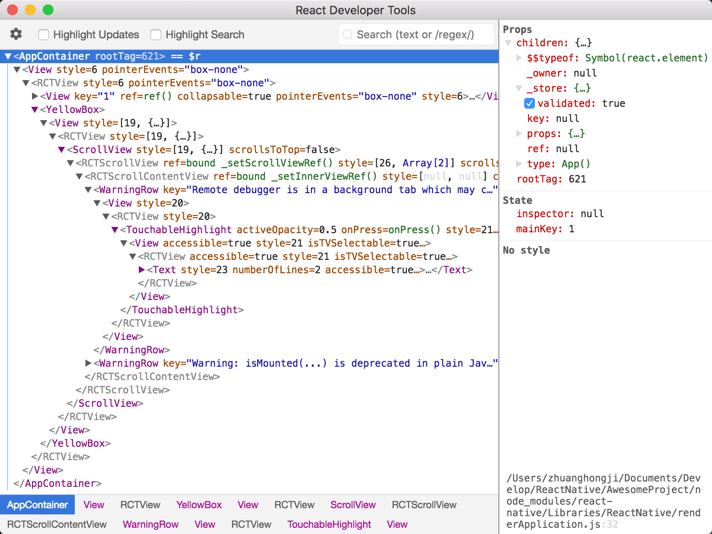

# React Native - 如何调试

写代码难免会遇到问题，所以在发现问题后知道如何通过调试去定位问题的具体位置显得非常重要。总的来说，React Native 的调试还是比较方便的，在这篇文章中我们一起来探讨下。

## 开发者菜单

### 开启调试的快捷键

在使用模拟器进行开发时，我们是可以利用应用菜单、键盘来使用一些快捷操作的。但在 iOS 模拟器中使用快捷键前需要确保模拟器的 Hardware 菜单中的 Keyboard 选项下的 "Connect Hardware Keyboard" 处于开启状态，否则按键是没有响应的。

### 访问 App 内的开发者菜单

如果是 iOS 真机或模拟器，你可以通过摇晃真机或是选择 iOS 模拟器的 "Hardware" 菜单中的 "Shake Gesture" 选项来打开 "开发者菜单"。另外，如果是在 iOS 模拟器中运行的话，还可以按下键盘中的 `Command ⌘ + D` 快捷键。

如果是 Android 真机，你也可以通过摇晃来打开 "开发者菜单"。但如果是 Android 模拟器的话，就只能通过 `Command ⌘ + M` 快捷键或在命令行中运行 `adb shell input keyevent 82` 来发送菜单键命令来打开了。

iOS 和 Android 的开发者菜单效果图分别如下：

| iOS | Android
| -- | --
|  | 

> 注：在发布 (production) 版本中开发者菜单将无法使用。

* Enable Hot Reload: 启用热重载，在保存代码后自动热重载，热重载后应用的状态还是在的，这个选项在开发过程中基本都会处于开启状态。
* Show Pref Minitor: 打开性能监视器，偶尔也会用到。
* ...

`Reload` 重新加载：
* 传统的原生应用开发中，每一次修改都需要重新编译，但在 React Native 中你只需要刷新一下 JavaScript 代码，就能立刻看到变化。
* 具体的操作就是在开发菜单中点击 "Reload" 选项。也可以在 iOS 模拟器中按下 `Command ⌘ + R` 快捷键，Android 模拟器的话则是快速按两下 `R` 键盘。

`Debug JS Remotely` 远程 JS 调试：
* 默认会打开 Chrome 进行调试。
* 或者你也可以通过一些配置来实现在 VSCode 中调试，这样会更加方便点。

`Enable Live Reload` 自动重新加载：
* 选择开发菜单中的 "Enable Live Reload" 可以开启自动刷新，这样可以节省你开发中的时间。
* 启用后好像是会在保存代码时自动重新加载，平时用的不多，因为重新加载后应用状态也没有了。

`Enable Hot Reload` 启用热重载：
* 热重载后，你还可以保持应用的当前运行状态，修改后的 JavaScript 文件会自动注入进来 (就好比行驶中的汽车不用停下就能更换新的轮胎)。
* 某些情况下 hot reload 并不能顺利实施。如果碰到任何界面刷新上的问题，请尝试手动完全刷新。

`Show Pref Minitor` 打开性能监视器：
* 偶尔也会用到。


尽管重新加载和热重载很方便，但有些时候你必须要重新编译应用才能使的修改生效：
* 增加了新的资源：比如在 iOS 的 `Images.xcassets` 文件夹添加了图片，或是在 Andorid 的 `res/drawable` 文件夹添加了图片。
* 更改了任何的原生代码：比如修改 iOS 平台中的 `objective-c` / `swift` 代码，或是修改了 Android 平台中的 `java` / `Kotlin` 代码。


## 应用内的错误与警告提示

红屏或黄屏提示都只会在开发版本中显示，在正式的生产包 (离线包) 中是不会显示的。

**红屏错误**

应用内的报错会以全屏红色显示在应用中 (调试模式下)，我们称为红屏 (red box) 报错。你可以使用 `console.error()` 来手动触发红屏错误。比如：

```js
componentDidMount() {
  console.error("这是手动触发的红屏错误")
}
```

| iOS | Android
| -- | --
|  | 


**黄屏警告**

应用内的警告会以全屏黄色显示在应用中 (调试模式下)，我们称为黄屏 (yellow box) 警告。点击警告可以查看详情或是忽略掉。和红屏报警类似，你可以使用 `console.warn()` 来手动触发黄屏警告。

默认情况下，开发模式中启用了黄屏警告。如果你觉得会干扰你的编码体验，也可以通过以下代码进行关闭：

```javascript
console.disableYellowBox = true;
console.warn("YellowBox is disabled.");
```

如果你只是想过滤部分黄屏警告，可以通过代码来屏蔽指定警告。姿势像下面这样调用 ignoreWarnings 方法这样，该方法接收一个数组参数：

```js
import { YellowBox } from "react-native";
YellowBox.ignoreWarnings(["Warning: ..."]);
```

在 CI/Xcode 中，黄屏警告还可以通过设置 `IS_TESTING` 环境变量来控制启用与否。

> 注：红屏错误和黄屏警告在发布版 (release/production) 中都是自动禁用的。


## 开发者工具

### Chrome

在开发者菜单中选择 "Debug JS Remotely" 选项，即可以开始在 Chrome 中调试 JavaScript 代码。点击这个选项的同时会自动打开调试页面 `http://localhost:8081/debugger-ui`，调试网页显示的内容大致如下图：


然后，在 Chrome 的菜单中选择 `Tools -> Developer Tools` 可以打开开发者工具，或者通过键盘快捷键来打开：
* Mac 上是 `Command ⌘ + Option ⌥ + I` 。
* Windows 上是 `Ctrl + Shift + I` 或 `F12` 。

打开 [Pause On Caught Exceptions](http://stackoverflow.com/questions/2233339/javascript-is-there-a-way-to-get-chrome-to-break-on-all-errors/17324511#17324511) 选项，即有异常时暂停，能够获得更好的开发体验。

注：Chrome 中并不能直接看到 App 的用户界面，而只能提供 console 的输出，以及在 sources 项中断点调试 js 脚本。一些老的教程和文章会提到 React 的 Chrome 插件，这一插件目前并不支持 React Native，而且调试本身并不需要这个插件。当然，你也可以安装独立版本 (非插件) 的 React Developer Tools 来辅助查看界面布局，下文会讲述具体安装方法。

示例：

```js
componentDidMount() {
  console.info("第一行日志")
  console.info("第二行日志")
  console.info("第三行日志")
}
```


### 自定义的 JavaScript 调试器

如果想用其他的 JavaScript 调试器来代替 Chrome，可以设置一个名为 `REACT_DEBUGGER` 的环境变量，其值为启动自定义调试器的命令。调试的流程依然是从开发者菜单中的 "Debug JS Remotely" 选项开始。

被指定的调试器需要知道项目所在的目录 (可以一次传递多个目录参数，以空格隔开)。例如，如果你设定了：

```shell
REACT_DEBUGGER="node /某个路径/launchDebugger.js --port 2345 --type ReactNative"
```

那么启动调试器的命令就应该是：

```shell
node /某个路径/launchDebugger.js --port 2345 --type ReactNative /某个路径/你的RN项目目录
```

> 以这种方式执行的调试器最好是一个短进程 (short-lived processes)，同时最好也不要有超过 200k 的文字输出。


### React Developer Tools

你可以使用 [单独版本的 React Developer Tools](https://github.com/facebook/react-devtools/tree/master/packages/react-devtools) 来调试 React 组件层级。要想使用该工具，先全局安装 `react-devtools` 包。

```shell
$ npm install -g react-devtools
```

```
安装日志如下：

zhuanghongji-mbp:AwesomeProject zhuanghongji$ npm install -g react-devtools
/usr/local/bin/react-devtools -> /usr/local/lib/node_modules/react-devtools/bin.js

> electron@1.8.7 postinstall /usr/local/lib/node_modules/react-devtools/node_modules/electron
> node install.js

Downloading SHASUMS256.txt
[============================================>] 100.0% of 5.74 kB (5.74 kB/s)
+ react-devtools@3.2.3
added 234 packages in 163.902s
```

注：react-devtools 依赖于 electron，而 electron 需要到国外服务器下载二进制包，所以国内用户这一步很可能会卡住。此时请在 `环境变量` 中添加 electron 专用的国内镜像源：`ELECTRON_MIRROR="https://npm.taobao.org/mirrors/electron/"`，然后再尝试安装 react-devtools。

安装完成后在命令行中执行 `react-devtools` 即可启动此工具：

```shell
$ react-devtools
```

效果图如下：



启动工具两三秒内就会连接到你的模拟器。

> Note: if you prefer to avoid global installations, you can add `react-devtools` as a project dependency. Add the `react-devtools` package to your project using `npm install --save-dev react-devtools`, then add `"react-devtools": "react-devtools"` to the `scripts` section in your `package.json`, and then run `npm run react-devtools` from your project folder to open the DevTools.


### React Native 检查器

打开应用内的开发者菜单，选择 "Toggle Inspector"。然后会显示一个覆盖层，你可以点击其中的 UI 元素来查看相关信息:

| iOS | Android | 官网示例
| -- | -- | --
|  |  | 

然而，如果你当前正在运行 `react-devtools`。检查器会进入一个特殊的收缩模式，然后将 DevTools 作为主要的 UI 显示。在该模式下，点击模拟器中的元素时，DevTools 中会显示出相关的组件信息。

演示静态图：


演示动态图：


你可以在同一个菜单下再次点击 "Toggle Inspector" 来结束该模式。


### 检查组件实例

在 Chrome 中调试 JavaScript 时，我们可以在浏览器控制台中检查 React 组件的属性和状态：
* 首先，按照 Chrome 中的调试说明打开 Chrome 控制台。
* 然后，确保 Chrome 控制台左上角的下拉框显示 `debuggerWorker.js` (这一步很重要)。
* 再然后，在 React DevTools 中选择一个 React 组件。在顶部有一个搜索框，可以帮助你按名字找到一个。一旦你选择了它，它就会以 `$r` 的形式出现在 Chrome 控制台，你可以查看它的属性、状态和实例变量。

下面是官方提供的一张动态效果图：


### 性能监测

你可以在开发者菜单中选择 "Show Pref Monitor" 选项以开启一个悬浮层，其中会显示应用的当前帧数。

| iOS | Android
| -- | --
|  | 


## 调试姿势

### Debugging in Ejected Apps

The remainder of this guide only applies to projects made with `react-native init` or to those made with Create React Native App which have since ejected. For more information about ejecting, please see the [guide](https://github.com/react-community/create-react-native-app/blob/master/EJECTING.md) on the Create React Native App repository.


### 访问控制台日志

在运行 React Native 应用时，可以在终端中运行如下命令来查看控制台的日志：

```shell
$ react-native log-ios
$ react-native log-android
```

比如 `react-native log-android`：

```shell
...

07-29 06:14:34.139  2637 10042 D ReactNative: CatalystInstanceImpl.destroy() end
07-29 06:14:34.353  2637 10041 I ReactNativeJS: Running application "AwesomeProject" with appParams: {"rootTag":71}. __DEV__ === true, development-level warning are ON, performance optimizations are OFF
07-29 06:14:34.421  2637 10041 I ReactNativeJS: 第一行日志
07-29 06:14:34.421  2637 10041 I ReactNativeJS: 第二行日志
07-29 06:14:34.421  2637 10041 I ReactNativeJS: 第三行日志
```

此外，你也可以在 iOS 模拟器的菜单中选择 `Debug -> Open System Log...` 来查看日志。如果是 Android 应用，无论是运行在模拟器或是真机上，都可以通过在终端命令程序中执行 `adb logcat *:S ReactNative:V ReactNativeJS:V` 命令来查看。比如下面的两张图：


### 使用 Chrome 开发者工具来在设备上调试

对于 iOS 真机来说，需要打开 [`RCTWebSocketExecutor.m`](https://github.com/facebook/react-native/blob/master/Libraries/WebSocket/RCTWebSocketExecutor.m) 文件，然后将其中的 "localhost" 改为你的电脑的 IP 地址，最后启用开发者菜单中的 "Debug JS Remotely" 选项。

对于 Android 5.0+ 设备 (包括模拟器) 来说，将设备通过 USB 连接到电脑上后，可以使用 [`adb`命令行工具](http://developer.android.com/tools/help/adb.html) 来设定从设备到电脑的端口转发：

```shell
$ adb reverse tcp:8081 tcp:8081
```

如果设备 Android 版本在 5.0 以下，则可以在开发者菜单中选择 "Dev Settings - Debug server host for device"，然后在其中填入电脑的 ”IP 地址:端口“。

> 如果在 Chrome 调试时遇到一些问题，那有可能是某些 Chrome 的插件引起的。试着禁用所有的插件，然后逐个启用，以确定是否某个插件影响到了调试。


### 在 Android 上使用 Stetho 来调试

[Stetho](http://facebook.github.io/stetho/)：是 Facebook 开源的一个 Android 调试工具，通过 Stetho，开发者可以使用 Chrome 的 inspect 功能来对Android 应用进行调试和查看。使用步骤如下：

**1. 在 `android/app/build.gradle` 文件的 `dependencies` 中添加：**

```groovy
debugCompile 'com.facebook.stetho:stetho:1.5.0'
debugCompile 'com.facebook.stetho:stetho-okhttp3:1.5.0'
```

> 上面使用的是 Stetho 的 1.5.0 版本，你可以在 `http://facebook.github.io/stetho/` 中找到更新版本，如果有的话。

**2. 创建以下 Java 类来封装 Stetho 调用，一个用于 release，一个用于 debug：**

`StethoWrapper.java` (Release) :

```java
// android/app/src/release/java/com/{yourAppName}/StethoWrapper.java
public class StethoWrapper {
    public static void initialize(Context context) {
        // NO_OP
    }

    public static void addInterceptor() {
        // NO_OP
    }
}
```

`StethoWrapper.java` (Debug) :

```java
// android/app/src/debug/java/com/{yourAppName}/StethoWrapper.java
public class StethoWrapper {
    public static void initialize(Context context) {
      Stetho.initializeWithDefaults(context);
    }

    public static void addInterceptor() {
      OkHttpClient client = OkHttpClientProvider.getOkHttpClient()
            .newBuilder()
            .addNetworkInterceptor(new StethoInterceptor())
            .build();
      OkHttpClientProvider.replaceOkHttpClient(client);
    }
}
```

**3. 打开 `android/app/src/main/java/com/{yourAppName}/MainApplication.java` 并在 `onCreate` 方法中补充相关代码:**

```java
public void onCreate() {
  super.onCreate();
  if (BuildConfig.DEBUG) {
      StethoWrapper.initialize(this);
      StethoWrapper.addInterceptor();
  }

  SoLoader.init(this, /* native exopackage */ false);
}
```

**4. 在 Android Studio 中打开项目并解决任何依赖问题，将鼠标悬停在红线上之后， IDE 会引导你完成相关步骤。**

**5. 执行 `react-native run-android` 命令。**

**6. 打开一个新的 Chrome 选项卡，然后在地址栏中输入 `chrome://inspect` 并回车。接着在页面中选择 'Inspect device' (标有 "Powered by Stetho" 字样) 即可。**


### 调试原生代码

在和原生代码打交道时 (比如编写原生模块)，可以直接从 Android Studio 或是 Xcode 中启动应用，并利用这些 IDE 的内置功能来调试 (比如设置断点)。这一方面和开发原生应用并无二致，所以总的来说，调试还是比较方便的。


## 总结

在这篇文章中，我们对如何调试 React Native 应用已经有了一个比较全面的了解。笔者目前使用得比较多的调试工具该是编辑器 VSCode 本身，因为比较强大且方便，关于这方面的信息读者可以搜索了解一下。
