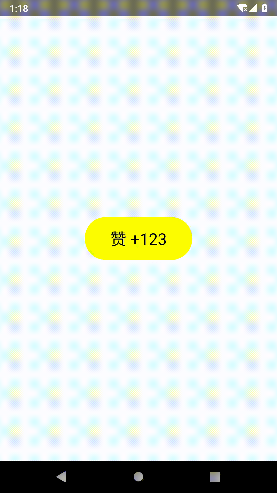

# React Native - ActivityIndicator

显示一个圆形的加载指示器。

## 概述

话不多说，先献上栗子一盘。

### 示例

```js
import React, { Component } from 'react';
import {
  ActivityIndicator,
  StyleSheet,
  Text,
  View
} from 'react-native';

type Props = {};
export default class App extends Component<Props> {
  render() {
    return (
      <View style={[styles.container, styles.horizontal]}>
        <ActivityIndicator size='large' color='#0000FF' animating={true}/>
        <ActivityIndicator size='small' color='#00FF00'/>
        <ActivityIndicator size='large' color='#0000FF'/>
        <ActivityIndicator size='small' color='#00FF00'/>
      </View>
    );
  }
}

const styles = StyleSheet.create({
  container: {
    flex: 1,
    justifyContent: 'center',
  },
  horizontal: {
    flexDirection: 'row',
    justifyContent: 'space-around',
    padding: 10,
  }
});
```

运行后，动态效果图如下：

| iOS | Android
| -- | --
|  | 


### 参数

**`animating`**

是否显示指示器。
* `true`: 显示 (默认值)。
* `false`: 不显示。

·

**`color`**

指示器的颜色 (默认灰色)。

·

**`size`**

指示器的大小。
* `'small'`: 小 (默认值)。
* `'large'`: 大。
* `number`: 通过数字指定大小，仅支持 Android 平台。

**`hidesWhenStopped`**

指示器动画停止时，是否隐藏指示器 (默认为 `true`)，仅支持 iOS 平台。

> 注：当 `animating` 和 `hidesWhenStopped` 同时为 `false` 时：
> * iOS 平台的指示器会暂停动画，但指示器本身还是可见的
> * Android 平台指示器会直接被隐藏


## 扩展

> 以下是为防止篇幅过短而刻意加的内容，哈哈哈。

所谓的指示器，在 App 中可以简单的理解为 "网络加载提示视图"。

假设我们现在有一个需求，需要在 "闲鱼" App 增加一个对商品点赞的功能：
* 用户点击 "赞" 按钮的时候发起网络请求，在请求成功后对当前点赞数加一。
* 为了友好的用户体验，我们在发起网络请求的时候需要将按钮内容显示为 `ActivityIndicator`，然后在请求成功后再显示 `点赞数`。

### 撸起袖子就是干

我们先来封装一个通用的 `StateView` 来管理 `ActivityIndicator` 和 `点赞数` 的显示控制：

`./src/StateView.tsx`

```tsx
import React, { Component } from 'react';
import { ActivityIndicator } from 'react-native';

interface IProps {
  /** 指示器大小 */
  indicatorSize: 'small' | 'large' 
  /** 指示器颜色 */
  indicatorColor: string,
  /** 当前要显示的内容类型，normal 表示正常显示其 children */
  type: 'normal' | 'loading'
}

export class StateView extends Component<IProps, Object> {
  static defaultProps: IProps = {
    indicatorSize: 'small',
    indicatorColor: 'white',
    type: 'normal',
  }

  render() {
    const { indicatorSize, indicatorColor, type } = this.props
    if (type === 'normal') {
      return this.props.children
    }
    return (
      <ActivityIndicator 
        size={indicatorSize} 
        color={indicatorColor}/>
    )
  }
}
```

至此，配料 `StateView` 准备好了，我们开始炒 (write) 菜 (example-code)：

`./App.tsx`

```tsx
import React, { Component } from 'react';
import { 
  StyleSheet, 
  Text, 
  View, 
  ViewStyle, 
  TextStyle, 
  TouchableOpacity,
} from 'react-native';
import { StateView } from './src/StateView';

interface IState {
  praising: boolean
  praiseNum: number
}

export default class App extends Component<Object, IState> {
  readonly state: IState = {
    praising: false,
    praiseNum: 123,
  }

  private plusPraiseNum() {
    this.setState({ praising: true })
    setTimeout(() => {
      this.setState(prevState => { 
        return { praising: false, praiseNum: prevState.praiseNum + 1 }
      })
    }, 3000)
  }

  render() {
    const { praising, praiseNum } = this.state
    return (
      <View style={styles.container}>
        <TouchableOpacity
          style={styles.prasingButton}
          activeOpacity={0.8}
          onPress={() => this.plusPraiseNum()}
        >
          <StateView 
            indicatorSize="large" 
            indicatorColor="black"
            type={praising ? 'loading' : 'normal'}
          >
            <Text style={styles.prasingNumText}>{`赞 +${praiseNum}`}</Text>
          </StateView>
        </TouchableOpacity>
      </View>
    );
  }
}

interface Style {
  container: ViewStyle,
  prasingButton: ViewStyle,
  prasingNumText: TextStyle,
}

const styles = StyleSheet.create<Style>({
  container: {
    flex: 1,
    justifyContent: 'center',
    alignItems: 'center',
    backgroundColor: '#F5FCFF',
  },
  prasingButton: {
    width: 160,
    height: 64,
    justifyContent: 'center',
    alignItems: 'center',
    borderRadius: 32,
    backgroundColor: 'yellow',
  },
  prasingNumText: {
    fontSize: 24,
    color: 'black',
  },
});
```

运行后，动态效果图如下：



注意：在实际开发中，我们应该将 `App.tsx` 中编写的 "点赞" 按钮封装成一个单独的组件，以便以后可能需要的代码复用。


### 代码解析

如果你没有学过 TypeScript 的话，可能会觉得上述的示例代码有点羞涩难懂，所以这里再针对其中 TypeScript 相关的内容做下解析。

**TypeScript 语法**

在 TypeScript 定义接口的语法姿势是这样的：

```ts
// 定义一个名为 InterfaceName 的接口 
interface InterfaceName {
  propName1: number
  propName2: number | string
  methodName: () => void
}

// 使用 InterfaceName 接口指定声明变量的类型
const interfaceExample: InterfaceName = {
  propName1: 1,
  propName2: 'ABC',
  methodName: () => { console.log('hello interface.') },
}
```

在上面的代码片段中，我们可以将接口 `InterfaceName` 理解成 "类型"，然后我们在声明变量 `interfaceExample` 的时候就通过 `: ` 语法来将其类型指定为 `interfaceExample`。

另外，在定义类型的时候我们除了可以使用 `interface` 接口关键字外，也可以使用 `type` 和 `typeof` 关键字来定义类型别名。比如：

```ts

// ···· using type and typeof
type MyUniontype = number | string

const myFunction = () => { console.log('hello type.') }
type FunctionType = typeof myFunction
// ....

interface InterfaceName {
  propName1: number
  propName2: MyUniontype        // 1
  methodName: FunctionType      // 2
}

const InterfaceNameExample: InterfaceName = {
  propName1: 1,
  propName2: 'ABC',
  methodName: () => { console.log('hello interface') },
}
```

上面两个代码片段中对 `InterfaceName` 接口的声明是完全等价的，主要区别在于后者使用了 `type` 和 `typeof` 定义了 "类型别名"。

.

**TypeScript 在 React Native 中的应用**

在 `@types/react/index.d.ts` 中，我们可以看到 `Component` 的定义大致是这样的：

```tsx
// P: Props
// S: State
class Component<P, S> {

  ... 
  constructor(props: Readonly<P>);

  setState<K extends keyof S>(
            state: ((prevState: Readonly<S>, props: Readonly<P>) => (Pick<S, K> | S | null)) | (Pick<S, K> | S | null),
            callback?: () => void
        ): void;

  render(): ReactNode;
  readonly props: Readonly<P> & Readonly<{ children?: ReactNode }>;
  state: Readonly<S>;

  refs: {
      [key: string]: ReactInstance
  };
}
```

* `Component` 接收两个泛型参数：`P` 是组件属性 Props 的类型，`S` 是组件状态 State 的类型。
* 构造函数 `constructor` 的参数类型是 `P`。
* `setState` 方法中通过 `extends of S` 限定泛型参数 `K` 的范围，参数 `state` 的类型可能是一个函数类型，也可能是 `S` 类型或 "`S` 键的一部分" 类型：
  * `((prevState: Readonly<S>, props: Readonly<P>) => (Pick<S, K> | S | null))`
  * `(Pick<S, K> | S | null)`
* 通过 `readonly` 关键字指定 props 是只读的，不可修改的。同时，可修改的 state 的类型声明中，通过 `Reactonly` 来对 `S` 做了类型映射。

综上，我们在定义 React Native 组件的时候，可以酱紫写：

```tsx
interface IProps {
  ...
}

interface IProps {
  ...
}

export class MyComponent<IProps, IProps> {
  render() {
    return (
      ...
    )
  }
}
```

另外，如果你仔细看的话会发现，我们在 create 样式的时候也使用到了 `interface` 和泛型，这种姿势一般是这样的：

```tsx
import {
  ViewStyle, ImageStyle, TextStyle
} from 'react-native'

interface Style {
  view: ViewStyle,
  image: ImageStyle,
  text: ImageStyle,
}

const styles = StyleSheet.create<Style>({
  view: { 
    ... 
  },
  image: { 
    ... 
  },
  text: { 
    ... 
  },
})
```

在定义样式时通过泛型来指定具体样式的类型，这样做的好处在于：如果我们编写样式代码时使用了不符合对应类型的属性，编辑器会进行错误提示。比如说如果写成这样：

```tsx
view : {
  fontSize: 16,  // fontSize 在 ViewStyle 中没有定义 (在 TextStyle 中才有)
}
```

这时编辑器会提示我们，`fontSize` 不符合 `ViewStyle` 类型定义。


## 总结

铛铛铛，在扩展了 "Indicator + TypeScript" 的实际应用后，文章的篇幅总算长了些，所以到这里就可以 Ending 了，哈哈哈。


