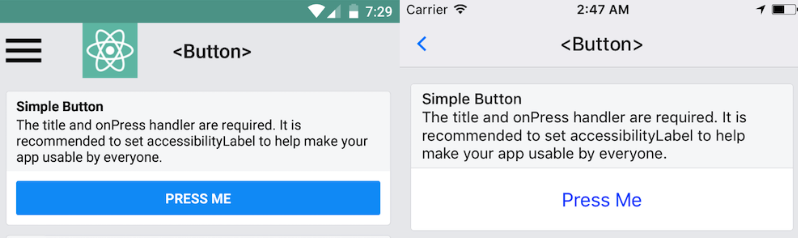

# Button

一个基本的按钮组件，在各个平台上都能得到很好的渲染，支持最低级别的自定义。



如果该按钮不太搭配你的应用，可以通过 [TouchableOpacity](https://facebook.github.io/react-native/docs/touchableopacity.html) 或 [touchableNativeFeedback](https://facebook.github.io/react-native/docs/touchablenativefeedback.html) 来定制自己所需要的按钮。你可以通过看 [这些按钮组件的源代码](https://github.com/facebook/react-native/blob/master/Libraries/Components/Button.js) 来获得灵感，或者可以看下 [社区构建的一系列按钮组件](https://js.coach/react-native?search=button)。

| [apsl-react-native-button](https://js.coach/apsl-react-native-button?search=button&collection=React+Native) | [react-native-simple-radio-button](https://js.coach/react-native-simple-radio-button?search=button&collection=React+Native)
| -- | --
|  | 


## 示例
```js
import React, {Component} from 'react';
import {
  StyleSheet,
  Alert,
  Button,
  View
} from 'react-native';


export default class App extends Component<Props> {
  render() {
    return (
      <View style={styles.container}>
        <Button title='默认样式'/>
        <Button color='red'
                title='红色按钮'
                onPress={() => {
                  Alert.alert('点击了红色按钮')
                }}
        />
        <Button color='blue'
                title='Learn More'
                disabled={true}
        />
      </View>
    );
  }
}

const styles = StyleSheet.create({
  container: {
    flex: 1,
    justifyContent: 'center',
    flexDirection: 'column'
  }
});
```

| iOS | Android
| -- | --
|  | 


## 参数

### `onPress`
用点击按钮时所调用的处理函数。

### `title`
按钮内显示的文本。

### `accessibilityLabel`

### `color`
* iOS: 对应的是文本的颜色
* Android: 对应的是按钮背景的颜色

### `disabled`
如果为 `true`, 则禁用该组件所有的所有交互。

### `testID`
Used to locate this view in end-to-end tests.

### `hasTVPreferredFocus`
(Apple TV only) TV preferred focus (see documentation for the View component).
