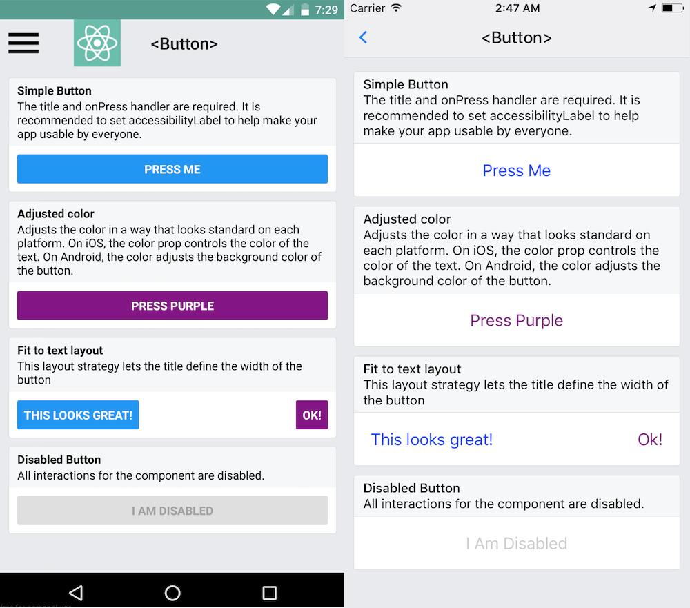
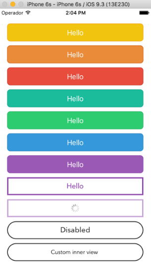
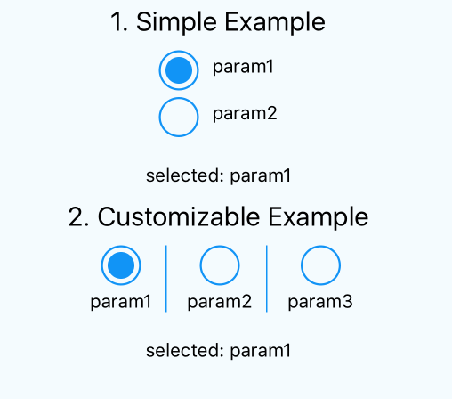
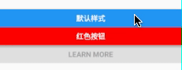

# React Native - Button 和 Touchable 

## 概述

在 React Native 中，`Button` 和 Touchable ( `TouchableOpacity` | `TouchableNativeFeedback` | ... ) 都表示可点击的视图。

其中 `Button` 是一个简单的跨平台的按钮组件，下面是一张从官方文档中拷贝过来的示例图：



仔细看这张图你会发现，`Button` 组件在两个平台上的显示基本是完全不一样的：
* 在 Android 上按钮渲染的时候有对应背景色，文字白色且默认都是大写。
* 在 iOS 上按钮牛渲染的时候文字是对应背景色，背景白色，默认情况下文字不会都转成大写。

这主要是平台 UI 呈现的差异性导致的，所以实际开发中我们很少会直接使用 `Button` 来作按钮显示，一般都是基于 Touchable 封装自己的按钮组件，以保证在两个平台上的渲染能保持一致，并且可高度定制化。

当然，如果你想保证平台显示一致性但又不想自己定制，可以考虑使用第三方按钮组件库，比如：
* [apsl-react-native-button](https://js.coach/apsl-react-native-button?search=button&collection=React+Native)
* [react-native-simple-radio-button](https://js.coach/react-native-simple-radio-button?search=button&collection=React+Native)

目前不知这两个平台库是否还在维护，下面是两张效果图：

| apsl-react-native-button | react-native-simple-radio-button
| -- | --
|  |  

## Button

### 示例

```js
import React, {Component} from 'react';
import {
  StyleSheet,
  Alert,
  Button,
  View
} from 'react-native';

export default class App extends Component<Props> {
  render() {
    return (
      <View style={styles.container}>
        <Button title='默认样式'/>
        <Button 
          color='red'
          title='红色按钮'
          onPress={() => {
            Alert.alert('点击了红色按钮')
          }}
        />
        <Button 
          color='blue'
          title='Learn More'
          disabled={true}
        />
      </View>
    );
  }
}

const styles = StyleSheet.create({
  container: {
    flex: 1,
    justifyContent: 'center',
    flexDirection: 'column'
  }
});
```

| iOS | Android
| -- | --
|  | 


### 参数

**`onPress`**

用点击按钮时所调用的处理函数。


**`title`**

按钮内显示的文本。


**`color`**

颜色。
* 在 iOS 平台上，对应的是文本的颜色。
* 在 Android 平台上，对应的是按钮背景的颜色。


**`disabled`**

如果为 `true`, 则会禁用该组件所有的所有交互。


## TouchableOpacity

一个可用于封装视图并可正确响应触摸操作的按钮组件。在按下的时候，封装的视图的不透明度会降低，也就是说会更加透明一点，这个 "一点" 到底是多少则可以通过其 `activeOpacity` 属性进行配置。

不透明度的变化是通过把子元素封装在一个 `Animated.View` 中来实现的，这个动画视图会被添加到视图层级中，少数情况下有可能会影响到布局。此组件与 `TouchableHighlight` 组件的区别在于并没有额外的颜色变化，适用场景一般更广一些。

### 示例代码

```js
import React, { Component } from 'react'
import {
  StyleSheet,
  TouchableOpacity,
  Text,
  View,
} from 'react-native'

export default class App extends Component {
  constructor(props) {
    super(props)
    this.state = { count: 0 }
  }

  onPress = () => {
    this.setState({
      count: this.state.count+1
    })
  }

 render() {
   return (
     <View style={styles.container}>
       <TouchableOpacity
         style={styles.button}
         onPress={this.onPress}
       >
         <Text> Touch Here </Text>
       </TouchableOpacity>
       <View style={[styles.countContainer]}>
         <Text style={[styles.countText]}>
            { this.state.count !== 0 ? this.state.count: null}
          </Text>
        </View>
      </View>
    )
  }
}

const styles = StyleSheet.create({
  container: {
    flex: 1,
    justifyContent: 'center',
    paddingHorizontal: 10
  },
  button: {
    alignItems: 'center',
    backgroundColor: '#DDDDDD',
    padding: 10
  },
  countContainer: {
    alignItems: 'center',
    padding: 10
  },
  countText: {
    color: '#FF00FF'
  }
})
```

动态效果图如下：


### 常用属性

**`activeOpacity`**

指定封装的视图在被触摸操作激活时以多少不透明度显示 (0 到 1 之间)。默认值为 0.2。

> 个人感觉 0.2 的时候透明度较高了，可以封装一个全局的 Touchable 组件出来并调整为 0.8，封装全局 Touchable 组件还可以通过 "节流/防抖" 来解决快速点击导致的多次响应 `onPress` 事件问题。


### 常用方法

`setOpacityTo((value: number), (duration: number));`

将本组件的不透明度设为指定值 (伴有过渡动画)。


## 总结

这篇文章主要是简单点描述了 `Button` 和 Touchable 系列组件的使用