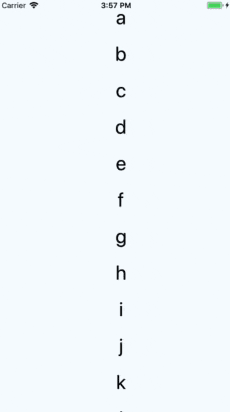

# React Native - FlatList

## 概述 

FlatList 是一个高性能的、易于使用的列表组件，它有以下特性：
* 完全跨平台
* 支持水平布局模式
* 可配置行组件显示或隐藏时的回调事件
* 支持单独的头部组件 (Header)
* 支持单独的尾部组件 (Footer)
* 支持自定义行间分隔线
* 支持下拉刷新
* 支持上拉加载
* 支持滚动到指定行 (ScrollToIndex)

如果需要分 "组/类/区" (section)，可使用功能类似的 `<SectionList>` 组件。

## 简单示例

下面是使用 FlatList 的一个简单示例：

```js
// 特意加了个 textStyle 使得 item 显示鲜明一点
const textStyle = { fontSize: 32, backgroundColor: 'red', borderRadius: 16 }

<FlatList
  data={[{key: 'a'}, {key: 'b'}]}
  renderItem={({ item }) => <Text>{item.key}</Text>}
/>
```

通过 `data` 属性指定数据源，再通过 `renderItem` 属性指定列表项绘制逻辑即可，运行后的效果图是这样的：


类似上述绘制 `Text` 组件的示例，我们来看一个有完整代码和动态效果图的：

```js
import React, { Component } from 'react';
import {
  StyleSheet,
  Text,
  View,
  FlatList,
  Dimensions,
} from 'react-native';

export default class App extends Component {
  render() {
    let data = [
      {key: 'a'}, {key: 'b'}, {key: 'c'}, {key: 'd'},
      {key: 'e'}, {key: 'f'}, {key: 'g'}, {key: 'h'},
      {key: 'i'}, {key: 'j'}, {key: 'k'}, {key: 'l'},
      {key: 'm'}, {key: 'n'}, {key: 'o'}, {key: 'p'},
    ]
    return (
      <View style={styles.container}>
        <FlatList
          data={data}
          renderItem={({item}) => <Text style={styles.text}>{item.key}</Text>}
        />
      </View>
    );
  }
}

const styles = StyleSheet.create({
  container: {
    flex: 1,
    justifyContent: 'center',
    alignItems: 'center',
    backgroundColor: '#F5FCFF',
  },
  text: {
    width: Dimensions.get('window').width,
    fontSize: 32,
    textAlign: 'center',
    margin: 10,
  },
});
```

| iOS | Android
| -- | --
|  | 

注：在上面的动态图中可以看到，相同的代码在 iOS 中是可以左右滑动的，而在 Android 中则不能。如果不期望有这个特性的话可以通过 `ScrollView` 的一个属性 (好像是 `bounces`，记不太清了) 来禁用掉，因为 `FlatList` 有着 `ScrollView` 所有的属性，所以直接使用该属性即可。

## 复杂点儿的示例

下面是一个稍微复杂点儿的例子，演示了如何利用 `PureComponent` 来进一步优化性能和减少 bug 产生的可能。

### 如何避免不必要的渲染

在上代码前，我们先来了解两个知识点：
* 组件 `shouldComponentUpdate` 机制。
* `Component` 和 `PureComponent` 的区别。

**shouldComponentUpdate**

`shouldComponentUpdate` 是组件的一个钩子函数，其函数原型如下：

```js
shouldComponentUpdate(nextProps, nextState)
```

使用 `shouldComponentUpdate()` 可以让 React 知道当前状态或属性的改变是否不影响组件的输出，该函数默认返回 `ture`，即表示需要重新渲染 (返回 `false` 时则表示不需要)。另外，在组件初始化渲染时或在使用 `forceUpdate()` 强制时该方法不会被调用。如果我们想要避免不必要的渲染，姿势大致是这样：

```js
shouldComponentUpdate(nextProps, nextState) {
  return nextState.someData !== this.state.someData
}
```

看似简单，但是在一个项目中有那么多组件，难道我们要一个一个编写代码去判断 `nextState` 和 `this.state` 里面的数据吗？显然不用，React 提供了一个名为 `PureComponent` 的组件。

**PureComponent**

`PureComponent` 与 `Component` 的功能几乎完全相同，但 `PureComponent` 会通过 `props` 和 `state` 进行浅比较来决定是否需要重新渲染。

```js
function checkShouldComponentUpdate() {
  ...

  // 判断此组件是否是 PureComponent
  // 如果是，则通过 shallowEqual 对 props 和 state 进行浅比较
  // 否则直接返回 true，表示要更新
  if (ctor.prototype && ctor.prototype.isPureReactComponent) {
    return (
      !shallowEqual(oldProps, newProps) || !shallowEqual(oldState, newState)
    );
  }
  return true;
}
```

> 注：浅比较，比较引用是否相同；深比较，比较原值是否相等，需要递归变量两个比较对象的所有属性，不用管引用是否相同。

### 代码和动态效果图

```js
import React, { Component } from 'react'
import {
  TouchableOpacity,
  Text,
  View,
  FlatList,
} from 'react-native'

class MyListItem extends React.PureComponent {
  _onPress = () => {
    this.props.onPressItem(this.props.id);
  };

  render() {
    const textColor = this.props.selected ? "red" : "black";
    return (
      <TouchableOpacity onPress={this._onPress}>
        <View>
          <Text style={{ color: textColor, fontSize: 24 }}>
            {this.props.title}
          </Text>
        </View>
      </TouchableOpacity>
    );
  }
}

class MultiSelectList extends React.PureComponent {
  // Map<string, boolean>
  state = { selected: new Map()};

  _keyExtractor = (item, index) => item.id;

  _onPressItem = (id) => {
    // updater functions are preferred for transactional updates
    this.setState((state) => {
      // copy the map rather than modifying state.
      const selected = new Map(state.selected);
      selected.set(id, !selected.get(id)); // toggle
      return {selected};
    });
  };

  _renderItem = ({item}) => (
    <MyListItem
      id={item.id}
      onPressItem={this._onPressItem}
      selected={!!this.state.selected.get(item.id)}
      title={item.title}
    />
  );

  render() {
    return (
      <FlatList
        data={this.props.data}
        extraData={this.state}
        keyExtractor={this._keyExtractor}
        renderItem={this._renderItem}
      />
    );
  }
}

export class FlatListDemo extends Component {
  render() {
    const data = [
     { id: 'a', title: 'this-is-A', selected: true},
     { id: 'b', title: 'this-is-B', selected: false},
     { id: 'c', title: 'this-is-C', selected: true},
     { id: 'd', title: 'this-is-D', selected: false},
     { id: 'e', title: 'this-is-E', selected: true},
    ]
   return (
     <View style={{ flex: 1 }}>
       <MultiSelectList data={data}/>
      </View>
    )
  }
}
```


* 对于 `MyListItem` 组件来说，其 `onPressItem` 属性使用箭头函数而非 bind 的方式进行绑定，使其不会在每次列表重新 render 时生成一个新的函数，从而保证了 props 的不变性 (当然前提是 `id`、`selected`和 `title` 也没变) ，不会触发自身无谓的重新绘制。换句话说，如果你是用 bind 来绑定 `onPressItem`，每次都会生成一个新的函数，导致 props 在 `===` 比较时返回 false，从而触发自身的一次不必要的重新绘制。
* 给 `FlatList` 指定 `extraData={this.state}` 属性，是为了保证 `state.selected` 变化时，能够正确触发 `FlatList` 的更新。如果不指定此属性，则 `FlatList` 不会触发更新，因为它是一个 `PureComponent`，其 props 在 `===` 比较中没有变化则不会触发更新。
* `keyExtractor` 属性指定使用 id 作为列表每一项的 key。


## 扩展

`FlatList` 组件实质是基于 `<VirtualizedList>` 组件的封装，它继承了其所有 props (也包括 `<ScrollView>` 所有的)，详细内容可在官方文档 API 部分找到。

此外，在使用 `FlatList` 时有以下注意事项：

* 当某行滑出渲染区域之外后，其内部状态将不会保留，需自行确保有在行组件以外的地方保留了数据。
* 本组件继承自 `PureComponent` 而非通常的 `Component`，这意味着如果其 `props` 在浅比较中是相等的，则不会重新渲染。所以需要检查你的 `renderItem` 函数所依赖的 `props` 数据 (包括 `data` 属性以及可能用到的父组件的 `state`)，如果是一个引用类型 (Object 或者数组都是引用类型)，则需要先修改其引用地址 (比如先复制到一个新的 Object 或者数组中)，然后再修改其值，否则界面很可能不会刷新。
* 为了优化内存占用同时保持滑动的流畅，列表内容会在屏幕外异步绘制。这意味着如果用户滑动的速度超过渲染的速度，则会先看到空白的内容。这是为了优化不得不作出的妥协，你可以根据自己的需求调整相应的参数，而我们 (官方) 也在设法持续改进。
* 默认情况下每行都需要提供一个不重复的 key 属性，你也可以提供一个 `keyExtractor` 函数来生成 key。

`FlatList` 组件如果嵌套在其它同滚动方向的 FlatList 中，则不会继承 `ScrollView` 的 `Props` 。Excuse me ?...


## 常用属性

**`renderItem`**

```js
renderItem({
  item: Object,
  index: number,
  separators: {
    highlight: Function,
    unhighlight: Function,
    updateProps: Function(select: string, newProps: Object)
  }
}) => ?React.Element
```

从 `data` 中挨个取出数据并渲染到列表中。`renderItem` 属性的类型是一个返回值为 `React.Element` 的函数。其参数列表中除了有列表项对应的数据项 `item` 外，还有可能会用到的 `index` 和 `separators` 参数，可根据实际情况决定是否使用，下面是官方文档对 `index` 和 `separators` 的一个描述：

> Provides additional metadata like `index` if you need it, as well as a more generic `separators.updateProps` function which let you set whatever props you want to change the rendering of either the leading separator or trailing separator in case the more common `highlight` and `unhighlight` (which set the `highlighted: boolean` prop) are insufficient for your use case.

| 类型     | 必填 |
| -------- | ---- |
| function | 是   |

示例：

```javascript
<FlatList
  ItemSeparatorComponent={Platform.OS !== 'android' && ({highlighted}) => (
    <View style={[style.separator, highlighted && {marginLeft: 0}]} />
  )}
  data={[{title: 'Title Text', key: 'item1'}]}
  renderItem={({item, separators}) => (
    <TouchableHighlight
      onPress={() => this._onPress(item)}
      onShowUnderlay={separators.highlight}
      onHideUnderlay={separators.unhighlight}>
      <View style={{backgroundColor: 'white'}}>
        <Text>{item.title}</Text>
      </View>
    </TouchableHighlight>
  )}
/>
```


**`data`**

为了简化起见，`data` 属性目前只支持普通数组。如果需要使用其他特殊数据结构，例如 immutable 数组，请直接使用更底层的 `VirtualizedList` 组件。

| 类型  | 必填 |
| ----- | ---- |
| array | 是   |


**`ItemSeparatorComponent`**

行与行之间的分隔线组件，不会出现在第一行之前和最后一行之后。 

> By default, `highlighted` and `leadingItem` props are provided. `renderItem` provides `separators.highlight`/`unhighlight` which will update the `highlighted` prop, but you can also add custom props with `separators.updateProps`.

| 类型      | 必填 |
| --------- | ---- |
| component | 否   |


**`ListEmptyComponent`**

列表为空时渲染该组件。可以是 `React.Component`，也可以是一个 render 函数，亦或者是渲染好的 Element。

| 类型                         | 必填 |
| ---------------------------- | ---- |
| component, function, element | 否   |


**`ListFooterComponent`**

尾部组件。类似 `ListEmptyComponent`，该属性对应的可以是 React.Component, 也可以是一个 render 函数，亦或者是渲染好的 Element。


**`ListHeaderComponent`**

头部组件。类似 `ListEmptyComponent`，该属性对应的可以是 React.Component, 也可以是一个 render 函数，亦或者是渲染好的 Element。


**`columnWrapperStyle`**

如果设置了多列布局 (即将 `numColumns` 值设为大于 1 的整数)，则可以通过该属性额外指定样式作用在每行容器上。

| 类型         | 必填 |
| ------------ | ---- |
| style object | 否   |


**`extraData`**

如果有除 `data` 以外的数据用在列表中 (不论是用在 `renderItem` 还是头部或者尾部组件中)，请在此属性中指定。同时此数据在修改时也需要先修改其引用地址 (比如先复制到一个新的 Object 或者数组中)，然后再修改其值，否则界面很可能不会刷新。

| 类型 | 必填 |
| ---- | ---- |
| any  | 否   |


**`getItemLayout`**

```js
(data, index) => {length: number, offset: number, index: number}
```

`getItemLayout` 是一个可选的优化，用于避免动态测量内容尺寸的开销，不过前提是你可以提前知道内容的高度。如果你的行高是固定的，`getItemLayout` 用起来就既高效又简单，类似下面这样：

```js
getItemLayout={(data, index) => (
  {length: ITEM_HEIGHT, offset: ITEM_HEIGHT * index, index}
)}
```

对于元素较多的列表 (几百行) 来说，添加 `getItemLayout` 可以极大地提高性能。注意如果你指定了 `ItemSeparatorComponent`，请把分隔线的尺寸也考虑到 offset 的计算之中。

| 类型     | 必填 |
| -------- | ---- |
| function | 否   |


**`horizontal`**

设置为 true 则变为水平布局模式。

| 类型    | 必填 |
| ------- | ---- |
| boolean | 否   |


**`initialNumToRender`**

指定一开始渲染的元素数量，最好刚刚够填满一个屏幕，这样保证了用最短的时间给用户呈现可见的内容。注意这第一批次渲染的元素不会在滑动过程中被卸载，这样是为了保证用户执行返回顶部的操作时，不需要重新渲染首批元素。

| 类型   | 必填 |
| ------ | ---- |
| number | 否   |


**`initialScrollIndex`**

开始时屏幕顶端的元素是列表中的第 `initialScrollIndex` 个元素, 而不是第一个元素。如果设置了这个属性，则第一批 `initialNumToRender` 范围内的元素不会再保留在内存里，而是直接立刻渲染位于 `initialScrollIndex` 位置的元素。需要先设置 `getItemLayout` 属性。

| 类型   | 必填 |
| ------ | ---- |
| number | 否   |


**`inverted`**

翻转滚动方向。实质是将 scale 变换设置为 -1。

| 类型    | 必填 |
| ------- | ---- |
| boolean | 否   |


**`keyExtractor`**

```js
(item: object, index: number) => string;
```

此函数用于为给定的 item 生成一个不重复的 key。Key 的作用是使 React 能够区分同类元素的不同个体，以便在刷新时能够确定其变化的位置，减少重新渲染的开销。若不指定此函数，则默认抽取 `item.key` 作为 key 值。若 `item.key` 也不存在，则使用数组下标。

| 类型     | 必填 |
| -------- | ---- |
| function | 否   |


**`numColumns`**

多列布局只能在非水平模式下使用，即必须是 `horizontal={false}`。此时组件内元素会从左到右从上到下按 Z 字形排列，类似启用了 `flexWrap` 的布局。组件内元素必须是等高的——暂时还无法支持瀑布流布局。

| 类型   | 必填 |
| ------ | ---- |
| number | 否   |


**`onEndReached`**

```js
(info: {distanceFromEnd: number}) => void
```

当列表被滚动到距离内容最底部不足 `onEndReachedThreshold` 的距离时调用。

| 类型     | 必填 |
| -------- | ---- |
| function | 否   |


**`onEndReachedThreshold`**

决定当距离内容最底部还有多远时触发 `onEndReached` 回调。注意此参数是一个 "比例值" 而 "非像素单位值"。比如说，当设置为 `0.5` 时则表示距离内容最底部的距离为当前列表可见长度的一半时触发。

| 类型   | 必填 |
| ------ | ---- |
| number | 否   |


**`onRefresh`**

```js
() => void
```

如果设置了此选项，则会在列表头部添加一个标准的 `RefreshControl` 控件，以便实现 "下拉刷新" 的功能。要注意，同时在该方法触发后你需要自行正确的正确设置 `refreshing` 属性。

| 类型     | 必填 |
| -------- | ---- |
| function | 否   |


**`onViewableItemsChanged`**

```js
(info: { viewableItems: array, changed: array }) => void
```

在可见行元素变化时调用，可见范围和变化频率等参数的配置请设置 `viewabilityConfig` 属性。

| 类型     | 必填 |
| -------- | ---- |
| function | 否   |


**`progressViewOffset`**

当需要在指定的偏移处显示加载指示器的时候，就可以设置这个值。

| 类型   | 必填 | 平台    |
| ------ | ---- | ------- |
| number | 否   | Android |


**`refreshing`**

在等待加载新数据时将此属性设为 `true`，列表就会显示出一个提示正在加载的视图。

| 类型    | 必填 |
| ------- | ---- |
| boolean | 否   |


**`removeClippedSubviews`**

对于大列表启用本属性可能可以提高性能，但在有些情况下会有 bug (比如内容无法显示)，所以需要谨慎使用。

| 类型    | 必填 |
| ------- | ---- |
| boolean | 否   |


## 常用方法

**`scrollToEnd()`**

```js
scrollToEnd([params]);
```

滚动到底部。注意，如果不设置 `getItemLayout` 属性的话，可能会显得有点卡。

参数：

| 名称   | 类型   | 必填 | 说明         |
| ------ | ------ | ---- | ------------ |
| params | object | 否   | 看下面的说明 |

参数 `params` 的有效 keys 有：
* `animated`：布尔类型，决定列表滚动时是否有个动画，默认值为 `true`。


**`scrollToIndex()`**

```js
scrollToIndex(params);
```

将位于指定位置的元素滚动到可视区的指定位置。

> 注意：如果不设置 `getItemLayout` 属性的话，无法跳转到当前渲染区域以外的位置。

参数：

| 名称   | 类型   | 必填 | 说明         |
| ------ | ------ | ---- | ------------ |
| params | object | 是   | 看下面的说明 |

参数 `params` 的有效 keys 有：
* `animated`：布尔类型，决定列表滚动时是否有个动画，默认值为 `true`。
* `index`：number 类型，要滚动到的列表项的索引值，必填。
* `viewOffset`：number 类型，用于偏移最终目标位置的固定像素数，必填。
* `viewPosition`：number 类型，一个决定列表项最终目标位置的比例值，比如说：
  * 为 0 时将它滚动到屏幕顶部。
  * 为 1 时将它滚动到屏幕底部。
  * 为 0.5 时将它滚动到屏幕中央。


**`scrollToItem()`**

```js
scrollToItem(params);
```

这个方法会顺序遍历元素，请尽可能使用 `scrollToIndex` 代替。

> 注意：类似 `scrollToIndex()`，如果不设置 `getItemLayout` 属性的话，无法跳转到当前渲染区域以外的位置。

参数：

| 名称   | 类型   | 必填 | 说明         |
| ------ | ------ | ---- | ------------ |
| params | object | 是   | 看下面的说明 |

参数 `params` 的有效 keys 有：
* `animated`：布尔类型，决定列表滚动时是否有个动画，默认值为 `true`。
* `item`：object 类型，要滚动到的 "数据" 对应的列表项。
* `viewPosition`：见 `scrollToIndex` 属性部分。


**`recordInteraction()`**

```js
recordInteraction();
```

主动通知列表发生了一个事件，以使列表重新计算可视区域。比如说当 `waitForInteractions` 为 `true` 并且用户没有滚动列表时。一般会在用户点击了列表项或发生了导航动作时调用。


**`flashScrollIndicators()`**

```js
flashScrollIndicators();
```

短暂地显示下滚动指示器。


## 总结

通过这篇文章，我们已经基本了解了 `FlatList` 的使用，同时也大概知道了如何在 React Native 中避免不必要的渲染。在 React Native 应用中，`FlatList` 是一个比较容易出现性能问题的组件，所以掌握相关性能优化的技能显得十分重要。
