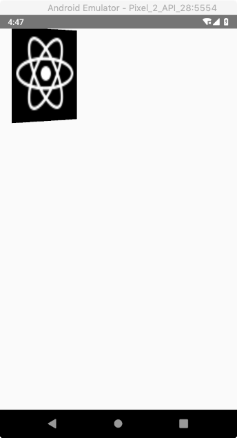

# React Native - Image

## 概述

`Image` 组件用于显示多种不同类型 (来源) 图片，包括网络图片、静态资源、临时的本地图片以及本地磁盘上的图片。

下面的例子分别演示了如何显示从本地缓存、网络甚至是以 `'data:'` 的 base64 uri 形式提供的图片。

> 注意：对于网络和 base64 数据的图片需要手动指定尺寸。

```js
import React, { Component } from 'react';
import { AppRegistry, View, Image } from 'react-native';

// 注：在 DisplayAnImage.js 文件同级目录放置了 favicon.png 文件
export default class DisplayAnImage extends Component {
  render() {
    return (
      <View>
        <Image source={require('./favicon.png')} />
        <Image
          style={{width: 50, height: 50}}
          source={{uri: 'https://facebook.github.io/react-native/docs/assets/favicon.png'}}
        />
        <Image
          style={{width: 66, height: 58}}
          source={{uri: 'data:image/png;base64,iVBORw0KGgoAAAANSUhEUgAAADMAAAAzCAYAAAA6oTAqAAAAEXRFWHRTb2Z0d2FyZQBwbmdjcnVzaEB1SfMAAABQSURBVGje7dSxCQBACARB+2/ab8BEeQNhFi6WSYzYLYudDQYGBgYGBgYGBgYGBgYGBgZmcvDqYGBgmhivGQYGBgYGBgYGBgYGBgYGBgbmQw+P/eMrC5UTVAAAAABJRU5ErkJggg=='}}
        />
      </View>
    );
  }
}
```

显示效果如下图：


另外，你也可以给图片添加 `style` 属性：

```js
import React, { Component } from 'react';
import { StyleSheet, View, Image } from 'react-native';

const styles = StyleSheet.create({
  stretch: {
    width: 50,
    height: 200
  }
});

export class DisplayAnImageWithStyle extends Component {
  render() {
    return (
      <View>
        <Image
          style={styles.stretch}
          source={require('./favicon.png')}
        />
      </View>
    );
  }
}
```

此时，显示效果就变成了这样：


## 在 Android 上支持 GIF 和 WebP 格式图片

默认情况下，Android 平台不支持显示 GIF 和 WebP 格式图片。如有需要，可在 `android/app/build.gradle` 文件中根据需要手动添加以下模块：

```gradle
dependencies {
  // 如果你需要支持 Android4.0 (API level 14) 之前的版本
  compile 'com.facebook.fresco:animated-base-support:1.9.0'

  // 如果你需要支持 GIF 动图
  compile 'com.facebook.fresco:animated-gif:1.9.0'

  // 如果你需要支持 WebP 格式，包括 WebP 动图
  compile 'com.facebook.fresco:animated-webp:1.9.0'
  compile 'com.facebook.fresco:webpsupport:1.9.0'

  // 如果只需要支持 WebP 格式而不需要动图
  compile 'com.facebook.fresco:webpsupport:1.9.0'
}
```

> Fresco 是 Facebook 开源的一款 Android 图片加载库，支持显示 GIF 和 Webp (静态和动态) 格式的图片。


## 常用属性

**`style`**

`Image` 组件的 `style` 属性很强大，比如说我们：
* 可以通过其 `opacity` 属性来指定透明度。
* 可以通过其 `tintColor` 来为所有非透明的像素指定一个颜色。
* 可以通过其 `resizeMode` 来调整图片尺寸。
* 可以通过其 `transforms` 属相来对图片进行变换。
* ...

下面我们通过几个示例来玩耍下：

```js
// 默认 width: 160, height: 160

// 示例1：不加额外任何属性
<Image
  style={{ width: 160, height: 160 }}
  source={require('./favicon.png')}/>

// 示例2：修改透明度
<Image
  style={{ width: 160, height: 160, opacity: 0.2 }}
  source={require('./favicon.png')}/>

// 示例2：调整非透明部分的颜色 (该图片完全不透明)
<Image
  style={{ width: 160, height: 160, tintColor: 'yellow' }}
  source={require('./favicon.png')}/>
```

| 示例1 | 示例2 | 示例3 
| -- | -- | --
|  |  |  


```js
// 示例4：调整图片尺寸 contain
<Image
  style={{ width: 160, height: 160, resizeMode: 'contain' }}
  source={require('./favicon.png')}/>

// 示例5：调整图片尺寸 contain
<Image
  style={{ width: 160, height: 160, resizeMode: 'cover' }}
  source={require('./favicon.png')}/>

// 示例6：调整图片尺寸 contain
<Image
  style={{ width: 160, height: 160, resizeMode: 'stretch' }}
  source={require('./favicon.png')}/>

// 示例7：调整图片尺寸 contain
<Image
  style={{ width: 160, height: 160, resizeMode: 'center', backgroundColor: '#EFEFEF' }}
  source={require('./favicon.png')}/>
  
// 示例8：调整图片尺寸 contain
<Image
  style={{ width: 160, height: 160, resizeMode: 'center' }}
  source={require('./favicon.png')}/>
```

| 示例4 | 示例5 | 示例6 | 示例7 | 示例8
| -- | -- | -- | -- | --
|  |  |  |  |   

> 注：示例 4、5、6 在该情况下显示是完全相同的。

`transform` 比较有趣，我们来特别说明一下：
* `transform` 接收一个转换对象数组。
* 每个对象都指定将被转换为键的属性和在转换中使用的值。对象不应组合。
* 每个对象使用一个键/值对。
* 旋转 (rotate) 转换需要一个字符串，以便转换可以用度(deg)或弧度(rad)表示。例如: `transform([{ rotateX: '45deg' }, { rotateZ: '0.785398rad' }])`。
* 倾斜 (skew) 转换需要一个字符串，以便转换可以用度数(deg)表示。例如: `transform([{ skewX: '45deg' }])`。

`transform` 接收的对象值可能有：
* `{ perspective: number }`
* `{ rotate: string }`
* `{ rotateX: string }`
* `{ rotateY: string }`
* `{ rotateZ: string }`
* `{ scale: number }`
* `{ scaleX: number }` 
* `{ scaleY: number }`
* `{ translateX: number }`
* `{ translateY: number }`
* `{ skewX: string }`
* `{ skewY: string }`

`transform` 示例：

```js
// 变换1：`transform: [{rotateX: '45deg'}]`
// 变换2：`transform: [{rotateY: '45deg'}]`
// 变换3：`transform: [{skewY: '45deg'}]`
// 变换4：`transform: [{rotate: '45deg'}]`
```

| 变换1 | 变换2 | 变换3 | 变换4
| -- | -- | -- | -- 
|  |  |  | 

```js
// 变换5：`transform: [{scaleX: 0.4}]`
// 变换6：`transform: [{translateX: 24}]`
// 变换7：`transform: [{skewY: '45deg'}]`
// 变换8：`transform: [{translateX: 60}, {translateY: 60}, {rotateY: '60deg'}]`
```

| 变换5 | 变换6 | 变换7 | 变换8
| -- | -- | -- | -- 
|  |  |  | 

<br/>


**`blurRadius`**

blurRadius (模糊半径)：为图片添加一个指定半径的模糊滤镜，类型为 `number`。比如：

| `blurRadius={0.4}` | `blurRadius={0.8}` | `blurRadius={1.2}` | `blurRadius={1.6}`
| -- | -- | -- | --
|  |  |  |  

<br/>


**`onLayout`**

当元素加载或者布局改变的时候调用，参数为：`{nativeEvent: {layout: {x, y, width, height}}}`.

<br/>


**`onLoad`**

加载成功完成时调用此回调函数。

<br/>


**`onLoadEnd`**

加载结束后，不论成功还是失败，调用此回调函数。

<br/>


**`onLoadStart`**

在加载开始时回调该函数。

示例：`onLoadStart={(e) => this.setState({loading: true})}`

<br/>


**`resizeMode`**

决定当组件尺寸和图片尺寸不成比例的时候如何调整图片的大小。
* `cover`: 在保持图片宽高比的前提下缩放图片，直到宽度和高度都大于等于容器视图的尺寸。
  * 如果容器有 padding 内衬的话，则相应减去。
  * 这样图片完全覆盖甚至超出容器，容器中不留任何空白。
* `contain`: 在保持图片宽高比的前提下缩放图片，直到宽度和高度都小于等于容器视图的尺寸。
  * 如果容器有 padding 内衬的话，则相应减去。
  * 这样图片完全被包裹在容器中，容器中可能留有空白。
* `stretch`: 拉伸图片且不维持宽高比，直到宽高都刚好填满容器。
* `repeat`: 重复平铺图片直到填满容器。图片会维持原始尺寸，但是当尺寸超过容器时会在保持宽高比的前提下缩放到能被容器包裹。
* `center`: 居中不拉伸。

<br/>


**`source`**

用于指定图片资源 (远程 URL 或本地文件资源)。

目前原生支持的图片格式有 `png`、`jpg`、`jpeg`、`bmp`、`gif`，以及：
* `webp` 仅限 Android。
* `psd` 仅限 iOS。

| 类型 | 必填 
| -- | -- 
| ImageSourcePropType | 否  

<br/>

**`loadingIndicatorSource`**

与 `source` 属性类似，此属性用于指定呈现 "图片加载指示器" 的资源，会显示直到要加载的图片准备好为止，通常用于需要从网络下载图片的场景。

> Can accept a number as returned by `require('./image.jpg')`

示例（在 Android 上试了好几次都没看到预期指示器效果，姿势不对？）：
```js
<Image
  style={{ width: 160, height: 160}}
  // source={{uri: 'http://www.keyunzhan.com/images/xianlu/20121222/23648358.jpg'}}
  // source={{uri: 'http://pic1.win4000.com/wallpaper/c/58492dd7d7dba.jpg'}}
  // source={{uri: 'http://img3.dns4.cn/pic/69566/201312141025086800.jpg'}}
  source={{uri: 'http://www.aibangwenlian.com/data/attachment/forum/201605/18/043243jgal161ud2g92zd4.jpg'}}
  loadingIndicatorSource={require('./favicon.png')}/>
```

<br/>


**`onError`**

当加载错误的时候调用此回调函数，参数 `{nativeEvent: {error}}`。

<br/>


**`resizeMethod`**

当图片实际尺寸和容器样式尺寸不一致时，决定以怎样的策略来调整图片的尺寸，仅支持 Android 平台。默认为 `auto`。
* `auto`: 使用启发式算法来在 `resize` 和 `scale` 中自动决定。
* `resize`: 在图片解码之前，使用软件算法对其在内存中的数据进行修改。当图片尺寸比容器尺寸大得多时，应该优先使用此选项。
* `scale`: 对图片进行缩放。和 `resize` 相比，`scale` 速度更快 (一般有硬件加速)，而且图片质量更优。在图片尺寸比容器尺寸小或者只是稍大一点时，应该优先使用此选项。

<br/>


**`defaultSource`**

在读取图片时默认显示的图片。仅限 iOS 使用。

| 类型 | 必填 | 平台
| -- | -- | -- 
| object, number | 否 | iOS      
| number | 否 | Android  

注：`number` - 静态图片引用语法 `require('./image.jpg')` 所返回的资源 id。

> Note：For Android, It works only on release builds, don't worry if it shows nothing on DEBUG builds.

<br/>

**`onPartialLoad`**

如果图片本身支持逐步加载，则逐步加载的过程中会调用此方法，"逐步加载" 的具体定义与具体的标准和实现有关。

| 类型 | 必填 | 平台 
| -- | -- | -- 
| function | 否 | iOS  

<br/>


**`onProgress`**

在加载过程中不断调用，参数为 `{ nativeEvent: {loaded, total }}`。

| 类型 | 必填 | 平台 
| -- | -- | -- 
| function | 否 | iOS  

<br/>


## 常用方法

**`getSize()`**

```js
Image.getSize(uri, success, [failure]);
```

在显示图片前获取图片的宽高(以像素为单位)。如果图片地址不正确或下载失败，此方法也会失败。

要获取图片的尺寸，首先需要加载或下载图片(同时会被缓存起来)。这意味着理论上你可以用这个方法来预加载图片，虽然此方法并没有针对这一用法进行优化，而且将来可能会换一些实现方案使得并不需要完整下载图片即可获取尺寸。所以更好的预加载方案是使用下面那个专门的预加载方法。

注意：此方法不能用于静态图片资源。

参数：

| 名称 | 类型 | 必填 | 说明 
| -- | -- | -- | -- 
| uri     | string   | 是 | 图片地址             
| success | function | 是 | 成功的回调函数，返回图片宽高数据 
| failure | function | 否 | 失败的回调函数     

<br/>


**`prefetch()`**

```js
Image.prefetch(url);
```

预加载一个远程图片(将其下载到本地磁盘缓存)。

参数：

| 名称 | 类型 | 必填 | 说明 
| -- | -- | -- | -- 
| url  | string | 是 | 图片的远程地址 

<br/>


**`abortPrefetch()`**

```js
Image.abortPrefetch(requestId);
```

中断预加载操作。仅 Android 可用。

参数：

| 名称 | 类型 | 必填 | 说明 
| -- | -- | -- | -- 
| requestId | number | 是   | `prefetch()` 返回的 id 

<br/>


**`queryCache()`**

```js
Image.queryCache(urls);
```

查询图片缓存状态。根据图片 URL 地址返回缓存状态，比如 "disk" (缓存在磁盘文件中)或是 "memory" (缓存在内存中)。

参数：

| 名称 | 类型  | 必填 | 说明
| -- | -- | -- | -- |
| urls | array | 是   | 要查询缓存状态的图片 URL 数组。 |

<br/>


## 附录

附几个 `Image` 相关属性类型在 `index.d.ts` 中的定义：

**`ImageSourcePropType`**

```ts
export type ImageSourcePropType = ImageURISource | ImageURISource[] | ImageRequireSource;

export interface ImageURISource {
    /**
     * `uri` is a string representing the resource identifier for the image, which
     * could be an http address, a local file path, or the name of a static image
     * resource (which should be wrapped in the `require('./path/to/image.png')`
     * function).
     */
    uri?: string;
    /**
     * `bundle` is the iOS asset bundle which the image is included in. This
     * will default to [NSBundle mainBundle] if not set.
     * @platform ios
     */
    bundle?: string;
    /**
     * `method` is the HTTP Method to use. Defaults to GET if not specified.
     */
    method?: string;
    /**
     * `headers` is an object representing the HTTP headers to send along with the
     * request for a remote image.
     */
    headers?: { [key: string]: string };
    /**
     * `cache` determines how the requests handles potentially cached
     * responses.
     *
     * - `default`: Use the native platforms default strategy. `useProtocolCachePolicy` on iOS.
     *
     * - `reload`: The data for the URL will be loaded from the originating source.
     * No existing cache data should be used to satisfy a URL load request.
     *
     * - `force-cache`: The existing cached data will be used to satisfy the request,
     * regardless of its age or expiration date. If there is no existing data in the cache
     * corresponding the request, the data is loaded from the originating source.
     *
     * - `only-if-cached`: The existing cache data will be used to satisfy a request, regardless of
     * its age or expiration date. If there is no existing data in the cache corresponding
     * to a URL load request, no attempt is made to load the data from the originating source,
     * and the load is considered to have failed.
     *
     * @platform ios
     */
    cache?: "default" | "reload" | "force-cache" | "only-if-cached";
    /**
     * `body` is the HTTP body to send with the request. This must be a valid
     * UTF-8 string, and will be sent exactly as specified, with no
     * additional encoding (e.g. URL-escaping or base64) applied.
     */
    body?: string;
    /**
     * `width` and `height` can be specified if known at build time, in which case
     * these will be used to set the default `<Image/>` component dimensions.
     */
    width?: number;
    height?: number;
    /**
     * `scale` is used to indicate the scale factor of the image. Defaults to 1.0 if
     * unspecified, meaning that one image pixel equates to one display point / DIP.
     */
    scale?: number;
}

export type ImageRequireSource = number;
```

<br/>


**`ImageProps`** 

```ts
export interface ImagePropsBase extends ImagePropsIOS, ImagePropsAndroid, AccessibilityProps {
    /**
     * onLayout function
     *
     * Invoked on mount and layout changes with
     *
     * {nativeEvent: { layout: {x, y, width, height} }}.
     */
    onLayout?: (event: LayoutChangeEvent) => void;

    /**
     * Invoked on load error with {nativeEvent: {error}}
     */
    onError?: (error: NativeSyntheticEvent<ImageErrorEventData>) => void;

    /**
     * Invoked when load completes successfully
     * { source: { url, height, width } }.
     */
    onLoad?: (event: NativeSyntheticEvent<ImageLoadEventData>) => void;

    /**
     * Invoked when load either succeeds or fails
     */
    onLoadEnd?: () => void;

    /**
     * Invoked on load start
     */
    onLoadStart?: () => void;

    ...

    /**
     * Determines how to resize the image when the frame doesn't match the raw
     * image dimensions.
     *
     * 'cover': Scale the image uniformly (maintain the image's aspect ratio)
     * so that both dimensions (width and height) of the image will be equal
     * to or larger than the corresponding dimension of the view (minus padding).
     *
     * 'contain': Scale the image uniformly (maintain the image's aspect ratio)
     * so that both dimensions (width and height) of the image will be equal to
     * or less than the corresponding dimension of the view (minus padding).
     *
     * 'stretch': Scale width and height independently, This may change the
     * aspect ratio of the src.
     *
     * 'repeat': Repeat the image to cover the frame of the view.
     * The image will keep it's size and aspect ratio. (iOS only)
     *
     * 'center': Scale the image down so that it is completely visible,
     * if bigger than the area of the view.
     * The image will not be scaled up.
     */
    resizeMode?: ImageResizeMode;

    /**
     * The mechanism that should be used to resize the image when the image's dimensions
     * differ from the image view's dimensions. Defaults to `auto`.
     *
     * - `auto`: Use heuristics to pick between `resize` and `scale`.
     *
     * - `resize`: A software operation which changes the encoded image in memory before it
     * gets decoded. This should be used instead of `scale` when the image is much larger
     * than the view.
     *
     * - `scale`: The image gets drawn downscaled or upscaled. Compared to `resize`, `scale` is
     * faster (usually hardware accelerated) and produces higher quality images. This
     * should be used if the image is smaller than the view. It should also be used if the
     * image is slightly bigger than the view.
     *
     * More details about `resize` and `scale` can be found at http://frescolib.org/docs/resizing-rotating.html.
     *
     * @platform android
     */
    resizeMethod?: "auto" | "resize" | "scale";

    /**
     * The image source (either a remote URL or a local file resource).
     *
     * This prop can also contain several remote URLs, specified together with their width and height and potentially with scale/other URI arguments.
     * The native side will then choose the best uri to display based on the measured size of the image container.
     * A cache property can be added to control how networked request interacts with the local cache.
     *
     * The currently supported formats are png, jpg, jpeg, bmp, gif, webp (Android only), psd (iOS only).
     */
    source: ImageSourcePropType;

    /**
     * similarly to `source`, this property represents the resource used to render
     * the loading indicator for the image, displayed until image is ready to be
     * displayed, typically after when it got downloaded from network.
     */
    loadingIndicatorSource?: ImageURISource;

    /**
     * A unique identifier for this element to be used in UI Automation testing scripts.
     */
    testID?: string;

    /**
     * A static image to display while downloading the final image off the network.
     */
    defaultSource?: ImageURISource | number;
}

export interface ImageProps extends ImagePropsBase {
    /**
     *
     * Style
     */
    style?: StyleProp<ImageStyle>;
}
```

<br/>


## 总结

通过这篇文章，我们基本了解了 `Image` 组件的使用。
