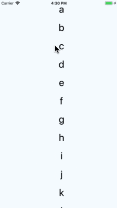
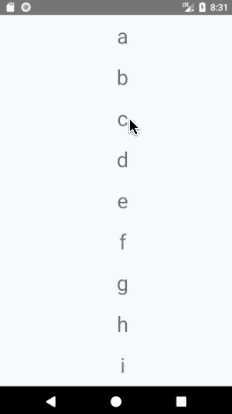

# React Native - RefreshControl

该组件用于 `ScrollView` 或 `FlatList` 内部，以为其添加下拉刷新的功能。当 `ScrollView` 处于竖直方向的起点位置（scrollY: 0）时，下拉会触发一个 `onRefresh` 事件。

## 示例

```javascript
class RefreshableList extends Component {
  constructor(props) {
    super(props);
    this.state = {
      refreshing: false,
    };
  }

  _onRefresh = () => {
    this.setState({refreshing: true});
    fetchData().then(() => {
      this.setState({refreshing: false});
    });
  }

  render() {
    return (
      <FlatList
        refreshControl={
          <RefreshControl
            refreshing={this.state.refreshing}
            onRefresh={this._onRefresh}
          />
        }
        ...
      />
    );
  }
  ...
}
```

注意： `refreshing` 是一个受控属性， 所以必须在 `onRefresh` 回调函数中设置其值为 `true`，否则 loading 指示器会立即停止。

使用时大致效果如下 (示例代码大致如上，故略)：

| iOS | Android
| -- | --
|  | 

## 常用属性

**`refreshing`**

视图是否应该在刷新时显示指示器，布尔类型，`true` 时表示显示。

<br/>


**`onRefresh`**

在视图开始刷新时回调的函数，非必填。

<br/>


**`colors`**

指定至少一种颜色用来绘制刷新指示器，类型为 `<color>[]`，仅适用于 Android 平台。

<br/>


**`enabled`**

指定是否要启用刷新指示器，仅适用于 Android 平台。

<br/>


**`progressBackgroundColor`**

指定刷新指示器的背景色，类型为 `color`，仅适用于 Android 平台。


**`progressViewOffset`**

指定刷新指示器的垂直起始位置 (top offset)，类型为 `number`，仅适用于 Android 平台。

<br/>


**`size`**

指定刷新指示器的大小，具体数值可参阅 `RefreshControl.SIZE`，仅适用于 Android 平台。

<br/>


**`tintColor`**

指定刷新指示器的颜色，仅适用于 iOS 平台。

<br/>


**`title`**

指定刷新指示器下显示的文字，仅适用于 iOS 平台。

<br/>


**`titleColor`**

指定刷新指示器下显示的文字的颜色，仅适用于 iOS 平台。

<br/>


## 总结

从属性上来看，可以看出 `RefreshControl` 在两个平台上的差异比较大，属性基本也都不相同。所以，为了使得使用简单并且保证在所有页面上下拉刷新的样式一致，通常我们会封装一个 `RefreshControl` 出来。比如命名为 `CustomRefreshControl`，然后指定默认的 `colors` 和 `tintColor` 属性，然后暴露额外相关属性即可。