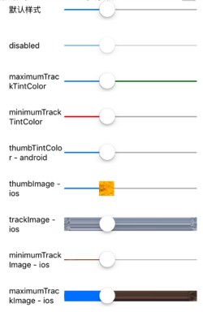
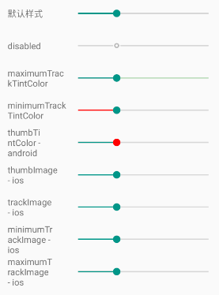
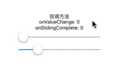

# React Native - Slide
一个用于在一个范围值内选择单个值得组件。

## 示例一：属性参数
```js
import React, {Component} from 'react';
import {
  StyleSheet,
  View,
  Text,
  Slider
} from 'react-native';

export default class App extends Component<Props> {
  render() {
    return (
      <View style={styles.container}>
        <View style={styles.row}>
          <Text style={styles.text}>默认样式</Text>
          <Slider style={styles.slide} value={0.3}/>
        </View>

        <View style={styles.row}>
          <Text style={styles.text}>disabled</Text>
          <Slider style={styles.slide} value={0.3} disabled={true}/>
        </View>

        <View style={styles.row}>
          <Text style={styles.text}>maximumTrackTintColor</Text>
          <Slider style={styles.slide} value={0.3} maximumTrackTintColor='green'/>
        </View>

        <View style={styles.row}>
          <Text style={styles.text}>minimumTrackTintColor</Text>
          <Slider style={styles.slide} value={0.3} minimumTrackTintColor='red'/>
        </View>

        <View style={styles.row}>
          <Text style={styles.text}>thumbTintColor - android</Text>
          <Slider style={styles.slide} value={0.3} thumbTintColor='red'/>
        </View>

        <View style={styles.row}>
          <Text style={styles.text}>thumbImage - ios</Text>
          <Slider style={styles.slide} value={0.3} thumbImage={require('./res/images/thumb.png')}/>
        </View>

        <View style={styles.row}>
          <Text style={styles.text}>trackImage - ios</Text>
          <Slider style={styles.slide} value={0.3} trackImage={require('./res/images/track.png')}/>
        </View>

        <View style={styles.row}>
          <Text style={styles.text}>minimumTrackImage - ios</Text>
          <Slider style={styles.slide} value={0.3} minimumTrackImage={require('./res/images/mini.png')}/>
        </View>

        <View style={styles.row}>
          <Text style={styles.text}>maximumTrackImage - ios</Text>
          <Slider style={styles.slide} value={0.3} maximumTrackImage={require('./res/images/maxi.png')}/>
        </View>
      </View>
    );
  }
}

const styles = StyleSheet.create({
  container: {
    flex: 1,
    flexDirection: 'column',
    justifyContent: 'center',
    alignItems: 'center',
  },
  row: {
    flexDirection: 'row',
    justifyContent: 'flex-start',
    alignItems: 'center',
    paddingLeft:16,
  },
  text: {
    width: 96,
    justifyContent: 'flex-start'
  },
  slide: {
    width: 240,
    height: 36,
  },
  marginTop: {
    marginTop: 12,
  }
});
```

| ios | android
| -- | --
|  | 

## 示例二：方法参数
```js
export default class App extends Component<Props> {
  constructor(props) {
    super(props)
    this.state = {
      value: 0,
      onValueChange: 0,
      onSlidingComplete: 0,
    }
  }

  render() {
    return (
      <View style={styles.container}>
        <Text style={styles.marginTop}>回调方法</Text>
        <Text>onValueChange: {this.state.onValueChange}</Text>
        <Text>onSlidingComplete: {this.state.onSlidingComplete}</Text>

        // 不设置默认值，最小值默认为0，最大值默认为1
        <Slider
          style={styles.slide}
          onValueChange={(value) => {
            this.setState({onValueChange: value})
          }}
          onSlidingComplete={(value) => {
            this.setState({onSlidingComplete: value})
          }}
        />

        <Slider
          style={styles.slide}
          step={1}
          minimumValue={-5}
          maximumValue={20}
          value={this.state.value}
          onValueChange={(value) => {
            this.setState({onValueChange: value})
          }}
          onSlidingComplete={(value) => {
            this.setState({onSlidingComplete: value})
          }}
        />
      </View>
    );
  }
}
```

iOS 和 Android 两个平台的效果是一致的：  




## 参数

### `style`

### `disabled`
如果为 `true` 则 `Slider` 不能滑动，默认为 `false`。

### `maximumValue`
`Slider` 的最大值，默认为 `1`。

### `minimumTrackTintColor`
「滑块」左侧的滑条颜色值。

### `minimumValue`
`Slider` 的最小值，默认为 `0`。

### `onSlidingComplete`
不管值是否发生了变化，当用户释放「滑块」时都会回调的方法。释放时当前的值会作为该方法的参数。
> 用户结束滑动的时候调用此回调。

### `onValueChange`
当用户滑动「滑块」时持续回调的方法。
> 在用户拖动滑块的过程中不断调用此回调。

### `step`
滑块的最小步长。这个值应该在 0 到 (maximumValue - minimumValue) 之间。  
默认值为 `0`。

### `maximumTrackTintColor`
「滑块」右侧的滑条颜色值。

### `testID`

### `value`
「滑块」的初始值。  
这个值应该在最小值和最大值（默认 0 - 1）之间，默认值是 `0`。
> 这不是一个受约束的组件。也就是说，在用户操作后即使你不更新值，这个组件也不会还原到初始值。

### `thumbTintColor` - Android
「滑块」的前景色。

### `maximumTrackImage` - iOS
指定一个「滑块」右侧轨道背景图。  
只支持静态图片。  
图片最中央的像素会被平铺直至填满轨道。

### `minimumTrackImage` - iOS
指定一个「滑块」左侧轨道背景图。  
只支持静态图片。  
图片最中央的像素会被平铺直至填满轨道。

### `thumbImage` - iOS
给「滑块」设置一张图片。只支持静态图片。

### `trackImage` - iOS
给轨道设置一张背景图。  
只支持静态图片。  
图片最中央的像素会被平铺直至填满轨道。
