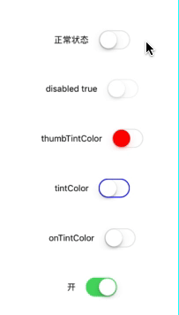
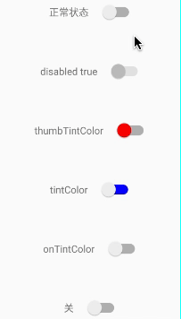

# React Native - Switch

一个跨平台的、可以在两个状态 (TRUE or FALSE) 中进行切换的组件。

注意，`Switch` 是受控组件（controlled component），也就是说：
* 你必须在 `onValueChange` 回调中手动更新 `value` 属性以响应用户的操作。
* 如果不更新 `value` 属性，组件只会按一开始给定的 `value` 值来渲染且保持不变，看上去就像完全点不动。

## 示例

示例代码：

```js
export default class App extends Component<Props> {
  constructor(props) {
    super(props)
    this.state = {
      value: false,
    }
  }

  render() {
    return (
      <View style={styles.container}>
        <View style={styles.row}>
          <Text style={styles.text}>正常状态</Text>
          <Switch/>
        </View>

        <View style={styles.row}>
          <Text style={styles.text}>disabled true</Text>
          <Switch disabled={true}/>
        </View>

        <View style={styles.row}>
          <Text style={styles.text}>thumbTintColor</Text>
          <Switch thumbTintColor='red'/>
        </View>

        <View style={styles.row}>
          <Text style={styles.text}>tintColor</Text>
          <Switch tintColor='blue'/>
        </View>

        <View style={styles.row}>
          <Text style={styles.text}>onTintColor</Text>
          <Switch onTintColor='orange'/>
        </View>

        <View style={styles.row}>
          <Text style={styles.text}>{this.state.value ? "开" : "关"}</Text>
          <Switch
            value = {this.state.value}
            onValueChange={(value) => {
              this.setState({
                value: value
              })
            }}
          />
        </View>
      </View>
    );
  }
}

const styles = StyleSheet.create({
  container: {
    flex: 1,
    flexDirection: 'column',
    justifyContent: 'center',
    alignItems: 'center',
  },
  row: {
    flexDirection: 'row',
    justifyContent: 'flex-start',
    alignItems: 'center',
    margin: 16,
  },
  text: {
    margin: 16,
  }
});
```

示例效果图 (两个平台都有，而且是动态的噢)：

| iOS | Android
| -- | --
|  | 


## 常用属性

**`disabled`**

设置 `true` 时用户不可以改变其开关状态，默认为 `false`。

<br/>


**`onTintColor`**

处于 "开" 状态时组件的背景色。

<br/>


**`onValueChange`**

当开关状态发生变化时，将会回调的方法。

<br/>


**`thumbTintColor`**

"滑块" 的颜色。

> If this is set on iOS, the switch grip will lose its drop shadow.

<br/>

**`tintColor`**

边框的颜色：
* iOS 平台：指的是组件的边缘颜色。
* Android 平台：指的是组件处于「关」状态时的背景色。

<br/>


**`value`**

组件的开关状态值，如果为 `true` 组件将会显示为 "开" 状态样式，默认为 `false`。


## 常用方法

呃.. 这个是真没有。


## 总结

这篇文章主要是简单介绍了 React Native 中 `Switch` 组件的使用，该组件个别属性在不同平台上的显示差异比较大，一个比较好的做法是抽象出共同的、必须要用到的属性并包装成一个新的组件。