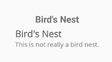
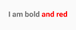
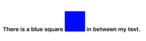
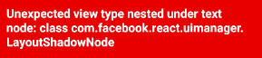
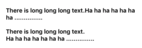

# React Native - Text

`Text` 是一个用来显示文本的组件，支持嵌套、样式和触摸事件处理。

在下面的示例中，演示了一个嵌套的 `title` 和 `body` 文本组件，并且继承了来自 `styles.baseText` 的 `fontFamily` 字体样式，其中 `title` 文本组件还使用了额外的 `styles.titleText` 样式。

```js
import React, {Component} from 'react';
import {
  StyleSheet,
  View,
  Text
} from 'react-native';


export default class App extends Component<Props> {
  constructor(props) {
    super(props)
    this.state = {
      titleText: "Bird's Nest",
      bodyText: 'This is not really a bird nest.'
    }
  }

  onPressTitle() {
    this.setState({bodyText: 'You click the title text.'});
  }

  render() {
    return (
      <View style={styles.container}>
        // 增加这个 Text 是为了方便对比字体显示效果
        <Text style={styles.titleText} onPress={this.onPressTitle.bind(this)}>
          {this.state.titleText}{'\n'}
        </Text>

        <Text style={styles.baseText}>
          <Text style={styles.titleText}>
            {this.state.titleText}{'\n'}
          </Text>
          <Text numberOflines={5}>
            {this.state.bodyText}
          </Text>
        </Text>
      </View>
    );
  }
}

const styles = StyleSheet.create({
  container: {
    flex: 1,
    flexDirection: 'column',
    justifyContent: 'center',
    alignItems: 'center'
  },
  baseText: {
    fontFamily: 'open-sans-regular'
  },
  titleText: {
    fontSize: 20,
    fontWeight: 'bold'
  }
});
```



> 上面使用到的 `fontFamily`
> * 在 iOS 平台下， // TODO
> * 在 Android 平台下需要在 `/assets/fonts` 目录下放一个同名字体文件，即 `open-sans-regular.ttf`。

要注意 `onPress` 的写法，类似以下两种方式是错误的：
```js
// 错误写法一：点击后提示 “undefined is not a function ...”
<Text style={styles.titleText} onPress={this.onPressTitle}>
  {this.state.titleText}{'\n'}
</Text>

// 错误写法二：页面无法加载，提示
// Invariant Violation: Maximun update depth exceeded. This
// can hanppen when a component repeatedly calls setState
// inside componentWillUpdate or componentDidUpdate.
// React limits the number of nested updates to prevent
// infinite loops.

// 大致意思就是发生了“死循环”。
// 代码 `this.onPressTitle()` 是函数的执行而不是绑定。
// 页面在渲染时会执行这个函数，因为该函数体执行了 setState
// 导致又重新渲染，接着又重复执行了个函数...
<Text style={styles.titleText} onPress={this.onPressTitle()}>
  {this.state.titleText}{'\n'}
</Text>
```

## 嵌套文本

iOS 和 Android 都允许你通过对字符串进行一段范围标识来显示特定的样式，日入加粗或上色（类似 iOS 中的 `NSAttributedString` 和 Android 中的 `SpannableString`）。实践中，这是非常乏味的。对于 React Native 来说，是通过使用 web paradigm 使得你可以嵌套 `Text` 来实现同样的效果。比如：

```js
<Text style={{fontWeight: 'bold'}}>
  I am bold {}
  <Text style={{color: 'red'}}>
    and red
  </Text>
</Text>
```



实际上，RN 是通过将上述代码转换为包含以下信息的 `NSAttributedString` 或 `SpannableString` 来实现的：
```
"I am bold and red"
0-9: bold
9-17: red
```

## 嵌套 View
在 iOS 平台中，你是可以在 `Text` 组件中嵌套 `View` 的，比如：
```js
<Text style={{fontWeight: 'bold'}}>
  There is a blue square {}
  <View style={{
    width: 50,
    height: 50,
    backgroundColor: 'blue'
  }}/>
  {} in between my text.
</Text>
```
  

而在 Android 中是直接报错的：  
  

## Containers

`Text` 元素相对布局而言是特殊的：内部的一切不再使用 flexbox 布局。这意味着 `Text` 的内部元素不再是长方形的了，但是可以如果超过末尾可以看到换行。举个栗子：

```js
<Text>
  <Text style={{fontWeight: 'bold'}}>
    There is long long long text.
  </Text>
  <Text style={{fontWeight: 'bold'}}>
    Ha ha ha ha ha ha ha ...............{'\n'}
  </Text>
</Text>

<View>
  <Text style={{fontWeight: 'bold'}}>
    There is long long long text.
  </Text>
  <Text style={{fontWeight: 'bold'}}>
    Ha ha ha ha ha ha ha ...............
  </Text>
</View>
```


## 限制的样式继承

在 Web 开发中，为整个 document 设置字体和大小的常用方法是利用继承的 CSS 属性，如下所示：

```css
html {
  font-family: 'lucida grande', tahoma, verdana, arial, sans-serif;
  font-size: 11px;
  color: #141823;
}
```
这个 document 中的所有元素都会继承该样式除非它们的父元素指定了新的样式规则。

在 RN 中，文本的显示与样式相对 Web 来说是更加严格的：**你必须将所有的文本内容放在 `<Text>` 组件内部，不能直接放在 `<View>` 组件内部**。
```js
// BAD: will raise exception,
// can't have a text node as child of a <View>
<View>
  Some text
</View>

// GOOD
<View>
  <Text>
    Some text
  </Text>
</View>
```

在 RN 中使用一致字体和大小的推荐方法是创建一个包含它们的组件 `MyAppText` 并在你的应用程序中使用。你还可以使用此组件为 `MyAppHeaderText` 等其它类型的文本创建更具体的组件。

代码如何编写？ // TODO


## 参数

### `selectable`
决定用户是否可以长按选择文本，以便进行复制和粘贴。

### `accessible`
When set to `true`, indicates that the view is an accessibility element. The default value for a Text element is `true`.

### `ellipsizeMode`
省略模式。当设置了 `numberOfLines` 时（必须结合一起使用），该参数定义了文字会如何被如何截短。可能值有：
* `'head'` - 该行末尾适应，开头的缺失文本由省略号表示。如 "...wxyz"。
* `'middle'` - 该行头尾适应，中部缺失文本由省略号表示。如 "ab...yz"。
* `'tail'` - 该行头部适应，末尾的缺失文本由省略号表示。如 "abcd..."。
* `'clip'` - Lines are not drawn past the edge of the text container.

默认值为 `tail`。
> `clip` 仅适用于 iOS。

### `nativeID`
Used to locate this view from native code.

### `numberOfLines`
用于通过省略号截短文本（在计算文本布局后），包括折叠产生的换行在内，总的行数不会超过这个属性的控制。通常会与 `ellipsizeMode` 一起使用。

### `onLayout`
当挂载或布局发生变化时会被调用。  
参数为：`{nativeEvent: {layout: {x, y, width, height}}}`

### `onLongPress`
当文本被长按时调用此回调函数。
比如：`onLongPress={this.increaseSize}>`

### `onPress`
当文本被点击时调用此回调函数。
比如：`onPress={() => console.log('1st')}`

### `pressRetentionOffset`
当滚动视图被禁用时，这将定义你的触摸离开按钮有多远，然后停用按钮。一旦停用，请尝试将其移回，并且你会看到该按钮再次被重新激活！在滚动视图禁用时，将它来回移动数次。确保你传入一个常量来减少内存分配。
> When the scroll view is disabled, this defines how far your touch may move off of the button, before deactivating the button. Once deactivated, try moving it back and you'll see that the button is once again reactivated! Move it back and forth several times while the scroll view is disabled. Ensure you pass in a constant to reduce memory allocations.

TYPE: `object: {top: number, left: number, bottom: number, right: number}`

### `allowFontScaling`
指定字体是否需要随着给定样式的限制而自动缩放（默认为 `true`）。

### `style`
* `textShadowOffset`: object: {width: number,height: number}
* `color`: [color](https://facebook.github.io/react-native/docs/colors.html)
* `fontSize`: number
* `fontStyle`: enum('normal', 'italic')
* `fontWeight`: enum('normal', 'bold', '100', '200', ... '900')
* `lineHeight`: number
* `textAlign`:  enum('auto', 'left', 'right', 'center', 'justify')  
指定文本的对齐方式。其中 `'justify'` 仅支持 iOS，Android 上会变成 `'left'`。
* `textDecorationLine`: enum('none', 'underline', 'line-through', 'underline line-through')
* `textShadowColor`: [color](https://facebook.github.io/react-native/docs/colors.html)
* `fontFamily`: string 字体
* `textShadowRadius`: number
* `includeFontPadding`: bool (Android)  
Android 在默认情况下会为文字额外保留一些 padding，以便留出空间摆放上标或是下标的文字。对于某些字体来说，这些额外的 padding 可能会导致文字难以垂直居中。如果你把 `textAlignVertical` 设置为 `'center'` 之后，文字看起来依然不在正中间，那么可以尝试将本属性设置为 `false`。
* `textAlignVertical`: enum('auto', 'top', 'bottom', 'center') (Android)
* `fontVariant`: array of enum('small-caps', 'oldstyle-nums', 'lining-nums', 'tabular-nums', 'proportional-nums') (iOS)
* `letterSpacing`: number   
Increase or decrease the spacing between characters. The default is 0, for no extra letter spacing.
>iOS: The additional space will be rendered after each glyph.
>
>Android: Only supported since Android 5.0 - older versions will ignore this attribute. Please note that additional space will be added around the glyphs (half on each side), which differs from the iOS rendering. It is possible to emulate the iOS rendering by using layout attributes, e.g. negative margins, as appropriate for your situation.
* `textDecorationColor`: [color](https://facebook.github.io/react-native/docs/colors.html) (iOS)
* `textDecorationStyle`: enum('solid', 'double', 'dotted', 'dashed') (iOS)
* `writingDirection`: enum('auto', 'ltr', 'rtl') (iOS)

### `testID`
用来在端到端测试中标记这个视图。

### `disabled`
Specifies the disabled state of the text view for testing purposes

### `selectionColor`
The highlight color of the text.

### `textBreakStrategy`
enum('simple', 'highQuality', 'balanced')

Set text break strategy on Android API Level 23+, possible values are simple, highQuality, balanced The default value is highQuality.

### `adjustsFontSizeToFit` - iOS
指定字体是否随着给定样式的限制而自动缩放。

### `minimumFontScale` - iOS
当 `adjustsFontSizeToFit` 启用时，指定字体的最小缩放比（0.01 - 1.00）。

### `suppressHighlighting`
当为 `true` 时，如果文本被按下，则没有任何视觉效果。默认情况下，文本被按下时会有一个灰色的、椭圆形的高光。
