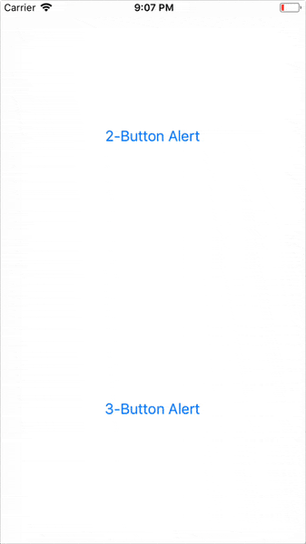

# React Native - Alert

用于显示一个带有指定标题和内容的提示对话框。

支持指定一系列的按钮，点击任何按钮都会回调对应的 `onPress` 方法并关闭对话框。默认情况下，显示的提示对话框只带有一个 `OK / 确定` 按钮。

该 API 在 iOS 和 Android 上都可以使用，但如果你想显示一个对话框并让用户输入一些信息，那你可能需要使用 `AlertIOS`。

## 示例

直接看两个平台上的显示效果先：

| iOS | Android
| -- | --
|  | 

### iOS

在 iOS 平台上，你可以指定任意数量的按钮。每个按钮可以指定自己样式，比如 'default'、'cancel' 和 'destructive' 其中一个.

### Android

在 Android 平台上，最多可以指定三个按钮，这三个按钮可分别理解为三种状态：
* 中间态 `neutral`
* 消极态 `negative`
* 积极态 `positive`

在写代码时，如果你：
* 只指定一个按钮，那么它具有 "积极态" 的属性，比如 "确定"。
* 指定了两个按钮，则分别是 "消极态" 和 "积极态"，比如 "取消" 和 "确定"。
* 指定了三个按钮，则分别是 "中间态"、"消极态" 和 "积极态"，比如 "稍后再说"、"取消" 和 "确定"。

另外，在 Android 平台上默认点击提示框的外面会自动取消提示框。如果你想阻止这个行为，可以提供一个额外参数 `{ onDismiss: () => {} }`。或者，也可以设置另外一个属性 `{ cancelable: false }` 来阻止。

示例代码片段：

```js
// Works on both iOS and Android
Alert.alert(
  'Alert Title',
  'My Alert Msg',
  [
    { text: 'Ask me later', onPress: () => console.log('Ask me later pressed') },
    { text: 'Cancel', onPress: () => console.log('Cancel Pressed'), style: 'cancel' },
    { text: 'OK', onPress: () => console.log('OK Pressed') },
  ],
  { cancelable: false },
)
```

## 相关方法

呃，只有 `alert()` 这个，其原型如下：

```js
static alert(title, message?, buttons?, options?, type?)
```


## 总结

一般来说，我们都是将 React Native 作为原生项目的一部分进行使用的，而以前原生部分已经封装好弹窗相关的逻辑并且已有预先定义样式了。所以，我们一般不会使用 `Alert.alert()` 来做弹窗逻辑，而是封装一个 Native Module 来实现。