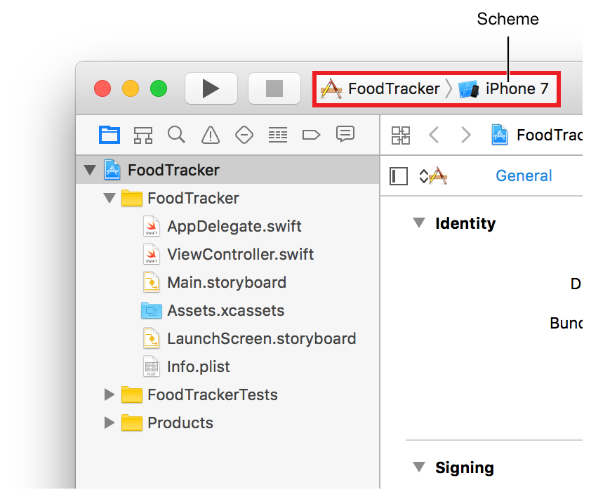
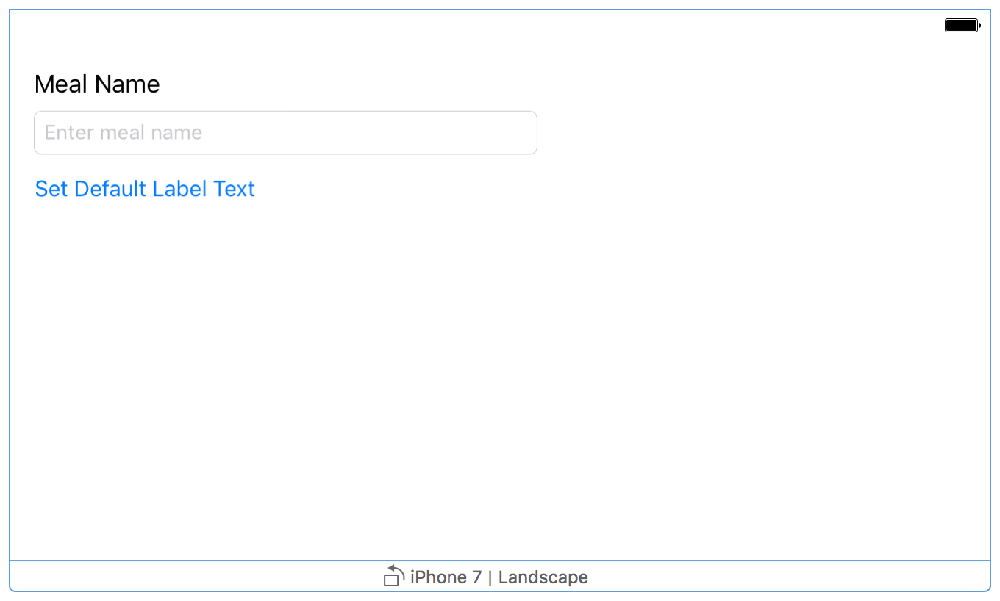
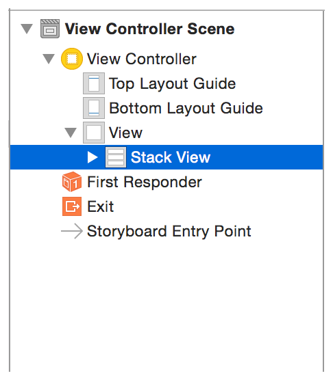
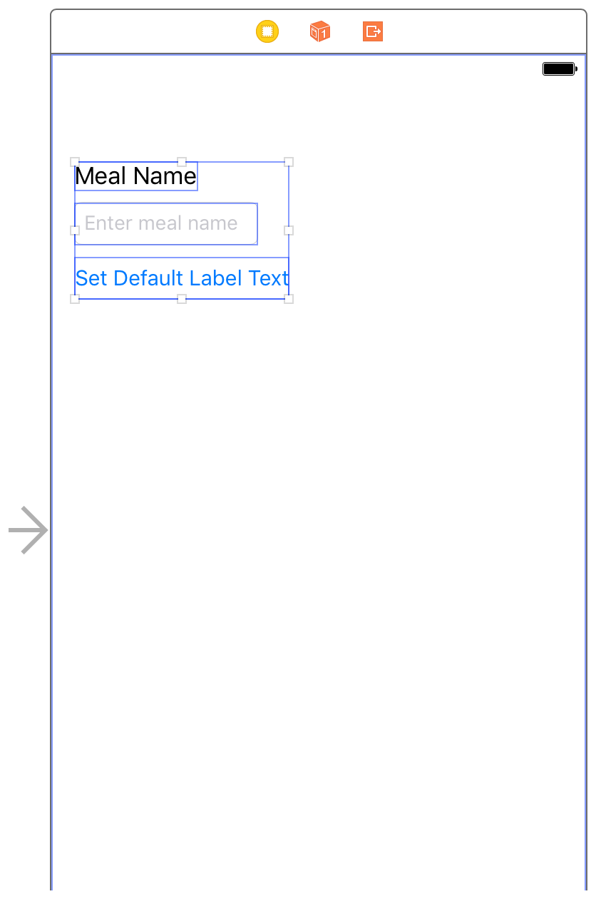
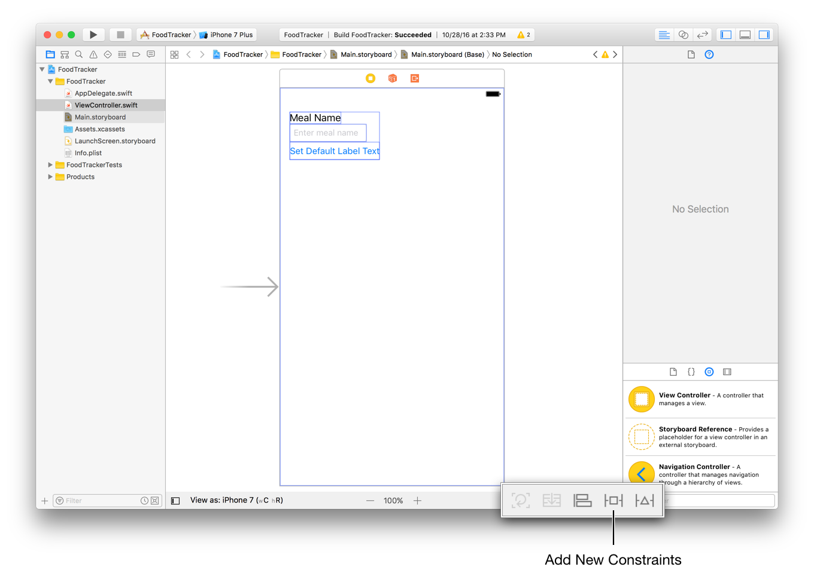
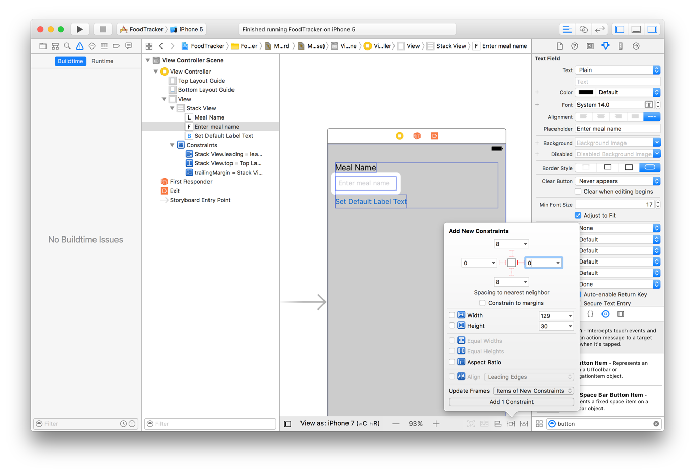

# 使用 Swift 开发 iOS 应用：构建基本 UI

本课程让你熟悉 Xcode，这是你用来编写应用程序的工具。你将熟悉 Xcode 中项目的结构，并学习如何在基本项目组件之间导航和使用。在本课程中，你将开始为 FoodTracker 应用程序创建一个简单的 [用户界面(UI)](https://developer.apple.com/library/archive/referencelibrary/GettingStarted/DevelopiOSAppsSwift/GlossaryDefinitions.html#//apple_ref/doc/uid/TP40015214-CH12-SW18) 并在模拟器中查看它。完成后，你的应用程序将显示用餐名称的标签，用于更改用餐名称的文本字段以及用于重置名称的按钮。


## 学习目标

在课程结束时，你将能够：

* 在 Xcode 中创建一个项目
* 确定使用 Xcode 项目模板创建的密钥文件的用途
* 打开并在项目中的文件之间切换
* 在 iOS 模拟器中运行应用程序
* 在故事板中添加，移动和调整 UI 元素的大小
* 使用属性 (attributes) 检查器编辑故事板中 UI 元素的属性
* 使用大纲 (outline) 视图查看和重新排列 UI 元素
* 使用助理 (Assistant) 编辑器的预览模式预览故事板 UI
* 使用自动布局 (Auto Layout) 来布局可自动适应用户设备大小的 UI

## 创建一个新项目

Xcode 包含几个内置的应用程序模板，用于开发常见类型的 iOS 应用程序。例如游戏、基于标签的导航应用程序和基于表格视图的应用程序。这些模板中的大多数都具有预配置的接口和源代码文件。在本课程中，你将从最基本的模板开始：单一视图应用程序 (Single View Application)。

### 创建新项目

**1. 从 `/Applications` 目录中打开Xcode。**

如果这是你第一次启动 Xcode，它可能会要求你同意用户协议并下载其它组件。按照提示通过这些页面，直到 Xcode 完全设置并准备启动。

一旦 Xcode 启动，就会出现欢迎窗口。


如果出现项目窗口而不是欢迎窗口，请不要担心。可能你以前在 Xcode 中创建或打开了一个项目。只需使用下一步中的菜单项即可创建项目。

**2. 在欢迎窗口中，单击 “Create a new Xcode project” (或选择 File > New > Project)。**

Xcode 打开一个新窗口并显示一个对话框，你可以在其中选择模板。

**3. 选择对话框顶部的 iOS。**

**4. 在 Application 部分中，选择 Single View Application，然后单击 Next。**


**5. 在显示的对话框中，使用以下值命名你的应用并为项目选择其它选项：**

* Product Name：`FoodTracker`  
  Xcode 使用你输入的产品名称来命名你的项目和应用程序。
* Team：如果未自动填写，请将团队设置为无。
* Organization Name：组织的名称或你自己的名称。你可以留空。
* Organization Identifier：你的组织标识符，如果你有一个的话。如果不这样做，请使用 `com.example`。
* Bundle Identifier：此值是根据你的产品名称和组织标识符自动生成的。
* Language：Swift
* Devices：Universal  
  一个 Universal 的应用程序是指可同时在 iPhone 和 iPad 上运行。
* Use Core Data：未选中。
* nclude Unit Tests：选中。
* Include UI Tests：未选中。


**6. 点击下一步。**

**7. 在出现的对话框中，选择要保存项目的位置，然后单击 “Create”。**

Xcode 会在 [工作区窗口](https://developer.apple.com/library/archive/referencelibrary/GettingStarted/DevelopiOSAppsSwift/GlossaryDefinitions.html#//apple_ref/doc/uid/TP40015214-CH12-SW9) 中打开你的新项目。


工作区窗口可能有一个错误图标，上面写着 “Signing for FoodTracker requires a development team”，这个警告意味着你还没有为 iOS 开发进行 Xcode 相关设置。但不用担心，你不这样做也能完成接下来的课程。你在模拟器中运行应用程序可以不需要开发团队。

> **进一步探索**  
> 
> 在 iOS 设备上运行应用程序之前，你需要设置一个有效的团队，以便可以对应用程序进行签名。如果你是 Apple 开发人员计划成员的个人或组织的一部分，你可以在此处选择该团队。否则，你的 Apple ID 将分配给可用于在设备上启动应用程序的个人团队。但是，在将应用程序提交到 App Store 之前，你需要加入 Apple Developer Program。
>
> 有关详细信息，请选择 Help > Xcode Help，然后搜索 “Signing workflow”。


## 熟悉 Xcode

Xcode 包含创建应用程序所需的一切，它组织创建应用程序的所有文件和资源，并为你的代码和用户界面提供编辑器。此外，Xcode 还允许你构建，运行和调试应用程序，提供了 iOS 设备模拟器以及功能强大的集成调试器。

花点时间熟悉 Xcode 工作区的主要部分：
* **导航区域 (Navigator area)**：提供对项目各个部分的快速访问。
* **编辑区域 (Editor area)**：允许你编辑源代码、用户界面和其它资源。
* **通用区域 (Utility area)**：提供有关所选项目和访问现有资源的信息。
* **工具栏 (Toolbar)**：用于构建和运行应用程序，查看正在运行的任务的进度以及配置工作环境。

> 通用区域分为两部分：
> * 顶部是 **检查器窗格**：可以在其中查看和编辑有关在导航器中选择的项目或编辑区域的信息。
> * 底部是 **库窗格**：你可以在其中访问用户界面元素、代码段和其它资源。


不要被这些零散知识点给绕晕了，当你需要使用它时，每个区域都会有详细的描述。


## 运行 iOS 模拟器

因为你创建的项目基于 Xcode 模板，所以会自动为你设置基本的应用程序环境。即使你没有编写任何代码，也可以构建和运行单视图应用程序模板，而无需任何其它配置。

要构建和运行你的应用程序，请使用 Xcode 中包含的 iOS [模拟器](https://developer.apple.com/library/archive/referencelibrary/GettingStarted/DevelopiOSAppsSwift/GlossaryDefinitions.html#//apple_ref/doc/uid/TP40015214-CH12-SW48) 应用程序。模拟器可让你了解应用程序在设备上运行时的外观和行为方式。

模拟器可以模拟许多不同类型的硬件 - iPad 和 iPhone 的所有页面尺寸和分辨率 - 因此你可以在你正在开发的每个设备上模拟你的应用程序。在本课程中，使用 iPhone 7 选项。


### 在模拟器中运行你的应用程序

**1. 在 Xcode 工具栏的 Scheme 弹出菜单中，选择 iPhone 7。**

通过 Scheme 弹出菜单，你可以选择要在其上运行应用的模拟器或设备。确保选择 iPhone 7 Simulator，而不是 iOS 设备。



**2. 单击位于 Xcode 工具栏左上角的 Run 按钮。**


或者，选择 Product > Run (或按 Command-R)。

如果你是第一次运行应用程序，Xcode 会询问你是否要在 Mac 上启用开发人员模式。开发人员模式允许 Xcode 访问某些调试功能，而无需每次都输入密码。决定是否要启用开发人员模式并按照提示进行操作。


如果你选择不启用开发者模式，稍后可能会要求你输入密码。本系列课程假定开发人员模式已启用。

**3. 通过 Xcode 工具栏观察构建过程直到完成。**

Xcode 在活动查看器 (Activity viewer) 中显示有关构建过程的信息，该查看器位于工具栏的中间。

在 Xcode 完成项目的构建后，模拟器会自动启动。第一次启动可能需要一些时间。

模拟器以你指定的 iPhone 模式打开，然后启动你的应用程序。最初，模拟器显示应用程序的启动页面，然后转换到应用程序的主页面。在未修改的单视图应用程序模板中，启动页面和主页面是相同的。


现在，单视图应用程序模板并没有做太多工作 - 它仅仅是显示一个白色页面。其它模板具有更复杂的行为。在通过扩展模板来创建自己的应用程序之前，先了解模板的用法是非常重要的。在模拟器中运行你的应用程序而不进行任何修改，是开始理解的好方法。

通过选择 Simulator > Quit Simulator (或按 Command-Q) 退出模拟器。


## 查看源代码

Single View Application 模板附带了一些设置应用程序环境的源代码文件。首先，看看`AppDelegate.swift` 文件。

### 查看 AppDelegate.swift 源文件

**1. 确保导航器区域中的项目导航器已打开。**

该 [项目导航](https://developer.apple.com/library/archive/referencelibrary/GettingStarted/DevelopiOSAppsSwift/GlossaryDefinitions.html#//apple_ref/doc/uid/TP40015214-CH12-SW57) 显示项目中的所有文件。如果项目导航器未打开，请单击导航器选择器栏中最左侧的按钮。(或者选择 View > Navigators > Show Project Navigator)


**2. 如有必要，可通过单击旁边的三角形来打开项目导航器中的 FoodTracker 文件夹。**

**3. 选择 `AppDelegate.swift`。**

Xcode 会在窗口的主编辑器区域中打开源文件。


或者，双击该 `AppDelegate.swift` 文件以在单独的窗口中打开它。


## App 委托源文件

`AppDelegate.swift` 源文件具有两个主要功能：

* 它定义了你的 `AppDelegate` 类。该 [应用程序委托](https://developer.apple.com/library/archive/referencelibrary/GettingStarted/DevelopiOSAppsSwift/GlossaryDefinitions.html#//apple_ref/doc/uid/TP40015214-CH12-SW27) 创建的窗口 (Window) 来绘制你的应用内容，并提供了一个地方来响应应用程序的状态转换。
* 它创建了应用程序的 **入口点 (entry point)** 和 **运行循环 (run loop，为你的应用程序提供输入事件)**。这项工作由 `UIApplicationMain` 属性(`@UIApplicationMain`)完成，该属性出现在文件的顶部。

使用 `UIApplicationMain` 属性等同于调用 `UIApplicationMain` 函数并将 `AppDelegate` 类的名称作为委托类的名称传递。作为响应，系统会创建应用程序对象。应用程序对象负责管理应用程序的生命周期。系统还会创建 `AppDelegate` 类的实例，并将其分配给应用程序对象。最后，系统启动你的应用程序。

无论什么时候创建一个新项目都会自动创建 `AppDelegate` 类。除非你正在做一些极不寻常的事情，否则你应该使用 Xcode 提供的这个类来初始化你的应用并响应应用级事件。`AppDelegate` 类采用 `UIApplicationDelegate` 的协议。此协议定义了许多用于设置应用程序、响应应用程序状态更改以及处理其它应用程序级事件的方法。

`AppDelegate` 类仅包含一个属性：`window`。

```swift
var window: UIWindow?
```

该属性存储了应用程序窗口的引用。此窗口表示应用程序视图层次结构的根。这是你绘制所有应用内容的地方。请注意，window 属性是可选的 (`optional`)，这意味着它在某些时候可能没有值 (`nil`)。

`AppDelegate` 类还实现了以下代理方法：

```swift
func application(_ application: UIApplication, didFinishLaunchingWithOptions launchOptions: [UIApplicationLaunchOptionsKey: Any]?) -> Bool

func applicationWillResignActive(_ application: UIApplication)

func applicationDidEnterBackground(_ application: UIApplication)

func applicationWillEnterForeground(_ application: UIApplication)

func applicationDidBecomeActive(_ application: UIApplication)

func applicationWillTerminate(_ application: UIApplication)
```

这些方法允许应用程序对象与 app 委托进行通信。在应用程序状态转换期间 - 例如，应用程序启动、转换到后台和应用程序终止 - 应用程序对象会调用相应的委托方法，为你的应用程序提供响应的机会。你无需执行任何特殊操作以确保在正确的时间调用这些方法 - 应用程序对象将为你处理该工作。

每个委托方法都有一个默认行为。如果将模板实现保留为空或从 `AppDelegate` 类中删除它，则无论何时调用该方法，都会获得默认行为。或者，你可以将自己的代码添加到存根方法 (stub methods)，定义自定义行为以在方法调用时执行。

该模板还为每个存根方法提供注释。这些注释描述了你的应用应该如何使用这些方法。你可以使用存根方法和注释作为蓝图来设计许多常见的应用程序级的行为。

在本课程中，你将不会使用任何自定义应用程序委托代码，因此你不必对 `AppDelegate.swift` 文件进行任何更改。


## 视图控制器源文件

Single View Application 模板有另一个源代码文件：`ViewController.swift`。在项目导航器中选择 `ViewController.swift` 并查看它。


该文件自定义了 `UIViewController` 的子类并命名为 `ViewController`。现在这个类只是继承了 `UIViewController` 定义的所有行为，如果要覆盖或扩展这些行为，请覆盖在 `UIViewController` 上定义的方法。

正如你在 `ViewController.swift` 文件中看到的那样，模板的实现会覆盖 `viewDidLoad()` 和 `didReceiveMemoryWarning()` 方法; 但是，除了调用 `UIViewController` 这些方法的版本之外，模板的存根实现还没有做任何事情。你可以添加自己的代码来定义视图控制器对这些事件的响应。

虽然模板附带了该 `didReceiveMemoryWarning()` 方法，但你不需要在本课程中实现它，因此请继续并删除它。

此时，你的 `ViewController.swift` 代码应如下所示：

```swift
import UIKit
 
class ViewController: UIViewController {
    
    override func viewDidLoad() {
        super.viewDidLoad()
        // Do any additional setup after loading the view, typically from a nib.
    }
    
}
```

你将在本课程后面开始在此源代码文件中编写代码。

## 打开你的故事板

你已准备好开始为你的应用设计故事板。故事板是应用程序的用户界面的视觉表示，展示了内容的页面以及它们之间的转换。你可以使用故事板来布置驱动应用程序的流程或故事。在构建它的过程中，你可以准确地看到正在构建的内容，立即获得有关正在工作和不可用的内容的反馈，并立即对你的用户界面进行可见的更改。

### 打开故事板

**在项目导航器中，选择 `Main.storyboard`。**

Xcode 在 Interface Builder 中打开故事板 - 在编辑器区域中打开可视化界面编辑器。故事板的背景是画布。你可以使用画布添加和排列用户界面元素。


此时，应用中的故事板包含一个场景，表示应用中的内容页面。指向画布上场景左侧的箭头是故事板入口点，这意味着在应用程序启动时首先加载此场景。此场景包含由视图控制器管理的单个视图。你将很快了解有关视图和视图控制器角色的更多信息。

当你在 iPhone 7 Simulator 中运行应用程序时，此场景中的视图就是你在设备页面上看到的视图。但是，画布上的场景可能与模拟器的页面尺寸不同。你可以在画布底部选择页面大小和方向。在这种情况下，它以纵向设置为 iPhone 7，因此画布和模拟器是相同的。

即使画布显示特定的设备和方向，重要的是创建一个自适应界面 - 一个自动调整的界面，使其在任何设备和任何方向上看起来都很好。在开发界面时，你可以更改画布的视图，让你了解界面如何适应不同大小的页面。


## 构建基本 UI

是时候构建一个基本界面了，首先你要为场景的设计用户界面，这样你就可以在 FoodTracker 应用程序中添加新餐。

Xcode 提供了一个可以添加到 storyboard 文件的对象库。其中一些是出现在用户界面中的元素，例如按钮和文本字段。其它 (如 **视图控制器** 和 **手势识别器**」) 则定义了应用的行为，但未显示在页面上。

用户界面中显示的元素称为视图。视图向用户显示内容，它们是构建用户界面并以清晰，优雅和有用的方式呈现内容的构建块。视图具有各种有用的内置行为，包括在页面上显示自己并对用户输入做出反应。

iOS 中的所有视图对象都是类型 `UIView` 或其子类之一。许多 UIView 子类在外观和行为方面都非常专业。首先在场景中添加一个文本字段 (`UITextField`)，一个 `UIView` 的子类。文本字段视图允许用户键入单行文本，你将其用作食物名称。


### 向场景中添加文本字段

**1. 选择 “Editor” > “Canvas”，并确保选中 “Show Bounds Rectangles”。**

此设置使 Interface Builder 在画布中的所有视图周围绘制一个蓝色边界框。许多视图和控件具有透明背景，因此很难看到它们的实际大小。当系统调整视图大小以使其大于或小于你预期时，会出现布局错误。启用此设置有助于你准确了解视图层次结构中发生的情况。

**2. 打开 Object 库。**

对象库出现在底部实用面积上的 Xcode 的右侧。如果没有看到对象库，请单击其按钮，这是库选择器栏左侧的第三个按钮。(或者，选择 “View” > “Utilities” > “Show Object Library”。)


将出现一个列表，显示每个对象的名称，描述和可视化表示。

**3. 在“对象库”中，键入 `text field` 过滤器字段以快速查找“文本字段”对象。**

**4. 将 Text Field 对象从 Object 库拖到场景中。**


如有必要，请选择 “Editor” > “Canvas” > “Zoom” 进行放大。

**5. 拖动文本字段，使其位于场景的上半部分，并与场景中的左边距对齐。**

当它捕捉到左边距时停止拖动文本字段。


蓝色布局指南可帮助你放置文本字段。只有拖动或调整旁边的对象时，布局指南才可见; 当你放开文本字段时它们会消失。

**6. 如有必要，单击文本字段以显示调整大小手柄 (handles)。**

你可以通过拖动其调整大小手柄来调整用户界面元素的大小，调整大小手柄是元素边框上显示的小白色方块。你可以通过选择它来显示元素的调整大小手柄。在这种情况下，应该已经选择了文本字段，因为你刚停止拖动它。如果你的文本字段如下所示，则你已准备好调整其大小; 如果没有，请在画布上选择它。


**7. 调整文本字段的左右边缘的大小，直到看到三个垂直布局指南：左边距对齐，水平中心对齐和右边距对齐。**


虽然场景中有文本字段，但没有指示用户在字段中输入的内容。使用文本字段的占位符文本提示用户输入新餐的名称。


### 配置文本字段的占位符文本

**1. 选择文本字段后，在实用程序区域中打开“属性”检查器。**

单击检查器选择器栏中左侧的第四个按钮  时，将显示“属性”检查器，它允许你编辑故事板中对象的属性。


**2. 在“属性”检查器中，找到标记为“Placeholder”的字段并键入 Enter meal name。**

> **进一步探索**
> 
> 在生产应用程序中，应该可以查看用户可以看到的任何字符串(例如文本字段的占位符文本)。有关更多信息，请参阅 [Build Apps for the World](https://developer.apple.com/internationalization/)。

**3. 按 Return 键在文本字段中显示新的占位符文本。**


在编辑文本字段的属性时，还可以编辑用户选择文本字段时显示的系统键盘的属性。


### 配置文本字段的键盘

**1. 确保仍然选中文本字段。**

**2. 在“属性”检查器中，找到标有 “Return Key” 的字段，然后选择 “Done” (如有必要，向下滚动)。**

**3. 此更改将使键盘上的默认 Return 键通过将其更改为 Done 键，寓意更加明显。**

**4. 在“属性”检查器中，选中 “Auto-enable Return Key” 复选框(如果需要，再次向下滚动)。**

此更改使用户无法在文本字段中键入文本之前点击完成键，从而确保用户永远不能输入空字符串作为食物名称。


接下来，在场景顶部添加标签 `UILabel`。标签不是交互式的，它只是在用户界面中显示静态文本。为了帮助你了解如何定义用户界面中元素之间的交互，你将配置此标签以显示用户在文本字段中输入的文本。这将是测试文本字段是否正在接受用户输入并对其进行适当处理的好方法。

### 向场景添加标签

**1. 在对象库中，键入 `label` 过滤器字段以快速查找 Label 对象。**

**2. 将 Label 对象从 Object 库拖到场景中。**

**3. 拖动标签，使其位于文本字段的正上方，并与场景中的左边距对齐。**

在符合指南时停止拖动标签。


双击标签并键入 `Meal Name`。

按 Return 键以在标签中显示新文本。


现在，向场景添加一个按钮 `UIButton`。按钮是交互式的，因此用户可以点按它以触发你定义的操作。稍后，你将创建一个操作以将标签文本重置为默认值。


### 向场景添加按钮

**1. 在对象库中，键入 button 过滤器字段以快速查找 Button 对象。**

**2. 将 Button 对象从 Object 库拖到场景中。**

**3. 拖动按钮使其位于文本字段的正下方，并与场景中的左边距对齐。**

在按下按钮时停止拖动按钮。


**4. 双击该按钮并键入Set Default Label Text。**

**5. 按Return键在按钮中显示新文本。**

**6. 如有必要，重新定位按钮。**


理解你添加的元素是如何在场景中实际排列是很好的，查看大纲视图以查看哪些用户界面元素已添加到场景中。


### 查看大纲视图

**1. 在故事板中，切换到大纲视图。**


**2. 如果折叠大纲视图，请单击切换以展开大纲视图。**

你可以根据需要折叠和展开大纲视图。

大纲视图出现在画布的左侧，在你的故事板中提供了对象的分层表示。你应该能够看到层次结构中列出的刚刚添加的文本字段、标签和按钮。但是为什么你添加的用户界面元素嵌套在 View 下？

视图不仅在页面上显示自身并对用户输入作出反应，它们还可以作为其它视图的容器。视图的分层结构排列称为 **视图层次结构**。视图层次定义的视图是相对于其它视图布局的。在该层次结构中，视图中包含的视图称为子视图，包含视图的父视图称为其超视图。视图可以有多个子视图，但只有一个超级视图。


通常，每个场景都有自己的视图层次结构。每个视图层次结构的顶部是内容视图。在当前场景中，内容视图名为 View，即 View Controller 内的顶级视图。文本字段、标签和按钮是内容视图的子视图。你放置在此场景中的所有其它视图将是此内容视图的子视图 (尽管它们本身可以具有嵌套的子视图)。


## 预览界面

定期预览你的应用，检查所有内容是否符合预期。你可以使用助理编辑器预览你的应用程序界面，该辅助编辑器与你的主编辑器并排显示。

### 预览界面

**1. 单击 Xco​​de 右上角附近的 Xcode 工具栏中的“助手”按钮以打开助理编辑器。**


**2. 如果需要更多空间，可以通过单击 Xco​​de 工具栏中的“导航器和实用程序”按钮来折叠项目导航器和实用程序区域。**


你也可以折叠大纲视图。

**3. 在助理编辑器顶部显示的编辑器选择栏中，将助理编辑器从 “Automatic” 切换到 “Preview” > “Main.storyboard” (Preview)。**


正如你在助理编辑器中看到的那样，预览看起来几乎与画布相同。但是，这并没有真正告诉你任何新的东西。画布和预览都显示相同大小的页面 (iPhone 7) 和相同的方向(纵向)。如果要检查界面是否具有自适应性，则需要预览不同大小的页面和不同的方向。


**4. 要预览横向，请单击预览底部的“旋转”按钮。**


不幸的是，事情看起来不太合适。文本字段，标签和按钮相对于页面左上角保持相同的大小和位置。这意味着文本字段不再从边距到边距填充页面。



**5. 要预览不同的页面大小，请单击助理编辑器底部的“添加”按钮，然后选择 iPhone SE。**


同样，文本字段，标签和按钮相对于页面的左上角保持相同的大小和位置。但是，这一次，文本字段超出了页面的右边缘。


要创建自适应界面，你需要指定界面应如何根据不同的页面大小进行调整。例如，当界面旋转到横向时，文本字段应该增长。当界面显示在 iPhone SE 上时，文本字段应缩小。你可以使用“自动布局”轻松指定这些类型的界面规则。


## 采用自动布局

自动布局是一个功能强大的布局引擎，可帮助你设计自适应布局，动态响应场景大小的任何更改。你可以使用约束来描述布局，这些约束解释了一个元素相对于另一个元素的位置，或元素的大小。自动布局根据这些约束动态计算每个元素的大小和位置。

定义布局的最简单方法之一是使用堆栈视图(UIStackView)。堆栈视图提供了简化的界面，用于在列或行中布置视图集合。堆栈视图使用引擎盖下的自动布局来计算它管理的所有视图的大小和位置。这使你可以轻松访问自动布局的全部功能，同时大大降低布局的复杂性。

要采用自动布局，请将现有界面元素包装在堆栈视图中，然后添加在场景中放置堆栈视图所需的约束。

### 将“自动布局”约束添加到用餐场景

**1. 单击“Standard”按钮返回标准编辑器。**


单击 Xco​​de 工具栏中的“导航器和实用程序”按钮，展开项目导航器和实用程序区域。

**2. 在按键盘上的 Shift 键的同时，选择文本字段，标签和按钮。**


**3. 在画布的右下角，单击“嵌入堆栈”按钮。(或者，选择 “Editor” > “Embed In” > “Stack View”)**


Xcode 将用户界面元素包装在堆栈视图中，将它们堆叠在一起。Xcode 分析你现有的布局，以确定项目应垂直堆叠，而不是水平堆叠。


**4. 如有必要，请打开大纲视图。选择“Stack View”对象。**



**5. 在“属性”检查器中，“间距”字段键入8。按 Return 键。**

你会注意到用户界面元素是垂直空间，堆栈视图随之增长。



**6. 在画布的右下角，打开“添加新约束”菜单。**



**7. 在“与最近邻居间距”上方，单击两个水平约束和顶部垂直约束以选择它们。选中后，它们会变红。**


这些约束表示与最近的前导，尾随和顶部邻居的间距。在此上下文中，术语最近邻居意味着最近的用户界面元素的边界，其可以是超视图，另一个用户界面元素或边距。由于选中了“约束到边距”复选框，因此在这种情况下，堆栈视图将被约束到超视图的左右边距。这提供了堆栈视图和场景边缘之间的空间。

另一方面，堆栈的顶部相对于场景的顶部布局指南受到约束。如果状态栏可见，则顶部布局指南位于状态栏的底部。如果没有，它位于场景的顶部。因此，你需要在堆栈视图和布局指南之间添加一点空间。

**8. 左侧和右侧框键入 0，并在顶部框中键入间距 20。**

**9. 在“更新帧 (Update Frames)”旁边的弹出菜单中，选择“新约束项”。这会导致Interface Builder 在创建约束时自动更新受影响视图的帧。**


**10. 在“添加新约束”菜单中，单击“添加3约束”按钮。**


标签、文本字段和按钮现在左对齐并以适当的间距布局，但文本字段仍然没有拉伸以填充页面的宽度。要解决此问题，你需要添加其它约束。


### 调整堆栈中的文本字段宽度

**1. 在故事板中，选择用餐场景中的文本字段。**

**2. 在画布的右下角，再次打开“添加新约束”菜单。**


**3. 在“与最近邻居间距”上方，单击右侧水平约束以将其选中。选择后变为红色。**

**4. 在右边的框中键入0。**

**5. 在“更新帧”旁边的弹出菜单中，选择“新约束项”。**



**6. 在“添加新约束”菜单中，单击“添加1约束”按钮。**


*检查点*：在 iOS 模拟器中运行你的应用程序。通过选择硬件 > 向左旋转和硬件 > 向右旋转(或向左箭头和向右箭头指针)旋转模拟器。请注意文本字段如何增长和缩小到适当的大小，具体取决于设备的方向和页面大小。另请注意，状态栏以横向方向消失。

在文本字段内单击并使用页面键盘输入文本(如果你愿意，可以通过选择 硬件 > 键盘 > 连接硬件键盘 来使用计算机的键盘)。


## 调试自动布局

如果你没有得到预期的行为，请使用自动布局调试功能来帮助你。可以使用“更新帧”按钮和“解决自动布局问题”菜单访问这些功能。


如果你收到有关错误放置视图的警告，请使用“更新帧”按钮。此按钮可更新所选视图及其所有子视图的帧。选择场景的视图控制器以更新场景中的所有视图。你还可以按住 Option 键并单击“更新帧”按钮以仅更新所选视图。

如果布局不按预期运行，请单击“解决自动布局问题”按钮以显示调试命令菜单。此菜单中的所有命令都有两种形式。一个影响当前选定的视图。另一个影响当前视图控制器中的所有视图。如果所有命令都显示为灰色，请选择场景的视图控制器或其中一个视图，然后再次打开菜单。

选择“重置为建议的约束”以使Xcode使用一组有效的约束更新你的界面。选择Clear Constraints以删除用户界面元素上的所有约束，然后尝试按照前面的说明再次设置约束。


## 总结

在本课程中，你已经熟悉 Xcode 项目的内容，以及用于设计和运行 iOS 应用程序的许多工具。你还构建了一个简单的用户界面。

虽然项目的场景还没有做太多，但基本的用户界面在那里并且功能齐全。确保你的布局从一开始就是健壮且可扩展的，这可确保你有一个坚实的基础来构建。